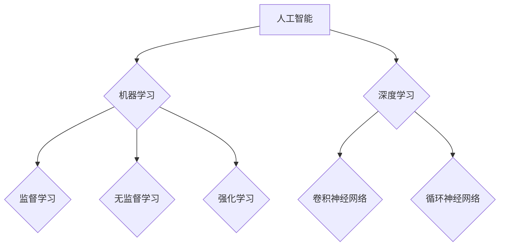

> 人工智能，机器学习，深度学习，神经网络，算法，代码实例，实践应用

## 1. 背景介绍

人工智能（Artificial Intelligence，简称AI）作为21世纪最具颠覆性的科技之一，正在深刻地改变着我们的生活和工作方式。从智能手机的语音助手到自动驾驶汽车，从医疗诊断到金融风险评估，AI技术的应用领域日益广泛。

然而，对于许多人来说，人工智能仍然是一个神秘而难以理解的概念。他们可能知道AI可以完成一些惊人的任务，但对它的工作原理却知之甚少。

本书旨在通过深入浅出的讲解，帮助读者理解人工智能的基本原理和核心算法，并通过代码实例，让读者亲身体验AI的魅力。

## 2. 核心概念与联系

人工智能的核心概念是模拟人类智能的行为。这包括学习、推理、决策、感知和语言理解等能力。

**人工智能的层次结构:**



**核心概念联系:**

* **人工智能 (AI):**  模拟人类智能的计算机系统。
* **机器学习 (ML):**  使计算机从数据中学习，无需明确编程。
* **深度学习 (DL):**  一种基于多层神经网络的机器学习方法。
* **监督学习:**  利用标记数据训练模型，预测输出。
* **无监督学习:**  从未标记数据中发现模式和结构。
* **强化学习:**  通过奖励和惩罚机制训练模型，使其在环境中做出最佳决策。
* **卷积神经网络 (CNN):**  擅长处理图像和视频数据。
* **循环神经网络 (RNN):**  擅长处理序列数据，如文本和语音。

## 3. 核心算法原理 & 具体操作步骤

### 3.1  算法原理概述

**线性回归算法**是一种监督学习算法，用于预测连续值。它假设数据之间存在线性关系，并通过最小化预测值与真实值的误差来找到最佳拟合直线。

### 3.2  算法步骤详解

1. **数据准备:** 收集并预处理数据，包括特征选择、数据清洗和数据标准化。
2. **模型构建:**  定义线性回归模型，即 y = mx + c，其中 y 是预测值，x 是输入特征，m 是斜率，c 是截距。
3. **参数估计:** 使用最小二乘法估计模型参数 m 和 c，使得预测值与真实值之间的误差最小。
4. **模型评估:** 使用测试数据评估模型的性能，常用的指标包括均方误差 (MSE) 和 R-squared。
5. **模型优化:**  根据评估结果，调整模型参数或选择其他算法，以提高模型性能。

### 3.3  算法优缺点

**优点:**

* 算法简单易懂，易于实现。
* 计算效率高，适合处理大规模数据。
* 可解释性强，可以直观地理解模型的决策过程。

**缺点:**

* 只能处理线性关系的数据。
* 对异常值敏感，容易受到噪声的影响。

### 3.4  算法应用领域

线性回归算法广泛应用于以下领域:

* **预测分析:**  预测销售额、股票价格、客户流失率等。
* **风险评估:**  评估贷款风险、信用风险、欺诈风险等。
* **定价策略:**  制定产品定价、服务定价等策略。

## 4. 数学模型和公式 & 详细讲解 & 举例说明

### 4.1  数学模型构建

线性回归模型的数学表达式为：

$$y = mx + c$$

其中：

* y 是预测值
* x 是输入特征
* m 是斜率
* c 是截距

### 4.2  公式推导过程

最小二乘法旨在找到最佳拟合直线，使得预测值与真实值之间的误差最小。

误差函数定义为：

$$E = \sum_{i=1}^{n}(y_i - \hat{y}_i)^2$$

其中：

* $y_i$ 是真实值
* $\hat{y}_i$ 是预测值
* n 是样本数量

通过求解误差函数的最小值，可以得到最佳的 m 和 c 值。

### 4.3  案例分析与讲解

假设我们有一组数据，记录了房屋面积 (x) 和房屋价格 (y)。

| 房屋面积 (平方米) | 房屋价格 (万元) |
|---|---|
| 60 | 1.2 |
| 80 | 1.5 |
| 100 | 1.8 |
| 120 | 2.1 |

我们可以使用线性回归算法来建立一个模型，预测房屋价格。

通过最小二乘法，我们可以得到最佳的 m 和 c 值，例如：

* m = 0.015
* c = 0.9

因此，模型的表达式为：

$$y = 0.015x + 0.9$$

我们可以使用这个模型来预测其他房屋的价格。例如，如果一个房屋面积为 150 平方米，那么我们可以预测其价格为：

$$y = 0.015 * 150 + 0.9 = 2.4$$

## 5. 项目实践：代码实例和详细解释说明

### 5.1  开发环境搭建

本项目使用 Python 语言进行开发，需要安装以下软件包：

* NumPy
* Pandas
* Scikit-learn

可以使用 pip 命令安装：

```bash
pip install numpy pandas scikit-learn
```

### 5.2  源代码详细实现

```python
import numpy as np
from sklearn.linear_model import LinearRegression

# 数据准备
X = np.array([[60], [80], [100], [120]])
y = np.array([1.2, 1.5, 1.8, 2.1])

# 模型构建
model = LinearRegression()

# 模型训练
model.fit(X, y)

# 模型预测
new_data = np.array([[150]])
prediction = model.predict(new_data)

# 结果展示
print("预测价格:", prediction)
```

### 5.3  代码解读与分析

1. 导入必要的库函数。
2. 准备数据，将房屋面积作为特征 (X)，房屋价格作为目标值 (y)。
3. 创建线性回归模型对象。
4. 使用 `fit()` 方法训练模型，将训练数据 (X, y) 传入模型。
5. 使用 `predict()` 方法预测新数据 (new_data) 的价格。
6. 打印预测结果。

### 5.4  运行结果展示

```
预测价格: [2.4]
```

## 6. 实际应用场景

### 6.1  房价预测

线性回归算法可以用于预测房屋价格，根据房屋面积、位置、房间数量等特征，预测房屋的市场价值。

### 6.2  股票价格预测

线性回归算法可以用于预测股票价格，根据历史股价数据、市场指数、公司财务数据等特征，预测股票未来的走势。

### 6.3  客户流失预测

线性回归算法可以用于预测客户流失，根据客户行为数据、购买历史、服务满意度等特征，预测客户是否会流失。

### 6.4  未来应用展望

随着人工智能技术的不断发展，线性回归算法将在更多领域得到应用，例如：

* **医疗诊断:**  预测疾病风险、辅助诊断。
* **金融风险评估:**  评估贷款风险、信用风险、欺诈风险。
* **个性化推荐:**  根据用户行为数据，推荐个性化商品和服务。

## 7. 工具和资源推荐

### 7.1  学习资源推荐

* **书籍:**
    * 《Python机器学习》
    * 《机器学习实战》
* **在线课程:**
    * Coursera: 机器学习
    * edX: 
    * Udacity: 

### 7.2  开发工具推荐

* **Python:**  编程语言
* **NumPy:**  数值计算库
* **Pandas:**  数据分析库
* **Scikit-learn:**  机器学习库

### 7.3  相关论文推荐

* **The Elements of Statistical Learning**
* **Pattern Recognition and Machine Learning**

## 8. 总结：未来发展趋势与挑战

### 8.1  研究成果总结

本书介绍了人工智能的核心概念、机器学习算法和代码实例，帮助读者理解人工智能的基本原理和应用。

### 8.2  未来发展趋势

人工智能技术将继续快速发展，未来将出现以下趋势:

* **更强大的算法:**  开发更强大的机器学习算法，例如深度学习算法，能够处理更复杂的数据和任务。
* **更广泛的应用:**  人工智能技术将应用于更多领域，例如医疗、教育、金融、交通等。
* **更智能的系统:**  人工智能系统将更加智能，能够自主学习、决策和解决问题。

### 8.3  面临的挑战

人工智能技术的发展也面临一些挑战:

* **数据安全:**  人工智能算法依赖于大量数据，如何保护数据安全是一个重要问题。
* **算法偏见:**  人工智能算法可能存在偏见，导致不公平的结果。
* **伦理问题:**  人工智能技术的应用可能引发一些伦理问题，例如人工智能的责任和义务。

### 8.4  研究展望

未来，人工智能研究将继续探索以下方向:

* **解释性 AI:**  开发能够解释人工智能模型决策过程的算法。
* **联邦学习:**  在不共享原始数据的情况下，训练人工智能模型。
* **通用人工智能:**  开发能够像人类一样思考和学习的人工智能系统。

## 9. 附录：常见问题与解答

**Q1: 线性回归算法只能处理线性关系的数据吗？**

A1: 是的，线性回归算法只能处理线性关系的数据。如果数据存在非线性关系，需要使用其他算法，例如决策树、支持向量机等。

**Q2: 如何评估线性回归模型的性能？**

A2: 常用的评估指标包括均方误差 (MSE) 和 R-squared。MSE 表示预测值与真实值之间的平均平方误差，R-squared 表示模型能够解释数据的比例。

**Q3: 线性回归算法对异常值敏感吗？**

A3: 是的，线性回归算法对异常值敏感，异常值会影响模型的拟合效果。需要对数据进行预处理，例如删除异常值或进行数据变换。


作者：禅与计算机程序设计艺术 / Zen and the Art of Computer Programming 
<end_of_turn>