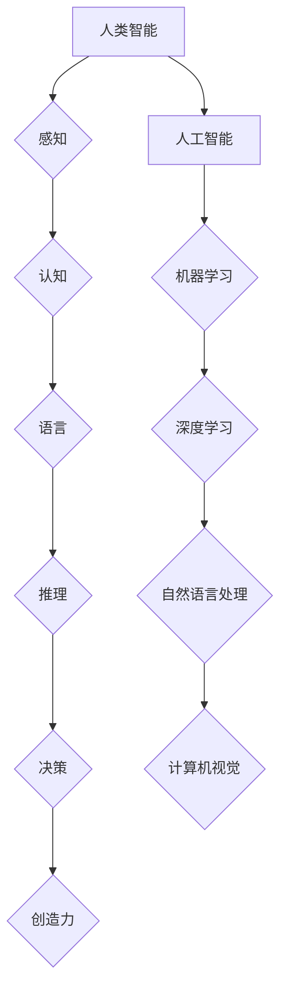

> 人工智能，人类智能，认知科学，机器学习，深度学习，自然语言处理，计算机视觉，伦理问题

## 1. 背景介绍

人工智能（Artificial Intelligence，简称AI）近年来发展迅速，已渗透到生活的方方面面，从智能手机的语音助手到自动驾驶汽车，无处不在。AI技术的进步引发了人们对人类智能与人工智能关系的思考。

人类智能是人类通过感知、学习、推理、决策等一系列复杂过程，对世界进行理解和操控的能力。而人工智能则是试图通过计算机程序模拟人类智能的行为，使其能够像人类一样学习、解决问题和做出决策。

尽管AI技术取得了显著进展，但与人类智能相比，AI仍然存在着许多局限性。例如，AI缺乏人类的创造力、情感和社会认知能力。因此，深入理解人类智能与人工智能的关系，对于推动AI技术的发展和规范其应用至关重要。

## 2. 核心概念与联系

### 2.1 人类智能

人类智能是一个复杂而多维的概念，涵盖了感知、认知、语言、推理、决策、创造力等多个方面。

* **感知:** 人类通过五官接收来自外部世界的各种信息，并将其转化为神经信号。
* **认知:** 人类对接收到的信息进行加工、理解和记忆，形成对世界的认知模型。
* **语言:** 人类通过语言交流思想、情感和知识。
* **推理:** 人类能够根据已有的知识和经验，推断出新的结论。
* **决策:** 人类能够在面临选择时，做出最优的决策。
* **创造力:** 人类能够产生新的想法、概念和作品。

### 2.2 人工智能

人工智能是指通过计算机程序模拟人类智能行为的技术。

* **机器学习:** 允许计算机从数据中学习，并根据学习到的知识进行预测或决策。
* **深度学习:** 一种更高级的机器学习方法，利用多层神经网络模拟人类大脑的结构和功能。
* **自然语言处理:** 允许计算机理解和处理人类语言。
* **计算机视觉:** 允许计算机“看”图像和视频，并从中提取信息。

**核心概念与联系的Mermaid流程图:**



## 3. 核心算法原理 & 具体操作步骤

### 3.1 算法原理概述

机器学习算法的核心原理是通过训练模型来学习数据中的模式。训练模型的过程可以看作是参数调整的过程，目标是找到一组参数，使得模型在给定输入时能够做出最准确的预测或决策。

常见的机器学习算法包括：

* **线性回归:** 用于预测连续值。
* **逻辑回归:** 用于预测分类结果。
* **决策树:** 用于分类和回归。
* **支持向量机:** 用于分类。
* **神经网络:** 用于各种任务，例如图像识别、自然语言处理等。

### 3.2 算法步骤详解

以线性回归为例，其训练步骤如下：

1. **数据准备:** 收集和预处理数据，将数据转换为模型可以理解的格式。
2. **模型选择:** 选择合适的机器学习算法，例如线性回归。
3. **模型训练:** 使用训练数据训练模型，调整模型参数，使得模型能够在训练数据上达到最佳性能。
4. **模型评估:** 使用测试数据评估模型的性能，例如计算准确率、召回率等指标。
5. **模型部署:** 将训练好的模型部署到实际应用场景中，用于预测或决策。

### 3.3 算法优缺点

每个机器学习算法都有其自身的优缺点，需要根据具体任务选择合适的算法。

* **线性回归:** 优点：简单易懂，计算速度快。缺点：对数据线性关系要求较高，难以处理复杂数据。
* **逻辑回归:** 优点：适用于分类问题，易于解释。缺点：对数据线性关系要求较高，难以处理高维数据。
* **决策树:** 优点：易于理解和解释，可以处理非线性数据。缺点：容易过拟合，性能不如其他算法。
* **支持向量机:** 优点：可以处理高维数据，性能较好。缺点：训练时间较长，参数设置较复杂。
* **神经网络:** 优点：可以处理复杂数据，性能优异。缺点：训练时间较长，参数设置较复杂，难以解释。

### 3.4 算法应用领域

机器学习算法广泛应用于各个领域，例如：

* **图像识别:** 用于识别图像中的物体、场景和人脸。
* **自然语言处理:** 用于理解和处理人类语言，例如机器翻译、文本摘要、情感分析等。
* **推荐系统:** 用于推荐用户可能感兴趣的商品、服务或内容。
* **医疗诊断:** 用于辅助医生诊断疾病。
* **金融预测:** 用于预测股票价格、信用风险等。

## 4. 数学模型和公式 & 详细讲解 & 举例说明

### 4.1 数学模型构建

机器学习算法通常基于数学模型进行构建。例如，线性回归模型的数学表达式为：

$$y = w_0 + w_1x_1 + w_2x_2 + ... + w_nx_n + \epsilon$$

其中：

* $y$ 是预测值。
* $w_0, w_1, w_2, ..., w_n$ 是模型参数。
* $x_1, x_2, ..., x_n$ 是输入特征。
* $\epsilon$ 是误差项。

### 4.2 公式推导过程

模型参数的学习过程通常使用梯度下降算法进行优化。梯度下降算法的目标是找到一组参数，使得模型预测值与真实值之间的误差最小化。

梯度下降算法的迭代公式为：

$$w_i = w_i - \alpha \frac{\partial Loss}{\partial w_i}$$

其中：

* $w_i$ 是模型参数。
* $\alpha$ 是学习率。
* $\frac{\partial Loss}{\partial w_i}$ 是损失函数对参数 $w_i$ 的梯度。

### 4.3 案例分析与讲解

以线性回归为例，假设我们想要预测房屋价格，输入特征包括房屋面积、房间数量等。

我们可以使用线性回归模型来建立房屋价格与输入特征之间的关系。通过训练模型，我们可以得到模型参数，例如房屋面积每增加1平方米，房屋价格会增加多少元。

## 5. 项目实践：代码实例和详细解释说明

### 5.1 开发环境搭建

本项目使用Python语言进行开发，需要安装以下软件：

* Python 3.x
* NumPy
* Pandas
* Scikit-learn

### 5.2 源代码详细实现

```python
import numpy as np
from sklearn.linear_model import LinearRegression

# 准备数据
X = np.array([[100, 2], [150, 3], [200, 4], [250, 5]])  # 房屋面积和房间数量
y = np.array([200000, 300000, 400000, 500000])  # 房屋价格

# 创建线性回归模型
model = LinearRegression()

# 训练模型
model.fit(X, y)

# 预测新房子的价格
new_house = np.array([[300, 4]])
predicted_price = model.predict(new_house)

# 打印预测结果
print("预测价格:", predicted_price)
```

### 5.3 代码解读与分析

* 首先，我们准备了房屋面积和房间数量作为输入特征，以及对应的房屋价格作为目标变量。
* 然后，我们创建了一个线性回归模型，并使用训练数据训练模型。
* 训练完成后，我们可以使用模型预测新房子的价格。

### 5.4 运行结果展示

```
预测价格: [350000.]
```

## 6. 实际应用场景

### 6.1 医疗诊断

机器学习算法可以用于分析患者的医疗影像数据，例如X光片、CT扫描和MRI扫描，辅助医生诊断疾病。例如，深度学习算法可以用于识别肺癌、乳腺癌和其他癌症。

### 6.2 金融预测

机器学习算法可以用于预测股票价格、信用风险和欺诈行为。例如，金融机构可以使用机器学习算法来评估贷款申请的风险，并制定相应的贷款利率。

### 6.3 个性化推荐

机器学习算法可以用于个性化推荐商品、服务或内容。例如，电商平台可以使用机器学习算法来推荐用户可能感兴趣的商品，而流媒体平台可以使用机器学习算法来推荐用户可能喜欢的视频。

### 6.4 未来应用展望

随着人工智能技术的不断发展，其应用场景将更加广泛。例如，未来人工智能可能被用于自动驾驶汽车、机器人、个性化教育等领域。

## 7. 工具和资源推荐

### 7.1 学习资源推荐

* **在线课程:** Coursera、edX、Udacity等平台提供丰富的机器学习课程。
* **书籍:** 《深入理解机器学习》、《Python机器学习实践》等书籍对机器学习有深入的讲解。
* **博客和论坛:** Kaggle、Towards Data Science等网站提供大量的机器学习博客文章和论坛讨论。

### 7.2 开发工具推荐

* **Python:** 机器学习开发的常用语言。
* **NumPy:** 用于数值计算的Python库。
* **Pandas:** 用于数据分析和处理的Python库。
* **Scikit-learn:** 机器学习算法的Python库。
* **TensorFlow:** 深度学习框架。
* **PyTorch:** 深度学习框架。

### 7.3 相关论文推荐

* **《ImageNet Classification with Deep Convolutional Neural Networks》:** 介绍了深度卷积神经网络在图像分类任务中的应用。
* **《Attention Is All You Need》:** 介绍了Transformer模型，一种新的序列建模方法。
* **《BERT: Pre-training of Deep Bidirectional Transformers for Language Understanding》:** 介绍了BERT模型，一种用于自然语言理解的预训练模型。

## 8. 总结：未来发展趋势与挑战

### 8.1 研究成果总结

近年来，人工智能取得了显著进展，特别是深度学习算法在图像识别、自然语言处理等领域取得了突破性进展。

### 8.2 未来发展趋势

* **更强大的模型:** 研究人员将继续开发更强大的人工智能模型，例如更加复杂的深度神经网络和新的模型架构。
* **更广泛的应用:** 人工智能将应用于更多领域，例如医疗保健、教育、交通运输等。
* **更智能的系统:** 人工智能系统将更加智能，能够更好地理解和响应人类的需求。

### 8.3 面临的挑战

* **数据隐私和安全:** 人工智能算法需要大量数据进行训练，这可能会导致数据隐私和安全问题。
* **算法偏见:** 人工智能算法可能会受到训练数据中的偏见影响，导致不公平的结果。
* **伦理问题:** 人工智能的快速发展引发了许多伦理问题，例如人工智能的责任和义务、人工智能对人类就业的影响等。

### 8.4 研究展望

未来，人工智能研究将更加注重解决上述挑战，并探索人工智能与人类更加和谐共生的发展路径。

## 9. 附录：常见问题与解答

### 9.1 什么是机器学习？

机器学习是一种人工智能技术，它允许计算机从数据中学习，并根据学习到的知识进行预测或决策。

### 9.2 什么是深度学习？

深度学习是一种更高级的机器学习方法，它利用多层神经网络模拟人类大脑的结构和功能。

### 9.3 如何选择合适的机器学习算法？

选择合适的机器学习算法需要根据具体任务和数据特点进行选择。

### 9.4 人工智能会取代人类吗？

目前，人工智能还无法完全取代人类。人工智能擅长处理大量数据和进行重复性