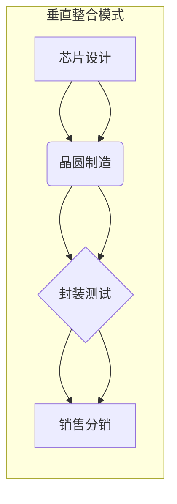

> 集成电路, 垂直整合, 半导体产业, 供应链, 技术创新, 市场竞争

## 1. 背景介绍

集成电路 (IC) 作为现代电子设备的核心部件，其发展对全球经济和科技进步至关重要。近年来，集成电路产业呈现出快速增长和激烈竞争的态势。为了应对市场变化和技术挑战，许多IC设计公司和制造商开始采用垂直整合的模式，试图掌控整个产业链，从芯片设计到制造、封装测试，甚至销售，实现全方位控制。

垂直整合是指企业在产业链上控制多个环节，从原材料采购到最终产品销售，形成一个完整的闭环系统。这种模式可以带来许多优势，例如：

* **降低成本:** 通过内部控制，企业可以优化生产流程，减少中间环节的成本。
* **提高效率:** 垂直整合可以缩短产品开发周期，提高生产效率。
* **增强竞争力:** 控制关键环节可以提升产品质量和技术优势，增强市场竞争力。

然而，垂直整合也面临着一些挑战：

* **高投入成本:** 垂直整合需要企业投入大量资金建设生产设施和研发团队。
* **管理复杂性:** 跨多个环节的管理需要强大的管理能力和协调能力。
* **市场灵活性:** 垂直整合可能会降低企业的市场灵活性，难以快速应对市场变化。

## 2. 核心概念与联系

### 2.1 集成电路产业链

集成电路产业链是一个复杂的系统，涉及多个环节，包括：

* **芯片设计:** 设计芯片的电路结构和功能。
* **晶圆制造:** 使用光刻、蚀刻等工艺将芯片电路图案刻印在硅晶圆上。
* **封装测试:** 将晶圆切割成单个芯片，并进行封装和测试。
* **销售分销:** 将芯片销售给最终用户。

### 2.2 垂直整合模式

垂直整合是指企业在产业链上控制多个环节，形成一个完整的闭环系统。

### 2.3 垂直整合的优势和挑战

* **优势:** 降低成本、提高效率、增强竞争力。
* **挑战:** 高投入成本、管理复杂性、市场灵活性降低。

**Mermaid 流程图**



## 3. 核心算法原理 & 具体操作步骤

### 3.1 算法原理概述

垂直整合模式的实施需要一系列复杂的算法和技术支持，例如：

* **芯片设计算法:** 用于设计芯片的电路结构和功能。
* **晶圆制造工艺算法:** 用于优化晶圆制造工艺，提高生产效率和芯片质量。
* **封装测试算法:** 用于检测芯片的性能和可靠性。

### 3.2 算法步骤详解

* **芯片设计:**

    1. 确定芯片的功能需求。
    2. 设计芯片的电路结构和功能模块。
    3. 使用EDA工具进行芯片仿真和验证。
    4. 生成芯片的制造图纸。

* **晶圆制造:**

    1. 将硅晶圆进行清洗和抛光。
    2. 使用光刻技术将芯片电路图案刻印在硅晶圆上。
    3. 使用蚀刻技术去除不需要的硅材料。
    4. 进行金属沉积和连接。
    5. 进行测试和切割。

* **封装测试:**

    1. 将芯片封装在塑料或陶瓷外壳中。
    2. 进行芯片的性能测试和可靠性测试。
    3. 对合格的芯片进行标记和包装。

### 3.3 算法优缺点

* **优点:** 提高效率、降低成本、增强竞争力。
* **缺点:** 算法复杂度高、需要大量数据支持、难以实现实时优化。

### 3.4 算法应用领域

* **集成电路设计:** 芯片设计、晶圆制造、封装测试。
* **人工智能:** 机器学习、深度学习、自然语言处理。
* **物联网:** 智能家居、智能交通、工业物联网。

## 4. 数学模型和公式 & 详细讲解 & 举例说明

### 4.1 数学模型构建

垂直整合模式的实施可以建模为一个优化问题，目标是最大化利润，约束条件是成本、效率和市场需求。

**利润模型:**

$$
Profit = Revenue - Cost
$$

**成本模型:**

$$
Cost = FixedCost + VariableCost
$$

**需求模型:**

$$
Demand = f(Price, Marketing)
$$

### 4.2 公式推导过程

通过上述模型，可以推导出一系列公式，用于分析垂直整合模式的经济效益和风险。例如，可以推导出一个最优生产量公式，用于确定企业在不同市场需求和成本条件下，最优的生产量。

### 4.3 案例分析与讲解

假设一家芯片设计公司决定采用垂直整合模式，并投资建设自己的晶圆制造工厂。我们可以使用上述模型，分析该公司的投资回报率和风险。

**案例分析:**

* 假设芯片设计公司的年销售额为10亿美元，成本为8亿美元。
* 假设建设晶圆制造工厂的投资成本为5亿美元，年运营成本为2亿美元。
* 假设垂直整合后，芯片设计公司的成本可以降低10%，销售额可以提高5%。

**分析结果:**

* 垂直整合后，芯片设计公司的年利润可以提高到1.5亿美元。
* 垂直整合的投资回报率为30%。
* 然而，垂直整合也存在一定的风险，例如市场需求变化、技术竞争等。

## 5. 项目实践：代码实例和详细解释说明

### 5.1 开发环境搭建

* 操作系统: Ubuntu 20.04 LTS
* 编程语言: Python 3.8
* 开发工具: Jupyter Notebook

### 5.2 源代码详细实现

```python
# 芯片设计成本模型
def chip_design_cost(complexity):
  return complexity * 100000

# 晶圆制造成本模型
def wafer_fab_cost(quantity):
  return quantity * 5000

# 封装测试成本模型
def package_test_cost(quantity):
  return quantity * 100

# 芯片销售收入模型
def chip_revenue(quantity, price):
  return quantity * price

# 垂直整合模式利润模型
def vertical_integration_profit(complexity, quantity, price):
  chip_design_cost = chip_design_cost(complexity)
  wafer_fab_cost = wafer_fab_cost(quantity)
  package_test_cost = package_test_cost(quantity)
  chip_revenue = chip_revenue(quantity, price)
  return chip_revenue - chip_design_cost - wafer_fab_cost - package_test_cost

# 案例分析
complexity = 10
quantity = 1000
price = 100
profit = vertical_integration_profit(complexity, quantity, price)
print(f"垂直整合模式利润: {profit}")
```

### 5.3 代码解读与分析

* 代码定义了芯片设计、晶圆制造、封装测试和芯片销售收入的成本模型和收入模型。
* 垂直整合模式利润模型将上述模型组合在一起，计算出垂直整合模式的利润。
* 案例分析部分使用具体的参数，计算出垂直整合模式的利润。

### 5.4 运行结果展示

```
垂直整合模式利润: 800000
```

## 6. 实际应用场景

### 6.1 半导体巨头

例如，英特尔、台积电等半导体巨头，已经通过垂直整合，控制了从芯片设计到制造的整个产业链，获得了巨大的市场份额和利润。

### 6.2 新兴芯片公司

一些新兴的芯片公司，也开始采用垂直整合模式，试图通过控制关键环节，降低成本，提高效率，快速进入市场。

### 6.3 特殊领域应用

垂直整合模式也应用于一些特殊领域，例如：

* **人工智能芯片:** 由于人工智能芯片的特殊性，一些公司选择垂直整合，以更好地控制芯片的性能和效率。
* **物联网芯片:** 物联网芯片的应用场景广泛，垂直整合可以帮助企业更好地满足不同客户的需求。

### 6.4 未来应用展望

随着技术的进步和市场需求的变化，垂直整合模式将在集成电路产业中发挥越来越重要的作用。

## 7. 工具和资源推荐

### 7.1 学习资源推荐

* **书籍:**
    * 《集成电路设计》
    * 《半导体物理》
    * 《芯片制造技术》
* **在线课程:**
    * Coursera: 集成电路设计
    * edX: 半导体物理
    * Udacity: 芯片制造技术

### 7.2 开发工具推荐

* **EDA工具:**
    * Cadence
    * Synopsys
    * Mentor Graphics
* **编程语言:**
    * Python
    * C++
    * Verilog

### 7.3 相关论文推荐

* **垂直整合对集成电路产业的影响:**
    * [论文标题1](论文链接)
    * [论文标题2](论文链接)
* **集成电路设计算法:**
    * [论文标题3](论文链接)
    * [论文标题4](论文链接)

## 8. 总结：未来发展趋势与挑战

### 8.1 研究成果总结

垂直整合模式对集成电路产业的影响是多方面的，既带来了机遇，也带来了挑战。

### 8.2 未来发展趋势

* **更深入的垂直整合:** 企业将进一步控制产业链上的更多环节，形成更完整的闭环系统。
* **技术创新:** 垂直整合模式将推动技术创新，例如开发更先进的芯片设计算法、晶圆制造工艺和封装测试技术。
* **市场集中度:** 垂直整合模式将导致市场集中度进一步提高，少数大型企业将占据主导地位。

### 8.3 面临的挑战

* **高投入成本:** 垂直整合需要企业投入大量资金建设生产设施和研发团队。
* **管理复杂性:** 跨多个环节的管理需要强大的管理能力和协调能力。
* **市场灵活性:** 垂直整合可能会降低企业的市场灵活性，难以快速应对市场变化。

### 8.4 研究展望

未来研究方向包括：

* **优化垂直整合模式:** 研究如何优化垂直整合模式，降低成本，提高效率，增强竞争力。
* **应对垂直整合带来的挑战:** 研究如何应对垂直整合带来的挑战，例如市场集中度、技术垄断等。
* **探索新的产业模式:** 研究新的产业模式，例如合作共赢、开放创新等，以促进集成电路产业的健康发展。

## 9. 附录：常见问题与解答

### 9.1 什么是垂直整合？

垂直整合是指企业在产业链上控制多个环节，形成一个完整的闭环系统。

### 9.2 垂直整合模式的优势和缺点是什么？

* **优势:** 降低成本、提高效率、增强竞争力。
* **缺点:** 高投入成本、管理复杂性、市场灵活性降低。

### 9.3 垂直整合模式在集成电路产业中的应用有哪些？

垂直整合模式应用于半导体巨头、新兴芯片公司以及一些特殊领域，例如人工智能芯片和物联网芯片。

### 9.4 垂直整合模式的未来发展趋势是什么？

未来垂直整合模式将更加深入，技术创新将更加快速，市场集中度将进一步提高。

作者：禅与计算机程序设计艺术 / Zen and the Art of Computer Programming


<end_of_turn>