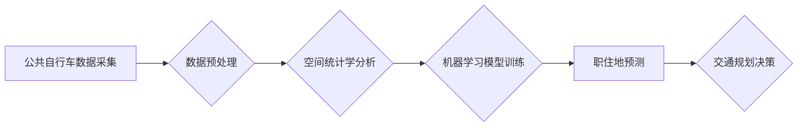

> 公共自行车数据，城市居民，职住地分析，空间统计学，机器学习，交通规划

## 1. 背景介绍

随着城市化进程的加速，城市交通拥堵问题日益突出。了解城市居民的职住地分布规律，对于城市交通规划、公共交通建设、城市发展等方面具有重要意义。传统的职住地分析方法主要依赖于人口普查数据和交通调查数据，但这些数据往往具有滞后性、样本量小、覆盖面窄等问题。近年来，随着共享单车、公共自行车等智能交通工具的普及，公共自行车出行数据成为一种新的数据资源，为城市居民职住地分析提供了新的思路和方法。

公共自行车数据包含了大量关于用户出行轨迹、时间分布、出行目的地等信息，这些信息可以用来分析城市居民的出行行为模式，进而推断出他们的职住地分布规律。基于公共自行车数据的城市居民职住地分析，具有以下优势：

* **数据丰富：** 公共自行车数据覆盖面广，用户群体多样，数据量大，能够提供更全面的出行信息。
* **数据实时性：** 公共自行车数据更新频率高，能够反映城市居民出行行为的实时变化。
* **数据成本低：** 相比于传统的交通调查数据，公共自行车数据获取成本较低。

## 2. 核心概念与联系

**2.1 职住地分析**

职住地分析是指研究城市居民工作地点和居住地的空间分布规律，以及两者之间的联系。职住地分析可以帮助我们了解城市居民的出行行为模式，分析城市交通拥堵的成因，为城市交通规划、公共交通建设、城市发展等方面提供决策依据。

**2.2 公共自行车数据**

公共自行车数据是指公共自行车系统收集到的用户出行信息，包括用户骑行轨迹、时间、地点、骑行时长等。这些数据可以用来分析城市居民的出行行为模式，推断出他们的职住地分布规律。

**2.3 空间统计学**

空间统计学是研究空间数据特征和空间关系的统计学分支。在职住地分析中，空间统计学方法可以用来分析城市居民职住地分布的聚集性、空间关联性等特征。

**2.4 机器学习**

机器学习是一种人工智能技术，可以用来从数据中学习规律，进行预测和分类。在职住地分析中，机器学习算法可以用来预测居民的职住地，识别不同类型居民的出行行为模式。

**2.5 交通规划**

交通规划是指根据城市发展规划和交通需求，制定交通基础设施建设、交通管理、交通服务等方面的规划方案。基于公共自行车数据的职住地分析可以为交通规划提供数据支持，帮助制定更合理的交通规划方案。

**2.6 流程图**



## 3. 核心算法原理 & 具体操作步骤

### 3.1  算法原理概述

基于公共自行车数据的城市居民职住地分析主要采用以下算法原理：

* **空间统计学分析：** 利用空间统计学方法分析公共自行车数据，识别居民职住地分布的聚集性、空间关联性等特征。
* **机器学习模型训练：** 利用机器学习算法，从公共自行车数据中学习居民职住地分布的规律，建立职住地预测模型。

### 3.2  算法步骤详解

**3.2.1 数据预处理**

* 数据清洗：去除公共自行车数据中的异常值、缺失值等。
* 数据转换：将公共自行车数据转换为适合空间统计学分析和机器学习模型训练的格式。
* 数据聚合：将公共自行车数据按照时间、地点等维度进行聚合，例如计算每个区域的骑行次数、骑行时长等。

**3.2.2 空间统计学分析**

* 空间自相关分析：分析公共自行车数据在空间上的相关性，识别居民职住地分布的聚集性。
* 空间聚类分析：将公共自行车数据按照空间位置进行聚类，识别不同类型的居民职住地分布区域。

**3.2.3 机器学习模型训练**

* 数据特征提取：从公共自行车数据中提取特征，例如骑行时间、骑行距离、骑行目的地等。
* 模型选择：选择合适的机器学习算法，例如逻辑回归、支持向量机、决策树等。
* 模型训练：利用训练数据训练机器学习模型，学习居民职住地分布的规律。

**3.2.4 职住地预测**

* 模型评估：利用测试数据评估模型的预测精度。
* 职住地预测：将未标记的公共自行车数据输入到训练好的模型中，预测居民的职住地。

### 3.3  算法优缺点

**优点：**

* 数据丰富：公共自行车数据覆盖面广，用户群体多样，数据量大。
* 数据实时性：公共自行车数据更新频率高，能够反映城市居民出行行为的实时变化。
* 数据成本低：相对于传统的交通调查数据，公共自行车数据获取成本较低。

**缺点：**

* 数据偏差：公共自行车用户群体可能与城市居民总体构成存在偏差。
* 数据隐私：公共自行车数据包含用户出行轨迹信息，需要进行隐私保护处理。

### 3.4  算法应用领域

* 城市交通规划：分析居民职住地分布规律，优化交通路网规划、公共交通线路规划等。
* 公共交通建设：根据居民职住地分布，规划建设公共交通站点、公交线路等。
* 城市发展规划：了解居民职住地分布，为城市发展规划提供数据支持。
* 商业地产开发：分析居民职住地分布，为商业地产开发提供决策依据。

## 4. 数学模型和公式 & 详细讲解 & 举例说明

### 4.1  数学模型构建

**4.1.1 空间自相关分析模型**

空间自相关分析模型可以用来衡量公共自行车数据在空间上的相关性。常用的空间自相关指标包括Moran's I指数和Geary's C指数。

**Moran's I指数**

$$
I = \frac{\sum_{i=1}^{n} \sum_{j=1}^{n} w_{ij} (x_i - \bar{x})(x_j - \bar{x})}{\sum_{i=1}^{n} \sum_{j=1}^{n} w_{ij} \sum_{i=1}^{n} (x_i - \bar{x})^2}
$$

其中：

* $x_i$ 表示第 $i$ 个区域的公共自行车数据。
* $\bar{x}$ 表示所有区域公共自行车数据的平均值。
* $w_{ij}$ 表示第 $i$ 个区域与第 $j$ 个区域之间的空间权重。

**Geary's C指数**

$$
C = \frac{\sum_{i=1}^{n} \sum_{j=1}^{n} w_{ij} (x_i - x_j)^2}{\sum_{i=1}^{n} \sum_{j=1}^{n} w_{ij} \sum_{i=1}^{n} (x_i - \bar{x})^2}
$$

**4.1.2 空间聚类分析模型**

空间聚类分析模型可以用来识别不同类型的居民职住地分布区域。常用的空间聚类算法包括DBSCAN算法和K-means算法。

**DBSCAN算法**

DBSCAN算法是一种基于密度的聚类算法，可以识别任意形状的聚类。

**K-means算法**

K-means算法是一种基于距离的聚类算法，需要事先指定聚类数目。

### 4.2  公式推导过程

**4.2.1 Moran's I指数推导过程**

Moran's I指数的推导过程可以参考空间统计学相关书籍和文献。

**4.2.2 DBSCAN算法推导过程**

DBSCAN算法的推导过程可以参考机器学习相关书籍和文献。

### 4.3  案例分析与讲解

**4.3.1 案例分析**

可以利用公共自行车数据，对某城市居民职住地分布进行分析。例如，可以利用Moran's I指数分析居民职住地分布的聚集性，利用DBSCAN算法识别不同类型的居民职住地分布区域。

**4.3.2 解释说明**

通过案例分析，可以得出关于城市居民职住地分布的结论，例如：

* 居民职住地分布存在明显的聚集性。
* 城市居民职住地分布可以分为不同的类型，例如中心城区居民职住地分布密集，郊区居民职住地分布分散等。

## 5. 项目实践：代码实例和详细解释说明

### 5.1  开发环境搭建

* 操作系统：Windows/macOS/Linux
* Python版本：3.6+
* 必要的库：pandas, numpy, scikit-learn, geopandas, matplotlib

### 5.2  源代码详细实现

```python
# 数据加载
import pandas as pd
bike_data = pd.read_csv('bike_data.csv')

# 数据预处理
# ...

# 空间统计学分析
from scipy.spatial.distance import cdist
from sklearn.cluster import DBSCAN
# ...

# 机器学习模型训练
from sklearn.linear_model import LogisticRegression
model = LogisticRegression()
model.fit(X_train, y_train)

# 职住地预测
predictions = model.predict(X_test)

# 结果展示
# ...
```

### 5.3  代码解读与分析

* 数据加载：使用pandas库读取公共自行车数据。
* 数据预处理：对公共自行车数据进行清洗、转换、聚合等操作。
* 空间统计学分析：使用scipy库和sklearn库的DBSCAN算法对公共自行车数据进行空间聚类分析。
* 机器学习模型训练：使用sklearn库的LogisticRegression算法对公共自行车数据进行职住地预测模型训练。
* 职住地预测：将未标记的公共自行车数据输入到训练好的模型中，预测居民的职住地。
* 结果展示：使用matplotlib库对预测结果进行可视化展示。

### 5.4  运行结果展示

运行结果可以展示居民职住地分布的预测结果，例如：

* 地图上显示不同颜色代表不同类型的居民职住地分布区域。
* 表格显示每个区域的居民职住地分布比例。

## 6. 实际应用场景

### 6.1 城市交通规划

* 分析居民职住地分布规律，优化交通路网规划、公共交通线路规划等。
* 根据居民职住地分布，规划建设交通枢纽、停车场等设施。

### 6.2 公共交通建设

* 根据居民职住地分布，规划建设公共交通站点、公交线路等。
* 利用公共自行车数据，优化公共自行车站点布局、运营策略等。

### 6.3 城市发展规划

* 了解居民职住地分布，为城市发展规划提供数据支持。
* 根据居民职住地分布，规划建设商业区、居住区等。

### 6.4 未来应用展望

* 利用人工智能技术，对公共自行车数据进行更深入的分析，例如预测未来居民出行需求、识别出行异常行为等。
* 将公共自行车数据与其他数据源，例如人口普查数据、交通调查数据等进行融合分析，获得更全面的城市居民职住地分布信息。

## 7. 工具和资源推荐

### 7.1  学习资源推荐

* 书籍：
    * 《空间统计学》
    * 《机器学习》
* 在线课程：
    * Coursera上的空间统计学课程
    * edX上的机器学习课程

### 7.2  开发工具推荐

* Python编程语言
* pandas数据分析库
* numpy数值计算库
* scikit-learn机器学习库
* geopandas地理数据处理库
* matplotlib数据可视化库

### 7.3  相关论文推荐

* 《基于公共自行车数据的城市居民职住