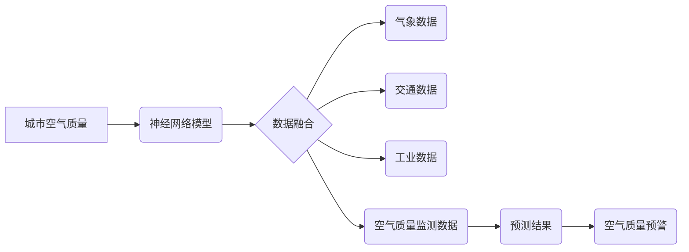

> 城市空气质量，神经网络，预测模型，空气污染，机器学习，环境监测

## 1. 背景介绍

城市空气污染已成为全球面临的严峻挑战之一，它对人类健康、生态环境和经济发展造成严重危害。传统的空气质量监测主要依赖于地面监测站，但监测点分布有限，数据覆盖范围不足，难以全面反映城市空气质量状况。随着物联网、大数据和人工智能技术的快速发展，基于神经网络的城市空气质量研究成为一个新的研究热点。

神经网络作为一种强大的机器学习算法，能够从海量数据中提取特征，建立复杂的非线性映射关系，具有较高的预测精度和自学习能力。将其应用于城市空气质量研究，可以实现以下优势：

* **提高预测精度:** 神经网络能够学习复杂的空气质量变化规律，提高预测精度，为空气质量管理提供更准确的预警信息。
* **扩展监测范围:** 通过融合多源数据，如气象数据、交通数据、工业数据等，神经网络可以扩展监测范围，实现对城市空气质量的全面监测。
* **实时监测和预警:** 基于神经网络的模型可以实现实时监测和预警，及时发现空气污染异常情况，为公众提供及时预警信息。

## 2. 核心概念与联系

### 2.1 神经网络

神经网络是一种模仿人脑神经网络结构的计算模型。它由多个相互连接的神经元组成，每个神经元接收输入信号，进行处理后输出信号。神经网络通过调整连接权重和阈值，学习数据之间的映射关系，从而实现预测、分类、识别等功能。

### 2.2 城市空气质量

城市空气质量是指城市大气中悬浮颗粒物、气体污染物等污染物的浓度水平。主要污染物包括二氧化硫 (SO2)、氮氧化物 (NOx)、臭氧 (O3)、一氧化碳 (CO)、二氧化碳 (CO2) 和颗粒物 (PM2.5、PM10) 等。

### 2.3 数据融合

数据融合是指将来自不同来源的数据进行整合和处理，以获得更全面、更准确的信息。在城市空气质量研究中，数据融合可以将气象数据、交通数据、工业数据等与空气质量监测数据进行结合，提高预测精度和监测范围。

**核心概念与联系流程图:**



## 3. 核心算法原理 & 具体操作步骤

### 3.1 算法原理概述

本研究采用卷积神经网络 (CNN) 作为核心算法，其结构特点使其能够有效地提取空气质量数据中的空间特征和时间序列特征。CNN 算法主要包括卷积层、池化层、全连接层等。卷积层通过卷积核提取数据特征，池化层降低数据维度，全连接层进行分类或回归预测。

### 3.2 算法步骤详解

1. **数据预处理:** 对原始数据进行清洗、归一化、特征提取等处理，以提高模型训练效率和预测精度。
2. **模型构建:** 根据具体任务需求，设计 CNN 模型结构，包括卷积层、池化层、全连接层等。
3. **模型训练:** 使用训练数据训练模型，调整模型参数，使模型能够准确地预测空气质量。
4. **模型评估:** 使用测试数据评估模型性能，包括准确率、召回率、F1-score 等指标。
5. **模型部署:** 将训练好的模型部署到实际应用环境中，实现对城市空气质量的实时监测和预警。

### 3.3 算法优缺点

**优点:**

* 能够有效提取数据特征，提高预测精度。
* 具有较强的泛化能力，能够应用于不同城市和不同污染物。
* 可以实现实时监测和预警。

**缺点:**

* 需要大量的训练数据，数据获取和标注成本较高。
* 模型训练时间较长，计算资源需求较高。
* 模型解释性较差，难以理解模型的决策过程。

### 3.4 算法应用领域

* **空气质量预警:** 预测未来空气质量变化趋势，为公众提供预警信息。
* **污染源排放控制:** 分析污染源排放情况，制定污染控制措施。
* **环境监测:** 实时监测城市空气质量，评估环境质量。
* **健康风险评估:** 评估空气污染对人体健康的风险，为健康管理提供依据。

## 4. 数学模型和公式 & 详细讲解 & 举例说明

### 4.1 数学模型构建

本研究采用多层感知机 (MLP) 作为神经网络模型，其数学模型可以表示为：

$$
y = f(W^L x^L + b^L)
$$

其中：

* $y$ 是模型输出，即预测的空气质量值。
* $x^L$ 是第 $L$ 层的输入特征向量。
* $W^L$ 是第 $L$ 层的权重矩阵。
* $b^L$ 是第 $L$ 层的偏置向量。
* $f$ 是激活函数，例如ReLU、Sigmoid等。

### 4.2 公式推导过程

MLP 模型的训练过程是通过反向传播算法来实现的。反向传播算法的基本思想是：

1. 计算模型输出与真实值的误差。
2. 根据误差反向传播，更新各层的权重和偏置。
3. 重复上述步骤，直到模型误差达到最小值。

具体推导过程涉及梯度下降算法、链式法则等数学概念，这里不再赘述。

### 4.3 案例分析与讲解

假设我们想要预测某城市 PM2.5 浓度，训练数据包含 PM2.5 浓度、气温、湿度、风速等特征。

通过训练 MLP 模型，我们可以得到模型参数 $W^L$ 和 $b^L$。然后，对于新的输入数据，例如气温为 25℃、湿度为 60%、风速为 5m/s，我们可以使用模型公式计算预测的 PM2.5 浓度。

## 5. 项目实践：代码实例和详细解释说明

### 5.1 开发环境搭建

本项目使用 Python 语言和 TensorFlow 深度学习框架进行开发。

* 安装 Python 3.x 及相关库：pip install tensorflow numpy pandas matplotlib

### 5.2 源代码详细实现

```python
import tensorflow as tf
from tensorflow.keras.models import Sequential
from tensorflow.keras.layers import Dense, Conv1D, MaxPooling1D, Flatten

# 定义模型结构
model = Sequential()
model.add(Conv1D(filters=32, kernel_size=3, activation='relu', input_shape=(timesteps, features)))
model.add(MaxPooling1D(pool_size=2))
model.add(Conv1D(filters=64, kernel_size=3, activation='relu'))
model.add(MaxPooling1D(pool_size=2))
model.add(Flatten())
model.add(Dense(units=1, activation='linear'))

# 编译模型
model.compile(optimizer='adam', loss='mse')

# 训练模型
model.fit(X_train, y_train, epochs=10, batch_size=32)

# 评估模型
loss, accuracy = model.evaluate(X_test, y_test)
print('Loss:', loss)
print('Accuracy:', accuracy)

# 预测
predictions = model.predict(X_new)
```

### 5.3 代码解读与分析

* **模型结构:** 该代码定义了一个 CNN 模型，包含卷积层、池化层和全连接层。卷积层用于提取数据特征，池化层降低数据维度，全连接层进行分类或回归预测。
* **模型编译:** 使用 Adam 优化器和均方误差 (MSE) 损失函数编译模型。
* **模型训练:** 使用训练数据训练模型，设置训练轮数 (epochs) 和批处理大小 (batch_size)。
* **模型评估:** 使用测试数据评估模型性能，计算损失值和准确率。
* **模型预测:** 使用训练好的模型预测新的输入数据。

### 5.4 运行结果展示

运行代码后，会输出模型训练过程中的损失值和准确率，以及模型预测结果。

## 6. 实际应用场景

### 6.1 城市空气质量监测

基于神经网络的空气质量监测系统可以实时监测城市空气质量，并根据预警阈值发出预警信息，提醒公众采取防护措施。

### 6.2 污染源排放控制

通过分析污染源排放数据和空气质量数据，神经网络模型可以识别主要污染源，并预测其排放对空气质量的影响，为污染控制决策提供依据。

### 6.3 环境风险评估

基于神经网络的模型可以评估空气污染对人体健康的风险，为制定健康管理策略提供参考。

### 6.4 未来应用展望

随着人工智能技术的不断发展，基于神经网络的城市空气质量研究将更加深入，应用场景也将更加广泛。例如：

* **个性化空气质量预警:** 根据用户的健康状况、活动轨迹等信息，提供个性化的空气质量预警。
* **智能空气净化:** 基于神经网络的智能空气净化器可以根据实时空气质量情况自动调节净化效率。
* **城市规划优化:** 利用神经网络模型预测空气质量变化趋势，为城市规划和建设提供参考。

## 7. 工具和资源推荐

### 7.1 学习资源推荐

* **书籍:**
    * 深度学习 (Deep Learning) - Ian Goodfellow, Yoshua Bengio, Aaron Courville
    * 神经网络与深度学习 (Neural Networks and Deep Learning) - Michael Nielsen
* **在线课程:**
    * TensorFlow 官方教程: https://www.tensorflow.org/tutorials
    * Coursera 深度学习课程: https://www.coursera.org/specializations/deep-learning

### 7.2 开发工具推荐

* **Python:** https://www.python.org/
* **TensorFlow:** https://www.tensorflow.org/
* **Keras:** https://keras.io/

### 7.3 相关论文推荐

* **Air Quality Forecasting Using Deep Learning:** https://arxiv.org/abs/1803.03447
* **A Deep Learning Approach for Air Quality Prediction:** https://ieeexplore.ieee.org/document/8609737

## 8. 总结：未来发展趋势与挑战

### 8.1 研究成果总结

基于神经网络的城市空气质量研究取得了显著进展，能够有效提高空气质量预测精度，扩展监测范围，实现实时监测和预警。

### 8.2 未来发展趋势

* **模型复杂度提升:** 研究更深层次、更复杂的网络结构，提高模型预测精度和泛化能力。
* **数据融合增强:** 融合更多类型的数据，例如卫星遥感数据、传感器数据等，提高模型的准确性和可靠性。
* **解释性增强:** 研究更易于解释的神经网络模型，提高模型的可信度和应用推广。

### 8.3 面临的挑战

* **数据获取和标注:** 高质量的空气质量数据获取和标注成本较高，需要进一步探索数据获取和标注方法。
* **模型解释性:** 神经网络模型的决策过程难以解释，需要研究更易于解释的模型结构和方法。
* **计算资源需求:** 训练大型神经网络模型需要大量的计算资源，需要探索更有效的训练方法和硬件平台。

### 8.4 研究展望

未来，基于神经网络的城市空气质量研究将继续深入，为构建更加智能、可持续的城市环境做出贡献。


## 9. 附录：常见问题与解答

**Q1: 神经网络模型的训练需要多少数据？**

A1: 神经网络模型的训练数据量取决于模型复杂度、数据特征等因素。一般来说，需要