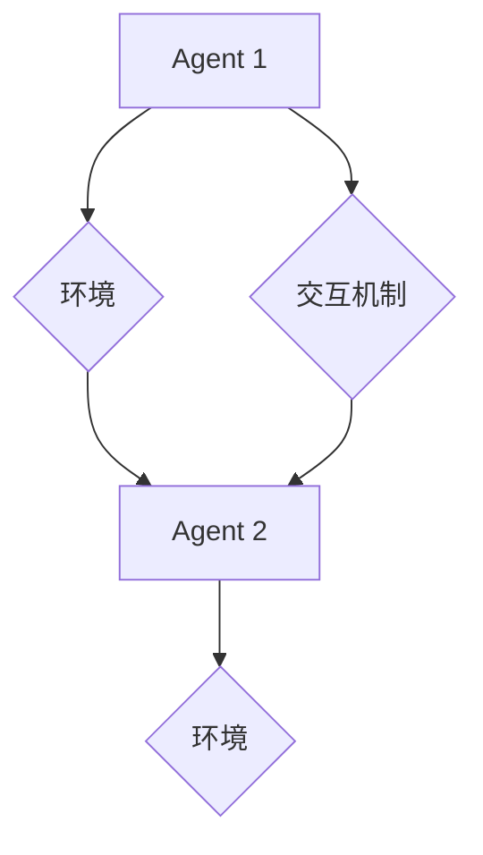

> 多Agent系统，Agent，智能体，协作，分布式，异步交互，同步交互，复杂任务

## 1. 背景介绍

在当今科技日新月异的时代，人工智能（AI）正以惊人的速度发展，并逐渐渗透到各个领域。其中，多Agent系统（MAS）作为一种重要的AI范式，凭借其强大的灵活性和适应性，在解决复杂问题、模拟现实世界等方面展现出巨大的潜力。

传统的单Agent系统，通常由一个独立的智能体完成任务。然而，当任务变得复杂，需要协调多个子任务或多个智能体协同工作时，单Agent系统就显得力不从心。多Agent系统则通过引入多个相互独立的智能体（Agent），每个Agent都具有自己的目标和行为策略，通过交互和协作来完成更复杂的任务。

## 2. 核心概念与联系

**2.1  Agent的概念**

在MAS中，Agent是一个具有感知、决策和行动能力的独立实体。它可以感知环境信息，根据自身目标和环境信息做出决策，并执行相应的行动。Agent可以是软件程序、机器人、人等，只要具备上述三个基本能力，都可以被视为Agent。

**2.2  多Agent系统的架构**

多Agent系统通常由以下几个关键组成部分构成：

* **Agent:** 多个相互独立的智能体，每个Agent都有自己的目标、行为策略和感知能力。
* **环境:** Agent所处的外部世界，包括Agent可以感知到的信息和Agent可以执行的行动。
* **交互机制:** Agent之间进行信息交换和协作的机制，可以是同步交互，也可以是异步交互。
* **调度机制:** 控制Agent执行顺序和资源分配的机制。

**2.3  交互类型**

Agent之间的交互可以是同步的，也可以是异步的。

* **同步交互:** Agent需要等待对方完成操作后才能继续执行自己的操作。这种交互方式通常需要更高的通信效率，但可以保证交互的原子性。
* **异步交互:** Agent可以独立执行操作，并在需要时发送消息给其他Agent。这种交互方式更加灵活，可以提高系统的并发性，但需要考虑消息传递的可靠性和顺序性。

**2.4  Mermaid 流程图**



## 3. 核心算法原理 & 具体操作步骤

**3.1  算法原理概述**

多Agent系统的核心算法通常涉及以下几个方面：

* **Agent的决策算法:** 每个Agent都需要根据自身目标和环境信息做出决策。常见的决策算法包括：
    * **基于规则的决策:** 根据预先定义的规则来做出决策。
    * **基于模型的决策:** 建立环境模型，通过模拟和推理来做出决策。
    * **强化学习:** 通过与环境交互，学习最优的决策策略。
* **Agent之间的协作算法:** Agent需要通过协作来完成更复杂的任务。常见的协作算法包括：
    * **协同规划:** 多个Agent共同规划任务执行方案。
    * **分工合作:** 将任务分解成多个子任务，由不同的Agent负责执行。
    * **协同学习:** 多个Agent共同学习，提高整体的决策能力。

**3.2  算法步骤详解**

以下是一个基于规则的决策算法的具体操作步骤：

1. **感知环境:** Agent感知环境信息，例如其他Agent的位置、目标等。
2. **规则匹配:** Agent根据自身目标和环境信息，匹配相应的规则。
3. **决策执行:** Agent根据匹配的规则，做出决策并执行相应的行动。
4. **状态更新:** 环境状态根据Agent的行动发生变化。
5. **重复步骤1-4:** Agent不断感知环境、匹配规则、决策执行、状态更新，直到任务完成。

**3.3  算法优缺点**

* **优点:** 规则易于理解和修改，决策过程简单高效。
* **缺点:** 规则难以覆盖所有情况，难以应对复杂和动态的环境。

**3.4  算法应用领域**

* **机器人协作:** 多个机器人协同完成任务，例如搬运货物、组装产品等。
* **游戏AI:** 多个AI角色协同完成游戏任务，例如围棋、策略游戏等。
* **网络安全:** 多个安全代理协同防御网络攻击。

## 4. 数学模型和公式 & 详细讲解 & 举例说明

**4.1  数学模型构建**

多Agent系统的数学模型通常基于博弈论、概率论和图论等数学工具。

* **博弈论:** 用于描述Agent之间的交互和竞争关系。
* **概率论:** 用于描述Agent的行为和环境的随机性。
* **图论:** 用于描述Agent之间的连接关系和信息传递路径。

**4.2  公式推导过程**

例如，我们可以使用博弈论中的纳什均衡来分析Agent的决策策略。纳什均衡是指一个状态，在该状态下，每个Agent都无法通过单方面改变自己的策略来获得更高的收益。

**4.3  案例分析与讲解**

假设有两个Agent，分别代表两个玩家，他们在玩一个简单的博弈游戏。每个玩家可以选择“合作”或“背叛”两种策略。

* 如果两个玩家都选择“合作”，则双方都获得一定的收益。
* 如果一方选择“合作”，另一方选择“背叛”，则选择“背叛”的玩家获得更高的收益，而选择“合作”的玩家获得较低的收益。
* 如果两个玩家都选择“背叛”，则双方都获得较低的收益。

通过分析这个博弈游戏的收益矩阵，我们可以发现，纳什均衡是两个玩家都选择“背叛”的策略。

**4.4  数学公式**

```latex
$$
\begin{array}{c|c|c}
& \text{合作} & \text{背叛} \\ \hline
\text{合作} & (3,3) & (0,5) \\ \hline
\text{背叛} & (5,0) & (1,1)
\end{array}
$$
```

## 5. 项目实践：代码实例和详细解释说明

**5.1  开发环境搭建**

* 操作系统: Ubuntu 20.04
* Python 版本: 3.8
* 必要的库: numpy, matplotlib, networkx

**5.2  源代码详细实现**

```python
import numpy as np
import matplotlib.pyplot as plt
import networkx as nx

# 定义Agent类
class Agent:
    def __init__(self, id, goal):
        self.id = id
        self.goal = goal
        self.state = None

    def perceive(self, environment):
        # Agent感知环境信息
        pass

    def decide(self, environment):
        # Agent根据环境信息做出决策
        pass

    def act(self, environment):
        # Agent执行行动
        pass

# 定义环境类
class Environment:
    def __init__(self):
        self.agents = []
        self.graph = nx.Graph()

    def add_agent(self, agent):
        self.agents.append(agent)

    def update(self):
        # 更新环境状态
        pass

# 创建Agent和环境
agent1 = Agent(1, "目标1")
agent2 = Agent(2, "目标2")
environment = Environment()
environment.add_agent(agent1)
environment.add_agent(agent2)

# 设置环境初始状态
environment.update()

# 运行多Agent系统
while True:
    # 每个Agent感知环境、决策、执行行动
    for agent in environment.agents:
        agent.perceive(environment)
        agent.decide(environment)
        agent.act(environment)

    # 更新环境状态
    environment.update()

```

**5.3  代码解读与分析**

* **Agent类:** 定义了Agent的基本属性和行为，包括id、目标、状态、感知、决策和行动等。
* **Environment类:** 定义了环境的基本属性和行为，包括Agent列表、图结构等。
* **代码流程:** 首先创建Agent和环境，然后设置环境初始状态。接着，进入循环，每个Agent感知环境、决策、执行行动，最后更新环境状态。

**5.4  运行结果展示**

运行代码后，可以观察到Agent在环境中交互和协作的过程，例如Agent之间的移动、目标的达成等。

## 6. 实际应用场景

**6.1  智能交通系统**

* 多个智能交通信号灯协同控制交通流量，减少拥堵。
* 多个无人驾驶汽车协同行驶，提高道路安全性和效率。

**6.2  智能制造**

* 多个机器人协同完成生产任务，提高生产效率和质量。
* 多个智能传感器协同监控生产过程，及时发现问题。

**6.3  金融市场**

* 多个智能交易系统协同进行交易，提高交易效率和收益。
* 多个风险管理系统协同监控市场风险，降低风险损失。

**6.4  未来应用展望**

随着人工智能技术的不断发展，多Agent系统将在更多领域得到应用，例如：

* **医疗保健:** 多个智能医疗机器人协同完成手术、护理等任务。
* **教育:** 多个智能教学系统协同提供个性化教育服务。
* **环境保护:** 多个智能环境监测系统协同监控环境污染情况。

## 7. 工具和资源推荐

**7.1  学习资源推荐**

* **书籍:**
    * 《多Agent系统》
    * 《人工智能：现代方法》
* **在线课程:**
    * Coursera: Multi-Agent Systems
    * edX: Introduction to Artificial Intelligence

**7.2  开发工具推荐**

* **MAS平台:**
    * Jadex
    * AgentSpeak
* **编程语言:**
    * Python
    * Java

**7.3  相关论文推荐**

* **《多Agent系统：概念、架构和算法》**
* **《基于强化学习的多Agent系统》**

## 8. 总结：未来发展趋势与挑战

**8.1  研究成果总结**

近年来，多Agent系统领域取得了显著进展，在算法、架构、应用等方面都取得了突破。

**8.2  未来发展趋势**

* **更智能的Agent:** 利用深度学习等先进技术，开发更智能、更灵活的Agent。
* **更复杂的交互:** 研究更复杂的交互机制，例如协同规划、分工合作等。
* **更广泛的应用:** 将多Agent系统应用到更多领域，例如医疗保健、教育、环境保护等。

**8.3  面临的挑战**

* **Agent的自主性与安全性:** 如何保证Agent的自主性，同时确保其安全性？
* **Agent的协作与信任:** 如何让Agent之间能够有效协作，并建立信任关系？
* **多Agent系统的可解释性:** 如何提高多Agent系统的可解释性，使其决策过程更加透明？

**8.4  研究展望**

未来，多Agent系统将继续是一个重要的研究方向，需要进一步探索Agent的智能化、交互的复杂性和应用的广泛性。


## 9. 附录：常见问题与解答

**9.1  Q: 多Agent系统与单Agent系统相比有什么优势？**

**A:** 多Agent系统相比单Agent系统具有以下优势：

* **更灵活:** 多个Agent可以协同工作，适应更复杂的环境。
* **更鲁棒:** 即使部分Agent失效，其他Agent仍然可以继续执行任务。
* **更可扩展:** 可以轻松添加新的Agent，扩展系统的功能。

**9.2  Q: 多Agent系统有哪些常见的应用场景？**

**A:** 多Agent系统常见的应用场景包括：

* 智能交通系统
* 智能制造
* 金融市场