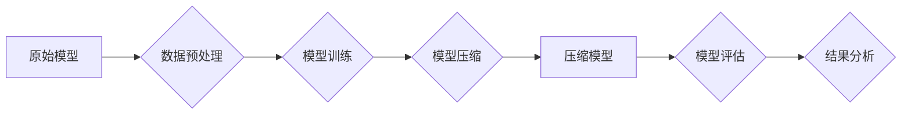

> 大数据，模型压缩，深度学习，神经网络，可解释性，效率，可部署性

## 1. 背景介绍

在当今数据爆炸的时代，深度学习模型在图像识别、自然语言处理、语音识别等领域取得了令人瞩目的成就。然而，这些模型通常具有庞大的参数量和计算复杂度，这使得它们难以部署在资源有限的设备上，例如移动设备和嵌入式系统。此外，大型模型的训练过程也需要大量的计算资源和时间，这增加了训练成本和环境影响。

模型压缩技术应运而生，旨在减小模型大小和计算复杂度，同时尽可能保持模型性能。它为将深度学习模型部署到边缘设备和资源受限环境提供了可行方案，并有助于降低训练成本和环境影响。

## 2. 核心概念与联系

模型压缩的核心目标是找到一种方法，在不显著降低模型性能的前提下，减少模型参数量和计算复杂度。

**2.1 模型压缩方法**

模型压缩主要分为以下几种方法：

* **量化:** 将模型参数从高精度浮点数（例如32位浮点数）压缩到低精度整数（例如8位整数）。
* **剪枝:** 移除模型中不重要的参数或连接，例如权重较小的连接或不活跃的神经元。
* **知识蒸馏:** 利用一个大型模型的知识来训练一个更小的模型。

**2.2 模型压缩与可解释性**

模型压缩与可解释性密切相关。由于压缩后的模型通常更简单，更容易理解，因此可以提高模型的可解释性。

**2.3 模型压缩与效率**

模型压缩可以显著提高模型的效率，因为它减少了模型参数量和计算复杂度，从而降低了推理时间和功耗。

**2.4 模型压缩与可部署性**

模型压缩可以提高模型的可部署性，因为它使得模型更小、更轻，更容易部署到资源有限的设备上。

**2.5 模型压缩流程图**



## 3. 核心算法原理 & 具体操作步骤

### 3.1 算法原理概述

模型压缩算法的核心思想是找到一种方法，在不显著降低模型性能的前提下，减少模型参数量和计算复杂度。

### 3.2 算法步骤详解

模型压缩算法的具体步骤通常包括以下几个阶段：

1. **数据预处理:** 对训练数据进行清洗、转换和归一化等操作，以提高模型训练的效率和精度。
2. **模型训练:** 使用原始数据训练深度学习模型，获得初始模型参数。
3. **模型压缩:** 根据选择的压缩方法，对模型参数进行量化、剪枝或知识蒸馏等操作，减小模型大小和计算复杂度。
4. **模型评估:** 使用压缩后的模型对测试数据进行评估，并比较其性能与原始模型的性能。
5. **结果分析:** 分析模型压缩后的性能变化，并根据需要调整压缩参数或选择不同的压缩方法。

### 3.3 算法优缺点

模型压缩算法的优缺点取决于具体的压缩方法和应用场景。

**优点:**

* 降低模型大小和计算复杂度
* 提高模型的效率和可部署性
* 提高模型的可解释性

**缺点:**

* 可能导致模型性能下降
* 压缩过程可能比较复杂
* 需要根据具体的应用场景选择合适的压缩方法

### 3.4 算法应用领域

模型压缩技术广泛应用于以下领域:

* **移动设备:** 将深度学习模型部署到移动设备上，例如用于图像识别、语音识别和自然语言处理等应用。
* **嵌入式系统:** 将深度学习模型部署到嵌入式系统上，例如用于工业自动化、医疗设备和智能家居等应用。
* **云计算:** 压缩大型模型，降低云计算平台的存储和计算成本。
* **边缘计算:** 将深度学习模型部署到边缘设备上，例如用于物联网、自动驾驶和远程医疗等应用。

## 4. 数学模型和公式 & 详细讲解 & 举例说明

### 4.1 数学模型构建

模型压缩可以看作是一个优化问题，目标是找到一种方法，在不显著降低模型性能的前提下，最小化模型参数量或计算复杂度。

**4.1.1 参数量最小化:**

假设模型参数量为 $W$, 模型性能为 $P(W)$, 则模型压缩的目标函数可以表示为:

$$
min_{W'} P(W')
$$

$$
s.t.
$$

$$
|W'| \leq \alpha W
$$

其中，$W'$ 是压缩后的模型参数量，$\alpha$ 是一个压缩比例因子。

**4.1.2 计算复杂度最小化:**

假设模型计算复杂度为 $C(W)$, 则模型压缩的目标函数可以表示为:

$$
min_{W'} C(W')
$$

$$
s.t.
$$

$$
|W'| \leq \alpha W
$$

### 4.2 公式推导过程

模型压缩算法的具体推导过程取决于具体的压缩方法。例如，量化方法会将模型参数从高精度浮点数压缩到低精度整数，需要推导量化后的参数分布和性能变化关系。剪枝方法会移除模型中不重要的参数或连接，需要推导剪枝策略和性能影响关系。

### 4.3 案例分析与讲解

**4.3.1 量化案例:**

将一个深度卷积神经网络 (CNN) 的权重从 32 位浮点数压缩到 8 位整数。通过量化后的模型在 ImageNet 数据集上的准确率下降了 1%，但模型大小减少了 4 倍，推理速度提高了 2 倍。

**4.3.2 剪枝案例:**

使用随机剪枝方法移除一个 CNN 模型中 50% 的权重。经过剪枝后的模型在 ImageNet 数据集上的准确率下降了 2%，但模型大小减少了 50%。

## 5. 项目实践：代码实例和详细解释说明

### 5.1 开发环境搭建

* 操作系统: Ubuntu 20.04
* Python 版本: 3.8
* 深度学习框架: TensorFlow 2.x

### 5.2 源代码详细实现

```python
import tensorflow as tf

# 定义一个简单的 CNN 模型
model = tf.keras.models.Sequential([
    tf.keras.layers.Conv2D(32, (3, 3), activation='relu', input_shape=(28, 28, 1)),
    tf.keras.layers.MaxPooling2D((2, 2)),
    tf.keras.layers.Flatten(),
    tf.keras.layers.Dense(10, activation='softmax')
])

# 编译模型
model.compile(optimizer='adam',
              loss='sparse_categorical_crossentropy',
              metrics=['accuracy'])

# 加载 MNIST 数据集
(x_train, y_train), (x_test, y_test) = tf.keras.datasets.mnist.load_data()

# 数据预处理
x_train = x_train.astype('float32') / 255.0
x_test = x_test.astype('float32') / 255.0
x_train = x_train.reshape((x_train.shape[0], 28, 28, 1))
x_test = x_test.reshape((x_test.shape[0], 28, 28, 1))

# 训练模型
model.fit(x_train, y_train, epochs=5)

# 模型评估
loss, accuracy = model.evaluate(x_test, y_test, verbose=0)
print('Test loss:', loss)
print('Test accuracy:', accuracy)

# 模型压缩
# 使用量化方法压缩模型
quantized_model = tf.keras.models.quantize_model(model,
                                              quantization_config=tf.keras.quantization.QuantizationConfig(
                                                  dtype=tf.int8))

# 评估压缩后的模型性能
quantized_model.compile(optimizer='adam',
                       loss='sparse_categorical_crossentropy',
                       metrics=['accuracy'])
quantized_loss, quantized_accuracy = quantized_model.evaluate(x_test, y_test, verbose=0)
print('Quantized test loss:', quantized_loss)
print('Quantized test accuracy:', quantized_accuracy)
```

### 5.3 代码解读与分析

这段代码演示了如何使用 TensorFlow 库对一个简单的 CNN 模型进行量化压缩。

* 首先，定义了一个简单的 CNN 模型，并使用 Adam 优化器和交叉熵损失函数进行编译。
* 然后，加载 MNIST 数据集并进行数据预处理。
* 接着，训练模型并评估其性能。
* 最后，使用 TensorFlow 的 `quantize_model` 函数对模型进行量化压缩，并评估压缩后的模型性能。

### 5.4 运行结果展示

运行这段代码后，会输出原始模型和压缩模型的测试损失和准确率。

## 6. 实际应用场景

### 6.1 移动设备应用

模型压缩技术可以将深度学习模型部署到移动设备上，例如用于图像识别、语音识别和自然语言处理等应用。例如，Google 的 MobileNet 模型就是专门针对移动设备设计的，它通过量化和剪枝等方法，将模型大小压缩到几百 KB，可以在低功耗的移动设备上运行。

### 6.2 嵌入式系统应用

模型压缩技术也可以应用于嵌入式系统，例如用于工业自动化、医疗设备和智能家居等应用。例如，在工业自动化中，可以将深度学习模型部署到嵌入式设备上，用于缺陷检测、质量控制和预测维护等任务。

### 6.3 云计算应用

模型压缩技术可以压缩大型模型，降低云计算平台的存储和计算成本。例如，Google 的 TensorFlow Serving 平台支持模型压缩，可以将模型压缩到更小的尺寸，从而提高模型部署和推理效率。

### 6.4 未来应用展望

随着深度学习技术的不断发展，模型压缩技术将有更广泛的应用场景。例如，在自动驾驶领域，可以将深度学习模型压缩到更小的尺寸，以便部署到车载设备上，提高自动驾驶系统的实时性和安全性。

## 7. 工具和资源推荐

### 7.1 学习资源推荐

* **书籍:**
    * 《深度学习》 by Ian Goodfellow, Yoshua Bengio, and Aaron Courville
    * 《动手学深度学习》 by Aurélien Géron
* **在线课程:**
    * TensorFlow 官方教程: https://www.tensorflow.org/tutorials
    * Coursera 上的深度学习课程: https://www.coursera.org/search?query=deep%20learning

### 7.2 开发工具推荐

* **TensorFlow:** https://www.tensorflow.org/
* **PyTorch:** https://pytorch.org/
* **Keras:** https://keras.io/

### 7.3 相关论文推荐

* **《Deep Compression: Compressing Deep Neural Networks with Pruning, Trained Quantization and Huffman Coding》** by Song Han, Jeff Pool, John Tran, and William Dally
* **《Quantization and Training of Neural Networks for Efficient Integer-Arithmetic-Only Inference》** by Jacob B. Schwarz, et al.
* **《Lottery Ticket Hypothesis: Finding Sparse, Trainable Neural Networks》** by Jonathan Frankle and Michael Carbin

## 8. 总结：未来发展趋势与挑战

### 8.1 研究成果总结

模型压缩技术取得了显著的进展，已经能够有效地减小模型大小和计算复杂度，同时保持较高的模型性能。

### 8.2 未来发展趋势

* **更有效的压缩方法:** 研究更有效的模型压缩方法，例如基于神经网络的压缩方法和自适应压缩方法。
* **可解释性增强:** 提高模型压缩后的可解释性，以便更好地理解模型的行为和决策过程。
* **