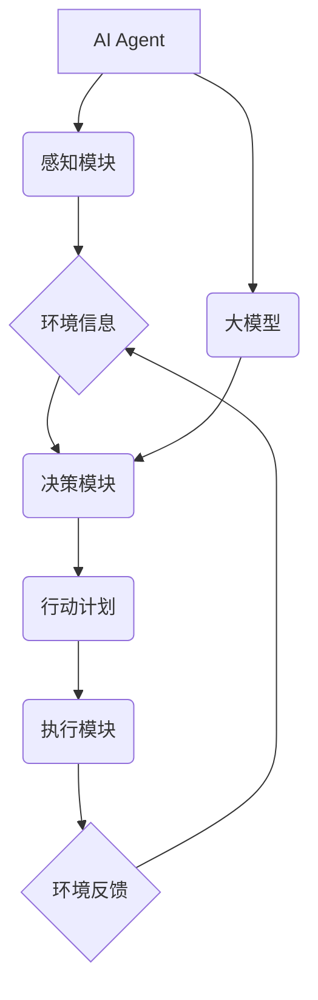

> AI Agent, 大模型, 规划, 强化学习, 决策制定, 知识表示, 问题解决

## 1. 背景介绍

在人工智能领域，AI Agent（智能代理）作为实现智能化的核心单元，扮演着重要的角色。AI Agent能够感知环境、做出决策并执行行动，从而实现预期的目标。随着大模型技术的快速发展，AI Agent的智能化水平得到了显著提升。大模型，特别是具备强大泛化能力和知识表示能力的Transformer模型，为AI Agent提供了更强大的学习和推理能力，使其能够处理更复杂的任务和环境。

然而，单纯依靠大模型的学习能力仍然不足以使AI Agent真正智能化。AI Agent需要具备规划能力，能够根据目标和环境信息制定合理的行动计划，并根据反馈信息进行调整。规划是AI Agent智能化的关键环节，它决定了AI Agent的决策效率和行动效果。

## 2. 核心概念与联系

**2.1 AI Agent**

AI Agent是一个能够感知环境、做出决策并执行行动的智能体。它通常由以下几个部分组成：

* **感知模块:** 用于获取环境信息，例如传感器数据、文本信息等。
* **决策模块:** 用于根据环境信息和目标制定行动计划。
* **执行模块:** 用于执行决策并与环境交互。

**2.2 大模型**

大模型是指参数量巨大、训练数据量庞大的深度学习模型。它们通常具有强大的泛化能力和知识表示能力，能够在各种任务中表现出色，例如自然语言处理、图像识别、代码生成等。

**2.3 规划**

规划是指在给定目标和环境信息的情况下，制定一系列步骤以实现目标的过程。规划算法通常需要考虑以下因素：

* **目标:** AI Agent想要达成的目标。
* **环境:** AI Agent所处的环境及其状态。
* **行动:** AI Agent可以执行的行动。
* **时间:** 规划需要考虑时间因素，例如行动的执行时间和目标的完成时间。

**2.4 核心概念联系**

大模型和规划在AI Agent中相互关联，共同推动AI Agent的智能化发展。大模型为AI Agent提供了强大的学习和推理能力，使其能够更好地理解环境信息和目标需求。规划算法则利用大模型的知识表示能力，制定更合理的行动计划，从而提高AI Agent的决策效率和行动效果。



## 3. 核心算法原理 & 具体操作步骤

### 3.1 算法原理概述

在AI Agent中，常用的规划算法包括：

* **状态空间搜索:** 这种算法将问题转化为状态空间搜索问题，通过穷举搜索所有可能的路径，找到最优解。
* **强化学习:** 强化学习算法通过与环境交互，学习最优策略。AI Agent在环境中采取行动，根据反馈信息更新策略，最终学习到最优的行动策略。
* **基于规则的规划:** 基于规则的规划算法使用预先定义的规则来生成行动计划。这种方法通常适用于结构化环境，但难以处理复杂、动态的环境。

### 3.2 算法步骤详解

**3.2.1 状态空间搜索**

1. **构建状态空间:** 将问题转化为状态空间，其中每个状态代表环境的一种情况。
2. **定义操作:** 定义AI Agent可以执行的操作，这些操作会改变环境状态。
3. **搜索路径:** 从初始状态开始，搜索所有可能的路径，直到找到目标状态。
4. **评估路径:** 对每个路径进行评估，选择最优路径。

**3.2.2 强化学习**

1. **定义奖励函数:** 定义一个奖励函数，用于评估AI Agent的行动效果。
2. **初始化策略:** 初始化一个策略，用于决定AI Agent在每个状态下采取的行动。
3. **与环境交互:** AI Agent与环境交互，根据策略选择行动，并获得奖励反馈。
4. **更新策略:** 使用奖励反馈更新策略，使策略朝着获得更高奖励的方向调整。
5. **重复步骤3-4:** 重复步骤3-4，直到策略收敛。

**3.2.3 基于规则的规划**

1. **定义规则:** 定义一组规则，描述AI Agent在不同环境状态下应该采取的行动。
2. **匹配规则:** 根据当前环境状态，匹配相应的规则。
3. **执行行动:** 执行规则指定的行动。

### 3.3 算法优缺点

| 算法 | 优点 | 缺点 |
|---|---|---|
| 状态空间搜索 | 能够找到最优解 | 计算复杂度高，难以处理大规模问题 |
| 强化学习 | 能够学习复杂策略，适应动态环境 | 需要大量数据和计算资源，训练时间长 |
| 基于规则的规划 | 简单易实现，适用于结构化环境 | 难以处理复杂、动态的环境 |

### 3.4 算法应用领域

* **机器人控制:** 规划机器人运动路径、抓取物体等。
* **游戏AI:** 规划游戏角色的行动策略。
* **自动驾驶:** 规划车辆行驶路线、避障等。
* **医疗诊断:** 规划治疗方案、辅助医生诊断疾病。

## 4. 数学模型和公式 & 详细讲解 & 举例说明

### 4.1 数学模型构建

在AI Agent中，规划问题通常可以建模为一个马尔可夫决策过程 (MDP)。MDP由以下几个要素组成：

* **状态空间 S:** 环境可能存在的全部状态。
* **行动空间 A:** AI Agent可以执行的全部行动。
* **转移概率 P(s', r | s, a):** 从状态 s 执行行动 a 到状态 s' 的概率，以及获得奖励 r 的概率。
* **奖励函数 R(s, a):** 在状态 s 执行行动 a 时获得的奖励。

### 4.2 公式推导过程

目标是找到一个策略 π(s)，使得在策略 π(s) 下，AI Agent获得的总奖励最大化。

可以使用动态规划算法或蒙特卡罗方法来求解MDP问题。

**动态规划算法:**

Bellman方程：

$$
V^{\pi}(s) = \max_a \left[ R(s, a) + \gamma \sum_{s'} P(s', r | s, a) V^{\pi}(s') \right]
$$

其中：

* $V^{\pi}(s)$ 是在策略 π(s) 下，从状态 s 开始的期望总奖励。
* $\gamma$ 是折扣因子，控制未来奖励的权重。

**蒙特卡罗方法:**

通过模拟多个轨迹，估计策略的价值函数。

### 4.3 案例分析与讲解

**案例:** 一个AI Agent需要在迷宫中找到出口。

* **状态空间:** 迷宫中的每个格子。
* **行动空间:** 向上、向下、向左、向右移动。
* **转移概率:** 每个行动的成功概率取决于迷宫的结构。
* **奖励函数:** 找到出口时获得最大奖励，其他状态获得较小的奖励。

可以使用动态规划算法或蒙特卡罗方法来规划AI Agent的行动路径，使其能够找到出口。

## 5. 项目实践：代码实例和详细解释说明

### 5.1 开发环境搭建

* Python 3.x
* TensorFlow 或 PyTorch
* 其他必要的库，例如 NumPy、Pandas 等

### 5.2 源代码详细实现

```python
# 使用强化学习算法规划AI Agent的行动

import gym
import numpy as np
from tensorflow.keras.models import Sequential
from tensorflow.keras.layers import Dense

# 创建环境
env = gym.make('CartPole-v1')

# 定义神经网络模型
model = Sequential()
model.add(Dense(128, activation='relu', input_shape=(4,)))
model.add(Dense(64, activation='relu'))
model.add(Dense(2, activation='softmax'))

# 编译模型
model.compile(loss='categorical_crossentropy', optimizer='adam')

# 训练模型
for episode in range(1000):
    state = env.reset()
    done = False
    total_reward = 0

    while not done:
        # 选择行动
        action = np.argmax(model.predict(state.reshape(1, -1)))

        # 执行行动
        next_state, reward, done, _ = env.step(action)

        # 更新状态
        state = next_state

        # 更新奖励
        total_reward += reward

    # 训练模型
    model.fit(state.reshape(1, -1), np.eye(2)[action], epochs=1, verbose=0)

    # 打印奖励
    print(f'Episode {episode+1}, Total Reward: {total_reward}')

# 保存模型
model.save('cartpole_model.h5')
```

### 5.3 代码解读与分析

* 代码使用强化学习算法训练AI Agent，使其能够控制CartPole环境中的杆子保持平衡。
* 模型使用神经网络结构，输入环境状态，输出行动概率。
* 训练过程使用强化学习的原理，通过奖励反馈更新模型参数。
* 训练完成后，模型能够预测在给定环境状态下，应该采取的行动，从而使AI Agent能够控制杆子保持平衡。

### 5.4 运行结果展示

训练完成后，模型能够控制杆子保持平衡，并获得较高的奖励。

## 6. 实际应用场景

### 6.1 自动驾驶

AI Agent可以规划车辆行驶路线，避障，并做出安全决策。

### 6.2 机器人控制

AI Agent可以规划机器人运动路径，抓取物体，以及完成其他任务。

### 6.3 游戏AI

AI Agent可以规划游戏角色的行动策略，提高游戏体验。

### 6.4 未来应用展望

随着大模型和规划算法的不断发展，AI Agent将在更多领域得到应用，例如医疗诊断、金融投资、教育等。

## 7. 工具和资源推荐

### 7.1 学习资源推荐

* **书籍:**
    * Reinforcement Learning: An Introduction by Sutton and Barto
    * Artificial Intelligence: A Modern Approach by Russell and Norvig
* **在线课程:**
    * Coursera: Reinforcement Learning Specialization
    * Udacity: Intro to Artificial Intelligence

### 7.2 开发工具推荐

* **Python:** 广泛用于AI开发，拥有丰富的库和工具。
* **TensorFlow:** 深度学习框架，用于训练大模型。
* **PyTorch:** 深度学习框架，灵活易用。

### 7.3 相关论文推荐

* **Deep Reinforcement Learning with Double Q-learning**
* **Proximal Policy Optimization Algorithms**
* **Attention Is All You Need**

## 8. 总结：未来发展趋势与挑战

### 8.1 研究成果总结

大模型和规划算法在AI Agent领域取得了显著进展，使AI Agent能够处理更复杂的任务和环境。

### 8.2 未来发展趋势

* **更强大的大模型:** 随着计算资源的不断提升，大模型将变得更加强大，能够处理更复杂的任务。
* **更有效的规划算法:** 研究人员将继续开发更有效的规划算法，使AI Agent能够在更复杂的环境中做出更优的决策。
* **多模态AI Agent:** 未来AI Agent将能够处理多种模态信息，例如文本、图像、音频等，从而更加智能化。

### 8.3 面临的挑战

* **数据获取和标注:** 大模型需要大量的训练数据，而获取和标注高质量数据仍然是一个挑战。
* **模型解释性和可解释性:** 大模型的决策过程往往难以理解，这限制了其在安全关键领域的应用。
* **伦理和社会影响:** AI Agent的快速发展也带来了伦理和社会影响，需要引起重视和讨论。

### 8.4 研究展望

未来研究将集中在以下几个方面:

* 开发更强大的大模型