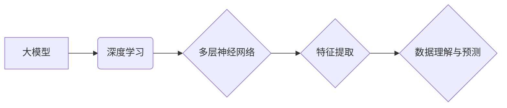

> 大模型、创业、技术突破、产品创新、人工智能、深度学习、自然语言处理、计算机视觉

## 1. 背景介绍

在当今科技飞速发展的时代，人工智能（AI）正以惊人的速度改变着我们的生活和工作方式。其中，大模型作为AI领域的一项重要突破，凭借其强大的学习能力和泛化能力，正在广泛应用于各个领域，为创业者带来了前所未有的机遇。

大模型是指参数规模庞大、训练数据海量的人工智能模型。它们通过学习海量数据，能够掌握复杂的知识和模式，并应用于各种任务，例如自然语言处理、计算机视觉、语音识别等。与传统机器学习模型相比，大模型具有以下优势：

* **更强的学习能力:** 大模型拥有更多的参数，能够学习更复杂的模式和关系。
* **更好的泛化能力:** 大模型在训练数据之外的未知数据上表现更出色。
* **更广泛的应用场景:** 大模型可以应用于更广泛的领域和任务。

## 2. 核心概念与联系

大模型的训练和应用离不开深度学习技术。深度学习是一种模仿人类大脑神经网络结构的机器学习方法。它通过多层神经网络，逐层提取数据的特征，最终实现对数据的理解和预测。

**大模型与深度学习的联系:**



## 3. 核心算法原理 & 具体操作步骤

### 3.1  算法原理概述

大模型的训练主要基于**反向传播算法**。该算法通过不断调整模型参数，使模型的预测结果与真实结果之间的误差最小化。

**反向传播算法步骤:**

1. 将输入数据输入到模型中，得到预测结果。
2. 计算预测结果与真实结果之间的误差。
3. 根据误差反向传播，调整模型参数。
4. 重复步骤1-3，直到误差达到预设阈值。

### 3.2  算法步骤详解

1. **数据预处理:** 将原始数据进行清洗、转换和格式化，使其适合模型训练。
2. **模型构建:** 根据任务需求，选择合适的模型架构，并初始化模型参数。
3. **模型训练:** 使用训练数据，通过反向传播算法，不断调整模型参数，使模型的预测结果越来越准确。
4. **模型评估:** 使用测试数据，评估模型的性能，例如准确率、召回率等。
5. **模型调优:** 根据评估结果，调整模型参数或架构，进一步提高模型性能。
6. **模型部署:** 将训练好的模型部署到实际应用场景中。

### 3.3  算法优缺点

**优点:**

* 能够学习复杂的模式和关系。
* 具有较好的泛化能力。
* 应用范围广泛。

**缺点:**

* 训练成本高，需要大量的计算资源和数据。
* 训练时间长，可能需要数天甚至数周。
* 模型解释性差，难以理解模型的决策过程。

### 3.4  算法应用领域

大模型在各个领域都有广泛的应用，例如：

* **自然语言处理:** 文本生成、机器翻译、问答系统、情感分析等。
* **计算机视觉:** 图像识别、物体检测、图像分割、视频分析等。
* **语音识别:** 语音转文本、语音助手、语音搜索等。
* **推荐系统:** 商品推荐、内容推荐、用户画像等。

## 4. 数学模型和公式 & 详细讲解 & 举例说明

### 4.1  数学模型构建

大模型的训练过程本质上是一个优化问题，目标是找到最优的模型参数，使得模型的预测结果与真实结果之间的误差最小化。

常用的损失函数包括均方误差（MSE）、交叉熵损失（Cross-Entropy Loss）等。

**均方误差（MSE）:**

$$MSE = \frac{1}{n} \sum_{i=1}^{n} (y_i - \hat{y}_i)^2$$

其中：

* $y_i$ 是真实值
* $\hat{y}_i$ 是模型预测值
* $n$ 是样本数量

**交叉熵损失（Cross-Entropy Loss）:**

$$Cross-Entropy Loss = -\sum_{i=1}^{n} y_i \log(\hat{y}_i)$$

其中：

* $y_i$ 是真实值（one-hot编码）
* $\hat{y}_i$ 是模型预测值（概率分布）

### 4.2  公式推导过程

反向传播算法的核心是利用链式法则，将损失函数对模型参数的梯度计算出来。

**链式法则:**

$$\frac{d}{dx} f(g(x)) = f'(g(x)) \cdot g'(x)$$

通过链式法则，可以将损失函数对模型参数的梯度分解成多个部分，并逐层反向传播。

### 4.3  案例分析与讲解

假设我们训练一个图像分类模型，目标是将图像分类为猫或狗。

我们可以使用交叉熵损失函数来衡量模型的性能。

当模型预测结果为猫的概率为0.8，真实值为猫时，交叉熵损失为：

$$Cross-Entropy Loss = -0.8 \log(0.8) \approx 0.22$$

当模型预测结果为狗的概率为0.2，真实值为狗时，交叉熵损失为：

$$Cross-Entropy Loss = -0.2 \log(0.2) \approx 0.69$$

通过反向传播算法，我们可以计算出模型参数的梯度，并根据梯度更新模型参数，从而降低损失函数的值。

## 5. 项目实践：代码实例和详细解释说明

### 5.1  开发环境搭建

为了实现大模型的训练和应用，需要搭建相应的开发环境。

常用的开发环境包括：

* **Python:** 大模型开发的常用编程语言。
* **深度学习框架:** TensorFlow、PyTorch等深度学习框架提供丰富的工具和库，方便大模型的训练和应用。
* **GPU:** 大模型的训练需要大量的计算资源，GPU可以显著加速训练速度。

### 5.2  源代码详细实现

以下是一个使用PyTorch框架训练一个简单的文本分类模型的代码示例：

```python
import torch
import torch.nn as nn

# 定义模型
class TextClassifier(nn.Module):
    def __init__(self, vocab_size, embedding_dim, hidden_dim, num_classes):
        super(TextClassifier, self).__init__()
        self.embedding = nn.Embedding(vocab_size, embedding_dim)
        self.lstm = nn.LSTM(embedding_dim, hidden_dim)
        self.fc = nn.Linear(hidden_dim, num_classes)

    def forward(self, x):
        x = self.embedding(x)
        x, _ = self.lstm(x)
        x = self.fc(x[:, -1, :])
        return x

# 初始化模型参数
vocab_size = 10000
embedding_dim = 128
hidden_dim = 256
num_classes = 2
model = TextClassifier(vocab_size, embedding_dim, hidden_dim, num_classes)

# 定义损失函数和优化器
criterion = nn.CrossEntropyLoss()
optimizer = torch.optim.Adam(model.parameters())

# 训练模型
for epoch in range(num_epochs):
    for batch in train_dataloader:
        inputs, labels = batch
        optimizer.zero_grad()
        outputs = model(inputs)
        loss = criterion(outputs, labels)
        loss.backward()
        optimizer.step()

# 保存模型
torch.save(model.state_dict(), 'text_classifier.pth')
```

### 5.3  代码解读与分析

这段代码实现了使用PyTorch框架训练一个简单的文本分类模型。

* **模型定义:** 定义了一个名为`TextClassifier`的模型类，包含嵌入层、LSTM层和全连接层。
* **模型初始化:** 初始化模型参数，包括词嵌入维度、LSTM隐藏维度和类别数。
* **损失函数和优化器:** 定义了交叉熵损失函数和Adam优化器。
* **训练模型:** 训练模型的过程包括迭代训练数据，计算损失，反向传播梯度，更新模型参数。
* **保存模型:** 将训练好的模型参数保存到文件。

### 5.4  运行结果展示

训练完成后，可以将模型应用于新的文本数据进行分类。

## 6. 实际应用场景

大模型在各个领域都有广泛的应用场景，例如：

### 6.1  自然语言处理

* **聊天机器人:** 大模型可以训练出更智能、更自然的聊天机器人，能够更好地理解用户的意图并提供更准确的回复。
* **机器翻译:** 大模型可以实现更高质量的机器翻译，能够更准确地翻译不同语言之间的文本。
* **文本摘要:** 大模型可以自动生成文本摘要，提取文本的关键信息。
* **问答系统:** 大模型可以训练出更智能的问答系统，能够理解用户的提问并提供更准确的答案。

### 6.2  计算机视觉

* **图像识别:** 大模型可以识别图像中的物体、场景和人物。
* **物体检测:** 大模型可以检测图像中物体的位置和类别。
* **图像分割:** 大模型可以将图像分割成不同的区域，例如前景和背景。
* **视频分析:** 大模型可以分析视频内容，例如识别人物、跟踪物体、识别事件等。

### 6.3  语音识别

* **语音转文本:** 大模型可以将语音转换为文本，例如语音助手、语音搜索等。
* **语音合成:** 大模型可以将文本转换为语音，例如语音播报、语音助手等。
* **语音识别:** 大模型可以识别语音中的说话人、情绪、语气等信息。

### 6.4  未来应用展望

大模型的应用前景广阔，未来将有更多新的应用场景出现，例如：

* **个性化推荐:** 根据用户的兴趣和偏好，提供个性化的商品、内容和服务推荐。
* **自动驾驶:** 大模型可以帮助自动驾驶汽车感知周围环境、做出决策和控制车辆。
* **医疗诊断:** 大模型可以辅助医生进行疾病诊断，提高诊断准确率。
* **科学研究:** 大模型可以帮助科学家分析大规模数据，发现新的规律和知识。

## 7. 工具和资源推荐

### 7.1  学习资源推荐

* **书籍:**
    * 《深度学习》
    * 《动手学深度学习》
    * 《自然语言处理》
* **在线课程:**
    * Coursera: 深度学习
    * Udacity: 深度学习工程师
    * fast.ai: 深度学习课程
* **博客和网站:**
    * TensorFlow博客
    * PyTorch博客
    * OpenAI博客

### 7.2  开发工具推荐

* **深度学习框架:** TensorFlow、PyTorch、Keras
* **数据处理工具:** Pandas、NumPy
* **可视化工具:** Matplotlib、Seaborn

### 7.3  相关论文推荐

* 《Attention Is All You Need》
* 《BERT: Pre-training of Deep Bidirectional Transformers for Language Understanding》
* 《GPT-3: Language Models are Few-Shot Learners》

## 8. 总结：未来发展趋势与挑战

### 8.1  研究成果总结

近年来，大模型在各个领域取得了显著的成果，例如在自然语言处理、计算机视觉、语音识别等领域取得了突破性的进展。

### 8.2  未来发展趋势

未来，大模型的发展趋势包括：

* **模型规模的进一步扩大:** 随着计算资源的不断提升，大模型的规模将继续扩大，模型能力将进一步增强。
* **模型架构的创新:** 研究人员将继续探索新的模型架构，例如Transformer变体、图神经网络等，以提高模型的性能和效率。
* **多模态大模型:** 将文本、图像、