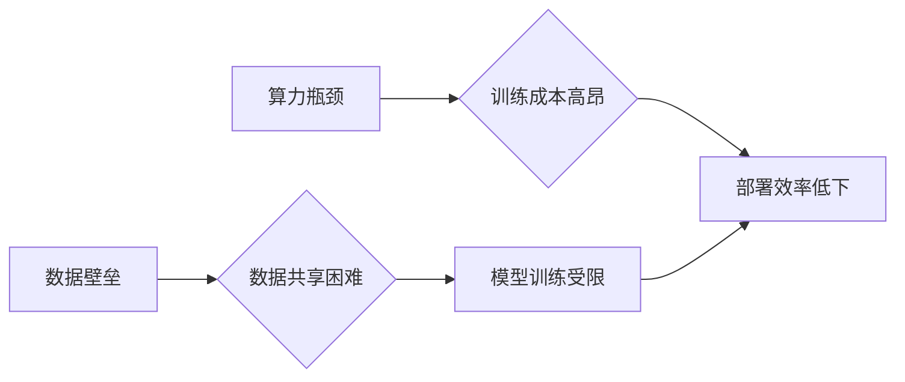

> 大模型、数据壁垒、算力瓶颈、创业挑战、AI技术、数据安全、算力资源

## 1. 背景介绍

近年来，人工智能（AI）技术取得了飞速发展，特别是大模型的涌现，为各行各业带来了前所未有的机遇。大模型，是指参数规模庞大、训练数据海量的人工智能模型，其强大的学习能力和泛化能力使其能够在自然语言处理、计算机视觉、语音识别等领域取得突破性进展。

然而，大模型的应用也面临着诸多挑战，其中数据壁垒和算力瓶颈是两个最为关键的难题。数据壁垒是指不同组织、机构之间数据孤岛现象，导致数据无法共享和流通，限制了大模型的训练和应用。算力瓶颈是指训练和部署大模型需要大量的计算资源，而现有的算力资源难以满足需求，导致训练成本高昂、部署效率低下。

## 2. 核心概念与联系

### 2.1 数据壁垒

数据壁垒是指不同组织、机构之间数据无法共享和流通的现象。其主要原因包括：

* **数据孤岛:** 各组织、机构各自拥有大量数据，但缺乏统一的标准和接口，导致数据无法互通。
* **数据安全和隐私:** 数据泄露和隐私侵犯是组织和个人高度关注的问题，导致数据共享面临安全风险。
* **数据所有权和利益分配:** 数据所有权和利益分配问题难以解决，导致数据共享缺乏动力。

### 2.2 算力瓶颈

算力瓶颈是指训练和部署大模型需要大量的计算资源，而现有的算力资源难以满足需求。其主要原因包括：

* **模型规模庞大:** 大模型参数规模巨大，训练和推理需要大量的计算能力。
* **训练数据海量:** 大模型需要海量数据进行训练，数据处理和训练过程都需要大量的计算资源。
* **算力资源稀缺:** 高性能计算资源稀缺，难以满足大模型训练和部署的需求。

**Mermaid 流程图**



## 3. 核心算法原理 & 具体操作步骤

### 3.1 算法原理概述

大模型训练主要采用深度学习算法，其中Transformer模型是目前最流行的架构之一。Transformer模型利用自注意力机制，能够捕捉文本序列中长距离依赖关系，从而实现更准确的文本理解和生成。

### 3.2 算法步骤详解

大模型训练的具体步骤包括：

1. **数据预处理:** 将原始数据进行清洗、格式化、编码等操作，使其能够被模型理解。
2. **模型构建:** 根据任务需求选择合适的模型架构，并设置模型参数。
3. **模型训练:** 使用训练数据训练模型，通过反向传播算法不断调整模型参数，使其能够准确预测目标输出。
4. **模型评估:** 使用测试数据评估模型性能，并根据评估结果进行模型调优。
5. **模型部署:** 将训练好的模型部署到实际应用场景中，用于进行预测或生成。

### 3.3 算法优缺点

**优点:**

* 强大的学习能力和泛化能力，能够在各种任务中取得优异的性能。
* 可以处理海量数据，并从中提取有价值的信息。
* 可以进行文本生成、翻译、问答等多种自然语言处理任务。

**缺点:**

* 训练成本高昂，需要大量的计算资源和时间。
* 模型参数规模庞大，部署成本较高。
* 容易受到训练数据质量的影响，如果训练数据存在偏差，模型也会产生偏差。

### 3.4 算法应用领域

大模型在各个领域都有广泛的应用，例如：

* **自然语言处理:** 文本分类、情感分析、机器翻译、文本摘要等。
* **计算机视觉:** 图像识别、物体检测、图像分割等。
* **语音识别:** 语音转文本、语音合成等。
* **推荐系统:** 商品推荐、内容推荐等。
* **医疗诊断:** 病症诊断、药物研发等。

## 4. 数学模型和公式 & 详细讲解 & 举例说明

### 4.1 数学模型构建

Transformer模型的核心是自注意力机制，其数学模型可以表示为：

$$
Attention(Q, K, V) = \frac{exp(Q \cdot K^T / \sqrt{d_k})}{exp(Q \cdot K^T / \sqrt{d_k})} \cdot V
$$

其中：

* $Q$：查询矩阵
* $K$：键矩阵
* $V$：值矩阵
* $d_k$：键向量的维度

### 4.2 公式推导过程

自注意力机制的目的是计算每个词与其他词之间的相关性，并根据相关性权重来聚合信息。

公式推导过程如下：

1. 计算查询矩阵 $Q$ 与键矩阵 $K$ 的点积，并进行归一化处理，得到注意力权重矩阵。
2. 将注意力权重矩阵与值矩阵 $V$ 进行加权求和，得到最终的输出。

### 4.3 案例分析与讲解

例如，在翻译句子“The cat sat on the mat”时，自注意力机制可以计算每个词与其他词之间的相关性，例如“cat”与“sat”之间的相关性较高，因为它们描述了同一个动作。

通过自注意力机制，模型能够更好地理解句子结构和语义关系，从而实现更准确的翻译。

## 5. 项目实践：代码实例和详细解释说明

### 5.1 开发环境搭建

* 操作系统：Ubuntu 20.04
* Python 版本：3.8
* CUDA 版本：11.0
* cuDNN 版本：8.0

### 5.2 源代码详细实现

```python
import torch
import torch.nn as nn

class Transformer(nn.Module):
    def __init__(self, vocab_size, embedding_dim, num_heads, num_layers):
        super(Transformer, self).__init__()
        self.embedding = nn.Embedding(vocab_size, embedding_dim)
        self.transformer_layers = nn.ModuleList([
            nn.TransformerEncoderLayer(embedding_dim, num_heads)
            for _ in range(num_layers)
        ])
        self.linear = nn.Linear(embedding_dim, vocab_size)

    def forward(self, x):
        x = self.embedding(x)
        for layer in self.transformer_layers:
            x = layer(x)
        x = self.linear(x)
        return x
```

### 5.3 代码解读与分析

* `__init__` 方法：初始化模型参数，包括词嵌入层、Transformer编码器层和线性输出层。
* `forward` 方法：定义模型的正向传播过程，将输入序列经过词嵌入层、Transformer编码器层和线性输出层，最终得到输出序列。

### 5.4 运行结果展示

训练完成后，可以使用测试数据评估模型性能，例如计算准确率、困惑度等指标。

## 6. 实际应用场景

### 6.1 自然语言处理

大模型在自然语言处理领域有广泛的应用，例如：

* **机器翻译:** 使用大模型进行机器翻译，可以实现更高质量的翻译结果。
* **文本摘要:** 使用大模型进行文本摘要，可以自动生成文本的简要概述。
* **问答系统:** 使用大模型构建问答系统，可以自动回答用户的问题。

### 6.2 计算机视觉

大模型在计算机视觉领域也有着重要的应用，例如：

* **图像识别:** 使用大模型进行图像识别，可以识别图像中的物体、场景等。
* **物体检测:** 使用大模型进行物体检测，可以定位图像中的物体，并识别物体的类别。
* **图像分割:** 使用大模型进行图像分割，可以将图像分割成不同的区域。

### 6.3 其他领域

大模型还可以应用于其他领域，例如：

* **语音识别:** 使用大模型进行语音识别，可以将语音转换为文本。
* **推荐系统:** 使用大模型进行推荐，可以根据用户的兴趣推荐相关的商品或内容。
* **医疗诊断:** 使用大模型进行医疗诊断，可以辅助医生诊断疾病。

### 6.4 未来应用展望

随着大模型技术的不断发展，其应用场景将会更加广泛，例如：

* **个性化教育:** 根据学生的学习情况，提供个性化的学习内容和辅导。
* **智能客服:** 使用大模型构建智能客服系统，可以自动回答用户的咨询问题。
* **自动写作:** 使用大模型进行自动写作，可以生成各种类型的文本内容。

## 7. 工具和资源推荐

### 7.1 学习资源推荐

* **书籍:**
    * 《深度学习》
    * 《自然语言处理》
    * 《Transformer模型》
* **在线课程:**
    * Coursera: 深度学习
    * Udacity: 自然语言处理
    * fast.ai: 深度学习

### 7.2 开发工具推荐

* **框架:**
    * TensorFlow
    * PyTorch
    * Hugging Face Transformers
* **库:**
    * NumPy
    * Pandas
    * Scikit-learn

### 7.3 相关论文推荐

* 《Attention Is All You Need》
* 《BERT: Pre-training of Deep Bidirectional Transformers for Language Understanding》
* 《GPT-3: Language Models are Few-Shot Learners》

## 8. 总结：未来发展趋势与挑战

### 8.1 研究成果总结

近年来，大模型技术取得了显著进展，其性能不断提升，应用场景不断拓展。

### 8.2 未来发展趋势

* **模型规模进一步扩大:** 随着计算资源的不断发展，大模型的规模将会进一步扩大，从而提升模型的性能。
* **模型训练效率提升:** 研究人员将致力于开发更有效的训练算法和硬件平台，以提高大模型的训练效率。
* **模型应用场景更加广泛:** 大模型将应用于更多领域，例如医疗、教育、金融等。

### 8.3 面临的挑战

* **数据壁垒:** 数据孤岛现象仍然存在，限制了大模型的训练和应用。
* **算力瓶颈:** 训练和部署大模型需要大量的计算资源，算力资源的短缺仍然是一个挑战。
* **模型可解释性:** 大模型的决策过程难以理解，缺乏可解释性。

### 8.4 研究展望

未来研究将重点关注以下几个方面：

* **解决数据壁垒问题:** 探索数据共享机制，促进数据流通。
* **提升算力资源利用效率:** 开发高效的训练算法和硬件平台，降低训练成本。
* **提高模型可解释性:** 研究模型决策机制，提高模型的可解释性。

## 9. 附录：常见问题与解答

### 9.1 什么是大模型？

大模型是指参数规模庞大、训练数据海量的人工智能模型。

### 9.2 大模型有哪些应用场景？

大模型在各个领域都有广泛的应用，例如自然语言处理、计算机视觉、语音识别等。

### 9.3 如何训练大模型？

训练大模型需要大量的计算资源和时间，通常采用深度学习算法，例如Transformer模型。

### 9.4 大模型有哪些挑战？

大模型面临着数据壁垒、算力瓶颈、模型可解释性等挑战。

### 9.5 大模型的未来发展趋势是什么？

未来大模型的规模将会进一步扩大，训练效率将会提升，应用场景将会更加广泛。


作者：禅与计算机程序设计艺术 / Zen and the Art of Computer Programming 
<end_of_turn>