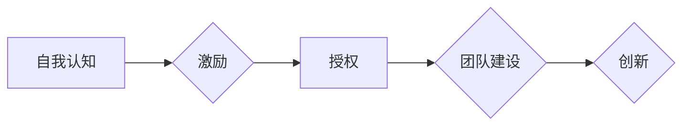

> 大模型、创业者、领导力、自我认知、激励、授权、团队建设、创新

## 1. 背景介绍

大模型时代已经到来，其强大的计算能力和泛化能力正在深刻地改变着各行各业。对于创业者而言，大模型技术带来的机遇与挑战并存。一方面，大模型可以帮助创业者快速构建产品，提升效率，降低成本；另一方面，大模型的复杂性和黑盒属性也给创业者带来了新的挑战。如何有效地利用大模型，如何领导好团队，如何应对不断变化的市场环境，这些都是创业者需要思考的问题。

本篇文章将从自我认知、激励与授权三个方面，探讨大模型时代创业者领导力的修炼之道。

## 2. 核心概念与联系

### 2.1 自我认知

自我认知是领导力的基石。创业者需要深刻地了解自己的优势、劣势、性格特点、价值观等，才能更好地定位自己，选择合适的创业方向，并带领团队朝着目标前进。

### 2.2 激励

激励是领导者激发团队成员潜能的关键。创业者需要了解团队成员的动机、需求和目标，并制定相应的激励机制，激发团队成员的积极性和创造力。

### 2.3 授权

授权是领导者赋予团队成员决策权和执行权的过程。创业者需要学会信任团队成员，将一部分权力下放，让团队成员拥有更多的自主权，从而提高团队的效率和士气。

**核心概念与联系流程图**



## 3. 核心算法原理 & 具体操作步骤

### 3.1 算法原理概述

大模型的训练主要基于深度学习算法，其中Transformer模型是目前最主流的架构。Transformer模型的核心思想是利用注意力机制，捕捉文本序列中不同词语之间的关系，从而更好地理解文本的语义。

### 3.2 算法步骤详解

1. **数据预处理:** 将原始文本数据进行清洗、分词、标记等操作，使其能够被模型理解。
2. **模型构建:** 根据Transformer模型的架构，搭建模型结构，包括编码器、解码器和注意力机制等模块。
3. **模型训练:** 使用训练数据，通过反向传播算法，调整模型参数，使模型能够准确地预测文本序列。
4. **模型评估:** 使用测试数据，评估模型的性能，例如准确率、困惑度等指标。
5. **模型部署:** 将训练好的模型部署到生产环境中，用于实际应用。

### 3.3 算法优缺点

**优点:**

* 强大的文本理解能力
* 泛化能力强
* 可以处理长文本序列

**缺点:**

* 训练成本高
* 计算资源需求大
* 黑盒属性强

### 3.4 算法应用领域

* 自然语言处理
* 机器翻译
* 文本摘要
* 情感分析
* 聊天机器人

## 4. 数学模型和公式 & 详细讲解 & 举例说明

### 4.1 数学模型构建

Transformer模型的核心是注意力机制，其数学模型可以表示为：

$$
Attention(Q, K, V) = softmax(\frac{QK^T}{\sqrt{d_k}})V
$$

其中：

* $Q$：查询矩阵
* $K$：键矩阵
* $V$：值矩阵
* $d_k$：键向量的维度
* $softmax$：softmax函数

### 4.2 公式推导过程

注意力机制的目的是计算每个词语与其他词语之间的相关性，并根据相关性加权求和，得到最终的输出。

公式推导过程如下：

1. 计算查询矩阵 $Q$ 与键矩阵 $K$ 的点积，并进行归一化处理，得到注意力权重矩阵。
2. 将注意力权重矩阵与值矩阵 $V$ 进行矩阵乘法，得到最终的输出。

### 4.3 案例分析与讲解

例如，在机器翻译任务中，Transformer模型可以利用注意力机制，计算源语言句子中每个词语与目标语言句子中每个词语之间的相关性，从而更好地翻译句子。

## 5. 项目实践：代码实例和详细解释说明

### 5.1 开发环境搭建

* Python 3.7+
* PyTorch 1.7+
* CUDA 10.2+

### 5.2 源代码详细实现

```python
import torch
import torch.nn as nn

class Transformer(nn.Module):
    def __init__(self, vocab_size, embedding_dim, num_heads, num_layers):
        super(Transformer, self).__init__()
        self.embedding = nn.Embedding(vocab_size, embedding_dim)
        self.transformer_layers = nn.ModuleList([
            nn.TransformerEncoderLayer(embedding_dim, num_heads)
            for _ in range(num_layers)
        ])
        self.linear = nn.Linear(embedding_dim, vocab_size)

    def forward(self, x):
        x = self.embedding(x)
        for layer in self.transformer_layers:
            x = layer(x)
        x = self.linear(x)
        return x
```

### 5.3 代码解读与分析

* `__init__` 方法初始化模型参数，包括词嵌入层、Transformer编码器层和线性输出层。
* `forward` 方法定义模型的正向传播过程，将输入序列经过词嵌入层、Transformer编码器层和线性输出层，最终得到输出序列。

### 5.4 运行结果展示

训练好的Transformer模型可以用于各种自然语言处理任务，例如机器翻译、文本摘要、情感分析等。

## 6. 实际应用场景

### 6.1 创业公司应用

大模型可以帮助创业公司快速构建产品，例如聊天机器人、智能客服、内容生成工具等，提升效率，降低成本。

### 6.2 行业应用

大模型可以应用于各个行业，例如金融、医疗、教育等，帮助企业提高效率、优化流程、提升客户体验。

### 6.3 未来应用展望

随着大模型技术的不断发展，其应用场景将更加广泛，例如自动驾驶、个性化推荐、虚拟助手等。

## 7. 工具和资源推荐

### 7.1 学习资源推荐

* **书籍:**《深度学习》、《自然语言处理》
* **在线课程:** Coursera、edX、Udacity
* **开源项目:** HuggingFace、TensorFlow Hub

### 7.2 开发工具推荐

* **深度学习框架:** PyTorch、TensorFlow
* **文本处理工具:** NLTK、spaCy
* **云计算平台:** AWS、Google Cloud、Azure

### 7.3 相关论文推荐

* Attention Is All You Need
* BERT: Pre-training of Deep Bidirectional Transformers for Language Understanding

## 8. 总结：未来发展趋势与挑战

### 8.1 研究成果总结

大模型技术取得了显著的进展，在自然语言处理等领域取得了突破性成果。

### 8.2 未来发展趋势

* 模型规模进一步扩大
* 模型训练效率提升
* 模型解释性增强
* 多模态大模型发展

### 8.3 面临的挑战

* 计算资源需求大
* 训练数据获取困难
* 模型安全性和可解释性问题

### 8.4 研究展望

未来，大模型技术将继续发展，并应用于更多领域，为人类社会带来更多福祉。

## 9. 附录：常见问题与解答

### 9.1 什么是大模型？

大模型是指参数量超过10亿的深度学习模型。

### 9.2 大模型的优势是什么？

大模型具有强大的计算能力和泛化能力，可以处理复杂的任务，并取得优异的性能。

### 9.3 如何训练大模型？

训练大模型需要大量的计算资源和训练数据。

### 9.4 大模型的应用场景有哪些？

大模型可以应用于自然语言处理、计算机视觉、语音识别等多个领域。

作者：禅与计算机程序设计艺术 / Zen and the Art of Computer Programming


<end_of_turn>