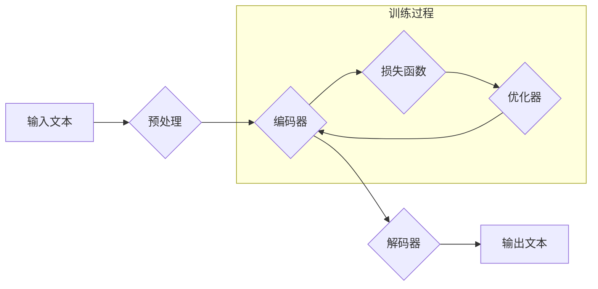

> 大规模语言模型，LLM，评估指标，性能分析，应用场景，未来趋势

## 1. 背景介绍

近年来，大规模语言模型（Large Language Models，LLM）在自然语言处理领域取得了显著进展，展现出强大的文本生成、翻译、问答和代码生成能力。这些模型通常拥有数十亿甚至数千亿个参数，通过海量文本数据进行训练，能够学习复杂的语言模式和知识。然而，随着模型规模的不断扩大，评估其性能和理解其工作机制变得越来越复杂。

传统的自然语言处理评估指标，例如准确率、召回率和F1-score，在评估LLM的性能时往往显得不足。因为LLM的输出往往是连续的文本，而这些指标更适合于分类或序列标注任务。此外，LLM的泛化能力和鲁棒性也需要更加深入的评估。

## 2. 核心概念与联系

大规模语言模型的评估是一个多方面的挑战，需要考虑模型的各种性能指标、应用场景和潜在的风险。

**2.1 核心概念**

* **大规模语言模型 (LLM):** 指拥有数十亿甚至数千亿个参数的深度学习模型，通过学习海量文本数据，能够生成、翻译、理解和总结自然语言。
* **评估指标:** 用于量化LLM性能的指标，例如准确率、困惑度、BLEU分数、ROUGE分数等。
* **应用场景:** LLM在文本生成、机器翻译、问答系统、代码生成等多个领域都有广泛的应用。
* **伦理风险:** LLM可能存在生成虚假信息、传播偏见和歧视等伦理风险。

**2.2 架构图**



## 3. 核心算法原理 & 具体操作步骤

**3.1 算法原理概述**

大规模语言模型通常基于Transformer架构，其核心思想是利用注意力机制来捕捉文本序列中的长距离依赖关系。Transformer模型由编码器和解码器两部分组成。编码器将输入文本序列编码成一个固定长度的向量表示，解码器则根据编码器的输出生成目标文本序列。

**3.2 算法步骤详解**

1. **预处理:** 将输入文本进行分词、词嵌入等预处理操作，将文本转换为模型可以理解的数字表示。
2. **编码:** 将预处理后的文本序列输入编码器，编码器通过多层Transformer模块，将文本序列编码成一个固定长度的向量表示。
3. **解码:** 将编码器的输出作为输入，解码器根据输入生成目标文本序列。解码器也由多层Transformer模块组成，并使用注意力机制来选择与当前生成词语相关的上下文信息。
4. **损失函数:** 使用交叉熵损失函数来衡量模型的预测结果与真实目标之间的差异。
5. **优化器:** 使用梯度下降算法和优化器（例如Adam）来更新模型参数，使得模型的损失函数最小化。

**3.3 算法优缺点**

* **优点:**
    * 能够捕捉长距离依赖关系，提高文本理解和生成能力。
    * 训练效率高，可以并行训练多个数据样本。
    * 泛化能力强，可以应用于多种自然语言处理任务。
* **缺点:**
    * 模型规模庞大，训练和部署成本高。
    * 训练数据对模型性能有很大影响，需要大量高质量的文本数据。
    * 存在生成虚假信息、传播偏见和歧视等伦理风险。

**3.4 算法应用领域**

* 文本生成：小说、诗歌、剧本、新闻报道等。
* 机器翻译：将一种语言翻译成另一种语言。
* 问答系统：回答用户提出的问题。
* 代码生成：自动生成代码。
* 聊天机器人：与用户进行自然语言对话。

## 4. 数学模型和公式 & 详细讲解 & 举例说明

**4.1 数学模型构建**

Transformer模型的核心是注意力机制，它允许模型关注输入序列中与当前生成词语相关的上下文信息。注意力机制可以表示为一个权重矩阵，该矩阵表示每个词语对当前生成词语的贡献程度。

**4.2 公式推导过程**

注意力机制的计算公式如下：

$$
Attention(Q, K, V) = softmax(\frac{QK^T}{\sqrt{d_k}})V
$$

其中：

* $Q$：查询矩阵，表示当前生成词语的向量表示。
* $K$：键矩阵，表示输入序列中每个词语的向量表示。
* $V$：值矩阵，表示输入序列中每个词语的向量表示。
* $d_k$：键向量的维度。
* $softmax$：softmax函数，将注意力权重归一化到0到1之间。

**4.3 案例分析与讲解**

假设我们有一个句子“我爱学习编程”，我们要生成下一个词语。

* $Q$：表示“编程”的向量表示。
* $K$：表示“我”、“爱”、“学习”的向量表示。
* $V$：表示“我”、“爱”、“学习”、“编程”的向量表示。

通过计算注意力权重，我们可以发现“学习”对“编程”的贡献最大，因此模型会倾向于生成与“学习”相关的词语，例如“代码”。

## 5. 项目实践：代码实例和详细解释说明

**5.1 开发环境搭建**

* Python 3.7+
* PyTorch 1.7+
* CUDA 10.2+

**5.2 源代码详细实现**

```python
import torch
import torch.nn as nn

class Transformer(nn.Module):
    def __init__(self, vocab_size, embedding_dim, num_heads, num_layers):
        super(Transformer, self).__init__()
        self.embedding = nn.Embedding(vocab_size, embedding_dim)
        self.transformer_layers = nn.ModuleList([
            nn.TransformerEncoderLayer(embedding_dim, num_heads)
            for _ in range(num_layers)
        ])
        self.linear = nn.Linear(embedding_dim, vocab_size)

    def forward(self, x):
        x = self.embedding(x)
        for layer in self.transformer_layers:
            x = layer(x)
        x = self.linear(x)
        return x
```

**5.3 代码解读与分析**

* `__init__` 方法初始化模型参数，包括词嵌入层、Transformer编码器层和输出层。
* `forward` 方法定义模型的正向传播过程，将输入序列编码成目标文本序列。

**5.4 运行结果展示**

训练完成后，可以使用模型生成文本。例如，输入“我爱”，模型可能会输出“我爱学习”。

## 6. 实际应用场景

**6.1 文本生成**

LLM可以用于生成各种类型的文本，例如小说、诗歌、剧本、新闻报道等。例如，OpenAI的GPT-3模型可以生成高质量的创意写作内容。

**6.2 机器翻译**

LLM可以用于将一种语言翻译成另一种语言。例如，Google的BERT模型可以实现高质量的机器翻译。

**6.3 问答系统**

LLM可以用于构建问答系统，回答用户提出的问题。例如，微软的DialoGPT模型可以进行自然语言对话。

**6.4 代码生成**

LLM可以用于自动生成代码。例如，GitHub的Copilot模型可以根据代码注释生成代码片段。

**6.5 聊天机器人**

LLM可以用于构建聊天机器人，与用户进行自然语言对话。例如，Facebook的BlenderBot模型可以进行多轮对话。

**6.6 未来应用展望**

LLM在未来将有更广泛的应用场景，例如：

* 个性化教育：根据学生的学习进度和需求提供个性化的学习内容。
* 医疗诊断：辅助医生进行疾病诊断和治疗方案制定。
* 法律服务：自动生成法律文件和提供法律咨询。
* 科学研究：加速科学发现和技术创新。

## 7. 工具和资源推荐

**7.1 学习资源推荐**

* **书籍:**
    * 《深度学习》
    * 《自然语言处理》
    * 《Transformer模型详解》
* **在线课程:**
    * Coursera: 自然语言处理
    * Udacity: 深度学习
    * fast.ai: 深度学习

**7.2 开发工具推荐**

* **PyTorch:** 深度学习框架
* **TensorFlow:** 深度学习框架
* **HuggingFace:** 预训练模型库

**7.3 相关论文推荐**

* 《Attention Is All You Need》
* 《BERT: Pre-training of Deep Bidirectional Transformers for Language Understanding》
* 《GPT-3: Language Models are Few-Shot Learners》

## 8. 总结：未来发展趋势与挑战

**8.1 研究成果总结**

近年来，大规模语言模型取得了显著进展，在文本生成、机器翻译、问答系统等领域展现出强大的能力。

**8.2 未来发展趋势**

* 模型规模进一步扩大，参数数量达到万亿级甚至更高。
* 模型架构更加复杂，融合多模态信息，例如文本、图像、音频等。
* 模型训练更加高效，利用分布式训练和并行计算技术。
* 模型应用更加广泛，渗透到各个领域，例如教育、医疗、法律等。

**8.3 面临的挑战**

* 模型训练成本高昂，需要大量的计算资源和数据。
* 模型存在生成虚假信息、传播偏见和歧视等伦理风险。
* 模型解释性差，难以理解模型的决策过程。

**8.4 研究展望**

未来研究方向包括：

* 开发更加高效、鲁棒和安全的LLM模型。
* 探索LLM在更多领域应用的可能性。
* 研究LLM的伦理风险和社会影响。
* 提高LLM的解释性和可解释性。

## 9. 附录：常见问题与解答

**9.1 如何选择合适的LLM模型？**

选择合适的LLM模型需要根据具体的应用场景和需求进行考虑。例如，如果需要生成高质量的创意写作内容，可以选择GPT-3模型；如果需要进行机器翻译，可以选择BERT模型。

**9.2 如何训练自己的LLM模型？**

训练自己的LLM模型需要大量的计算资源、数据和专业知识。可以使用开源框架，例如PyTorch或TensorFlow，进行模型训练。

**9.3 如何评估LLM模型的性能？**

可以使用多种评估指标来评估LLM模型的性能，例如准确率、困惑度、BLEU分数、ROUGE分数等。

**9.4 如何解决LLM模型的伦理风险？**

解决LLM模型的伦理风险需要多方面的努力，包括：

* 开发更加安全、可靠的模型。
* 制定相关的伦理规范和政策。
* 加强公众对LLM技术的认知和监督。


作者：禅与计算机程序设计艺术 / Zen and the Art of Computer Programming 
<end_of_turn>