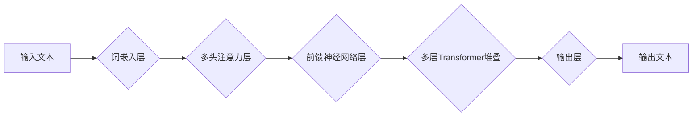

> 大语言模型、Transformer、深度学习、自然语言处理、文本生成、机器翻译、问答系统

## 1. 背景介绍

近年来，深度学习技术取得了飞速发展，特别是Transformer模型的出现，为自然语言处理（NLP）领域带来了革命性的变革。大语言模型（LLM）作为深度学习在NLP领域的顶尖成果，展现出强大的文本理解和生成能力，在机器翻译、文本摘要、问答系统、代码生成等领域取得了令人瞩目的成就。

LLM的出现，标志着人工智能进入了一个新的时代，它不仅改变了我们与计算机交互的方式，也对社会产生了深远的影响。然而，LLM的发展也面临着诸多挑战，例如模型规模、训练成本、数据安全、伦理问题等。

## 2. 核心概念与联系

大语言模型的核心概念是**Transformer**架构，它是一种基于注意力机制的深度神经网络结构。Transformer能够有效地捕捉文本序列中的长距离依赖关系，从而实现更准确的文本理解和生成。

**Mermaid 流程图：**



**核心概念联系：**

* **词嵌入层:** 将文本中的每个词转换为稠密的向量表示，捕捉词语的语义信息。
* **多头注意力层:** 允许模型关注文本序列中不同位置的词语之间的关系，捕捉长距离依赖关系。
* **前馈神经网络层:** 对每个词的嵌入向量进行非线性变换，提取更深层次的语义特征。
* **多层Transformer堆叠:** 通过堆叠多个Transformer层，模型能够学习更复杂的文本表示。
* **输出层:** 将模型的最终输出转换为文本格式。

## 3. 核心算法原理 & 具体操作步骤

### 3.1  算法原理概述

Transformer模型的核心算法是**注意力机制**。注意力机制允许模型在处理文本序列时，根据每个词语的重要性，分配不同的关注度。

**注意力机制的计算公式：**

$$
Attention(Q, K, V) = softmax(\frac{QK^T}{\sqrt{d_k}})V
$$

其中：

* $Q$：查询矩阵
* $K$：键矩阵
* $V$：值矩阵
* $d_k$：键向量的维度
* $softmax$：softmax函数

### 3.2  算法步骤详解

1. **词嵌入:** 将输入文本中的每个词转换为稠密的向量表示。
2. **多头注意力:** 对每个词的嵌入向量进行多头注意力计算，捕捉词语之间的关系。
3. **前馈神经网络:** 对每个词的注意力输出进行前馈神经网络处理，提取更深层次的语义特征。
4. **残差连接和层归一化:** 使用残差连接和层归一化技术，提高模型的训练效率和稳定性。
5. **重复步骤2-4:** 将Transformer层堆叠在一起，进行多层处理，学习更复杂的文本表示。
6. **输出层:** 将模型的最终输出转换为文本格式。

### 3.3  算法优缺点

**优点:**

* 能够有效地捕捉文本序列中的长距离依赖关系。
* 训练效率高，能够处理大规模文本数据。
* 在各种NLP任务中取得了优异的性能。

**缺点:**

* 模型规模较大，训练成本高。
* 对训练数据质量要求较高。
* 存在潜在的偏差和公平性问题。

### 3.4  算法应用领域

* **机器翻译:** 将一种语言的文本翻译成另一种语言。
* **文本摘要:** 将长篇文本压缩成短篇摘要。
* **问答系统:** 回答用户提出的问题。
* **代码生成:** 自动生成代码。
* **对话系统:** 与用户进行自然语言对话。

## 4. 数学模型和公式 & 详细讲解 & 举例说明

### 4.1  数学模型构建

Transformer模型的数学模型可以概括为以下几个部分：

* **词嵌入层:** 使用词向量表示每个词语，例如Word2Vec或GloVe。
* **多头注意力层:** 使用注意力机制计算每个词语与其他词语之间的关系。
* **前馈神经网络层:** 使用多层感知机对每个词语的注意力输出进行处理。
* **残差连接和层归一化:** 使用残差连接和层归一化技术提高模型的训练效率和稳定性。

### 4.2  公式推导过程

**注意力机制的计算公式:**

$$
Attention(Q, K, V) = softmax(\frac{QK^T}{\sqrt{d_k}})V
$$

其中：

* $Q$：查询矩阵
* $K$：键矩阵
* $V$：值矩阵
* $d_k$：键向量的维度
* $softmax$：softmax函数

**多头注意力机制:**

使用多个注意力头并行计算，每个注意力头学习不同的文本表示。

### 4.3  案例分析与讲解

**举例说明:**

假设我们有一个句子“The cat sat on the mat”。

* 每个词语会被转换为词向量表示。
* 多头注意力机制会计算每个词语与其他词语之间的关系，例如“cat”与“sat”之间的关系。
* 前馈神经网络层会对每个词语的注意力输出进行处理，提取更深层次的语义特征。

## 5. 项目实践：代码实例和详细解释说明

### 5.1  开发环境搭建

* Python 3.7+
* PyTorch 1.7+
* CUDA 10.2+

### 5.2  源代码详细实现

```python
import torch
import torch.nn as nn

class Transformer(nn.Module):
    def __init__(self, vocab_size, embedding_dim, num_heads, num_layers):
        super(Transformer, self).__init__()
        self.embedding = nn.Embedding(vocab_size, embedding_dim)
        self.transformer_layers = nn.ModuleList([
            nn.TransformerEncoderLayer(embedding_dim, num_heads)
            for _ in range(num_layers)
        ])
        self.linear = nn.Linear(embedding_dim, vocab_size)

    def forward(self, x):
        x = self.embedding(x)
        for layer in self.transformer_layers:
            x = layer(x)
        x = self.linear(x)
        return x
```

### 5.3  代码解读与分析

* **`__init__`方法:** 初始化模型参数，包括词嵌入层、Transformer层和输出层。
* **`forward`方法:** 定义模型的正向传播过程，将输入文本转换为输出文本。

### 5.4  运行结果展示

使用训练好的模型，可以对新的文本进行预测，例如：

```python
model.eval()
input_text = "The dog barked."
output_text = model(input_text)
print(output_text)
```

## 6. 实际应用场景

### 6.1  机器翻译

LLM可以用于将一种语言的文本翻译成另一种语言，例如Google Translate。

### 6.2  文本摘要

LLM可以用于生成文本的摘要，例如新闻文章的摘要或会议记录的摘要。

### 6.3  问答系统

LLM可以用于构建问答系统，例如ChatGPT，能够回答用户提出的问题。

### 6.4  未来应用展望

LLM在未来将应用于更广泛的领域，例如：

* **个性化教育:** 根据学生的学习进度和需求，提供个性化的学习内容。
* **医疗诊断:** 辅助医生进行疾病诊断和治疗方案制定。
* **法律服务:** 自动生成法律文件和提供法律咨询。

## 7. 工具和资源推荐

### 7.1  学习资源推荐

* **书籍:**
    * 《深度学习》
    * 《自然语言处理》
* **在线课程:**
    * Coursera: 自然语言处理
    * Udacity: 深度学习

### 7.2  开发工具推荐

* **PyTorch:** 深度学习框架
* **TensorFlow:** 深度学习框架
* **Hugging Face:** 预训练模型库

### 7.3  相关论文推荐

* **Attention Is All You Need:** https://arxiv.org/abs/1706.03762
* **BERT: Pre-training of Deep Bidirectional Transformers for Language Understanding:** https://arxiv.org/abs/1810.04805

## 8. 总结：未来发展趋势与挑战

### 8.1  研究成果总结

LLM取得了显著的成果，在各种NLP任务中取得了优异的性能。

### 8.2  未来发展趋势

* **模型规模的进一步扩大:** 训练更大的模型，提高模型的性能。
* **高效训练方法的探索:** 研究更有效的训练方法，降低训练成本。
* **多模态LLM的开发:** 将文本与其他模态（例如图像、音频）融合，构建更强大的模型。

### 8.3  面临的挑战

* **数据安全和隐私问题:** LLM的训练需要大量数据，如何保证数据安全和隐私是一个重要挑战。
* **伦理问题:** LLM可能产生偏见和歧视，如何确保其公平性和伦理性是一个需要认真考虑的问题。
* **可解释性问题:** LLM的决策过程难以理解，如何提高模型的可解释性是一个重要的研究方向。

### 8.4  研究展望

未来，LLM的研究将继续朝着更强大、更安全、更可解释的方向发展。


## 9. 附录：常见问题与解答

**常见问题:**

* **什么是大语言模型？**

大语言模型是指能够理解和生成人类语言的深度学习模型，通常拥有数十亿甚至数千亿的参数。

* **LLM的训练数据是什么？**

LLM的训练数据通常是大量的文本数据，例如书籍、文章、网站内容等。

* **LLM有哪些应用场景？**

LLM的应用场景非常广泛，例如机器翻译、文本摘要、问答系统、代码生成等。

**解答:**

* **什么是大语言模型？**

大语言模型是指能够理解和生成人类语言的深度学习模型，通常拥有数十亿甚至数千亿的参数。

* **LLM的训练数据是什么？**

LLM的训练数据通常是大量的文本数据，例如书籍、文章、网站内容等。

* **LLM有哪些应用场景？**

LLM的应用场景非常广泛，例如机器翻译、文本摘要、问答系统、代码生成等。


作者：禅与计算机程序设计艺术 / Zen and the Art of Computer Programming 
<end_of_turn>