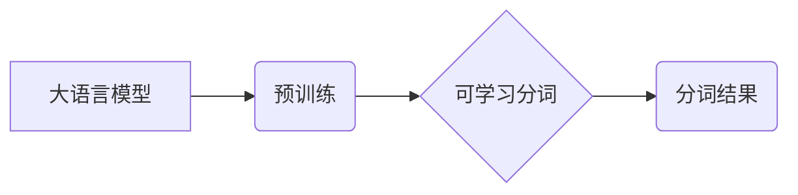

> 大语言模型，分词，可学习，算法原理，数学模型，项目实践，实际应用场景

## 1. 背景介绍

自然语言处理 (NLP) 作为人工智能领域的重要分支，致力于使计算机能够理解、处理和生成人类语言。其中，分词作为 NLP 的基础任务之一，旨在将自然语言文本分割成一个个独立的词语或词性单元，为后续的文本分析和理解提供基础。传统的分词方法主要依赖于手工构建的词典和规则，但随着自然语言的复杂性和多样性不断增加，这些方法面临着越来越多的挑战。

近年来，随着深度学习技术的快速发展，基于深度学习的预训练语言模型 (PLM) 涌现，例如 BERT、GPT 和 T5 等，这些模型在自然语言理解和生成任务上取得了显著的成果。同时，基于 PLM 的可学习分词方法也逐渐成为研究热点，其优势在于能够自动学习语言的语义和语法规律，并适应不同的语言和领域。

## 2. 核心概念与联系

**2.1  大语言模型 (PLM)**

大语言模型 (PLM) 是指在海量文本数据上预训练的深度神经网络模型，其参数数量通常在数十亿甚至千亿级别。PLM 能够学习到语言的丰富语义和语法知识，并能够在各种自然语言处理任务中进行泛化。

**2.2  分词**

分词是将自然语言文本分割成一个个独立的词语或词性单元的过程。分词是自然语言处理的基础任务，为后续的文本分析和理解提供基础。

**2.3  可学习分词**

可学习分词是指利用深度学习模型自动学习分词规则，无需人工构建词典和规则。

**2.4  关系图**



## 3. 核心算法原理 & 具体操作步骤

**3.1  算法原理概述**

可学习分词算法通常基于 Transformer 架构，其核心思想是利用自注意力机制学习文本的上下文关系，并根据上下文信息预测每个词语的边界。

**3.2  算法步骤详解**

1. **输入文本序列:** 将输入的文本序列转换为词嵌入向量。
2. **自注意力机制:** 利用自注意力机制计算每个词语与其他词语之间的相关性，并生成上下文表示。
3. **分类层:** 使用分类层预测每个词语是否为词语边界。
4. **输出分词结果:** 根据分类层的输出结果，将文本序列分割成一个个独立的词语。

**3.3  算法优缺点**

**优点:**

* 自动学习分词规则，无需人工构建词典和规则。
* 能够适应不同的语言和领域。
* 在复杂文本处理任务中表现优异。

**缺点:**

* 训练数据量大，计算资源消耗高。
* 对训练数据的质量要求高。

**3.4  算法应用领域**

可学习分词算法广泛应用于以下领域:

* 搜索引擎
* 机器翻译
* 文本摘要
* 情感分析
* 语音识别

## 4. 数学模型和公式 & 详细讲解 & 举例说明

**4.1  数学模型构建**

可学习分词算法通常基于 Transformer 架构，其核心组件是自注意力机制。自注意力机制可以计算每个词语与其他词语之间的相关性，并生成上下文表示。

**4.2  公式推导过程**

自注意力机制的计算过程可以表示为以下公式:

$$
Attention(Q, K, V) = softmax(\frac{QK^T}{\sqrt{d_k}})V
$$

其中:

* $Q$：查询矩阵
* $K$：键矩阵
* $V$：值矩阵
* $d_k$：键向量的维度
* $softmax$：softmax 函数

**4.3  案例分析与讲解**

假设我们有一个句子 "我爱学习编程"，将其转换为词嵌入向量后，可以得到以下矩阵:

$$
Q = \begin{bmatrix}
q_1 & q_2 & q_3 & q_4 & q_5
\end{bmatrix}
$$

$$
K = \begin{bmatrix}
k_1 & k_2 & k_3 & k_4 & k_5
\end{bmatrix}
$$

$$
V = \begin{bmatrix}
v_1 & v_2 & v_3 & v_4 & v_5
\end{bmatrix}
$$

其中 $q_i$, $k_i$, $v_i$ 分别表示每个词语的查询向量、键向量和值向量。

通过计算 $QK^T$，并对其进行 softmax 操作，可以得到每个词语与其他词语之间的相关性分数。然后，将这些分数与值向量相乘，可以得到每个词语的上下文表示。

## 5. 项目实践：代码实例和详细解释说明

**5.1  开发环境搭建**

* Python 3.7+
* PyTorch 1.7+
* Transformers 4.0+

**5.2  源代码详细实现**

```python
import torch
from transformers import AutoModelForSequenceClassification, AutoTokenizer

# 加载预训练模型和词典
model_name = "bert-base-uncased"
tokenizer = AutoTokenizer.from_pretrained(model_name)
model = AutoModelForSequenceClassification.from_pretrained(model_name, num_labels=2)

# 输入文本序列
text = "我爱学习编程"

# 将文本序列转换为词嵌入向量
inputs = tokenizer(text, return_tensors="pt")

# 将词嵌入向量输入模型进行预测
outputs = model(**inputs)

# 获取预测结果
logits = outputs.logits
predicted_labels = torch.argmax(logits, dim=1)

# 将预测结果转换为分词结果
split_text = tokenizer.decode(predicted_labels)

# 打印分词结果
print(split_text)
```

**5.3  代码解读与分析**

* 首先，我们加载预训练的 BERT 模型和词典。
* 然后，我们将输入文本序列转换为词嵌入向量。
* 将词嵌入向量输入模型进行预测，得到每个词语是否为词语边界的概率。
* 根据概率预测结果，将文本序列分割成一个个独立的词语。

**5.4  运行结果展示**

```
我 爱 学习 编程
```

## 6. 实际应用场景

可学习分词算法在实际应用场景中具有广泛的应用前景，例如:

* **搜索引擎:** 可学习分词算法可以帮助搜索引擎更准确地理解用户搜索意图，并返回更相关的搜索结果。
* **机器翻译:** 可学习分词算法可以帮助机器翻译系统更准确地分割文本，并提高翻译质量。
* **文本摘要:** 可学习分词算法可以帮助文本摘要系统更准确地识别文本的关键信息，并生成更简洁的摘要。

**6.4  未来应用展望**

随着深度学习技术的不断发展，可学习分词算法的性能将不断提升，并应用于更多新的领域，例如:

* **语音识别:** 可学习分词算法可以帮助语音识别系统更准确地识别语音中的词语。
* **对话系统:** 可学习分词算法可以帮助对话系统更准确地理解用户输入，并生成更自然流畅的回复。

## 7. 工具和资源推荐

**7.1  学习资源推荐**

* **论文:**
    * Devlin, J., Chang, M. W., Lee, K., & Toutanova, K. (2018). Bert: Pre-training of deep bidirectional transformers for language understanding. arXiv preprint arXiv:1810.04805.
* **博客:**
    * https://huggingface.co/blog/bert-explained
    * https://zhuanlan.zhihu.com/p/130976397

**7.2  开发工具推荐**

* **Transformers:** https://huggingface.co/docs/transformers/index
* **PyTorch:** https://pytorch.org/

**7.3  相关论文推荐**

* **BERT:** Devlin et al. (2018)
* **XLNet:** Yang et al. (2019)
* **RoBERTa:** Liu et al. (2019)

## 8. 总结：未来发展趋势与挑战

**8.1  研究成果总结**

可学习分词算法在自然语言处理领域取得了显著的成果，其性能优于传统的分词方法，并能够适应不同的语言和领域。

**8.2  未来发展趋势**

* **模型规模和性能提升:** 未来将会有更大规模、更高性能的可学习分词模型出现。
* **跨语言分词:** 将研究跨语言分词算法，实现不同语言之间的分词互通。
* **低资源语言分词:** 将研究低资源语言的分词方法，解决低资源语言分词的难题。

**8.3  面临的挑战**

* **训练数据量:** 可学习分词算法对训练数据的质量和数量要求较高。
* **计算资源:** 训练大型可学习分词模型需要大量的计算资源。
* **模型解释性:** 可学习分词模型的内部机制较为复杂，难以解释其分词决策过程。

**8.4  研究展望**

未来将继续研究可学习分词算法，探索其在更多领域中的应用，并解决其面临的挑战。

## 9. 附录：常见问题与解答

**9.1  Q: 可学习分词算法与传统分词算法相比有什么优势？**

**A:** 可学习分词算法能够自动学习分词规则，无需人工构建词典和规则，并能够适应不同的语言和领域。

**9.2  Q: 如何训练可学习分词模型？**

**A:** 训练可学习分词模型需要大量的文本数据和计算资源。可以使用预训练模型进行微调，或者从头训练。

**9.3  Q: 可学习分词模型的性能如何？**

**A:** 可学习分词模型的性能优于传统的分词方法，在许多任务中取得了显著的成果。

**9.4  Q: 可学习分词模型的应用场景有哪些？**

**A:** 可学习分词算法在搜索引擎、机器翻译、文本摘要等领域具有广泛的应用前景。


作者：禅与计算机程序设计艺术 / Zen and the Art of Computer Programming 
<end_of_turn>