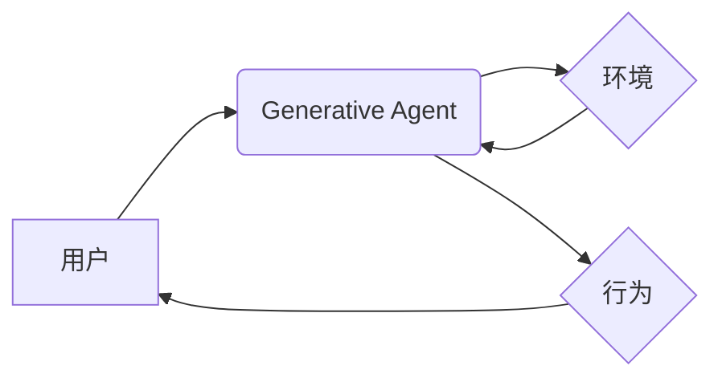

> 大语言模型，Generative Agents，应用指南，人工智能，自然语言处理，文本生成，对话系统

## 1. 背景介绍

近年来，人工智能领域取得了令人瞩目的进展，其中大语言模型（Large Language Models，LLMs）作为一种强大的工具，在自然语言处理（Natural Language Processing，NLP）领域展现出巨大的潜力。LLMs 能够理解和生成人类语言，并被应用于各种场景，例如机器翻译、文本摘要、对话系统等。

Generative Agents 作为 LLMs 的一种应用，旨在构建能够自主学习、决策和交互的智能代理。这些代理能够根据给定的任务和环境信息，生成行为和文本，并与用户进行自然流畅的对话。

## 2. 核心概念与联系

### 2.1  大语言模型 (LLMs)

大语言模型是基于深度学习技术的强大神经网络模型，通过训练海量文本数据，学习语言的语法、语义和上下文关系。

LLMs 通常采用 Transformer 架构，能够有效地捕捉长距离依赖关系，从而实现更准确的文本理解和生成。

### 2.2  Generative Agents

Generative Agents 是基于 LLMs 的智能代理，能够根据给定的任务和环境信息，生成行为和文本，并与用户进行交互。

Generative Agents 通常包含以下几个关键组件：

* **语言模型:** 用于理解和生成文本。
* **行为策略:** 用于决定代理的行为。
* **环境模型:** 用于模拟代理所处的环境。
* **奖励机制:** 用于评估代理的行为效果。

### 2.3  核心架构



## 3. 核心算法原理 & 具体操作步骤

### 3.1  算法原理概述

Generative Agents 的核心算法原理是基于强化学习（Reinforcement Learning，RL）和策略梯度（Policy Gradient）方法。

* **强化学习:**  代理通过与环境交互，获得奖励和惩罚，并根据这些反馈调整行为策略，以最大化长期奖励。
* **策略梯度:**  通过计算策略梯度，更新代理的行为策略，使其朝着获得更高奖励的方向发展。

### 3.2  算法步骤详解

1. **环境初始化:**  设置代理所处的环境，包括初始状态、动作空间和奖励函数。
2. **策略初始化:**  随机初始化代理的行为策略。
3. **交互循环:**
    * 代理根据当前状态和策略，选择一个动作。
    * 环境根据动作更新状态，并给予代理奖励。
    * 代理根据奖励和状态更新策略。
4. **训练结束:**  当代理的行为策略达到预设目标或训练时间结束时，停止训练。

### 3.3  算法优缺点

**优点:**

* 能够学习复杂的行为策略。
* 可以适应动态变化的环境。
* 能够生成多样化的行为。

**缺点:**

* 训练过程可能需要大量时间和计算资源。
* 奖励函数的设计对训练效果至关重要。
* 可能会出现不可预测的行为。

### 3.4  算法应用领域

* **对话系统:**  构建能够进行自然流畅对话的聊天机器人。
* **游戏 AI:**  开发能够学习和适应游戏环境的智能游戏角色。
* **自动写作:**  生成不同风格和类型的文本内容。
* **任务自动化:**  自动执行重复性任务，例如数据处理和邮件回复。

## 4. 数学模型和公式 & 详细讲解 & 举例说明

### 4.1  数学模型构建

Generative Agents 的数学模型通常基于马尔可夫决策过程（Markov Decision Process，MDP）。

MDP 由以下几个要素组成：

* **状态空间 (S):** 代理所处的环境状态集合。
* **动作空间 (A):** 代理可以执行的动作集合。
* **转移概率 (P):** 从一个状态到另一个状态的概率分布。
* **奖励函数 (R):**  代理在每个状态下获得的奖励值。
* **策略 (π):**  代理在每个状态下选择动作的策略。

### 4.2  公式推导过程

策略梯度方法的目标是最大化代理的预期奖励，可以使用以下公式进行推导：

$$
\nabla_{\theta} J(\theta) = \mathbb{E}_{\tau \sim \pi_{\theta}} \left[ \nabla_{\theta} \log \pi_{\theta}(a_t | s_t) \cdot Q(s_t, a_t) \right]
$$

其中：

* $J(\theta)$ 是代理的预期奖励函数。
* $\theta$ 是策略参数。
* $\pi_{\theta}$ 是策略函数。
* $\tau$ 是一个轨迹，由一系列状态和动作组成。
* $a_t$ 是在时间步 $t$ 的动作。
* $s_t$ 是在时间步 $t$ 的状态。
* $Q(s_t, a_t)$ 是状态-动作值函数，表示在状态 $s_t$ 执行动作 $a_t$ 的预期奖励。

### 4.3  案例分析与讲解

假设一个代理需要学习玩一个简单的游戏，例如贪吃蛇。

* 状态空间：蛇的位置和方向。
* 动作空间：向上、向下、向左、向右。
* 奖励函数：吃苹果获得奖励，撞墙或自身损失奖励。

通过训练，代理可以学习到一个策略，使得在游戏中获得尽可能高的分数。

## 5. 项目实践：代码实例和详细解释说明

### 5.1  开发环境搭建

* Python 3.7+
* TensorFlow 或 PyTorch
* OpenAI Gym

### 5.2  源代码详细实现

```python
import gym
import tensorflow as tf

# 定义策略网络
class PolicyNetwork(tf.keras.Model):
    def __init__(self):
        super(PolicyNetwork, self).__init__()
        # ...

    def call(self, state):
        # ...

# 定义价值网络
class ValueNetwork(tf.keras.Model):
    def __init__(self):
        super(ValueNetwork, self).__init__()
        # ...

    def call(self, state):
        # ...

# 定义代理
class GenerativeAgent:
    def __init__(self, env, policy_network, value_network):
        self.env = env
        self.policy_network = policy_network
        self.value_network = value_network

    def act(self, state):
        # ...

    def train(self, num_episodes):
        # ...

# 创建环境
env = gym.make('CartPole-v1')

# 创建策略网络和价值网络
policy_network = PolicyNetwork()
value_network = ValueNetwork()

# 创建代理
agent = GenerativeAgent(env, policy_network, value_network)

# 训练代理
agent.train(num_episodes=1000)

# 测试代理
observation = env.reset()
for _ in range(100):
    action = agent.act(observation)
    observation, reward, done, info = env.step(action)
    env.render()
    if done:
        observation = env.reset()
```

### 5.3  代码解读与分析

* **策略网络:**  负责根据当前状态预测最优动作的概率分布。
* **价值网络:**  负责估计在给定状态下获得的预期奖励。
* **代理:**  整合策略网络和价值网络，并根据环境信息进行决策和交互。

### 5.4  运行结果展示

运行代码后，代理将在环境中进行交互，并尝试完成任务。

## 6. 实际应用场景

### 6.1  对话系统

Generative Agents 可以用于构建能够进行自然流畅对话的聊天机器人，例如客服机器人、陪伴机器人等。

### 6.2  游戏 AI

Generative Agents 可以用于开发能够学习和适应游戏环境的智能游戏角色，例如对手、NPC等。

### 6.3  自动写作

Generative Agents 可以用于生成不同风格和类型的文本内容，例如新闻报道、小说、诗歌等。

### 6.4  未来应用展望

Generative Agents 具有广泛的应用前景，未来可能在以下领域得到更广泛的应用：

* **教育:**  个性化学习辅导、虚拟老师等。
* **医疗:**  辅助诊断、个性化治疗方案等。
* **金融:**  风险评估、投资决策等。

## 7. 工具和资源推荐

### 7.1  学习资源推荐

* **书籍:**
    * 《Deep Reinforcement Learning Hands-On》
    * 《Reinforcement Learning: An Introduction》
* **在线课程:**
    * Coursera: Reinforcement Learning Specialization
    * Udacity: Deep Reinforcement Learning Nanodegree

### 7.2  开发工具推荐

* **TensorFlow:**  开源深度学习框架。
* **PyTorch:**  开源深度学习框架。
* **OpenAI Gym:**  强化学习环境库。

### 7.3  相关论文推荐

* **《Proximal Policy Optimization Algorithms》**
* **《Asynchronous Methods for Deep Reinforcement Learning》**
* **《Deep Q-Network》**

## 8. 总结：未来发展趋势与挑战

### 8.1  研究成果总结

Generative Agents 作为 LLMs 的一种应用，取得了显著的进展，能够学习复杂的行为策略，并应用于各种场景。

### 8.2  未来发展趋势

* **更强大的模型:**  开发更强大的 LLMs，提高代理的学习能力和表现力。
* **更有效的训练方法:**  研究更有效的训练方法，降低训练成本和时间。
* **更安全的代理:**  确保代理的行为安全可靠，避免出现不可预测的行为。

### 8.3  面临的挑战

* **数据获取和标注:**  训练 Generative Agents 需要大量高质量的数据，获取和标注数据成本高昂。
* **奖励函数设计:**  奖励函数的设计对训练效果至关重要，设计合理的奖励函数是一个挑战。
* **可解释性和透明度:**  Generative Agents 的决策过程往往难以解释，提高可解释性和透明度是一个重要方向。

### 8.4  研究展望

未来，Generative Agents 将继续朝着更智能、更安全、更可解释的方向发展，并在更多领域得到应用。


## 9. 附录：常见问题与解答

**Q1:  Generative Agents 和传统 AI 有什么区别？**

**A1:**  传统 AI 通常基于规则或机器学习算法，而 Generative Agents 基于强化学习，能够学习复杂的行为策略。

**Q2:  如何评估 Generative Agents 的性能？**

**A2:**  可以使用各种指标评估 Generative Agents 的性能，例如奖励、成功率、鲁棒性等。

**Q3:  Generative Agents 是否会取代人类？**

**A3:**  Generative Agents 是工具，可以帮助人类完成任务，但不会取代人类。


作者：禅与计算机程序设计艺术 / Zen and the Art of Computer Programming 
<end_of_turn>