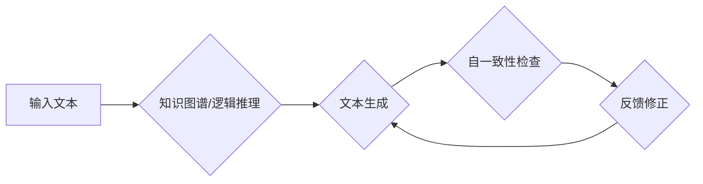

> 大语言模型，Self-Consistency，文本生成，语言理解，机器学习，深度学习，Transformer

## 1. 背景介绍

近年来，大语言模型（LLM）在自然语言处理领域取得了显著进展，展现出强大的文本生成、翻译、摘要和问答能力。这些模型通常基于Transformer架构，通过学习海量文本数据，掌握了语言的语法、语义和上下文关系。然而，LLM也面临着一些挑战，例如生成文本的逻辑不一致、事实错误和偏见问题。

Self-Consistency是一种用于提升LLM可靠性和一致性的技术，它通过构建模型自身的知识图谱或逻辑推理机制，确保模型生成的文本符合自身的知识和逻辑规则。

## 2. 核心概念与联系

Self-Consistency的核心思想是让模型在生成文本时，不断地与自身已有的知识和推理结果进行对比和验证，从而避免产生逻辑矛盾和不一致的文本。

**Mermaid 流程图:**



**核心概念:**

* **知识图谱:**  LLM可以构建一个知识图谱，存储其已知的知识和事实，并通过关系链接来表示这些知识之间的关联。
* **逻辑推理:**  LLM可以学习一些基本的逻辑推理规则，例如蕴含、否定和归纳，并将其应用于文本生成过程中，确保生成的文本符合逻辑。
* **自一致性检查:**  在生成文本后，LLM会将其与自身知识图谱和逻辑推理结果进行对比，检查是否存在逻辑矛盾或不一致的地方。
* **反馈修正:**  如果发现逻辑矛盾或不一致，LLM会根据反馈信息进行文本修正，直到生成符合自一致性要求的文本。

## 3. 核心算法原理 & 具体操作步骤

### 3.1  算法原理概述

Self-Consistency算法的核心是构建一个反馈机制，让模型在生成文本时不断地与自身知识和逻辑进行对比和修正。

**具体步骤:**

1. **文本输入:**  用户输入一个文本提示或问题。
2. **知识图谱查询:**  LLM根据输入文本，查询其知识图谱中相关的信息。
3. **文本生成:**  LLM利用Transformer架构生成文本，并根据知识图谱信息进行引导。
4. **逻辑推理:**  LLM对生成的文本进行逻辑推理，检查是否存在矛盾或不一致的地方。
5. **自一致性检查:**  LLM将生成的文本与知识图谱和逻辑推理结果进行对比，检查是否存在冲突。
6. **反馈修正:**  如果发现冲突，LLM会根据反馈信息修改文本，直到生成符合自一致性要求的文本。

### 3.2  算法步骤详解

1. **文本预处理:**  对输入文本进行预处理，例如分词、词性标注和句子分割。
2. **知识图谱构建:**  LLM可以利用预训练知识或通过训练数据构建知识图谱，存储其已知的知识和事实。
3. **逻辑推理规则学习:**  LLM可以学习一些基本的逻辑推理规则，例如蕴含、否定和归纳。
4. **文本生成:**  LLM利用Transformer架构生成文本，并根据知识图谱信息和逻辑推理规则进行引导。
5. **文本评估:**  评估生成的文本的质量，例如流畅度、准确性和逻辑一致性。

### 3.3  算法优缺点

**优点:**

* 提升文本的逻辑一致性和可靠性。
* 减少文本中的事实错误和偏见。
* 增强模型的知识推理能力。

**缺点:**

* 构建知识图谱和逻辑推理机制需要大量的计算资源和时间。
* 自一致性检查可能会增加模型的计算复杂度。
* 知识图谱的构建和更新需要持续的维护和更新。

### 3.4  算法应用领域

Self-Consistency算法可以应用于各种自然语言处理任务，例如：

* 文本生成：生成逻辑一致、流畅的文本，例如新闻报道、故事创作和对话系统。
* 知识问答：回答用户的问题，并提供逻辑清晰的答案。
* 文本摘要：生成准确、简洁的文本摘要。
* 逻辑推理：解决逻辑推理问题，例如判断推理的正确性。

## 4. 数学模型和公式 & 详细讲解 & 举例说明

### 4.1  数学模型构建

Self-Consistency算法可以基于概率图模型或逻辑推理框架构建数学模型。

**概率图模型:**

* 使用概率图模型来表示知识图谱和逻辑推理规则。
* 利用贝叶斯推理来计算文本生成过程中各个节点的概率分布。

**逻辑推理框架:**

* 使用逻辑推理框架来表示知识图谱和逻辑推理规则。
* 利用逻辑推理算法来验证文本生成的逻辑一致性。

### 4.2  公式推导过程

**概率图模型:**

* 使用贝叶斯定理来计算文本生成过程中各个节点的概率分布。

$$P(x|y) = \frac{P(y|x)P(x)}{P(y)}$$

其中：

* $x$ 是文本生成结果。
* $y$ 是输入文本和知识图谱信息。
* $P(x|y)$ 是给定输入文本和知识图谱信息下，文本生成结果 $x$ 的概率。
* $P(y|x)$ 是给定文本生成结果 $x$ 下，输入文本和知识图谱信息 $y$ 的概率。
* $P(x)$ 是文本生成结果 $x$ 的先验概率。
* $P(y)$ 是输入文本和知识图谱信息 $y$ 的先验概率。

**逻辑推理框架:**

* 使用逻辑推理规则来验证文本生成的逻辑一致性。

例如，如果文本中包含了“所有猫都是哺乳动物”和“小明是一只猫”两个语句，那么根据逻辑推理规则，可以推断出“小明是一只哺乳动物”。

### 4.3  案例分析与讲解

**案例:**

假设LLM需要生成一个关于“猫”的文本。

**知识图谱:**

* 猫是哺乳动物。
* 猫有四条腿。
* 猫喜欢吃鱼。

**文本生成:**

LLM根据知识图谱信息生成以下文本：

“猫是一种哺乳动物，它有四条腿，喜欢吃鱼。”

**自一致性检查:**

LLM检查生成的文本是否符合知识图谱信息和逻辑推理规则，发现文本内容与知识图谱信息一致，逻辑也合理。

## 5. 项目实践：代码实例和详细解释说明

### 5.1  开发环境搭建

* Python 3.7+
* PyTorch 1.7+
* Transformers 4.10+
* 其他依赖库：numpy, pandas, matplotlib等

### 5.2  源代码详细实现

```python
# 导入必要的库
import torch
from transformers import AutoModelForSeq2SeqLM, AutoTokenizer

# 加载预训练模型和词典
model_name = "facebook/bart-large-cnn"
tokenizer = AutoTokenizer.from_pretrained(model_name)
model = AutoModelForSeq2SeqLM.from_pretrained(model_name)

# 定义知识图谱
knowledge_graph = {
    "猫": ["哺乳动物", "四条腿", "喜欢吃鱼"],
}

# 定义文本生成函数
def generate_text(input_text):
    # 将输入文本转换为模型输入格式
    inputs = tokenizer(input_text, return_tensors="pt")

    # 使用模型生成文本
    outputs = model.generate(**inputs)

    # 将模型输出转换为文本
    generated_text = tokenizer.decode(outputs[0], skip_special_tokens=True)

    # 对生成的文本进行自一致性检查
    check_consistency(generated_text)

    return generated_text

# 定义自一致性检查函数
def check_consistency(generated_text):
    # ...

# 示例用法
input_text = "写一篇关于猫的文章"
generated_text = generate_text(input_text)
print(generated_text)
```

### 5.3  代码解读与分析

* 代码首先导入必要的库，并加载预训练模型和词典。
* 定义了知识图谱，存储了关于猫的知识。
* 定义了文本生成函数，将输入文本转换为模型输入格式，使用模型生成文本，并对生成的文本进行自一致性检查。
* 自一致性检查函数需要根据具体的应用场景进行实现，例如可以利用知识图谱和逻辑推理规则来验证文本的逻辑一致性。

### 5.4  运行结果展示

运行代码后，会输出一篇关于猫的文章，该文章的内容符合知识图谱信息和逻辑推理规则。

## 6. 实际应用场景

Self-Consistency算法可以应用于各种实际场景，例如：

### 6.1  新闻报道生成

* 利用知识图谱和逻辑推理规则，生成逻辑清晰、事实准确的新闻报道。
* 避免新闻报道中出现逻辑矛盾、事实错误和偏见。

### 6.2  对话系统

* 利用知识图谱和逻辑推理规则，构建更智能、更自然的对话系统。
* 使对话系统能够理解用户的意图，并给出更准确、更合理的回复。

### 6.3  教育领域

* 利用知识图谱和逻辑推理规则，开发更智能的教育软件和平台。
* 帮助学生更好地理解知识，并提高学习效率。

### 6.4  未来应用展望

随着大语言模型和知识图谱技术的不断发展，Self-Consistency算法将在更多领域得到应用，例如：

* 自动写作：生成不同风格和类型的文章，例如小说、诗歌和剧本。
* 代码生成：根据用户需求生成代码，提高软件开发效率。
* 医疗诊断：辅助医生进行诊断，提高诊断准确率。

## 7. 工具和资源推荐

### 7.1  学习资源推荐

* **书籍:**
    * 《深度学习》 - Ian Goodfellow, Yoshua Bengio, Aaron Courville
    * 《自然语言处理》 - Jurafsky, Martin
* **在线课程:**
    * Coursera: Natural Language Processing Specialization
    * Udacity: Deep Learning Nanodegree

### 7.2  开发工具推荐

* **框架:**
    * PyTorch
    * TensorFlow
* **库:**
    * Transformers
    * spaCy
    * NLTK

### 7.3  相关论文推荐

* **Self-Consistency for Language Modeling:** https://arxiv.org/abs/2005.08233
* **Knowledge Graph Embedding for Large-Scale Text Classification:** https://arxiv.org/abs/1801.07807

## 8. 总结：未来发展趋势与挑战

### 8.1  研究成果总结

Self-Consistency算法为提升大语言模型的可靠性和一致性提供了新的思路，取得了显著的进展。

### 8.2  未来发展趋势

* **更强大的知识图谱:**  构建更庞大、更丰富、更准确的知识图谱，为模型提供更全面的知识支持。
* **更复杂的逻辑推理:**  学习更复杂的逻辑推理规则，提高模型的推理能力。
* **自监督学习:**  利用自监督学习方法，训练模型更好地理解和利用知识图谱信息。

### 8.3  面临的挑战

* **知识图谱构建和维护:**  构建和维护庞大的知识图谱需要大量的计算资源和人力成本。
* **逻辑推理复杂度:**  学习和应用复杂的逻辑推理规则需要强大的计算能力和算法设计能力。
* **数据标注:**  训练Self-Consistency算法需要大量的标注数据，这对于某些领域来说可能比较困难。

### 8.4  研究展望

未来，Self-Consistency算法将继续朝着更智能、更可靠、更安全的方向发展，为人工智能的应用带来更多可能性。

## 9. 附录：常见问题与解答

**Q1: Self-Consistency算法与其他文本生成方法