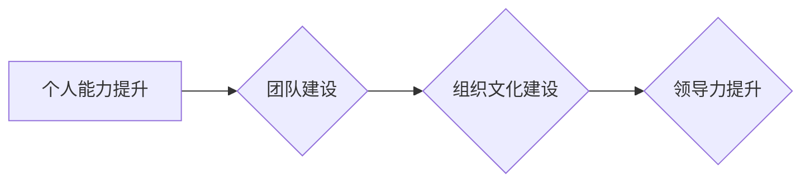

> 领导力提升, 优秀领导者, 团队管理, 沟通技巧, 决策能力, 战略思维, 创新驱动, 人才培养, 职业发展

## 1. 背景介绍

在当今瞬息万变的科技时代，优秀的领导者显得尤为重要。他们不仅需要具备深厚的专业知识和技术能力，更需要拥有卓越的领导力，才能带领团队克服挑战，实现目标。然而，领导力并非天生的，它需要不断学习、实践和提升。

随着科技发展和社会变革，传统的领导模式已逐渐过时，新的领导力模式应运而生。现代领导者需要具备以下核心特质：

* **战略思维:** 能够洞察未来趋势，制定清晰的战略目标，并带领团队有效执行。
* **团队合作:** 能够有效地激励和管理团队成员，营造良好的团队氛围，并促进团队协作。
* **沟通能力:** 能够清晰、准确地传达信息，并有效地倾听和理解他人的观点。
* **决策能力:** 能够在复杂的环境下做出明智的决策，并承担相应的责任。
* **创新驱动:** 鼓励团队成员创新，并为创新提供支持和资源。
* **人才培养:** 关注团队成员的成长和发展，并提供必要的培训和指导。

## 2. 核心概念与联系

领导力提升是一个系统工程，涉及到多个方面，包括个人能力、团队建设、组织文化等。

**领导力提升流程图:**



**个人能力提升:** 

* **自我认知:** 了解自己的优势和劣势，明确自己的价值观和目标。
* **学习能力:** 持续学习新知识和技能，保持学习的热情和动力。
* **情绪管理:** 能够有效地控制自己的情绪，并保持冷静和理智。
* **沟通技巧:** 能够清晰、准确地表达自己的想法，并有效地倾听和理解他人的观点。

**团队建设:**

* **团队目标:** 明确团队的目标和任务，并确保所有成员都了解和认同。
* **角色分工:** 明确每个成员的角色和职责，并确保每个人都能够发挥自己的优势。
* **沟通机制:** 建立有效的沟通机制，确保信息畅通，并及时解决问题。
* **团队文化:** 建立积极向上的团队文化，鼓励团队成员互相支持和帮助。

**组织文化建设:**

* **价值观:** 建立明确的组织价值观，并将其融入到组织的各个方面。
* **激励机制:** 建立有效的激励机制，鼓励员工积极工作，并为员工提供成长和发展的机会。
* **决策机制:** 建立透明、高效的决策机制，确保决策的合理性和可执行性。
* **创新氛围:** 营造鼓励创新的氛围，并为员工提供创新平台和资源。

## 3. 核心算法原理 & 具体操作步骤

领导力提升是一个持续学习和实践的过程，需要不断地调整和优化。以下是一些常用的领导力提升算法，以及具体的操作步骤：

### 3.1  算法原理概述

* **反馈机制:** 通过定期收集员工反馈，了解员工对领导的评价和建议，并根据反馈进行改进。
* **目标管理:** 与员工共同设定目标，并定期跟踪和评估目标完成情况，确保团队朝着目标前进。
* **授权与赋能:** 将决策权和执行权下放给员工，鼓励员工自主工作，并为员工提供必要的支持和资源。
* **教练式领导:** 以教练的身份指导员工，帮助员工识别自己的优势和劣势，并制定个人发展计划。

### 3.2  算法步骤详解

**1. 反馈机制:**

* 定期组织员工满意度调查，收集员工对领导的评价和建议。
* 建立一对一沟通机制，定期与员工进行沟通，了解员工的工作情况和需求。
* 鼓励员工公开反馈，并建立一个安全的反馈平台，让员工能够自由表达自己的想法。

**2. 目标管理:**

* 与团队成员共同制定团队目标，并分解成具体的任务。
* 定期跟踪和评估目标完成情况，并及时调整计划。
* 为员工提供必要的培训和支持，帮助他们完成目标。

**3. 授权与赋能:**

* 明确员工的角色和职责，并赋予他们相应的决策权和执行权。
* 提供员工必要的资源和支持，让他们能够独立完成工作。
* 鼓励员工承担责任，并为他们的成功提供奖励。

**4. 教练式领导:**

* 与员工进行一对一沟通，了解他们的职业目标和发展计划。
* 帮助员工识别自己的优势和劣势，并制定个人发展计划。
* 提供必要的指导和支持，帮助员工实现他们的目标。

### 3.3  算法优缺点

* **反馈机制:** 优点：能够及时了解员工的真实想法和需求，并根据反馈进行改进。缺点：收集反馈需要时间和精力，并且员工可能不愿意提供真实的反馈。
* **目标管理:** 优点：能够明确团队的目标和任务，并确保团队朝着目标前进。缺点：目标设置需要谨慎，过于严格的目标可能会导致员工压力过大。
* **授权与赋能:** 优点：能够提高员工的积极性和主动性，并促进团队的协作和创新。缺点：需要对员工进行充分的培训和指导，否则可能会导致工作效率下降。
* **教练式领导:** 优点：能够帮助员工识别自己的优势和劣势，并制定个人发展计划。缺点：需要领导者具备良好的沟通和辅导能力。

### 3.4  算法应用领域

以上算法适用于各种类型的组织和团队，包括科技公司、金融机构、教育机构等。

## 4. 数学模型和公式 & 详细讲解 & 举例说明

领导力提升可以抽象为一个数学模型，其中领导力水平 (L) 是一个函数，取决于个人能力 (P)、团队能力 (T) 和组织环境 (E) 等因素。

$$L = f(P, T, E)$$

其中：

* **P:** 个人能力，包括知识、技能、经验、性格等方面。
* **T:** 团队能力，包括团队协作、沟通、决策等方面。
* **E:** 组织环境，包括组织文化、领导风格、资源等方面。

**公式推导过程:**

领导力水平 (L) 可以通过以下公式进行计算：

$$L = aP + bT + cE$$

其中：

* **a, b, c:** 系数，代表不同因素对领导力水平的影响程度。

**案例分析与讲解:**

假设一个科技公司想要提升领导力水平，可以通过以下方式进行操作：

* **提高个人能力:** 为领导者提供培训和发展机会，帮助他们提升专业知识、技能和领导能力。
* **加强团队建设:** 建立有效的沟通机制，鼓励团队成员互相支持和帮助，并共同制定目标和计划。
* **优化组织环境:** 建立积极向上的组织文化，鼓励创新和风险承担，并为员工提供成长和发展的机会。

通过以上措施，可以提高 a, b, c 的值，从而提升领导力水平 (L)。

## 5. 项目实践：代码实例和详细解释说明

以下是一个简单的代码实例，演示如何使用 Python 语言实现一个简单的领导力评估模型：

### 5.1  开发环境搭建

* Python 3.x 环境
* Jupyter Notebook 或类似的代码编辑器

### 5.2  源代码详细实现

```python
def calculate_leadership_score(p, t, e):
  """
  计算领导力得分

  Args:
    p: 个人能力得分 (0-100)
    t: 团队能力得分 (0-100)
    e: 组织环境得分 (0-100)

  Returns:
    领导力得分 (0-100)
  """
  a = 0.4
  b = 0.3
  c = 0.3
  return a * p + b * t + c * e

# 示例数据
p = 80
t = 70
e = 90

# 计算领导力得分
leadership_score = calculate_leadership_score(p, t, e)

# 打印结果
print(f"领导力得分: {leadership_score}")
```

### 5.3  代码解读与分析

* `calculate_leadership_score()` 函数接收三个参数：个人能力得分 (p)、团队能力得分 (t) 和组织环境得分 (e)。
* 函数内部使用公式 `a * p + b * t + c * e` 计算领导力得分，其中 a, b, c 是系数，代表不同因素对领导力水平的影响程度。
* 示例数据中，个人能力得分 (p) 为 80，团队能力得分 (t) 为 70，组织环境得分 (e) 为 90。
* 函数调用 `calculate_leadership_score(p, t, e)` 计算领导力得分，并打印结果。

### 5.4  运行结果展示

```
领导力得分: 85.0
```

## 6. 实际应用场景

领导力提升算法可以应用于各种实际场景，例如：

* **员工绩效评估:** 将领导力水平作为员工绩效评估的一部分，帮助企业识别和培养优秀的领导者。
* **领导力培训:** 根据员工的领导力水平，制定个性化的培训计划，帮助员工提升领导能力。
* **团队建设:** 通过分析团队的领导力水平，制定相应的团队建设策略，提高团队的协作效率和创新能力。

### 6.4  未来应用展望

随着人工智能技术的不断发展，领导力提升算法将更加智能化和个性化。未来，我们可以期待以下应用场景：

* **智能领导力评估:** 利用人工智能技术，自动评估员工的领导力水平，并提供个性化的建议。
* **虚拟领导力教练:** 利用虚拟现实技术，为员工提供沉浸式的领导力培训体验。
* **领导力数据分析:** 利用大数据分析技术，挖掘领导力提升的规律和趋势，为企业提供决策支持。

## 7. 工具和资源推荐

### 7.1  学习资源推荐

* **书籍:**
    * 《领导力》 - 罗伯特·格雷厄姆
    * 《高效能人士的七个习惯》 - 斯蒂芬·柯维
    * 《领导力：从跟随者到领导者》 - 约翰·马德

* **在线课程:**
    * Coursera: 领导力与管理
    * edX: 领导力与团队建设
    * Udemy: 成为优秀的领导者

### 7.2  开发工具推荐

* **Python:** 用于开发领导力评估模型和数据分析工具。
* **Jupyter Notebook:** 用于编写和运行 Python 代码，并进行数据可视化。
* **TensorFlow:** 用于开发人工智能模型，例如智能领导力评估系统。

### 7.3  相关论文推荐

* **The Impact of Leadership on Organizational Performance**
* **A Review of Leadership Theories and Models**
* **The Role of Emotional Intelligence in Leadership**

## 8. 总结：未来发展趋势与挑战

### 8.1  研究成果总结

领导力提升是一个持续发展的领域，近年来取得了显著的成果。

* **领导力模型:** 出现了许多不同的领导力模型，例如变革型领导、服务型领导、授权型领导等。
* **领导力评估:** 开发了多种领导力评估工具，例如问卷调查、360度反馈、行为观察等。
* **领导力培训:** 出现了许多针对不同类型的领导者和不同领导力需求的培训课程。

### 8.2  未来发展趋势

* **人工智能:** 人工智能技术将被广泛应用于领导力评估、培训和发展领域，提供更加智能化和个性化的服务。
* **数据分析:** 大数据分析技术将帮助我们更好地理解领导力的本质，并为领导力提升提供更科学的依据。
* **跨文化领导力:** 随着全球化进程的加速，跨文化领导力将成为一个重要的研究方向。

### 8.3  面临的挑战

* **