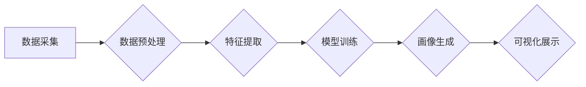

> 学生行为习惯，画像分析，可视化，机器学习，数据挖掘，教育科技

## 1. 背景介绍

随着教育信息化进程的不断加速，海量教育数据正在被生成和积累。这些数据蕴含着丰富的学生行为信息，例如学习时间、学习内容、学习方式、学习效果等。有效挖掘和分析这些数据，能够帮助教育工作者深入了解学生的学习习惯和行为模式，从而为个性化教学、精准指导和学习效果提升提供重要支撑。

然而，传统的教育数据分析方法往往局限于简单的统计描述，难以揭示学生行为背后的复杂规律和潜在关联。因此，亟需一种能够对学生行为数据进行深度挖掘和可视化分析的平台，以帮助教育工作者更全面、更深入地了解学生。

## 2. 核心概念与联系

### 2.1 学生行为习惯画像

学生行为习惯画像是指通过对学生行为数据的分析和挖掘，构建出学生个性化的行为特征描述，并将其以可视化的形式呈现出来。

### 2.2 数据驱动决策

数据驱动决策是指利用数据分析结果，为教育决策提供科学依据。学生行为习惯画像平台可以为教育工作者提供数据驱动的决策支持，帮助他们制定更有效的教学策略和个性化学习方案。

### 2.3 可视化分析

可视化分析是指将数据以图形、图表等形式呈现出来，以便于人们直观地理解和分析数据背后的信息。学生行为习惯画像平台采用先进的可视化技术，将学生行为数据转化为易于理解的图形和图表，帮助教育工作者快速掌握学生行为特征和趋势。

**核心架构流程图**



## 3. 核心算法原理 & 具体操作步骤

### 3.1 算法原理概述

学生行为习惯画像平台的核心算法主要包括数据预处理、特征提取、模型训练和可视化展示等环节。

* **数据预处理:** 对原始数据进行清洗、转换和格式化，去除噪声和异常值，以便于后续算法的应用。
* **特征提取:** 从原始数据中提取具有代表性的特征，例如学习时间、学习内容、学习方式、学习效果等。
* **模型训练:** 利用机器学习算法对提取的特征进行训练，构建学生行为习惯画像模型。
* **可视化展示:** 将训练好的模型应用于新的数据，生成学生行为习惯画像，并以图形、图表等形式进行可视化展示。

### 3.2 算法步骤详解

1. **数据采集:** 从各种教育数据源，例如学习管理系统、在线考试平台、学习行为日志等，收集学生行为数据。
2. **数据预处理:** 对收集到的数据进行清洗、转换和格式化，去除噪声和异常值，并进行数据标准化处理。
3. **特征提取:** 利用数据挖掘和机器学习技术，从预处理后的数据中提取具有代表性的特征，例如学习时间、学习内容、学习方式、学习效果等。
4. **模型训练:** 选择合适的机器学习算法，例如聚类算法、分类算法、回归算法等，对提取的特征进行训练，构建学生行为习惯画像模型。
5. **画像生成:** 将训练好的模型应用于新的数据，生成学生行为习惯画像，并将其以图形、图表等形式进行可视化展示。

### 3.3 算法优缺点

**优点:**

* **个性化分析:** 可以根据学生的个体差异，生成个性化的行为习惯画像。
* **数据驱动决策:** 可以为教育决策提供数据驱动的依据，帮助制定更有效的教学策略。
* **可视化展示:** 可以将复杂的数据信息以直观易懂的方式呈现出来，方便教育工作者理解和分析。

**缺点:**

* **数据依赖:** 算法的准确性依赖于数据的质量和数量。
* **模型复杂性:** 构建准确的模型需要复杂的算法和大量的计算资源。
* **隐私保护:** 需要妥善处理学生行为数据的隐私问题。

### 3.4 算法应用领域

学生行为习惯画像平台的应用领域非常广泛，例如：

* **个性化教学:** 根据学生的学习习惯和行为模式，制定个性化的学习方案。
* **学习效果评估:** 通过分析学生的学习行为，评估学生的学习效果和学习进度。
* **学习干预:** 对学习行为出现异常的学生进行及时干预和指导。
* **教学策略优化:** 通过分析学生的学习行为，优化教学策略和教学方法。

## 4. 数学模型和公式 & 详细讲解 & 举例说明

### 4.1 数学模型构建

学生行为习惯画像平台可以采用多种数学模型进行构建，例如：

* **聚类算法:** 将学生按照其行为特征进行分组，每个分组代表一种特定的行为模式。常用的聚类算法包括K-means聚类、层次聚类等。
* **分类算法:** 将学生分为不同的类别，例如高成就型学生、中等成就型学生、低成就型学生等。常用的分类算法包括决策树、支持向量机、神经网络等。
* **回归算法:** 预测学生的学习成绩或其他学习行为指标。常用的回归算法包括线性回归、逻辑回归、支持向量机回归等。

### 4.2 公式推导过程

这里以K-means聚类算法为例，介绍其数学模型和公式推导过程：

**目标:** 将n个数据点划分为k个簇，使得每个簇内的数据点尽可能接近，而不同簇之间的数据点尽可能远离。

**算法步骤:**

1. **随机初始化k个质心:** 质心代表每个簇的中心点。
2. **计算每个数据点到每个质心的距离:** 使用欧氏距离或其他距离度量。
3. **将每个数据点分配到距离最近的质心所在的簇:** 
4. **重新计算每个簇的质心:** 将每个簇内的所有数据点进行平均，得到新的质心。
5. **重复步骤2-4:** 直到质心不再发生变化，或者达到最大迭代次数。

**公式:**

* **欧氏距离:** $$d(x,y) = \sqrt{\sum_{i=1}^{n}(x_i - y_i)^2}$$
* **质心计算:** $$c_i = \frac{1}{n_i}\sum_{x \in C_i} x$$

其中:

* $x$ 和 $y$ 是两个数据点。
* $n$ 是数据点的维度。
* $c_i$ 是第i个簇的质心。
* $n_i$ 是第i个簇包含的数据点数量。

### 4.3 案例分析与讲解

假设我们有一组学生学习行为数据，包括学习时间、学习内容、学习方式等特征。我们可以使用K-means聚类算法将这些学生分为不同的学习行为类型，例如：

* **勤奋学习型:** 学习时间长，学习内容广泛，学习方式多样。
* **被动学习型:** 学习时间短，学习内容单一，学习方式被动。
* **高效学习型:** 学习时间短，学习内容精简，学习方式高效。

通过分析不同学习行为类型的特征，我们可以制定针对性的教学策略和学习方案，帮助学生提高学习效率和学习效果。

## 5. 项目实践：代码实例和详细解释说明

### 5.1 开发环境搭建

* **操作系统:** Windows/macOS/Linux
* **编程语言:** Python
* **开发工具:** Jupyter Notebook/VS Code
* **库依赖:** pandas, numpy, scikit-learn, matplotlib, seaborn

### 5.2 源代码详细实现

```python
import pandas as pd
from sklearn.cluster import KMeans
import matplotlib.pyplot as plt

# 数据加载
data = pd.read_csv('student_behavior_data.csv')

# 数据预处理
# ...

# 特征提取
features = data[['学习时间', '学习内容', '学习方式']]

# 模型训练
kmeans = KMeans(n_clusters=3, random_state=42)
kmeans.fit(features)

# 画像生成
labels = kmeans.labels_
data['cluster'] = labels

# 可视化展示
plt.scatter(data['学习时间'], data['学习内容'], c=data['cluster'], cmap='viridis')
plt.xlabel('学习时间')
plt.ylabel('学习内容')
plt.title('学生行为习惯画像')
plt.show()
```

### 5.3 代码解读与分析

* **数据加载:** 使用pandas库读取学生行为数据。
* **数据预处理:** 对数据进行清洗、转换和格式化，例如删除缺失值、标准化数据等。
* **特征提取:** 从原始数据中提取具有代表性的特征，例如学习时间、学习内容、学习方式等。
* **模型训练:** 使用K-means聚类算法对提取的特征进行训练，构建学生行为习惯画像模型。
* **画像生成:** 将训练好的模型应用于新的数据，生成学生行为习惯画像，并将其以图形、图表等形式进行可视化展示。

### 5.4 运行结果展示

运行代码后，会生成一个散点图，将学生按照其学习行为特征进行分组，每个分组代表一种特定的学习行为模式。

## 6. 实际应用场景

### 6.1 个性化教学

学生行为习惯画像可以帮助教师了解学生的学习习惯和行为模式，从而制定个性化的教学方案。例如，对于学习时间长、学习内容广泛的学生，可以鼓励他们进行深度学习和探索性学习；对于学习时间短、学习内容单一的学生，可以帮助他们制定更合理的学习计划和学习目标。

### 6.2 学习效果评估

学生行为习惯画像可以帮助教师评估学生的学习效果和学习进度。例如，可以通过分析学生的学习时间、学习内容、学习方式等特征，判断学生的学习效率和学习深度。

### 6.3 学习干预

学生行为习惯画像可以帮助教师及时发现学习行为出现异常的学生，并进行针对性的干预和指导。例如，如果发现某个学生学习时间大幅减少，学习内容单一，学习效果下降，可以及时与学生进行沟通，了解其遇到的困难，并提供相应的帮助和支持。

### 6.4 未来应用展望

随着人工智能技术的不断发展，学生行为习惯画像平台将会有更加广泛的应用场景，例如：

* **智能辅导系统:** 基于学生行为习惯画像，开发智能辅导系统，为学生提供个性化的学习指导和帮助。
* **学习行为预测:** 利用机器学习算法，预测学生的学习行为和学习效果，帮助教师提前做好准备工作。
* **教育资源推荐:** 根据学生的学习行为习惯，推荐个性化的学习资源和学习内容。

## 7. 工具和资源推荐

### 7.1 学习资源推荐

* **机器学习课程:** Coursera, edX, Udacity
* **数据挖掘书籍:** 《数据挖掘：概念与技术》
* **可视化工具:** Tableau, Power BI

### 7.2 开发工具推荐

* **编程语言:** Python
* **数据分析库:** pandas, numpy, scikit-learn
* **可视化库:** matplotlib, seaborn

### 7.3 相关论文推荐

* **K-means聚类算法:** "K-means Clustering" by MacQueen, J. B. (1967)
* **学生行为分析:** "Analyzing Student Behavior in Online Learning Environments" by Siemens, G., & Gašević, D. (2011)

## 8. 总结：未来发展趋势与挑战

### 8.1 研究成果总结

学生行为习惯画像平台是一个新兴的教育科技领域，其研究成果已经取得了一定的进展。通过数据挖掘和机器学习技术，可以有效地分析学生行为数据，构建学生行为习惯画像，为教育决策提供数据驱动的依据。

### 8.2 未来发展趋势

未来，学生行为习惯画像平台将朝着以下几个方向发展：

* **更精准的画像:** 利用更先进的机器学习算法和数据分析技术，构建更精准、更细粒度的学生行为习惯画像。
* **更个性化的服务:** 基于学生行为习惯画像，提供更个性化的学习建议、学习资源推荐和学习干预服务。
