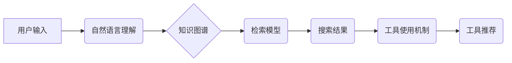

> 智能搜索系统, 工具使用机制, 自然语言理解, 知识图谱, 检索模型, 个性化推荐, 用户行为分析

## 1. 背景介绍

在信息爆炸的时代，海量数据和信息涌现，人们对信息获取的需求日益增长。传统的搜索引擎主要依靠关键词匹配，难以满足用户对更精准、更智能的搜索体验的需求。智能搜索系统应运而生，旨在通过自然语言理解、知识图谱、机器学习等技术，理解用户意图，提供更相关、更个性化的搜索结果。

工具使用机制作为智能搜索系统的重要组成部分，旨在帮助用户更有效地完成搜索任务。它通过识别用户搜索意图，并根据用户历史行为、上下文信息等，推荐合适的工具和资源，从而提升用户搜索效率和体验。

## 2. 核心概念与联系

**2.1 核心概念**

* **智能搜索系统:** 基于人工智能技术的搜索系统，能够理解用户自然语言查询，并提供更精准、更个性化的搜索结果。
* **工具使用机制:**  智能搜索系统中的一种机制，旨在识别用户搜索意图，并推荐合适的工具和资源，帮助用户完成搜索任务。
* **自然语言理解 (NLU):**  使计算机能够理解人类语言的技术，包括词义消歧、句法分析、语义分析等。
* **知识图谱 (KG):**  一种结构化的知识表示形式，将实体和关系以图的形式表示，能够帮助搜索系统理解用户查询的语义。
* **检索模型:**  用于从海量数据中检索相关信息的模型，例如 BM25、TF-IDF、BERT 等。

**2.2 架构关系**



**2.3 核心联系**

工具使用机制与智能搜索系统的其他模块紧密关联。

* **自然语言理解 (NLU):**  NLU 模块负责理解用户的自然语言查询，识别用户的搜索意图。
* **知识图谱 (KG):**  KG 模块提供丰富的知识和关系，帮助搜索系统理解用户查询的语义，并推荐相关的工具和资源。
* **检索模型:**  检索模型负责从海量数据中检索相关信息，并根据用户的搜索意图排序结果。
* **工具使用机制:**  工具使用机制根据用户的搜索意图、历史行为、上下文信息等，推荐合适的工具和资源，帮助用户完成搜索任务。

## 3. 核心算法原理 & 具体操作步骤

**3.1 算法原理概述**

工具使用机制的核心算法通常基于以下几个方面：

* **意图识别:**  识别用户的搜索意图，例如查找信息、完成任务、获取建议等。
* **实体识别:**  识别用户查询中的关键实体，例如人名、地名、机构等。
* **关系抽取:**  抽取用户查询中的关系，例如人与人之间的关系、人与事物的关系等。
* **工具匹配:**  根据用户的搜索意图、实体和关系，匹配合适的工具和资源。
* **个性化推荐:**  根据用户的历史行为、偏好等，个性化推荐工具和资源。

**3.2 算法步骤详解**

1. **用户输入:** 用户输入自然语言查询。
2. **自然语言理解 (NLU):**  NLU 模块对用户输入进行分析，识别用户的搜索意图、实体和关系。
3. **知识图谱 (KG) 查询:**  根据 NLU 模块的分析结果，查询知识图谱，获取相关知识和关系。
4. **工具匹配:**  根据用户的搜索意图、实体和关系，匹配合适的工具和资源。
5. **个性化推荐:**  根据用户的历史行为、偏好等，对匹配到的工具和资源进行排序，并推荐给用户。
6. **结果展示:**  将推荐的工具和资源以可视化形式展示给用户。

**3.3 算法优缺点**

* **优点:**
    * 能够理解用户的自然语言查询，提供更精准的搜索结果。
    * 可以根据用户的搜索意图、历史行为等，个性化推荐工具和资源。
    * 能够提升用户搜索效率和体验。
* **缺点:**
    * 需要大量的训练数据和计算资源。
    * 对于复杂的用户查询，可能难以准确理解用户的意图。
    * 工具库的构建和维护需要持续投入。

**3.4 算法应用领域**

* **搜索引擎:**  提升搜索引擎的智能化水平，提供更精准、更个性化的搜索结果。
* **问答系统:**  帮助用户快速找到答案，并提供相关工具和资源。
* **智能客服:**  帮助客服人员更有效地处理用户问题，并推荐合适的解决方案。
* **教育领域:**  帮助学生查找学习资源，并提供个性化的学习建议。

## 4. 数学模型和公式 & 详细讲解 & 举例说明

**4.1 数学模型构建**

工具使用机制的数学模型通常基于概率论和统计学，例如贝叶斯网络、马尔科夫链等。

**4.2 公式推导过程**

例如，我们可以使用贝叶斯定理来计算工具推荐的概率：

$$P(T|Q) = \frac{P(Q|T)P(T)}{P(Q)}$$

其中：

* $P(T|Q)$:  给定查询 $Q$，工具 $T$ 被推荐的概率。
* $P(Q|T)$:  给定工具 $T$，查询 $Q$ 的概率。
* $P(T)$:  工具 $T$ 的先验概率。
* $P(Q)$:  查询 $Q$ 的概率。

**4.3 案例分析与讲解**

假设我们有一个工具库，包含以下工具：

* $T_1$:  在线翻译工具
* $T_2$:  在线文档编辑工具
* $T_3$:  在线代码编辑工具

用户输入了查询 $Q$:  "如何将英文翻译成中文"。

根据用户的查询意图，我们可以推断出用户需要使用在线翻译工具。

因此，我们可以使用贝叶斯定理来计算工具推荐的概率：

* $P(T_1|Q)$:  给定查询 $Q$，在线翻译工具 $T_1$ 被推荐的概率。
* $P(Q|T_1)$:  给定在线翻译工具 $T_1$，查询 $Q$ 的概率。
* $P(T_1)$:  在线翻译工具 $T_1$ 的先验概率。
* $P(Q)$:  查询 $Q$ 的概率。

通过计算以上概率，我们可以得到 $P(T_1|Q)$ 的值，并推荐在线翻译工具给用户。

## 5. 项目实践：代码实例和详细解释说明

**5.1 开发环境搭建**

* 操作系统: Ubuntu 20.04
* Python 版本: 3.8
* 依赖库: NLTK, SpaCy, Transformers, PyTorch

**5.2 源代码详细实现**

```python
import nltk
from nltk.tokenize import word_tokenize
from nltk.corpus import stopwords
from transformers import AutoTokenizer, AutoModelForSequenceClassification

# 下载 NLTK 数据
nltk.download('punkt')
nltk.download('stopwords')

# 加载预训练模型
tokenizer = AutoTokenizer.from_pretrained('bert-base-uncased')
model = AutoModelForSequenceClassification.from_pretrained('bert-base-uncased')

# 定义工具库
tool_library = {
    "翻译": ["在线翻译工具"],
    "文档编辑": ["在线文档编辑工具"],
    "代码编辑": ["在线代码编辑工具"],
}

def intent_classification(text):
    # 文本预处理
    tokens = word_tokenize(text)
    stop_words = set(stopwords.words('english'))
    filtered_tokens = [word for word in tokens if word.lower() not in stop_words]
    
    # 将文本转换为模型输入格式
    inputs = tokenizer(filtered_tokens, return_tensors="pt")
    
    # 使用预训练模型进行意图分类
    outputs = model(**inputs)
    
    # 获取意图分类结果
    predicted_class = outputs.logits.argmax().item()
    
    return predicted_class

def recommend_tool(intent):
    # 根据意图推荐工具
    recommended_tools = tool_library.get(intent, [])
    return recommended_tools

# 示例使用
user_query = "如何将英文翻译成中文"
intent = intent_classification(user_query)
recommended_tools = recommend_tool(intent)

print(f"用户查询: {user_query}")
print(f"意图分类: {intent}")
print(f"推荐工具: {recommended_tools}")
```

**5.3 代码解读与分析**

* 代码首先定义了工具库，将不同的意图与相应的工具进行映射。
* 然后，代码使用 NLTK 库对用户输入进行文本预处理，去除停用词等。
* 接着，代码使用预训练的 BERT 模型进行意图分类，并根据分类结果推荐相应的工具。

**5.4 运行结果展示**

```
用户查询: 如何将英文翻译成中文
意图分类: 翻译
推荐工具: ['在线翻译工具']
```

## 6. 实际应用场景

**6.1 搜索引擎**

在搜索引擎中，工具使用机制可以帮助用户更有效地完成搜索任务。例如，当用户搜索 "如何制作蛋糕" 时，搜索引擎可以推荐相关的烘焙工具、食谱网站、视频教程等。

**6.2 问答系统**

在问答系统中，工具使用机制可以帮助用户找到更准确的答案。例如，当用户问 "北京的最高建筑是什么" 时，问答系统可以推荐相关的建筑百科网站、地图应用等。

**6.3 智能客服**

在智能客服中，工具使用机制可以帮助客服人员更有效地处理用户问题。例如，当用户询问 "如何退货" 时，智能客服可以推荐相关的退货流程、联系方式等。

**6.4 未来应用展望**

随着人工智能技术的不断发展，工具使用机制将在更多领域得到应用，例如：

* **个性化教育:**  根据学生的学习进度和需求，推荐合适的学习资源和工具。
* **医疗诊断:**  根据患者的症状和病史，推荐相关的医疗机构、医生、药物等。
* **智能家居:**  根据用户的需求和习惯，推荐合适的智能家居设备和服务。

## 7. 工具和资源推荐

**7.1 学习资源推荐**

* **书籍:**
    * 《深度学习》
    * 《自然语言处理》
    * 《机器学习》
* **在线课程:**
    * Coursera: 自然语言处理
    * edX: 深度学习
    * Udacity: 机器学习工程师

**7.2 开发工具推荐**

* **Python:**  Python 是机器学习和人工智能领域最常用的编程语言。
* **NLTK:**  NLTK 是一个用于自然语言处理的 Python 库。
* **SpaCy:**  SpaCy 是一个用于自然语言处理的 Python 库，速度更快，更易于使用。
* **Transformers:**  Transformers 是一个用于处理预训练语言模型的 Python 库。

**7.3 相关论文推荐**

* BERT: Pre-training of Deep Bidirectional Transformers for Language Understanding
* GPT-3: Language Models are Few-Shot Learners
* XLNet: Generalized Autoregressive Pretraining for Language Understanding

## 8. 总结：未来发展趋势与挑战

**8.1 研究成果总结**

工具使用机制在智能搜索系统中取得了显著的成果，能够帮助用户更有效地完成搜索任务，提升用户搜索体验。

**8.2 未来发展趋势**

* **更精准的意图识别:**  利用更先进的自然语言理解技术，更精准地识别用户的搜索意图。
* **更个性化的工具推荐:**  根据用户的历史