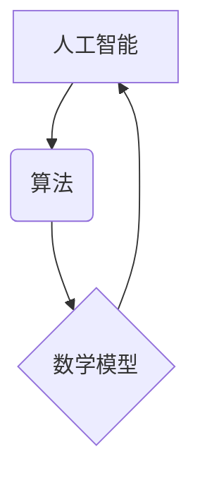

> 图灵奖，曼纽尔·布鲁姆，人工智能，计算机科学，算法，数学模型，项目实践，未来发展趋势

## 1. 背景介绍

计算机科学领域，像一颗颗闪耀的星辰，无数杰出人物用智慧和汗水照亮了前行的道路。其中，图灵奖作为计算机科学领域的最高荣誉，被誉为“诺贝尔奖”，每年颁发给对计算机科学领域做出杰出贡献的科学家或工程师。而曼纽尔·布鲁姆，这位计算机科学领域的巨人，凭借其对人工智能、算法和数学模型的深刻理解，以及对计算机科学发展方向的敏锐洞察，最终获得了这颗耀眼的星辰。

## 2. 核心概念与联系

### 2.1 人工智能

人工智能（Artificial Intelligence，简称AI）是指模拟人类智能行为的计算机系统。它涵盖了广泛的领域，包括机器学习、深度学习、自然语言处理、计算机视觉等。

### 2.2 算法

算法是解决特定问题的一系列步骤或规则。它就像一个计算机的“食谱”，告诉计算机如何处理数据并得到期望的结果。

### 2.3 数学模型

数学模型是使用数学语言和符号来描述和分析现实世界现象的工具。它可以帮助我们理解复杂系统，预测未来趋势，并找到最佳解决方案。

**核心概念联系图:**



## 3. 核心算法原理 & 具体操作步骤

### 3.1 算法原理概述

曼纽尔·布鲁姆的研究重点之一是深度学习算法。深度学习算法是一种基于多层神经网络的机器学习算法，能够学习复杂的数据模式。

### 3.2 算法步骤详解

1. **数据预处理:** 将原始数据转换为深度学习算法可以理解的格式。
2. **网络结构设计:** 设计多层神经网络的结构，包括神经元数量、连接方式等。
3. **参数初始化:** 为神经网络中的参数赋予初始值。
4. **前向传播:** 将输入数据通过神经网络传递，计算输出结果。
5. **反向传播:** 计算输出结果与目标值的误差，并根据误差调整神经网络的参数。
6. **迭代训练:** 重复前向传播和反向传播的过程，直到模型性能达到预期水平。

### 3.3 算法优缺点

**优点:**

* 能够学习复杂的数据模式。
* 性能优于传统机器学习算法。
* 应用范围广泛，包括图像识别、语音识别、自然语言处理等。

**缺点:**

* 训练数据量大，计算资源消耗高。
* 模型解释性差，难以理解模型的决策过程。

### 3.4 算法应用领域

深度学习算法在各个领域都有广泛的应用，例如：

* **图像识别:** 自动识别图像中的物体、场景和人物。
* **语音识别:** 将语音转换为文本。
* **自然语言处理:** 理解和生成人类语言。
* **医疗诊断:** 辅助医生诊断疾病。
* **金融预测:** 预测股票价格、风险评估等。

## 4. 数学模型和公式 & 详细讲解 & 举例说明

### 4.1 数学模型构建

深度学习算法的核心是多层神经网络。每个神经元接收多个输入信号，并通过激活函数进行处理，输出一个信号。神经元之间通过权重连接，权重决定了信号的强度。

### 4.2 公式推导过程

深度学习算法的训练过程是通过优化神经网络的权重来最小化损失函数。损失函数衡量模型预测结果与真实值的差异。常用的损失函数包括均方误差（MSE）和交叉熵损失（Cross-Entropy Loss）。

**均方误差 (MSE):**

$$MSE = \frac{1}{n} \sum_{i=1}^{n} (y_i - \hat{y}_i)^2$$

其中：

* $y_i$ 是真实值
* $\hat{y}_i$ 是模型预测值
* $n$ 是样本数量

**交叉熵损失 (Cross-Entropy Loss):**

$$Cross-Entropy Loss = -\sum_{i=1}^{n} y_i \log(\hat{y}_i) + (1-y_i) \log(1-\hat{y}_i)$$

其中：

* $y_i$ 是真实值（0或1）
* $\hat{y}_i$ 是模型预测值（0到1之间的概率）

### 4.3 案例分析与讲解

假设我们训练一个图像分类模型，目标是识别猫和狗的图片。我们可以使用交叉熵损失函数来衡量模型的性能。

如果模型预测一张图片是猫的概率为0.8，而真实标签是猫，则损失函数的值会比较小。反之，如果模型预测一张图片是狗的概率为0.2，而真实标签是狗，则损失函数的值会比较大。

通过反复训练，模型会不断调整权重，使得损失函数的值逐渐减小，最终达到较高的分类准确率。

## 5. 项目实践：代码实例和详细解释说明

### 5.1 开发环境搭建

为了实现深度学习算法，我们需要搭建一个开发环境。常用的开发环境包括：

* **Python:** 深度学习框架的编程语言。
* **TensorFlow:** Google开发的开源深度学习框架。
* **PyTorch:** Facebook开发的开源深度学习框架。
* **CUDA:** NVIDIA开发的GPU加速计算平台。

### 5.2 源代码详细实现

以下是一个使用TensorFlow实现图像分类的简单代码示例：

```python
import tensorflow as tf

# 定义模型结构
model = tf.keras.models.Sequential([
    tf.keras.layers.Conv2D(32, (3, 3), activation='relu', input_shape=(28, 28, 1)),
    tf.keras.layers.MaxPooling2D((2, 2)),
    tf.keras.layers.Conv2D(64, (3, 3), activation='relu'),
    tf.keras.layers.MaxPooling2D((2, 2)),
    tf.keras.layers.Flatten(),
    tf.keras.layers.Dense(10, activation='softmax')
])

# 编译模型
model.compile(optimizer='adam',
              loss='sparse_categorical_crossentropy',
              metrics=['accuracy'])

# 训练模型
model.fit(x_train, y_train, epochs=5)

# 评估模型
loss, accuracy = model.evaluate(x_test, y_test)
print('Test loss:', loss)
print('Test accuracy:', accuracy)
```

### 5.3 代码解读与分析

这段代码定义了一个简单的卷积神经网络模型，用于识别手写数字。

* `tf.keras.models.Sequential` 创建了一个顺序模型，即层级结构。
* `tf.keras.layers.Conv2D` 定义了一个卷积层，用于提取图像特征。
* `tf.keras.layers.MaxPooling2D` 定义了一个最大池化层，用于降低特征图的大小。
* `tf.keras.layers.Flatten` 将多维特征图转换为一维向量。
* `tf.keras.layers.Dense` 定义了一个全连接层，用于分类。
* `model.compile` 编译模型，指定优化器、损失函数和评价指标。
* `model.fit` 训练模型，使用训练数据进行训练。
* `model.evaluate` 评估模型，使用测试数据计算损失和准确率。

### 5.4 运行结果展示

训练完成后，我们可以使用测试数据评估模型的性能。

## 6. 实际应用场景

### 6.1 图像识别

深度学习算法在图像识别领域取得了突破性的进展。例如，Google的Inception模型能够识别超过1000种物体，Facebook的DeepFace模型能够识别人脸，并达到人类水平的准确率。

### 6.2 语音识别

深度学习算法也应用于语音识别领域。例如，Apple的Siri和Google的语音助手都使用深度学习算法进行语音识别。

### 6.3 自然语言处理

深度学习算法在自然语言处理领域也取得了显著成果。例如，Google的BERT模型能够理解复杂的句子结构和语义关系，并应用于机器翻译、文本摘要和问答系统等任务。

### 6.4 未来应用展望

随着深度学习算法的不断发展，其应用场景将更加广泛。例如，在医疗领域，深度学习算法可以辅助医生诊断疾病、预测患者的病情发展趋势；在金融领域，深度学习算法可以用于欺诈检测、风险评估和投资决策；在教育领域，深度学习算法可以个性化学习，为学生提供定制化的教学内容。

## 7. 工具和资源推荐

### 7.1 学习资源推荐

* **Coursera:** 提供深度学习相关的在线课程，例如Andrew Ng的深度学习课程。
* **Udacity:** 提供深度学习相关的在线课程和项目，例如深度学习工程师 Nanodegree。
* **Fast.ai:** 提供深度学习相关的教程和实践项目。

### 7.2 开发工具推荐

* **TensorFlow:** Google开发的开源深度学习框架。
* **PyTorch:** Facebook开发的开源深度学习框架。
* **Keras:** TensorFlow的高级API，简化了深度学习模型的构建。

### 7.3 相关论文推荐

* **AlexNet:** Krizhevsky等人在2012年提出的AlexNet模型，在ImageNet图像识别挑战赛中取得了突破性的成绩。
* **VGGNet:** Simonyan和Zisserman在2014年提出的VGGNet模型，使用较深的网络结构，取得了更高的准确率。
* **ResNet:** He等人在2015年提出的ResNet模型，引入了残差连接，解决了深度网络训练中的梯度消失问题。

## 8. 总结：未来发展趋势与挑战

### 8.1 研究成果总结

曼纽尔·布鲁姆的研究成果对人工智能领域产生了深远的影响。他的工作推动了深度学习算法的发展，并为其在各个领域的应用奠定了基础。

### 8.2 未来发展趋势

未来，人工智能领域将继续朝着更加智能、更加通用、更加安全的方向发展。

* **增强学习:** 训练人工智能系统能够通过与环境交互学习。
* **联邦学习:** 在不共享原始数据的情况下，训练多个设备上的模型。
* **解释性AI:** 使人工智能模型的决策过程更加透明和可解释。

### 8.3 面临的挑战

人工智能领域也面临着一些挑战，例如：

* **数据隐私:** 如何保护人工智能训练数据中的隐私信息。
* **算法偏见:** 如何避免人工智能算法产生偏见。
* **人工智能安全:** 如何确保人工智能系统安全可靠。

### 8.4 研究展望

未来，我们需要继续加强人工智能基础研究，探索人工智能的本质，并解决人工智能领域面临的挑战。同时，我们需要加强人工智能与其他领域的融合，推动人工智能技术在各个领域的应用，为人类社会创造更多价值。

## 9. 附录：常见问题与解答

### 9.1 什么是深度学习？

深度学习是一种机器学习算法，它使用多层神经网络来学习复杂的数据模式。

### 9.2 深度学习算法有哪些？

常见的深度学习算法包括卷积神经网络（CNN）、循环神经网络（RNN）、生成对抗网络（GAN）等。

### 9.3 如何搭建深度学习开发环境？

需要安装Python、深度学习框架（如TensorFlow、PyTorch）以及必要的库和工具。

### 9.4 如何训练深度学习模型？

需要准备训练数据，定义模型结构，选择优化器和损失函数，并使用训练数据训练模型。

### 9.5 如何评估深度学习模型的性能？

可以使用测试数据计算模型的损失和准确率等指标。


作者：禅与计算机程序设计艺术 / Zen and the Art of Computer Programming 
<end_of_turn>