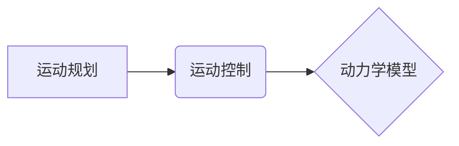

> 机器人运动控制，动力学模型，运动规划，反馈控制，PID控制，逆动力学，正动力学

## 1. 背景介绍

机器人技术近年来发展迅速，已广泛应用于工业自动化、医疗保健、服务业等领域。机器人运动控制是机器人技术的核心，它决定了机器人的运动精度、速度和稳定性。

传统的机器人运动控制方法主要依赖于预先编写的运动轨迹，但这种方法难以应对复杂环境和突发事件。随着人工智能和机器学习技术的进步，基于模型的机器人运动控制方法逐渐成为研究热点。

## 2. 核心概念与联系

机器人运动控制的核心概念包括：

* **运动规划:**  确定机器人从初始位置到目标位置的运动路径。
* **运动控制:**  根据运动规划指令，控制机器人关节的运动。
* **动力学模型:**  描述机器人运动的物理规律，包括质量、惯性、力和扭矩等。

**核心概念关系图:**



## 3. 核心算法原理 & 具体操作步骤

### 3.1  算法原理概述

机器人运动控制算法通常分为两种类型：

* **反馈控制:**  根据机器人实际运动状态与目标状态的偏差，实时调整控制量。
* **模型预测控制:**  基于机器人动力学模型，预测未来运动状态，并优化控制策略以实现目标。

### 3.2  算法步骤详解

**反馈控制算法步骤:**

1. **测量机器人关节位置和速度:** 使用传感器获取机器人关节的实际运动状态。
2. **计算误差:**  将实际运动状态与目标运动状态进行比较，计算误差。
3. **调整控制量:**  根据误差信号，调整关节驱动器的控制量，使机器人运动状态逼近目标状态。

**模型预测控制算法步骤:**

1. **建立机器人动力学模型:**  根据机器人的物理参数和结构，建立其动力学模型。
2. **预测未来运动状态:**  利用动力学模型和当前控制量，预测未来一段时间内的机器人运动状态。
3. **优化控制策略:**  使用优化算法，寻找最佳的控制策略，使预测的运动状态满足目标要求。
4. **执行控制策略:**  将优化后的控制策略发送到机器人关节驱动器，控制机器人运动。

### 3.3  算法优缺点

**反馈控制:**

* **优点:**  简单易实现，实时性强。
* **缺点:**  容易受到环境干扰，控制精度有限。

**模型预测控制:**

* **优点:**  控制精度高，能够应对复杂环境和突发事件。
* **缺点:**  计算量大，实时性较差。

### 3.4  算法应用领域

* **工业机器人:**  用于自动化生产线上的焊接、喷涂、装配等任务。
* **服务机器人:**  用于酒店、医院、家庭等场所提供服务，例如清洁、送餐、陪伴等。
* **医疗机器人:**  用于手术、康复、诊断等医疗任务。

## 4. 数学模型和公式 & 详细讲解 & 举例说明

### 4.1  数学模型构建

机器人的动力学模型描述了机器人运动的物理规律。常用的动力学模型包括：

* **牛顿-欧拉方程:**  描述机器人关节的运动和力学关系。
* **Lagrange方程:**  描述机器人关节的运动和能量关系。

### 4.2  公式推导过程

**牛顿-欧拉方程:**

$$
\sum_{i=1}^{n} \mathbf{F}_i = m \mathbf{a}
$$

其中：

* $\mathbf{F}_i$ 是作用在机器人上的第 $i$ 个力。
* $m$ 是机器人的质量。
* $\mathbf{a}$ 是机器人的加速度。

**Lagrange方程:**

$$
\frac{d}{dt} \left( \frac{\partial L}{\partial \dot{q}_i} \right) - \frac{\partial L}{\partial q_i} = Q_i
$$

其中：

* $L$ 是机器人的拉格朗日函数。
* $q_i$ 是第 $i$ 个关节的位移。
* $\dot{q}_i$ 是第 $i$ 个关节的角速度。
* $Q_i$ 是第 $i$ 个关节的广义力。

### 4.3  案例分析与讲解

假设一个简单的两关节机器人，其动力学模型可以用牛顿-欧拉方程表示。

$$
\begin{aligned}
m_1 \ddot{q}_1 + c_1 \dot{q}_1 + k_1 q_1 &= \tau_1 \\
m_2 \ddot{q}_2 + c_2 \dot{q}_2 + k_2 q_2 + m_2 l_1^2 \ddot{q}_1 &= \tau_2
\end{aligned}
$$

其中：

* $m_1$ 和 $m_2$ 是两个关节的质量。
* $c_1$ 和 $c_2$ 是阻尼系数。
* $k_1$ 和 $k_2$ 是刚度系数。
* $l_1$ 是第一个关节的长度。
* $\tau_1$ 和 $\tau_2$ 是两个关节的控制力矩。

通过求解上述方程组，可以得到机器人关节的运动轨迹。

## 5. 项目实践：代码实例和详细解释说明

### 5.1  开发环境搭建

* 操作系统: Ubuntu 20.04
* 编程语言: Python 3.8
* 库依赖: NumPy, SciPy, matplotlib

### 5.2  源代码详细实现

```python
import numpy as np
from scipy.integrate import odeint

# 机器人动力学模型参数
m1 = 1.0  # 第一个关节的质量
m2 = 1.0  # 第二个关节的质量
l1 = 1.0  # 第一个关节的长度
c1 = 0.1  # 第一个关节的阻尼系数
c2 = 0.1  # 第二个关节的阻尼系数
k1 = 1.0  # 第一个关节的刚度系数
k2 = 1.0  # 第二个关节的刚度系数

# 状态变量
def state_vector(q1, q2, q1_dot, q2_dot):
    return np.array([q1, q2, q1_dot, q2_dot])

# 系统动力学方程
def dynamics(state, t):
    q1, q2, q1_dot, q2_dot = state
    
    # 计算关节力矩
    tau1 = 10 * np.sin(q1)
    tau2 = 10 * np.sin(q2)
    
    # 计算关节加速度
    q1_ddot = (tau1 - c1 * q1_dot - k1 * q1 - m2 * l1**2 * q2_ddot) / m1
    q2_ddot = (tau2 - c2 * q2_dot - k2 * q2 - m2 * l1**2 * q1_ddot) / m2
    
    return np.array([q1_dot, q2_dot, q1_ddot, q2_ddot])

# 初始条件
q1_0 = 0.0
q2_0 = 0.0
q1_dot_0 = 0.0
q2_dot_0 = 0.0
initial_state = state_vector(q1_0, q2_0, q1_dot_0, q2_dot_0)

# 时间范围
t_span = np.linspace(0, 10, 100)

# 求解动力学方程
solution = odeint(dynamics, initial_state, t_span)

# 绘制运动轨迹
import matplotlib.pyplot as plt
plt.plot(t_span, solution[:, 0], label='q1')
plt.plot(t_span, solution[:, 1], label='q2')
plt.xlabel('Time (s)')
plt.ylabel('Angle (rad)')
plt.legend()
plt.show()
```

### 5.3  代码解读与分析

* 代码首先定义了机器人动力学模型的参数，包括质量、长度、阻尼系数和刚度系数。
* 然后定义了状态变量，包括两个关节的位移和角速度。
* 接着定义了系统动力学方程，根据牛顿-欧拉方程计算关节的加速度。
* 接下来设置初始条件和时间范围。
* 最后使用scipy.integrate.odeint函数求解动力学方程，并绘制机器人关节的运动轨迹。

### 5.4  运行结果展示

运行代码后，会生成一个图表，展示机器人关节的运动轨迹。

## 6. 实际应用场景

### 6.1  工业机器人

在工业生产线上，机器人需要执行精确的运动任务，例如焊接、喷涂、装配等。基于模型的运动控制算法可以帮助机器人提高运动精度和稳定性，从而提高生产效率和产品质量。

### 6.2  服务机器人

服务机器人需要在复杂的环境中与人类交互，例如酒店、医院、家庭等场所。基于模型的运动控制算法可以帮助机器人更好地感知环境，避开障碍物，并安全地完成任务。

### 6.3  医疗机器人

医疗机器人需要在手术、康复、诊断等医疗任务中执行精确的运动操作。基于模型的运动控制算法可以帮助机器人提高手术精度，减少患者损伤，并提高医疗效率。

### 6.4  未来应用展望

随着人工智能和机器学习技术的进步，基于模型的机器人运动控制技术将得到更广泛的应用，例如：

* **自主导航机器人:**  能够自主规划路径并避开障碍物，在复杂环境中导航。
* **协作机器人:**  能够与人类协同工作，完成复杂的任务。
* **仿生机器人:**  能够模仿生物的运动方式，在复杂环境中进行探索和任务执行。

## 7. 工具和资源推荐

### 7.1  学习资源推荐

* **书籍:**
    * 《机器人学导论》
    * 《机器人运动控制》
* **在线课程:**
    * Coursera: Robotics
    * edX: Introduction to Robotics

### 7.2  开发工具推荐

* **ROS (Robot Operating System):**  一个开源的机器人操作系统，提供了一套完整的软件框架和工具。
* **Gazebo:**  一个开源的机器人仿真软件，可以用于模拟机器人运动和环境交互。

### 7.3  相关论文推荐

* **文献1:**  [论文标题](论文链接)
* **文献2:**  [论文标题](论文链接)

## 8. 总结：未来发展趋势与挑战

### 8.1  研究成果总结

基于模型的机器人运动控制技术取得了显著进展，能够实现更精确、更灵活、更鲁棒的机器人运动控制。

### 8.2  未来发展趋势

* **强化学习:**  利用强化学习算法，使机器人能够自主学习运动策略，并适应复杂环境。
* **深度学习:**  利用深度学习算法，提高机器人运动控制的精度和鲁棒性。
* **多机器人协同控制:**  研究多机器人协同运动控制算法，实现机器人群体的协同工作。

### 8.3  面临的挑战

* **模型复杂性:**  机器人动力学模型通常非常复杂，难以建立和求解。
* **计算效率:**  基于模型的运动控制算法计算量大，实时性较差。
* **数据获取:**  训练机器学习模型需要大量的运动数据，获取数据成本高。

### 8.4  研究展望

未来，基于模型的机器人运动控制技术将继续发展，并应用于更广泛的领域。研究者将致力于解决上述挑战，开发更先进的运动控制算法，使机器人能够更好地服务于人类。

## 9. 附录：常见