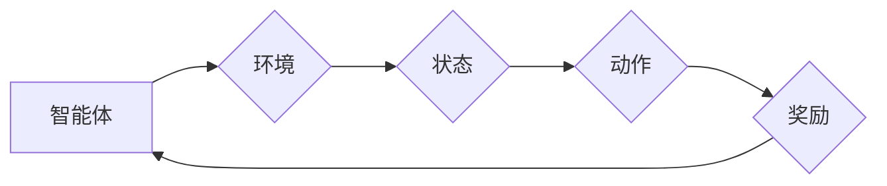

> 深度学习，Q-learning，边缘计算，强化学习，模型部署

## 1. 背景介绍

随着物联网、人工智能等技术的快速发展，海量数据在边缘设备上不断产生和积累。传统的云计算架构面临着数据传输延迟高、网络带宽有限等问题，难以满足实时处理和决策的需求。边缘计算应运而生，将计算资源和数据处理能力部署到靠近数据源的边缘节点，实现数据本地化处理，从而降低延迟、提高效率。

强化学习（Reinforcement Learning，RL）作为一种机器学习范式，能够通过与环境交互学习最优策略，在边缘计算场景中具有广阔的应用前景。深度强化学习（Deep Reinforcement Learning，DRL）将深度神经网络与强化学习相结合，能够处理更复杂的环境和任务，例如机器人控制、智能交通、工业自动化等。

Q-learning是一种经典的强化学习算法，通过构建Q值表来学习状态-动作对的价值函数，并根据价值函数选择最优动作。深度Q-learning则利用深度神经网络来逼近Q值函数，能够处理高维状态空间和连续动作空间。

## 2. 核心概念与联系

**2.1 强化学习概念**

强化学习是一种基于交互学习的机器学习方法，其核心在于智能体与环境的交互过程。智能体通过与环境交互，获得奖励或惩罚，并根据这些反馈调整其行为策略，最终学习到最优策略，以最大化累积奖励。

**2.2 深度Q-learning概念**

深度Q-learning将深度神经网络引入Q-learning算法，用于逼近Q值函数。深度神经网络能够学习复杂非线性关系，从而处理高维状态空间和连续动作空间。

**2.3 边缘计算概念**

边缘计算将计算资源和数据处理能力部署到靠近数据源的边缘节点，实现数据本地化处理，从而降低延迟、提高效率。

**2.4 核心架构**



**图 1：强化学习核心架构**

## 3. 核心算法原理 & 具体操作步骤

### 3.1 算法原理概述

深度Q-learning算法的核心思想是利用深度神经网络来逼近Q值函数，并通过Q值函数来选择最优动作。

Q值函数表示在给定状态下执行特定动作的期望累积奖励。深度Q-learning算法通过训练深度神经网络，学习Q值函数的近似表示，从而能够在新的状态下选择最优动作。

### 3.2 算法步骤详解

1. **初始化:** 初始化深度神经网络，并设置学习率、折扣因子等超参数。

2. **环境交互:** 智能体与环境交互，获得当前状态和奖励。

3. **动作选择:** 根据当前状态和Q值网络的输出，选择一个动作。

4. **状态转移:** 执行动作后，智能体进入新的状态。

5. **Q值更新:** 更新Q值网络的参数，使Q值函数逼近真实Q值。

6. **重复步骤2-5:** 重复以上步骤，直到智能体学习到最优策略。

### 3.3 算法优缺点

**优点:**

* 能够处理高维状态空间和连续动作空间。
* 学习能力强，能够学习复杂策略。

**缺点:**

* 训练时间长，需要大量的训练数据。
* 容易陷入局部最优解。

### 3.4 算法应用领域

* 机器人控制
* 智能交通
* 游戏 AI
* 医疗诊断
* 金融投资

## 4. 数学模型和公式 & 详细讲解 & 举例说明

### 4.1 数学模型构建

深度Q-learning算法的核心是Q值函数，其目标是学习一个函数Q(s, a)，其中s表示状态，a表示动作，Q(s, a)表示在状态s下执行动作a的期望累积奖励。

### 4.2 公式推导过程

Q值函数的更新规则是基于Bellman方程的：

$$Q(s, a) = Q(s, a) + \alpha [r + \gamma \max_{a'} Q(s', a') - Q(s, a)]$$

其中：

* $\alpha$ 是学习率，控制着学习速率。
* $r$ 是当前状态下获得的奖励。
* $\gamma$ 是折扣因子，控制着未来奖励的权重。
* $s'$ 是执行动作a后进入的新状态。
* $a'$ 是在新的状态$s'$下选择的最优动作。

### 4.3 案例分析与讲解

假设一个智能体在玩一个简单的游戏，游戏状态包括玩家的位置和游戏目标的位置。玩家可以选择向上、向下、向左、向右四个动作。

当玩家执行一个动作后，会获得一定的奖励，例如到达目标位置获得高奖励，撞到障碍物获得低奖励。

深度Q-learning算法可以学习到玩家在不同状态下执行不同动作的期望累积奖励，从而学习到最优策略，即如何玩游戏获得最高奖励。

## 5. 项目实践：代码实例和详细解释说明

### 5.1 开发环境搭建

* Python 3.7+
* TensorFlow 2.0+
* OpenAI Gym

### 5.2 源代码详细实现

```python
import tensorflow as tf
import numpy as np
from tensorflow.keras.models import Sequential
from tensorflow.keras.layers import Dense

# 定义深度Q网络
class DeepQNetwork:
    def __init__(self, state_size, action_size):
        self.state_size = state_size
        self.action_size = action_size
        self.model = Sequential()
        self.model.add(Dense(24, activation='relu', input_shape=(state_size,)))
        self.model.add(Dense(24, activation='relu'))
        self.model.add(Dense(action_size))

    def predict(self, state):
        return self.model.predict(state)

# 定义训练函数
def train(dqn, state, action, reward, next_state, done):
    # 计算目标Q值
    target_q = reward
    if not done:
        target_q = reward + 0.99 * np.max(dqn.predict(next_state))
    # 更新Q值
    target = dqn.predict(state)
    target[0][action] = target_q
    dqn.model.fit(state, target, epochs=1, verbose=0)

# 主程序
if __name__ == '__main__':
    # 初始化深度Q网络
    dqn = DeepQNetwork(state_size=4, action_size=4)
    # 训练过程
    for episode in range(1000):
        state = env.reset()
        done = False
        while not done:
            # 选择动作
            action = np.argmax(dqn.predict(state))
            # 执行动作
            next_state, reward, done, _ = env.step(action)
            # 训练
            train(dqn, state, action, reward, next_state, done)
            # 更新状态
            state = next_state

```

### 5.3 代码解读与分析

* 代码首先定义了深度Q网络的结构，使用多层感知机来逼近Q值函数。
* 然后定义了训练函数，根据Bellman方程更新Q值网络的参数。
* 主程序中，首先初始化深度Q网络，然后进行训练过程。
* 在训练过程中，智能体与环境交互，根据Q值网络的输出选择动作，执行动作后获得奖励和下一个状态，并更新Q值网络的参数。

### 5.4 运行结果展示

训练完成后，可以测试智能体的性能，例如在游戏环境中观察智能体的行为，或者在其他任务中评估智能体的性能。

## 6. 实际应用场景

### 6.1 智能交通

深度Q-learning可以用于优化交通信号灯控制，根据实时交通流量调整信号灯的绿灯时间，从而减少拥堵和提高交通效率。

### 6.2 工业自动化

深度Q-learning可以用于机器人控制，例如在工厂环境中，机器人可以使用深度Q-learning算法学习如何抓取和搬运物品。

### 6.3 智能家居

深度Q-learning可以用于智能家居设备的控制，例如根据用户的习惯和需求，自动调节灯光、温度和空调等。

### 6.4 未来应用展望

随着边缘计算技术的不断发展，深度Q-learning在边缘计算中的应用场景将会更加广泛，例如：

* **智能医疗:** 在边缘设备上部署深度Q-learning模型，用于辅助医生诊断疾病、制定治疗方案。
* **智慧城市:** 利用深度Q-learning优化城市资源分配、交通管理、环境监测等方面。
* **个性化教育:** 根据学生的学习情况，深度Q-learning可以提供个性化的学习建议和辅导。

## 7. 工具和资源推荐

### 7.1 学习资源推荐

* **书籍:**
    * Reinforcement Learning: An Introduction by Richard S. Sutton and Andrew G. Barto
    * Deep Reinforcement Learning Hands-On by Maxim Lapan
* **在线课程:**
    * Deep Reinforcement Learning Specialization by DeepLearning.AI
    * Reinforcement Learning by David Silver (University of DeepMind)

### 7.2 开发工具推荐

* **TensorFlow:** 开源深度学习框架，支持深度Q-learning算法的实现。
* **PyTorch:** 开源深度学习框架，也支持深度Q-learning算法的实现。
* **OpenAI Gym:** 提供了多种环境，用于测试和训练强化学习算法。

### 7.3 相关论文推荐

* **Playing Atari with Deep Reinforcement Learning** by Mnih et al. (2013)
* **Human-level control through deep reinforcement learning** by Mnih et al. (2015)
* **Deep Q-Network** by Mnih et al. (2015)

## 8. 总结：未来发展趋势与挑战

### 8.1 研究成果总结

深度Q-learning在强化学习领域取得了显著的成果，能够解决复杂的任务，并取得了人类水平的性能。

### 8.2 未来发展趋势

* **模型效率:** 提高深度Q-learning模型的效率，使其能够在资源有限的边缘设备上运行。
* **数据效率:** 降低深度Q-learning算法对训练数据的依赖，使其能够在数据稀缺的情况下有效学习。
* **安全性和可靠性:** 提高深度Q-learning算法的安全性，使其能够在安全关键的应用场景中使用。

### 8.3 面临的挑战

* **探索与利用的平衡:** 深度Q-learning算法需要在探索新策略和利用已知策略之间找到平衡。
* **局部最优解:** 深度Q-learning算法容易陷入局部最优解，需要开发新的算法和方法来避免这种情况。
* **可解释性:** 深度Q-learning模型的决策过程难以解释，需要提高模型的可解释性。

### 8.4 研究展望

未来，深度Q-learning算法将继续发展，并应用于更多领域。研究者将致力于解决算法的挑战，提高其效率、安全性、可靠性和可解释性，使其能够更好地服务于人类社会。

## 9. 附录：常见问题与解答

**Q1: 深度Q-learning与传统Q-learning有什么区别？**

**A1:** 深度Q-learning使用深度神经网络来逼近Q值函数，而传统Q-learning使用Q值表来存储Q值。深度Q-learning能够处理高维状态空间和连续动作空间，而传统Q-learning只能处理低维状态空间和离散动作空间。

**Q2: 深度Q-learning的训练过程需要多长时间？**

**A2:** 深度Q-learning的训练时间取决于任务的复杂度、数据集的大小和模型的复杂度。一般来说，训练时间可能需要几天到几周。

**Q3: 深度Q-learning