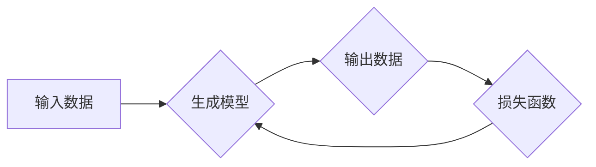

> 生成式AI, GPT-3, DALL-E, 市场趋势, 应用场景, 挑战

## 1. 背景介绍

近年来，人工智能（AI）技术取得了飞速发展，其中生成式AI作为其重要分支，展现出强大的潜力和应用价值。生成式AI是指能够根据输入数据生成新内容的AI模型，例如文本、图像、音频、视频等。与传统的AI模型相比，生成式AI更注重创造性和表达能力，能够完成更复杂的任务，并产生更具创意和个性化的输出。

### 1.1 生成式AI的兴起

生成式AI的兴起与以下几个因素密切相关：

* **大规模数据量的积累:**  互联网时代，海量数据被不断生成和积累，为训练大型生成式AI模型提供了充足的素材。
* **计算能力的提升:**  近年来，GPU计算能力的飞速发展，使得训练大型AI模型成为可能。
* **深度学习算法的进步:**  深度学习算法，特别是Transformer模型的出现，为生成式AI的训练和应用带来了突破。

### 1.2 生成式AI的应用场景

生成式AI已在多个领域展现出巨大的应用潜力，例如：

* **文本生成:**  自动写作、机器翻译、聊天机器人、代码生成等。
* **图像生成:**  图像合成、图像修复、风格迁移、艺术创作等。
* **音频生成:**  语音合成、音乐创作、音效制作等。
* **视频生成:**  视频剪辑、视频特效、虚拟人物动画等。

## 2. 核心概念与联系

生成式AI的核心概念包括：

* **生成模型:**  能够根据输入数据生成新数据的模型，例如GAN、VAE、Transformer等。
* **训练数据:**  用于训练生成模型的数据集，需要足够大且高质量。
* **损失函数:**  用于衡量生成模型输出与真实数据的差异，引导模型学习生成更逼真的数据。
* **优化算法:**  用于更新生成模型参数，降低损失函数值，提高模型性能。

**Mermaid 流程图:**



## 3. 核心算法原理 & 具体操作步骤

### 3.1 算法原理概述

生成式对抗网络（GAN）是生成式AI领域最具代表性的算法之一。GAN由两个网络组成：生成器（Generator）和判别器（Discriminator）。

* **生成器:**  负责根据随机噪声生成新的数据样本。
* **判别器:**  负责判断数据样本是真实数据还是由生成器生成的伪造数据。

GAN通过对抗训练的方式，生成器不断尝试生成更逼真的数据样本，而判别器则不断提高识别真实数据的能力。最终，生成器能够生成与真实数据几乎 indistinguishable 的数据样本。

### 3.2 算法步骤详解

1. **初始化:**  生成器和判别器网络参数随机初始化。
2. **生成器训练:**  生成器根据随机噪声生成数据样本，并将样本输入判别器。
3. **判别器训练:**  判别器根据真实数据和生成器生成的样本，判断样本的真实性，并更新判别器参数。
4. **重复步骤2和3:**  不断重复生成器和判别器的训练过程，直到生成器能够生成逼真的数据样本。

### 3.3 算法优缺点

**优点:**

* 生成高质量的样本数据。
* 能够学习复杂的数据分布。

**缺点:**

* 训练过程不稳定，容易陷入局部最优。
* 难以评估生成器性能。

### 3.4 算法应用领域

GAN已在图像生成、文本生成、语音合成、视频生成等领域取得成功应用。

## 4. 数学模型和公式 & 详细讲解 & 举例说明

### 4.1 数学模型构建

GAN的训练目标是最大化判别器的准确率，同时最小化生成器的损失。

* **判别器损失函数:**  

$$
L_D(D, X, G(Z)) = E_{x \sim p_{data}(x)}[log D(x)] + E_{z \sim p_z(z)}[log(1 - D(G(z)))]
$$

* **生成器损失函数:**

$$
L_G(G, D, Z) = E_{z \sim p_z(z)}[log(D(G(z)))]
$$

其中：

* $D(x)$ 表示判别器对数据样本 $x$ 的预测概率。
* $G(z)$ 表示生成器根据噪声 $z$ 生成的样本。
* $p_{data}(x)$ 表示真实数据分布。
* $p_z(z)$ 表示噪声分布。

### 4.2 公式推导过程

判别器损失函数旨在最大化判别器对真实数据和生成数据样本的正确分类概率。生成器损失函数旨在最小化判别器对生成数据样本的识别概率。

### 4.3 案例分析与讲解

例如，在图像生成任务中，GAN可以用来生成逼真的图像。生成器会根据随机噪声生成图像，判别器则会判断生成的图像是否真实。通过对抗训练，生成器会不断改进，生成越来越逼真的图像。

## 5. 项目实践：代码实例和详细解释说明

### 5.1 开发环境搭建

* Python 3.x
* TensorFlow 或 PyTorch
* CUDA 和 cuDNN

### 5.2 源代码详细实现

```python
# 生成器网络结构
class Generator(nn.Module):
    def __init__(self):
        super(Generator, self).__init__()
        # ...

    def forward(self, z):
        # ...

# 判别器网络结构
class Discriminator(nn.Module):
    def __init__(self):
        super(Discriminator, self).__init__()
        # ...

    def forward(self, x):
        # ...

# 训练循环
for epoch in range(num_epochs):
    for batch_idx, (real_images, _) in enumerate(dataloader):
        # ...
```

### 5.3 代码解读与分析

* 生成器网络结构负责根据随机噪声生成图像。
* 判别器网络结构负责判断图像是否真实。
* 训练循环中，生成器和判别器交替训练，直到生成器能够生成逼真的图像。

### 5.4 运行结果展示

训练完成后，可以利用生成器生成新的图像，并与真实图像进行比较。

## 6. 实际应用场景

### 6.1 文本生成

* **自动写作:**  生成新闻报道、产品描述、小说等文本内容。
* **机器翻译:**  将文本从一种语言翻译成另一种语言。
* **聊天机器人:**  与用户进行自然语言对话。

### 6.2 图像生成

* **图像合成:**  生成新的图像，例如合成人物肖像、场景图像等。
* **图像修复:**  修复损坏的图像，例如去除图像中的噪点、修复缺失的部分等。
* **风格迁移:**  将图像的风格迁移到其他图像上。

### 6.3 音频生成

* **语音合成:**  将文本转换为语音。
* **音乐创作:**  生成新的音乐作品。
* **音效制作:**  生成各种音效，例如枪声、爆炸声等。

### 6.4 未来应用展望

生成式AI未来将应用于更广泛的领域，例如：

* **教育:**  生成个性化学习内容、自动批改作业等。
* **医疗:**  生成医学图像、辅助诊断等。
* **娱乐:**  生成游戏场景、电影特效等。

## 7. 工具和资源推荐

### 7.1 学习资源推荐

* **书籍:**  《Deep Learning》
* **课程:**  Coursera上的《Deep Learning Specialization》
* **博客:**  OpenAI Blog、Google AI Blog

### 7.2 开发工具推荐

* **TensorFlow:**  开源深度学习框架
* **PyTorch:**  开源深度学习框架
* **Hugging Face:**  提供预训练模型和工具

### 7.3 相关论文推荐

* **Generative Adversarial Networks**
* **Attention Is All You Need**
* **BERT: Pre-training of Deep Bidirectional Transformers for Language Understanding**

## 8. 总结：未来发展趋势与挑战

### 8.1 研究成果总结

近年来，生成式AI取得了显著进展，能够生成高质量的文本、图像、音频等数据。

### 8.2 未来发展趋势

* **模型规模的进一步扩大:**  更大的模型能够学习更复杂的模式，生成更逼真的数据。
* **多模态生成:**  生成不同模态的数据，例如文本、图像、音频的联合生成。
* **可解释性增强:**  提高生成模型的可解释性，理解模型的决策过程。

### 8.3 面临的挑战

* **训练成本高:**  训练大型生成式AI模型需要大量的计算资源和时间。
* **数据安全和隐私问题:**  生成式AI模型可能被用于生成虚假信息，威胁数据安全和隐私。
* **伦理问题:**  生成式AI的应用可能引发伦理问题，例如版权问题、歧视问题等。

### 8.4 研究展望

未来，生成式AI的研究将继续深入，解决上述挑战，并推动其在更多领域得到应用。

## 9. 附录：常见问题与解答

* **什么是生成式AI？**

生成式AI是指能够根据输入数据生成新内容的AI模型。

* **生成式AI有哪些应用场景？**

生成式AI应用场景广泛，例如文本生成、图像生成、音频生成等。

* **如何训练生成式AI模型？**

训练生成式AI模型需要使用对抗训练的方式，生成器和判别器交替训练。

* **生成式AI有哪些挑战？**

生成式AI面临的挑战包括训练成本高、数据安全和隐私问题、伦理问题等。


作者：禅与计算机程序设计艺术 / Zen and the Art of Computer Programming 
<end_of_turn>