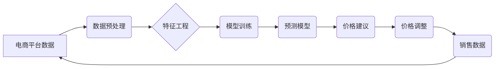

> 电商价格优化,机器学习,深度学习,预测模型,动态定价,算法,数据分析

## 1. 背景介绍

在当今激烈的电商市场竞争中，价格策略扮演着至关重要的角色。如何制定合理的定价策略，既能最大化利润，又能保持竞争力，是电商企业面临的重大挑战。传统的定价方法往往依赖于经验和主观判断，难以适应市场瞬息万变的动态环境。随着人工智能技术的快速发展，智能价格优化技术应运而生，为电商企业提供了更加精准、高效的定价解决方案。

智能价格优化技术利用机器学习、深度学习等算法，对海量电商数据进行分析和挖掘，建立预测模型，预测商品需求、竞争对手价格等关键因素，从而实现动态调整商品价格，优化定价策略。

## 2. 核心概念与联系

**2.1 核心概念**

* **价格优化:** 指通过算法和数据分析，制定最优的商品价格策略，以最大化利润或达成其他目标。
* **机器学习:** 一种人工智能技术，通过训练模型，使计算机能够从数据中学习，并做出预测或决策。
* **深度学习:** 一种机器学习的子集，利用多层神经网络，能够学习更复杂的模式和关系。
* **预测模型:** 基于历史数据和算法，预测未来事件或趋势的数学模型。
* **动态定价:** 根据实时市场变化，动态调整商品价格的策略。

**2.2 架构图**



## 3. 核心算法原理 & 具体操作步骤

**3.1 算法原理概述**

电商价格优化的智能技术主要基于以下核心算法：

* **回归算法:** 用于预测商品价格，例如线性回归、逻辑回归、支持向量机等。
* **分类算法:** 用于分类商品，例如决策树、随机森林、神经网络等。
* **聚类算法:** 用于将商品进行分组，例如K-means聚类、层次聚类等。

**3.2 算法步骤详解**

1. **数据收集:** 收集电商平台的商品数据、销售数据、市场数据等。
2. **数据预处理:** 对收集到的数据进行清洗、转换、编码等处理，使其符合算法的输入要求。
3. **特征工程:** 从原始数据中提取特征，例如商品属性、价格历史、用户行为等，构建更能反映商品价值和市场趋势的特征向量。
4. **模型训练:** 选择合适的算法，利用训练数据训练模型，并进行模型评估和调参。
5. **预测模型部署:** 将训练好的模型部署到线上环境，用于实时预测商品价格。
6. **价格建议生成:** 根据预测模型的输出结果，生成商品价格建议。
7. **价格调整:** 根据价格建议，动态调整商品价格。

**3.3 算法优缺点**

* **优点:**
    * 能够根据市场变化动态调整价格，提高利润率。
    * 能够个性化推荐价格，提升用户体验。
    * 能够自动化价格调整，降低人工成本。
* **缺点:**
    * 需要大量的数据支持，数据质量对算法效果至关重要。
    * 模型训练和调参需要专业技术人员。
    * 价格调整过于频繁可能影响用户体验。

**3.4 算法应用领域**

* **电商平台:** 商品定价、促销活动、会员价格等。
* **旅游行业:** 机票、酒店、旅游套餐等价格优化。
* **金融行业:** 贷款利率、保险费率等动态调整。
* **能源行业:** 电力价格、燃气价格等预测和优化。

## 4. 数学模型和公式 & 详细讲解 & 举例说明

**4.1 数学模型构建**

电商价格优化的智能技术通常采用回归模型进行预测，例如线性回归模型。

**4.2 公式推导过程**

线性回归模型的目标是找到一条直线，使得预测值与实际值之间的误差最小。

假设我们有n个样本数据，每个样本包含商品特征向量x和实际价格y。线性回归模型的公式如下：

$$y = \beta_0 + \beta_1x_1 + \beta_2x_2 + ... + \beta_nx_n + \epsilon$$

其中：

* $y$ 是预测价格
* $x_1, x_2, ..., x_n$ 是商品特征向量
* $\beta_0, \beta_1, \beta_2, ..., \beta_n$ 是模型参数
* $\epsilon$ 是误差项

**4.3 案例分析与讲解**

假设我们想要预测商品价格，并收集了以下数据：

| 商品特征 | 价格 |
|---|---|
| 商品类别:A | 10 |
| 商品类别:B | 15 |
| 商品类别:C | 20 |

我们可以使用线性回归模型训练一个预测模型，并根据模型预测其他商品的价格。

## 5. 项目实践：代码实例和详细解释说明

**5.1 开发环境搭建**

* Python 3.x
* Jupyter Notebook
* scikit-learn

**5.2 源代码详细实现**

```python
import pandas as pd
from sklearn.linear_model import LinearRegression
from sklearn.model_selection import train_test_split

# 加载数据
data = pd.read_csv('电商数据.csv')

# 提取特征和目标变量
X = data[['商品类别', '品牌', '销量']]
y = data['价格']

# 数据分割
X_train, X_test, y_train, y_test = train_test_split(X, y, test_size=0.2, random_state=42)

# 创建线性回归模型
model = LinearRegression()

# 模型训练
model.fit(X_train, y_train)

# 模型评估
y_pred = model.predict(X_test)
print('模型评估结果:')
print(model.score(X_test, y_test))

# 预测新商品价格
new_data = pd.DataFrame({'商品类别': ['C'], '品牌': ['A'], '销量': [100]})
predicted_price = model.predict(new_data)
print('新商品价格预测结果:', predicted_price)
```

**5.3 代码解读与分析**

* 首先，我们加载数据并提取特征和目标变量。
* 然后，我们将数据分割成训练集和测试集。
* 接下来，我们创建线性回归模型并进行训练。
* 训练完成后，我们使用测试集评估模型的性能。
* 最后，我们使用训练好的模型预测新商品的价格。

**5.4 运行结果展示**

运行代码后，会输出模型评估结果和新商品价格预测结果。

## 6. 实际应用场景

**6.1 电商平台价格优化**

电商平台可以利用智能价格优化技术，根据商品属性、市场需求、竞争对手价格等因素，动态调整商品价格，提高利润率。例如，当商品需求旺盛时，可以适当提高价格；当商品库存充足时，可以进行促销活动，降低价格。

**6.2 旅游行业价格动态调整**

旅游行业可以利用智能价格优化技术，根据航班、酒店、旅游套餐的供需情况，动态调整价格。例如，在旅游旺季，可以提高价格；在淡季，可以进行促销活动，降低价格。

**6.3 金融行业动态定价**

金融行业可以利用智能价格优化技术，根据贷款申请人的信用评分、市场利率等因素，动态调整贷款利率。例如，信用评分高的申请人，可以获得更低的利率；市场利率上升时，可以适当提高贷款利率。

**6.4 未来应用展望**

随着人工智能技术的不断发展，智能价格优化技术将应用于更多领域，例如医疗、教育、制造业等。

## 7. 工具和资源推荐

**7.1 学习资源推荐**

* **书籍:**
    * 《机器学习》 - 周志华
    * 《深度学习》 - Ian Goodfellow
* **在线课程:**
    * Coursera: Machine Learning
    * edX: Deep Learning

**7.2 开发工具推荐**

* **Python:** 
    * scikit-learn
    * TensorFlow
    * PyTorch

**7.3 相关论文推荐**

* **Dynamic Pricing with Machine Learning: A Survey**
* **Deep Learning for Dynamic Pricing**

## 8. 总结：未来发展趋势与挑战

**8.1 研究成果总结**

智能价格优化技术已经取得了显著的成果，在电商、旅游、金融等领域得到了广泛应用。

**8.2 未来发展趋势**

* **模型更加精准:** 利用更先进的机器学习算法和深度学习模型，提高价格预测的准确性。
* **个性化定价:** 根据用户的购买历史、偏好等信息，进行个性化的价格推荐。
* **多场景融合:** 将不同场景的数据融合，构建更全面的价格优化模型。

**8.3 面临的挑战**

* **数据质量:** 价格优化模型依赖于高质量的数据，数据不完整、不准确会影响模型效果。
* **算法解释性:** 许多机器学习算法的决策过程难以解释，这可能会导致用户对价格调整的信任度降低。
* **伦理问题:** 价格优化技术可能会被滥用，例如针对特定用户进行价格歧视。

**8.4 研究展望**

未来，智能价格优化技术将继续朝着更加精准、个性化、可解释的方向发展，并解决伦理问题，为电商企业和消费者带来更多价值。

## 9. 附录：常见问题与解答

**9.1 如何选择合适的算法？**

选择合适的算法取决于具体应用场景和数据特点。例如，对于预测连续数值的商品价格，可以使用线性回归模型；对于分类商品，可以使用决策树模型。

**9.2 如何处理缺失数据？**

缺失数据可以通过多种方法处理，例如删除缺失数据、用平均值填充缺失数据、使用机器学习算法进行预测填充等。

**9.3 如何评估模型性能？**

模型性能可以通过多种指标评估，例如准确率、召回率、F1-score、R-squared等。

**9.4 如何防止价格歧视？**

在设计价格优化模型时，需要避免使用敏感特征，例如用户年龄、性别、种族等，以防止价格歧视。


作者：禅与计算机程序设计艺术 / Zen and the Art of Computer Programming 
<end_of_turn>