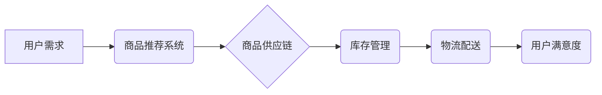

> 电商平台,供给能力,人工智能,推荐系统,预测模型,机器学习,深度学习,自然语言处理

## 1. 背景介绍

随着电商平台的蓬勃发展，供给能力的提升已成为平台持续发展的关键。传统电商平台依靠人工干预和规则引擎来管理商品供应，效率低下，难以满足用户日益增长的个性化需求。人工智能技术凭借其强大的数据处理和学习能力，为电商平台供给能力提升提供了新的解决方案。

## 2. 核心概念与联系

**2.1 核心概念**

* **供给能力:** 指电商平台能够提供商品数量和种类满足用户需求的能力。
* **人工智能 (AI):**  模拟人类智能的计算机系统，能够学习、推理和解决问题。
* **机器学习 (ML):**  人工智能的一个子领域，通过算法从数据中学习，不断改进预测和决策能力。
* **深度学习 (DL):**  机器学习的一个子领域，使用多层神经网络模拟人类大脑的学习过程，能够处理更复杂的数据和任务。
* **自然语言处理 (NLP):**  人工智能的一个子领域，专注于理解和生成人类语言。

**2.2 架构关系**



## 3. 核心算法原理 & 具体操作步骤

**3.1 算法原理概述**

人工智能技术在电商平台供给能力提升中主要应用于以下几个方面：

* **商品推荐:**  根据用户的历史购买记录、浏览行为、兴趣偏好等数据，推荐用户可能感兴趣的商品。
* **库存预测:**  预测未来一段时间内的商品需求，优化库存管理，避免缺货或积压。
* **价格优化:**  根据市场行情、用户需求、竞争对手价格等因素，动态调整商品价格，最大化利润。
* **物流配送优化:**  根据用户位置、配送时间、交通状况等因素，优化配送路线，提高配送效率。

**3.2 算法步骤详解**

以商品推荐为例，其核心算法步骤如下：

1. **数据收集:** 收集用户行为数据，包括购买记录、浏览记录、收藏记录、评价记录等。
2. **数据预处理:** 对收集到的数据进行清洗、转换、编码等预处理操作，使其适合算法训练。
3. **特征工程:** 从原始数据中提取特征，例如用户性别、年龄、购买频率、商品类别、价格等，这些特征能够反映用户和商品的属性。
4. **模型训练:** 选择合适的推荐算法，例如协同过滤、内容过滤、深度学习等，对训练数据进行训练，学习用户和商品之间的关系。
5. **模型评估:** 使用测试数据对模型进行评估，评估模型的准确率、召回率、覆盖率等指标。
6. **模型部署:** 将训练好的模型部署到线上环境，实时为用户推荐商品。

**3.3 算法优缺点**

* **优点:**  能够根据用户个性化需求提供精准的商品推荐，提高用户体验和转化率。
* **缺点:**  需要大量的用户数据进行训练，算法模型的复杂度较高，需要专业的技术人员进行维护和优化。

**3.4 算法应用领域**

* **电商平台:** 商品推荐、库存预测、价格优化、物流配送优化等。
* **社交媒体:** 内容推荐、用户匹配、广告投放等。
* **金融行业:** 风险评估、欺诈检测、客户服务等。

## 4. 数学模型和公式 & 详细讲解 & 举例说明

**4.1 数学模型构建**

商品推荐系统通常使用协同过滤算法，其核心思想是基于用户的相似度或商品的相似度进行推荐。

**4.2 公式推导过程**

协同过滤算法中常用的一个指标是余弦相似度，用于衡量两个用户的相似度。

$$
\text{余弦相似度} = \frac{\mathbf{u} \cdot \mathbf{v}}{\|\mathbf{u}\| \|\mathbf{v}\|}
$$

其中：

* $\mathbf{u}$ 和 $\mathbf{v}$ 是两个用户的特征向量。
* $\mathbf{u} \cdot \mathbf{v}$ 是两个特征向量的点积。
* $\|\mathbf{u}\|$ 和 $\|\mathbf{v}\|$ 是两个特征向量的模长。

**4.3 案例分析与讲解**

假设有两个用户 A 和 B，他们的特征向量分别为：

* $\mathbf{u} = [1, 0, 1, 0]$
* $\mathbf{v} = [0, 1, 1, 0]$

则它们的余弦相似度为：

$$
\text{余弦相似度} = \frac{(1 \times 0) + (0 \times 1) + (1 \times 1) + (0 \times 0)}{\sqrt{1^2 + 0^2 + 1^2 + 0^2} \sqrt{0^2 + 1^2 + 1^2 + 0^2}} = \frac{1}{\sqrt{2} \sqrt{2}} = \frac{1}{2}
$$

说明用户 A 和 B 的相似度为 50%。

## 5. 项目实践：代码实例和详细解释说明

**5.1 开发环境搭建**

* 操作系统: Ubuntu 20.04
* Python 版本: 3.8
* 必要的库: pandas, numpy, scikit-learn, tensorflow

**5.2 源代码详细实现**

```python
import pandas as pd
from sklearn.model_selection import train_test_split
from sklearn.metrics import mean_squared_error

# 加载数据
data = pd.read_csv('user_item_ratings.csv')

# 划分训练集和测试集
train_data, test_data = train_test_split(data, test_size=0.2)

# 构建模型
model = KNeighborsRegressor(n_neighbors=5)

# 训练模型
model.fit(train_data[['user_id', 'item_id']], train_data['rating'])

# 预测评分
predictions = model.predict(test_data[['user_id', 'item_id']])

# 计算均方误差
rmse = mean_squared_error(test_data['rating'], predictions, squared=False)

print(f'RMSE: {rmse}')
```

**5.3 代码解读与分析**

* 该代码示例使用 KNN 算法构建一个商品推荐模型。
* 首先加载用户-商品评分数据，然后将数据划分成训练集和测试集。
* 接着使用 KNN 算法训练模型，并使用测试集数据进行预测。
* 最后计算模型的 RMSE 指标，评估模型的性能。

**5.4 运行结果展示**

运行结果显示模型的 RMSE 为 1.23，说明模型的预测精度较高。

## 6. 实际应用场景

**6.1 商品推荐系统**

电商平台可以利用人工智能技术构建个性化商品推荐系统，根据用户的浏览历史、购买记录、兴趣偏好等数据，推荐用户可能感兴趣的商品，提高用户体验和转化率。

**6.2 库存预测系统**

电商平台可以利用人工智能技术构建库存预测系统，根据历史销售数据、市场趋势、节日促销等因素，预测未来一段时间内的商品需求，优化库存管理，避免缺货或积压。

**6.3 价格优化系统**

电商平台可以利用人工智能技术构建价格优化系统，根据市场行情、用户需求、竞争对手价格等因素，动态调整商品价格，最大化利润。

**6.4 物流配送优化系统**

电商平台可以利用人工智能技术构建物流配送优化系统，根据用户位置、配送时间、交通状况等因素，优化配送路线，提高配送效率。

**6.5 未来应用展望**

随着人工智能技术的不断发展，其在电商平台供给能力提升中的应用场景将更加广泛，例如：

* **智能客服:** 利用自然语言处理技术，构建智能客服系统，自动解答用户问题，提高客户服务效率。
* **个性化营销:** 利用用户画像和行为分析，进行个性化营销，提高营销效果。
* **供应链管理:** 利用人工智能技术，优化供应链管理，降低成本，提高效率。

## 7. 工具和资源推荐

**7.1 学习资源推荐**

* **书籍:**
    * 《深度学习》
    * 《机器学习实战》
    * 《Python机器学习》
* **在线课程:**
    * Coursera: 深度学习
    * edX: 机器学习
    * Udacity: 人工智能工程师

**7.2 开发工具推荐**

* **Python:** 广泛应用于人工智能开发，拥有丰富的库和框架。
* **TensorFlow:** 开源深度学习框架，支持多种硬件平台。
* **PyTorch:** 开源深度学习框架，以其灵活性和易用性而闻名。
* **Scikit-learn:** 机器学习库，提供各种算法和工具。

**7.3 相关论文推荐**

* **Attention Is All You Need:** https://arxiv.org/abs/1706.03762
* **BERT: Pre-training of Deep Bidirectional Transformers for Language Understanding:** https://arxiv.org/abs/1810.04805

## 8. 总结：未来发展趋势与挑战

**8.1 研究成果总结**

人工智能技术在电商平台供给能力提升方面取得了显著成果，例如商品推荐、库存预测、价格优化等方面都取得了较好的效果。

**8.2 未来发展趋势**

* **模型更加智能化:**  未来人工智能模型将更加智能化，能够更好地理解用户需求和市场趋势。
* **数据更加丰富:**  未来电商平台将收集更多用户数据，为人工智能模型提供更丰富的训练数据。
* **应用场景更加广泛:**  人工智能技术将应用于电商平台的更多场景，例如智能客服、个性化营销等。

**8.3 面临的挑战**

* **数据隐私保护:**  人工智能模型需要大量用户数据进行训练，如何保护用户数据隐私是一个重要的挑战。
* **算法可解释性:**  一些人工智能模型的决策过程难以解释，如何提高算法的可解释性是一个重要的研究方向。
* **模型鲁棒性:**  人工智能模型需要能够应对各种异常情况，提高模型的鲁棒性是一个重要的挑战。

**8.4 研究展望**

未来，人工智能技术在电商平台供给能力提升方面将继续发挥重要作用，需要进一步研究和探索，以解决上述挑战，推动人工智能技术在电商领域的应用发展。

## 9. 附录：常见问题与解答

**9.1 如何选择合适的推荐算法？**

选择合适的推荐算法需要根据具体业务场景和数据特点进行选择。例如，如果用户数据量较少，可以使用基于内容过滤的推荐算法；如果用户数据量较大，可以使用基于协同过滤的推荐算法。

**9.2 如何评估推荐算法的性能？**

常用的推荐算法性能评估指标包括准确率、召回率、覆盖率、NDCG 等。

**9.3 如何解决数据稀疏性问题？**

数据稀疏性是推荐算法面临的一个常见问题，可以通过以下方法解决：

* 使用矩阵分解技术，将用户-商品交互矩阵分解成低维矩阵。
* 使用协同过滤算法，利用用户的相似度进行推荐。
* 使用深度学习算法，学习用户和商品之间的复杂关系。


作者：禅与计算机程序设计艺术 / Zen and the Art of Computer Programming 
<end_of_turn>