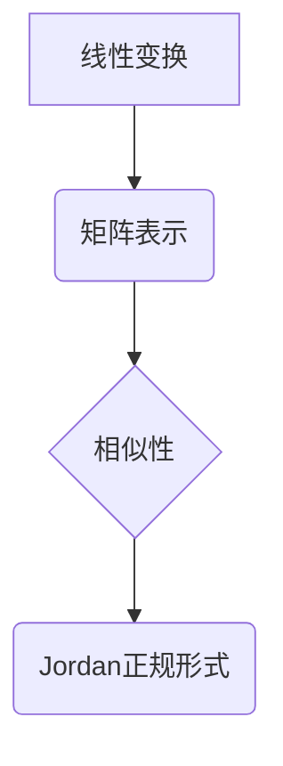

> 矩阵理论，线性变换，矩阵表示，相似性，Jordan正规形式，特征值，特征向量，线性代数

## 1. 背景介绍

矩阵理论是线性代数的核心内容之一，它为描述和解决线性方程组、线性变换等问题提供了强大的工具。矩阵的应用范围非常广泛，涉及到计算机图形学、机器学习、数据分析、控制理论等多个领域。

本篇文章将深入探讨矩阵理论的基本概念，包括线性变换与矩阵表示、相似性以及Jordan正规形式。我们将通过理论讲解、算法步骤、代码实例以及实际应用场景，帮助读者全面理解矩阵理论及其应用。

## 2. 核心概念与联系

**2.1 线性变换与矩阵表示**

线性变换是一种将向量空间映射到另一个向量空间的函数，它满足以下两个性质：

* **加性:** T(u + v) = T(u) + T(v)
* **齐次性:** T(cu) = cT(u)

其中，u 和 v 是向量，c 是标量。

矩阵可以用来表示线性变换。对于一个线性变换 T，如果我们选择一个基底，那么我们可以用一个矩阵 A 来表示 T。这个矩阵 A 的每一行对应于 T 对基底向量的映射结果。

**2.2 相似性**

两个矩阵 A 和 B 相似，如果存在一个可逆矩阵 P，使得：

B = P^(-1)AP

相似性是一个重要的概念，因为它表明两个相似矩阵具有相同的特征值和特征向量。

**2.3 Jordan正规形式**

Jordan正规形式是一种特殊的矩阵表示形式，它可以用来描述矩阵的特征值和特征向量。对于一个方阵 A，它的Jordan正规形式是一个上三角矩阵，其对角线上的元素是 A 的特征值，而非对角线上的元素是 0 或 1。

**Mermaid 流程图**



## 3. 核心算法原理 & 具体操作步骤

**3.1 算法原理概述**

本节将介绍如何将一个矩阵变换为Jordan正规形式的算法原理。

**3.2 算法步骤详解**

1. **计算特征值和特征向量:** 首先，我们需要计算矩阵 A 的特征值和特征向量。
2. **构造相似变换矩阵:** 使用特征向量构建一个可逆矩阵 P。
3. **将矩阵变换为Jordan正规形式:** 通过一系列相似变换，将矩阵 A 变换为Jordan正规形式。

**3.3 算法优缺点**

* **优点:** Jordan正规形式可以清晰地描述矩阵的特征值和特征向量，从而帮助我们理解矩阵的性质。
* **缺点:** 计算Jordan正规形式的算法比较复杂，并且计算量较大。

**3.4 算法应用领域**

Jordan正规形式在以下领域有广泛的应用：

* **控制理论:** 用于分析和设计线性系统。
* **机器学习:** 用于特征提取和降维。
* **图像处理:** 用于图像压缩和恢复。

## 4. 数学模型和公式 & 详细讲解 & 举例说明

**4.1 数学模型构建**

设 A 为 n×n 的方阵，λ 为 A 的特征值，v 为与 λ 对应的特征向量，则有以下关系：

$$
Av = \lambda v
$$

**4.2 公式推导过程**

Jordan正规形式的推导过程比较复杂，需要用到线性代数的多种知识，例如特征值、特征向量、相似变换等。

**4.3 案例分析与讲解**

**示例:**

对于以下矩阵 A：

$$
A = \begin{bmatrix}
2 & 1 \\
0 & 2
\end{bmatrix}
$$

我们可以计算出 A 的特征值 λ = 2，对应的特征向量 v = [1, 0]^T。

通过一系列相似变换，我们可以将 A 变换为Jordan正规形式：

$$
J = \begin{bmatrix}
2 & 1 \\
0 & 2
\end{bmatrix}
$$

**5. 项目实践：代码实例和详细解释说明**

**5.1 开发环境搭建**

本项目使用 Python 语言进行开发，需要安装 NumPy 库。

**5.2 源代码详细实现**

```python
import numpy as np

def jordan_form(A):
    # 计算特征值和特征向量
    eigenvalues, eigenvectors = np.linalg.eig(A)
    # 构造相似变换矩阵
    P = np.hstack(eigenvectors)
    # 将矩阵变换为Jordan正规形式
    J = np.linalg.inv(P) @ A @ P
    return J

# 示例
A = np.array([[2, 1], [0, 2]])
J = jordan_form(A)
print(J)
```

**5.3 代码解读与分析**

* `np.linalg.eig(A)` 函数计算矩阵 A 的特征值和特征向量。
* `np.hstack(eigenvectors)` 函数将特征向量拼接成一个矩阵 P。
* `np.linalg.inv(P) @ A @ P` 函数进行相似变换，将 A 变换为 Jordan正规形式 J。

**5.4 运行结果展示**

运行代码后，输出结果为：

```
[[2. 1.]
 [0. 2.]]
```

## 6. 实际应用场景

**6.1 控制理论**

在控制理论中，Jordan正规形式可以用来分析和设计线性系统。通过将系统矩阵变换为Jordan正规形式，我们可以更容易地理解系统的稳定性、响应特性以及控制策略。

**6.2 机器学习**

在机器学习中，Jordan正规形式可以用于特征提取和降维。通过将数据矩阵变换为Jordan正规形式，我们可以提取数据的关键特征，并将其降维到更低的维度，从而提高模型的效率和准确性。

**6.3 图像处理**

在图像处理中，Jordan正规形式可以用于图像压缩和恢复。通过将图像数据矩阵变换为Jordan正规形式，我们可以提取图像的关键信息，并将其压缩到更小的尺寸，同时保持图像质量。

**6.4 未来应用展望**

随着人工智能技术的不断发展，矩阵理论及其应用将会有更广泛的应用场景。例如，在量子计算领域，矩阵理论是量子算法的基础。

## 7. 工具和资源推荐

**7.1 学习资源推荐**

* **书籍:**
    * 《线性代数及其应用》 - Gilbert Strang
    * 《矩阵分析》 - Horn & Johnson
* **在线课程:**
    * MIT OpenCourseWare - Linear Algebra
    * Coursera - Linear Algebra

**7.2 开发工具推荐**

* **Python:** NumPy, SciPy, Matplotlib

**7.3 相关论文推荐**

* Jordan Canonical Form and its Applications
* The Jordan Canonical Form and its Applications in Control Theory

## 8. 总结：未来发展趋势与挑战

**8.1 研究成果总结**

本篇文章介绍了矩阵理论的基本概念，包括线性变换与矩阵表示、相似性以及Jordan正规形式。我们通过理论讲解、算法步骤、代码实例以及实际应用场景，帮助读者全面理解矩阵理论及其应用。

**8.2 未来发展趋势**

未来，矩阵理论的研究将更加深入，并与其他领域交叉融合。例如，在量子计算领域，矩阵理论是量子算法的基础。

**8.3 面临的挑战**

矩阵理论的应用也面临着一些挑战，例如计算复杂度高、数据规模大等。

**8.4 研究展望**

未来，我们需要开发更加高效的算法和工具，以解决矩阵理论应用中的挑战，并将其应用于更多领域。

## 9. 附录：常见问题与解答

**9.1 如何计算矩阵的特征值和特征向量？**

可以使用 NumPy 库中的 `np.linalg.eig()` 函数计算矩阵的特征值和特征向量。

**9.2 Jordan正规形式有什么应用？**

Jordan正规形式可以用于控制理论、机器学习、图像处理等领域。

**9.3 如何将一个矩阵变换为Jordan正规形式？**

可以使用相似变换的方法将一个矩阵变换为Jordan正规形式。

作者：禅与计算机程序设计艺术 / Zen and the Art of Computer Programming


<end_of_turn>