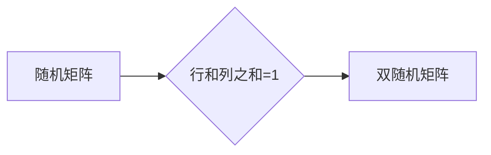

> 矩阵理论，随机矩阵，双随机矩阵，谱分析，特征值，特征向量，应用场景，机器学习，数据分析

## 1. 背景介绍

矩阵理论是数学领域的重要分支，在计算机科学、物理学、工程学等众多领域有着广泛的应用。其中，随机矩阵和双随机矩阵作为矩阵理论的特殊类型，在近年来得到了越来越多的关注。

随机矩阵是指其元素服从某种概率分布的矩阵，而双随机矩阵是指其行和列之和都等于1的随机矩阵。这些特殊的矩阵结构赋予它们独特的性质和应用潜力。

随机矩阵在统计物理、量子力学、金融数学等领域有着广泛的应用。例如，在统计物理中，随机矩阵被用来模拟原子核的能量谱；在量子力学中，随机矩阵被用来描述量子系统的统计性质；在金融数学中，随机矩阵被用来建模金融资产的价格波动。

双随机矩阵则主要应用于概率论、统计学和信息论等领域。例如，在概率论中，双随机矩阵被用来描述随机过程的转移概率；在统计学中，双随机矩阵被用来进行数据分析和分类；在信息论中，双随机矩阵被用来研究信息编码和传输。

## 2. 核心概念与联系

**2.1 随机矩阵**

随机矩阵是指其元素服从某种概率分布的矩阵。常见的随机矩阵类型包括：

* **对称随机矩阵:** 矩阵元素服从对称分布，即 Aij = Aji。
* **正交随机矩阵:** 矩阵元素服从正交分布，即 Aij = Aji，且矩阵的列向量相互正交。
* **酉随机矩阵:** 矩阵元素服从酉分布，即 Aij = Aji，且矩阵的列向量相互酉正交。

**2.2 双随机矩阵**

双随机矩阵是指其行和列之和都等于1的随机矩阵。

**2.3 联系**

随机矩阵和双随机矩阵之间存在着密切的联系。

* 双随机矩阵可以看作是特定类型的随机矩阵，其元素服从特定的概率分布，使得行和列之和都等于1。
* 许多随机矩阵的性质和应用都可以通过研究其对应的双随机矩阵来理解。

**2.4 Mermaid 流程图**



## 3. 核心算法原理 & 具体操作步骤

**3.1 算法原理概述**

随机矩阵和双随机矩阵的算法原理主要围绕着以下几个方面：

* **特征值和特征向量:** 随机矩阵和双随机矩阵的特征值和特征向量是研究其性质和应用的关键。
* **谱分析:** 谱分析是研究随机矩阵和双随机矩阵的重要工具，它可以用来分析矩阵的分布、稳定性等性质。
* **概率分布:** 随机矩阵的元素服从特定的概率分布，这决定了矩阵的性质和应用。

**3.2 算法步骤详解**

具体操作步骤取决于具体的应用场景和算法类型。以下是一些常见的算法步骤：

* **生成随机矩阵:** 根据特定的概率分布生成随机矩阵。
* **计算特征值和特征向量:** 使用数值算法计算随机矩阵的特征值和特征向量。
* **进行谱分析:** 分析随机矩阵的特征值分布、特征向量分布等。
* **应用于特定领域:** 将随机矩阵和双随机矩阵应用于特定的领域，例如机器学习、数据分析等。

**3.3 算法优缺点**

**优点:**

* 能够模拟现实世界中的随机现象。
* 具有广泛的应用潜力。
* 可以用于解决一些传统方法难以解决的问题。

**缺点:**

* 计算复杂度较高。
* 需要大量的计算资源。
* 算法结果可能存在随机性。

**3.4 算法应用领域**

* **机器学习:** 随机矩阵和双随机矩阵被用于构建机器学习模型，例如支持向量机、主成分分析等。
* **数据分析:** 随机矩阵和双随机矩阵被用于进行数据分析和分类，例如聚类分析、降维分析等。
* **金融数学:** 随机矩阵和双随机矩阵被用于建模金融资产的价格波动、风险管理等。
* **物理学:** 随机矩阵被用于模拟原子核的能量谱、量子系统的统计性质等。

## 4. 数学模型和公式 & 详细讲解 & 举例说明

**4.1 数学模型构建**

随机矩阵的数学模型通常由以下几个方面组成：

* **概率分布:** 随机矩阵的元素服从某种概率分布，例如正态分布、均匀分布等。
* **矩阵结构:** 随机矩阵可以是方阵、非方阵、对称矩阵、非对称矩阵等。
* **相关性:** 随机矩阵的元素之间可能存在相关性，例如协方差矩阵。

**4.2 公式推导过程**

例如，对于一个n×n的正态随机矩阵，其元素服从均值为0，方差为σ²的正态分布。其数学期望和协方差矩阵分别为：

$$
E[A_{ij}] = 0
$$

$$
Cov(A_{ij}, A_{kl}) = \begin{cases}
\sigma^2, & \text{if } i = k \text{ and } j = l \\
0, & \text{otherwise}
\end{cases}
$$

其中，Aij表示矩阵A的第i行第j列元素。

**4.3 案例分析与讲解**

例如，在机器学习中，随机矩阵可以用于构建支持向量机模型。支持向量机模型的目标是找到一个超平面，将训练数据中的不同类别的数据点分开。随机矩阵可以用来表示训练数据的特征向量，通过对随机矩阵进行特征值分解，可以得到一个低维的特征空间，在这个特征空间中，数据点更容易被分类。

## 5. 项目实践：代码实例和详细解释说明

**5.1 开发环境搭建**

* 操作系统: Linux/macOS/Windows
* 编程语言: Python
* 库: NumPy, SciPy, Matplotlib

**5.2 源代码详细实现**

```python
import numpy as np

# 生成一个n×n的正态随机矩阵
def generate_random_matrix(n, sigma):
    return np.random.normal(0, sigma, size=(n, n))

# 计算随机矩阵的特征值和特征向量
def calculate_eigenvalues_eigenvectors(matrix):
    eigenvalues, eigenvectors = np.linalg.eig(matrix)
    return eigenvalues, eigenvectors

# 绘制随机矩阵的特征值分布
def plot_eigenvalues(eigenvalues):
    plt.hist(eigenvalues, bins=20)
    plt.title('Eigenvalue Distribution')
    plt.xlabel('Eigenvalue')
    plt.ylabel('Frequency')
    plt.show()

# 示例代码
n = 100
sigma = 1
random_matrix = generate_random_matrix(n, sigma)
eigenvalues, eigenvectors = calculate_eigenvalues_eigenvectors(random_matrix)
plot_eigenvalues(eigenvalues)
```

**5.3 代码解读与分析**

* `generate_random_matrix()` 函数生成一个n×n的正态随机矩阵。
* `calculate_eigenvalues_eigenvectors()` 函数使用 NumPy 的 `linalg.eig()` 函数计算随机矩阵的特征值和特征向量。
* `plot_eigenvalues()` 函数使用 Matplotlib 绘制随机矩阵的特征值分布。

**5.4 运行结果展示**

运行代码后，会生成一个随机矩阵的特征值分布图。

## 6. 实际应用场景

**6.1 机器学习**

* **特征选择:** 使用随机矩阵的特征值分析来选择最相关的特征。
* **降维:** 使用随机矩阵的特征向量进行降维，将高维数据映射到低维空间。
* **模型训练:** 使用随机矩阵作为模型参数，例如在支持向量机模型中。

**6.2 数据分析**

* **聚类分析:** 使用随机矩阵的特征值和特征向量进行数据聚类。
* **降维分析:** 使用随机矩阵的特征向量进行数据降维，提取数据的关键信息。
* **异常检测:** 使用随机矩阵的特征值分布来检测异常数据点。

**6.3 其他领域**

* **金融数学:** 建模金融资产的价格波动、风险管理等。
* **物理学:** 模拟原子核的能量谱、量子系统的统计性质等。
* **信息论:** 研究信息编码和传输。

**6.4 未来应用展望**

随着人工智能和机器学习的发展，随机矩阵和双随机矩阵在未来将有更广泛的应用。例如，它们可以用于构建更复杂的机器学习模型，进行更深入的数据分析，解决更实际的问题。

## 7. 工具和资源推荐

**7.1 学习资源推荐**

* **书籍:**
    * "Matrix Analysis" by Roger A. Horn and Charles R. Johnson
    * "Random Matrices" by Mehta
* **在线课程:**
    * Coursera: "Matrix Analysis"
    * edX: "Linear Algebra"

**7.2 开发工具推荐**

* **Python:** NumPy, SciPy, Matplotlib
* **R:** Matrix, stats

**7.3 相关论文推荐**

* "Random Matrices: Theory and Applications" by Mehta
* "The Theory of Random Matrices" by Wigner

## 8. 总结：未来发展趋势与挑战

**8.1 研究成果总结**

近年来，随机矩阵和双随机矩阵的研究取得了显著进展，在理论和应用方面都取得了重要成果。

**8.2 未来发展趋势**

* **更复杂的随机矩阵模型:** 研究更复杂的随机矩阵模型，例如带结构的随机矩阵、非厄米特随机矩阵等。
* **更广泛的应用领域:** 将随机矩阵和双随机矩阵应用于更多领域，例如生物信息学、材料科学等。
* **更有效的算法:** 开发更有效的算法来计算随机矩阵的特征值和特征向量，提高计算效率。

**8.3 面临的挑战**

* **理论研究:** 随机矩阵理论是一个非常活跃的研究领域，仍然存在许多未解之谜。
* **算法复杂度:** 许多随机矩阵算法的计算复杂度较高，需要进一步优化。
* **应用场景:** 将随机矩阵和双随机矩阵应用于实际问题仍然面临一些挑战，需要进一步探索。

**8.4 研究展望**

未来，随机矩阵和双随机矩阵的研究将继续朝着更深入、更广泛的方向发展，为解决实际问题提供新的思路和方法。

## 9. 附录：常见问题与解答

**9.1 如何生成随机矩阵？**

可以使用 NumPy 库的 `random.rand()` 函数生成随机矩阵。

**9.2 如何计算随机矩阵的特征值和特征向量？**

可以使用 NumPy 库的 `linalg.eig()` 函数计算随机矩阵的特征值和特征向量。

**9.3 随机矩阵的应用场景有哪些？**

随机矩阵的应用场景非常广泛，例如机器学习、数据分析、金融数学、物理学等。

作者：禅与计算机程序设计艺术 / Zen and the Art of Computer Programming


<end_of_turn>