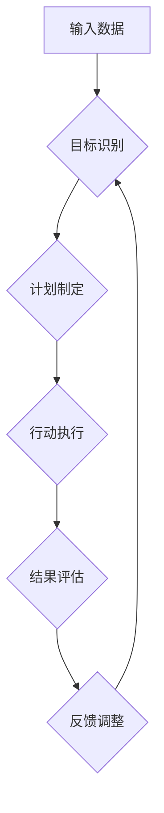

>  人工智能、短期目标、意识机制、目标管理、算法、实践

## 1. 背景介绍

在当今快速发展的科技时代，人工智能（AI）正以惊人的速度发展，其应用领域不断拓展，对人类社会的影响日益深远。然而，AI的发展也面临着诸多挑战，其中之一就是如何有效地管理AI的短期目标。

传统的目标管理方法主要适用于人类，而AI的学习和决策机制与人类截然不同。AI通常依赖于大量的训练数据和复杂的算法模型，其目标的设定和实现需要考虑算法的特性、数据质量以及环境变化等因素。

因此，我们需要探索一种新的目标管理机制，专门针对AI的特性进行设计，以帮助AI更好地完成短期目标，并最终实现更宏大的目标。

## 2. 核心概念与联系

### 2.1 短期目标

短期目标是指AI在特定时间范围内需要完成的具体任务或目标，例如识别图像、翻译文本、生成代码等。

### 2.2 意识机制

意识机制是指AI系统感知、理解和决策的机制，它决定了AI如何处理信息、制定计划和执行行动。

### 2.3 联系

短期目标管理的意识机制是指一种能够帮助AI系统有效地设定、实现短期目标的意识机制。

**Mermaid 流程图**



## 3. 核心算法原理 & 具体操作步骤

### 3.1 算法原理概述

短期目标管理的意识机制通常基于以下核心算法原理：

* **强化学习:** 通过奖励和惩罚机制，训练AI系统学习完成特定任务的最佳策略。
* **决策树:** 将决策过程分解成一系列的判断节点，并为每个节点指定相应的行动策略。
* **神经网络:** 利用多层神经元网络模拟人类大脑的学习和决策机制。

### 3.2 算法步骤详解

1. **目标识别:** 首先，需要识别AI系统需要完成的短期目标。这可以是通过人工设定，也可以通过分析环境信息和用户需求自动识别。
2. **计划制定:** 根据识别出的目标，AI系统需要制定相应的计划，包括具体的行动步骤和时间安排。
3. **行动执行:** AI系统按照计划执行相应的行动，并收集执行结果的数据。
4. **结果评估:** AI系统对执行结果进行评估，判断是否达到了预期的目标。
5. **反馈调整:** 根据评估结果，AI系统对计划进行调整，并反馈给目标识别模块，以改进未来的目标识别和计划制定。

### 3.3 算法优缺点

**优点:**

* **适应性强:** 可以根据环境变化和用户需求动态调整目标和计划。
* **自主性高:** AI系统能够自主地完成任务，无需人工干预。
* **效率高:** 通过算法优化，可以提高任务完成效率。

**缺点:**

* **复杂度高:** 算法设计和实现较为复杂，需要专业的技术人员。
* **数据依赖:** 算法的性能取决于训练数据的质量和数量。
* **解释性差:** AI系统的决策过程难以被人类理解。

### 3.4 算法应用领域

* **机器人控制:** 帮助机器人自主完成任务，例如导航、抓取、组装等。
* **自动驾驶:** 帮助车辆自主驾驶，避开障碍物，规划路线等。
* **个性化推荐:** 根据用户的行为和偏好，推荐个性化的商品、服务和内容。
* **医疗诊断:** 辅助医生诊断疾病，预测患者的病情发展趋势。

## 4. 数学模型和公式 & 详细讲解 & 举例说明

### 4.1 数学模型构建

我们可以用一个简单的数学模型来描述短期目标管理的意识机制：

$$
Goal = f(Perception, Knowledge, Plan)
$$

其中：

* **Goal:** 目标
* **Perception:** 感知信息
* **Knowledge:** 知识库
* **Plan:** 计划

### 4.2 公式推导过程

这个公式表明，AI系统的目标是通过感知信息、知识库和计划的结合来实现的。

* **感知信息:** AI系统通过传感器或其他方式获取环境信息，并将其转化为可理解的格式。
* **知识库:** AI系统拥有一个知识库，其中包含关于世界、任务和目标的知识。
* **计划:** AI系统根据感知信息和知识库，制定一个计划来实现目标。

### 4.3 案例分析与讲解

例如，一个AI机器人需要完成“将杯子从A点移动到B点”的任务。

* **感知信息:** 机器人通过摄像头感知到杯子的位置和周围环境。
* **知识库:** 机器人知道“杯子”是什么，以及如何移动物体。
* **计划:** 机器人根据感知信息和知识库，制定一个计划，例如：

1. 走到杯子旁边。
2. 抓住杯子。
3. 移动到B点。
4. 放下杯子。

## 5. 项目实践：代码实例和详细解释说明

### 5.1 开发环境搭建

* 操作系统：Ubuntu 20.04
* Python 版本：3.8
* 库依赖：TensorFlow、PyTorch、OpenCV等

### 5.2 源代码详细实现

```python
import tensorflow as tf

# 定义神经网络模型
model = tf.keras.models.Sequential([
    tf.keras.layers.Dense(128, activation='relu', input_shape=(784,)),
    tf.keras.layers.Dense(10, activation='softmax')
])

# 编译模型
model.compile(optimizer='adam',
              loss='sparse_categorical_crossentropy',
              metrics=['accuracy'])

# 训练模型
model.fit(x_train, y_train, epochs=10)

# 评估模型
loss, accuracy = model.evaluate(x_test, y_test)
print('Loss:', loss)
print('Accuracy:', accuracy)
```

### 5.3 代码解读与分析

这段代码实现了简单的图像分类模型。

* 首先，定义了一个神经网络模型，包含两层全连接层。
* 然后，编译模型，指定优化器、损失函数和评估指标。
* 接着，使用训练数据训练模型，指定训练轮数。
* 最后，使用测试数据评估模型的性能。

### 5.4 运行结果展示

训练完成后，可以查看模型的损失值和准确率。

## 6. 实际应用场景

短期目标管理的意识机制在许多实际应用场景中发挥着重要作用，例如：

* **智能客服:** AI客服系统可以根据用户的提问识别用户的意图，并提供相应的解决方案。
* **个性化教育:** AI教育系统可以根据学生的学习进度和能力，制定个性化的学习计划。
* **智能家居:** AI智能家居系统可以根据用户的习惯和需求，自动控制家电设备。

### 6.4 未来应用展望

随着人工智能技术的不断发展，短期目标管理的意识机制将应用于更多领域，例如：

* **自动驾驶:** 帮助车辆在复杂路况下安全驾驶。
* **医疗诊断:** 辅助医生更准确地诊断疾病。
* **科学研究:** 帮助科学家更快地发现新的知识。

## 7. 工具和资源推荐

### 7.1 学习资源推荐

* **书籍:**
    * 《深度学习》
    * 《强化学习：原理、算法和应用》
* **在线课程:**
    * Coursera: 深度学习
    * Udacity: 强化学习

### 7.2 开发工具推荐

* **TensorFlow:** 开源深度学习框架
* **PyTorch:** 开源深度学习框架
* **OpenCV:** 图像处理库

### 7.3 相关论文推荐

* **Attention Is All You Need**
* **Deep Reinforcement Learning**
* **Generative Adversarial Networks**

## 8. 总结：未来发展趋势与挑战

### 8.1 研究成果总结

短期目标管理的意识机制是人工智能领域的一个重要研究方向，取得了一定的成果。

* 算法模型不断完善，性能不断提升。
* 应用场景不断拓展，对社会的影响越来越大。

### 8.2 未来发展趋势

* **更智能的意识机制:** 研究更智能、更灵活、更适应复杂环境的意识机制。
* **更强大的计算能力:** 随着计算能力的提升，可以训练更复杂的模型，实现更高级的目标管理。
* **更广泛的应用场景:** 将短期目标管理的意识机制应用于更多领域，例如医疗、教育、金融等。

### 8.3 面临的挑战

* **解释性问题:** AI系统的决策过程难以被人类理解，这可能会导致信任问题。
* **数据安全问题:** AI系统的训练数据可能包含敏感信息，需要采取措施保护数据安全。
* **伦理问题:** AI系统的决策可能会对人类社会产生影响，需要考虑伦理问题。

### 8.4 研究展望

未来，我们将继续致力于研究更智能、更安全、更可解释的短期目标管理的意识机制，为人工智能的健康发展做出贡献。

## 9. 附录：常见问题与解答

* **Q1: 短期目标管理的意识机制与传统的目标管理方法有什么区别？**

* **A1:** 传统的目标管理方法主要适用于人类，而短期目标管理的意识机制专门针对AI的特性进行设计。

* **Q2: 短期目标管理的意识机制有哪些应用场景？**

* **A2:** 短期目标管理的意识机制可以应用于智能客服、个性化教育、智能家居等领域。

* **Q3: 短期目标管理的意识机制有哪些挑战？**

* **A3:** 短期目标管理的意识机制面临解释性问题、数据安全问题和伦理问题等挑战。


作者：禅与计算机程序设计艺术 / Zen and the Art of Computer Programming 
<end_of_turn>