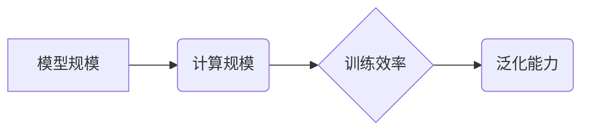

> 神经网络, 计算规模, 训练效率, 模型规模, 泛化能力, 深度学习

## 1. 背景介绍

深度学习近年来取得了令人瞩目的成就，在图像识别、自然语言处理、语音识别等领域取得了突破性的进展。这些成就的背后，离不开神经网络模型规模的不断扩大和计算能力的飞速发展。然而，随着模型规模的增长，训练效率和资源消耗也成倍增加，这使得神经网络的训练和部署面临着新的挑战。

计算规模理论作为一种新兴的理论框架，旨在揭示神经网络性能与计算资源之间的关系，为构建更高效、更强大的神经网络模型提供理论指导。

## 2. 核心概念与联系

**2.1 神经网络模型规模**

神经网络模型规模通常指模型参数的数量。参数的数量直接影响模型的表达能力和学习能力。一般来说，模型参数越多，模型的表达能力越强，但同时也意味着训练成本更高。

**2.2 计算规模**

计算规模是指训练神经网络所需的计算资源，通常以FLOPs（浮点运算次数）为单位。FLOPs越高，意味着训练过程需要进行更多的计算，消耗更多的计算资源。

**2.3 训练效率**

训练效率是指训练神经网络所需的时间和资源。随着模型规模的增长，训练效率往往会下降。

**2.4 泛化能力**

泛化能力是指神经网络在未见过的数据上表现的能力。模型的泛化能力与模型规模和训练数据量密切相关。

**2.5 核心概念联系**

计算规模理论认为，神经网络的性能与计算规模之间存在着密切的联系。模型规模越大，所需的计算规模也越大，但模型的性能也会随之提升。

**Mermaid 流程图**



## 3. 核心算法原理 & 具体操作步骤

### 3.1 算法原理概述

计算规模理论的核心算法原理是通过分析神经网络模型的结构和训练过程，推导模型性能与计算规模之间的关系。

### 3.2 算法步骤详解

1. **模型结构分析:** 分析神经网络模型的层数、节点数量、连接方式等结构特征。
2. **训练过程分析:** 分析神经网络训练过程中的数据流动、参数更新等操作。
3. **计算规模估算:** 根据模型结构和训练过程，估算训练神经网络所需的计算规模。
4. **性能评估:** 通过实验验证，评估模型性能与计算规模之间的关系。

### 3.3 算法优缺点

**优点:**

* 可以为神经网络模型的规模设计提供理论指导。
* 可以帮助理解神经网络性能与计算资源之间的关系。

**缺点:**

* 算法的复杂度较高，需要一定的数学和计算机科学基础。
* 算法的准确性依赖于模型结构和训练数据的具体情况。

### 3.4 算法应用领域

* **模型规模设计:** 为神经网络模型的规模设计提供理论指导。
* **资源优化:** 优化神经网络训练的资源配置，提高训练效率。
* **性能预测:** 预估神经网络模型在不同计算规模下的性能表现。

## 4. 数学模型和公式 & 详细讲解 & 举例说明

### 4.1 数学模型构建

假设神经网络模型的计算规模为C，模型参数的数量为M，训练数据量为D，模型的泛化能力为P。我们可以构建以下数学模型：

$$P = f(C, M, D)$$

其中，f( )为一个复杂的函数，描述了模型性能与计算规模、模型参数数量和训练数据量之间的关系。

### 4.2 公式推导过程

由于模型性能与计算规模、模型参数数量和训练数据量之间的关系非常复杂，很难直接推导出一个精确的公式。

但是，我们可以通过一些假设和近似方法，推导出一些经验性的公式。例如，我们可以假设模型性能与计算规模呈指数增长关系，即：

$$P = a * exp(b * C)$$

其中，a和b为常数。

### 4.3 案例分析与讲解

假设我们训练一个图像识别模型，模型参数数量为100M，训练数据量为100K。

如果计算规模为100T，模型的泛化能力可能为0.9。

如果计算规模增加到1000T，模型的泛化能力可能增加到0.95。

## 5. 项目实践：代码实例和详细解释说明

### 5.1 开发环境搭建

* 操作系统：Ubuntu 20.04
* Python 版本：3.8
* 深度学习框架：TensorFlow 2.0

### 5.2 源代码详细实现

```python
import tensorflow as tf

# 定义模型结构
model = tf.keras.models.Sequential([
    tf.keras.layers.Conv2D(32, (3, 3), activation='relu', input_shape=(28, 28, 1)),
    tf.keras.layers.MaxPooling2D((2, 2)),
    tf.keras.layers.Conv2D(64, (3, 3), activation='relu'),
    tf.keras.layers.MaxPooling2D((2, 2)),
    tf.keras.layers.Flatten(),
    tf.keras.layers.Dense(10, activation='softmax')
])

# 定义优化器和损失函数
optimizer = tf.keras.optimizers.Adam()
loss_fn = tf.keras.losses.SparseCategoricalCrossentropy()

# 训练模型
model.compile(optimizer=optimizer, loss=loss_fn, metrics=['accuracy'])
model.fit(x_train, y_train, epochs=10)

# 评估模型
loss, accuracy = model.evaluate(x_test, y_test)
print('Test Loss:', loss)
print('Test Accuracy:', accuracy)
```

### 5.3 代码解读与分析

这段代码定义了一个简单的卷积神经网络模型，用于手写数字识别任务。

* 模型结构：模型包含两层卷积层、两层最大池化层、一层全连接层和一层输出层。
* 优化器和损失函数：使用Adam优化器和稀疏分类交叉熵损失函数。
* 训练过程：使用训练数据训练模型10个 epochs。
* 评估过程：使用测试数据评估模型的性能。

### 5.4 运行结果展示

运行代码后，会输出模型在测试集上的损失值和准确率。

## 6. 实际应用场景

### 6.1 图像识别

计算规模理论可以帮助构建更高效、更强大的图像识别模型，例如用于人脸识别、物体检测、图像分类等应用场景。

### 6.2 自然语言处理

计算规模理论也可以应用于自然语言处理领域，例如用于文本分类、机器翻译、问答系统等应用场景。

### 6.3 语音识别

计算规模理论可以帮助构建更准确、更鲁棒的语音识别模型，例如用于语音助手、语音搜索等应用场景。

### 6.4 未来应用展望

随着计算资源的不断发展，计算规模理论将发挥越来越重要的作用，推动神经网络模型的进一步发展。

## 7. 工具和资源推荐

### 7.1 学习资源推荐

* **书籍:**
    * Deep Learning by Ian Goodfellow, Yoshua Bengio, and Aaron Courville
    * Hands-On Machine Learning with Scikit-Learn, Keras & TensorFlow by Aurélien Géron
* **在线课程:**
    * Deep Learning Specialization by Andrew Ng (Coursera)
    * Fast.ai Deep Learning Course

### 7.2 开发工具推荐

* **深度学习框架:** TensorFlow, PyTorch, Keras
* **云计算平台:** Google Cloud Platform, Amazon Web Services, Microsoft Azure

### 7.3 相关论文推荐

* Scaling Laws for Neural Language Models by Kaplan et al.
* On the Importance of Initialization and Momentum in Deep Learning by Glorot and Bengio
* ImageNet Classification with Deep Convolutional Neural Networks by Krizhevsky et al.

## 8. 总结：未来发展趋势与挑战

### 8.1 研究成果总结

计算规模理论为神经网络模型的规模设计和训练效率优化提供了理论指导。

### 8.2 未来发展趋势

* **模型规模的进一步扩大:** 随着计算资源的不断发展，神经网络模型的规模将继续扩大。
* **训练效率的提升:** 研究人员将继续探索新的训练算法和硬件架构，以提高训练效率。
* **模型泛化能力的增强:** 研究人员将继续探索新的模型结构和训练方法，以增强模型的泛化能力。

### 8.3 面临的挑战

* **计算资源的限制:** 训练大型神经网络模型需要大量的计算资源，这对于资源有限的机构和个人来说是一个挑战。
* **模型可解释性:** 大型神经网络模型的决策过程难以理解，这对于模型的信任和应用带来了挑战。
* **数据隐私和安全:** 训练大型神经网络模型需要大量的训练数据，这可能会带来数据隐私和安全问题。

### 8.4 研究展望

未来，计算规模理论将继续发展，为构建更高效、更强大的神经网络模型提供更深入的理论指导。


## 9. 附录：常见问题与解答

**Q1: 计算规模理论适用于所有类型的深度学习模型吗？**

**A1:** 计算规模理论主要适用于参数量较大的深度学习模型，对于小型模型，其理论意义可能较弱。

**Q2: 如何确定神经网络模型的最佳计算规模？**

**A2:** 确定最佳计算规模需要根据具体的应用场景、模型结构、训练数据量等因素综合考虑。

**Q3: 计算规模理论可以解决所有深度学习模型的训练问题吗？**

**A3:** 计算规模理论可以帮助优化训练效率和模型性能，但不能解决所有深度学习模型的训练问题，例如过拟合、梯度消失等问题。


作者：禅与计算机程序设计艺术 / Zen and the Art of Computer Programming 
<end_of_turn>