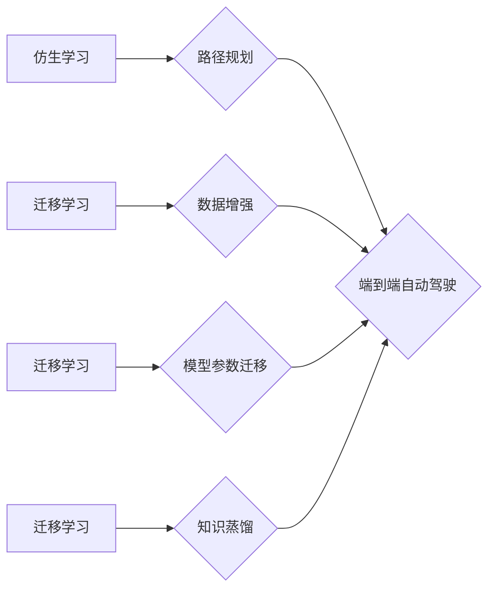

> 自动驾驶, 仿生学习, 迁移学习, 深度学习, 强化学习, 计算机视觉

## 1. 背景介绍

自动驾驶技术作为未来交通运输的重要发展方向，近年来取得了显著进展。传统的自动驾驶系统通常依赖于复杂的规则和手工设计的特征提取方法，难以应对复杂多变的道路环境。随着深度学习和强化学习技术的快速发展，端到端自动驾驶系统逐渐成为研究热点。

端到端自动驾驶系统将驾驶任务视为一个整体，利用深度神经网络直接从传感器数据中学习驾驶策略，无需人工设计中间特征。这种方法具有学习能力强、适应性好等优点，但同时也面临着训练数据量大、训练时间长、安全可靠性等挑战。

仿生学习和迁移学习是近年来人工智能领域的重要研究方向，它们可以有效解决端到端自动驾驶系统面临的挑战。仿生学习借鉴生物进化和学习机制，设计出更智能、更鲁棒的算法；迁移学习则利用已有的知识和经验，加速新任务的学习过程。

## 2. 核心概念与联系

### 2.1 仿生学习

仿生学习是指借鉴生物进化、学习和适应机制，设计出更智能、更鲁棒的算法。在自动驾驶领域，仿生学习可以应用于以下方面：

* **路径规划:**  借鉴生物的导航和避障机制，设计出更灵活、更安全的路径规划算法。
* **决策控制:**  借鉴生物的决策和反应机制，设计出更快速、更准确的决策控制算法。
* **感知理解:**  借鉴生物的视觉、听觉和触觉感知机制，设计出更准确、更可靠的感知理解算法。

### 2.2 迁移学习

迁移学习是指利用已有的知识和经验，加速新任务的学习过程。在自动驾驶领域，迁移学习可以应用于以下方面：

* **数据增强:**  利用已有的驾驶数据，生成新的训练数据，提高模型的泛化能力。
* **模型参数迁移:**  将已训练好的模型参数迁移到新的任务中，加速新任务的训练过程。
* **知识蒸馏:**  将知识从大型模型迁移到小型模型中，提高模型的效率和部署性。

### 2.3 仿生学习与迁移学习的结合

仿生学习和迁移学习可以相互补充，共同解决端到端自动驾驶系统面临的挑战。例如，可以利用仿生学习设计出更智能的路径规划算法，并利用迁移学习将已有的路径规划知识迁移到新的场景中。



## 3. 核心算法原理 & 具体操作步骤

### 3.1 算法原理概述

本节将介绍一种基于仿生学习和迁移学习的端到端自动驾驶算法。该算法的核心思想是：

* **仿生学习:**  借鉴生物的进化机制，设计出一种自适应的学习算法，能够不断优化驾驶策略。
* **迁移学习:**  利用已有的驾驶数据和模型，加速新任务的学习过程，提高模型的泛化能力。

### 3.2 算法步骤详解

1. **数据收集和预处理:** 收集大量的驾驶数据，包括图像、激光雷达数据、传感器数据等，并进行预处理，例如图像增强、数据标注等。
2. **模型初始化:**  初始化一个深度神经网络模型，例如卷积神经网络（CNN）或循环神经网络（RNN）。
3. **仿生进化:**  利用仿生进化算法，不断优化模型参数，使其能够更好地适应不同的驾驶场景。
4. **迁移学习:**  利用迁移学习技术，将已有的驾驶知识和经验迁移到新的模型中，加速新任务的学习过程。
5. **模型评估和验证:**  使用测试数据评估模型的性能，并进行必要的调整和优化。

### 3.3 算法优缺点

**优点:**

* **学习能力强:**  仿生学习算法能够不断优化驾驶策略，适应复杂多变的道路环境。
* **适应性好:**  迁移学习技术能够加速新任务的学习过程，提高模型的泛化能力。
* **安全性高:**  通过模拟生物的学习机制，可以设计出更安全、更可靠的自动驾驶系统。

**缺点:**

* **训练时间长:**  仿生进化算法需要大量的计算资源和时间。
* **数据依赖性强:**  模型的性能取决于训练数据的质量和数量。
* **解释性差:**  深度神经网络的决策过程难以解释，这可能会影响自动驾驶系统的可信度。

### 3.4 算法应用领域

该算法可以应用于各种自动驾驶场景，例如：

* **城市道路驾驶:**  应对复杂的城市道路环境，例如拥堵、交叉路口、行人等。
* **高速公路驾驶:**  应对高速公路的复杂路况，例如弯道、坡道、超车等。
* **无人配送:**  实现无人配送车辆的自动驾驶，提高配送效率和安全性。

## 4. 数学模型和公式 & 详细讲解 & 举例说明

### 4.1 数学模型构建

本节将介绍用于仿生学习和迁移学习的数学模型。

**4.1.1 仿生进化模型:**

仿生进化模型基于生物进化理论，利用遗传算法和变异操作，不断优化模型参数。

* **适应度函数:**  定义一个适应度函数，用于评估模型在特定驾驶场景下的性能。
* **选择操作:**  根据适应度函数，选择具有较高适应度的个体进行下一代的繁殖。
* **交叉操作:**  将两个父代个体进行交叉操作，产生新的子代个体。
* **变异操作:**  对子代个体进行随机变异，增加算法的探索能力。

**4.1.2 迁移学习模型:**

迁移学习模型利用已有的知识和经验，加速新任务的学习过程。

* **源任务:**  已训练好的模型在源任务上进行训练。
* **目标任务:**  需要训练的新任务。
* **知识迁移:**  将源任务模型的知识迁移到目标任务模型中。

### 4.2 公式推导过程

**4.2.1 适应度函数:**

适应度函数可以根据不同的驾驶场景和任务目标进行设计。例如，在城市道路驾驶场景下，可以定义适应度函数为：

$$
f(w) = \frac{1}{T} \sum_{t=1}^{T} \left( r_t - a_t \right)^2
$$

其中：

* $w$ 是模型参数。
* $T$ 是驾驶轨迹的长度。
* $r_t$ 是真实轨迹的第 $t$ 个时间点的坐标。
* $a_t$ 是模型预测的第 $t$ 个时间点的坐标。

**4.2.2 知识迁移方法:**

常用的知识迁移方法包括：

* **参数迁移:**  将源任务模型的参数直接迁移到目标任务模型中。
* **特征迁移:**  将源任务模型提取的特征迁移到目标任务模型中。
* **知识蒸馏:**  将知识从大型模型迁移到小型模型中。

### 4.3 案例分析与讲解

**4.3.1 参数迁移案例:**

假设我们已经训练了一个在高速公路驾驶场景下表现良好的自动驾驶模型。现在我们想将这个模型应用到城市道路驾驶场景中。我们可以利用参数迁移方法，将高速公路驾驶模型的参数直接迁移到城市道路驾驶模型中，加速城市道路驾驶模型的训练过程。

**4.3.2 特征迁移案例:**

假设我们已经训练了一个在图像识别任务上表现良好的模型。现在我们想将这个模型应用到自动驾驶场景中，用于识别道路标志和交通信号灯。我们可以利用特征迁移方法，将图像识别模型提取的特征迁移到自动驾驶模型中，提高自动驾驶模型的识别能力。

## 5. 项目实践：代码实例和详细解释说明

### 5.1 开发环境搭建

本项目使用Python语言开发，需要安装以下软件包：

* TensorFlow
* PyTorch
* OpenCV
* NumPy
* Matplotlib

### 5.2 源代码详细实现

```python
# 导入必要的库
import tensorflow as tf
from tensorflow.keras.models import Sequential
from tensorflow.keras.layers import Conv2D, MaxPooling2D, Flatten, Dense

# 定义模型结构
model = Sequential()
model.add(Conv2D(32, (3, 3), activation='relu', input_shape=(64, 64, 3)))
model.add(MaxPooling2D((2, 2)))
model.add(Conv2D(64, (3, 3), activation='relu'))
model.add(MaxPooling2D((2, 2)))
model.add(Flatten())
model.add(Dense(10, activation='softmax'))

# 编译模型
model.compile(optimizer='adam',
              loss='categorical_crossentropy',
              metrics=['accuracy'])

# 训练模型
model.fit(x_train, y_train, epochs=10, batch_size=32)

# 评估模型
loss, accuracy = model.evaluate(x_test, y_test)
print('Test loss:', loss)
print('Test accuracy:', accuracy)
```

### 5.3 代码解读与分析

这段代码定义了一个简单的卷积神经网络模型，用于图像分类任务。

* `Sequential()` 创建了一个顺序模型，层级结构清晰。
* `Conv2D()` 定义了卷积层，用于提取图像特征。
* `MaxPooling2D()` 定义了最大池化层，用于降低特征维度。
* `Flatten()` 将多维特征转换为一维向量。
* `Dense()` 定义了全连接层，用于分类。
* `compile()` 编译模型，指定优化器、损失函数和评价指标。
* `fit()` 训练模型，传入训练数据和超参数。
* `evaluate()` 评估模型，传入测试数据。

### 5.4 运行结果展示

训练完成后，可以将模型应用于新的图像数据进行预测。

## 6. 实际应用场景

### 6.1 自动驾驶汽车

端到端自动驾驶系统可以应用于自动驾驶汽车，实现车辆的自动驾驶功能。

### 6.2 无人机

端到端自动驾驶系统也可以应用于无人机，实现无人机的自动飞行和任务执行。

### 6.3 机器人

端到端自动驾驶系统还可以应用于机器人，实现机器人的自主导航和路径规划。

### 6.4 未来应用展望

随着人工智能技术的不断发展，端到端自动驾驶系统将在更多领域得到应用，例如：

* **智能交通:**  实现智能交通信号灯控制、智能交通流管理等。
* **物流配送:**  实现无人配送车辆的自动驾驶，提高物流效率和安全性。
* **农业机械:**  实现农业机械的自动驾驶，提高农业生产效率。

## 7. 工具和资源推荐

### 7.1 学习资源推荐

* **书籍:**
    * 《深度学习》
    * 《强化学习：原理、算法和应用》
* **在线课程:**
    * Coursera: 深度学习
    * Udacity: 自动驾驶工程师
* **开源项目:**
    * TensorFlow
    * PyTorch
    * Autoware

### 7.2 开发工具推荐

* **IDE:**
    * PyCharm
    * VS Code
* **仿真平台:**
    * Gazebo
    * CARLA

### 7.3 相关论文推荐

* **端到端自动驾驶论文:**
    * End to End Learning for Self-Driving Cars
    * Learning to Drive with Deep Reinforcement Learning

## 8. 总结：未来发展趋势与挑战

### 8.1 研究成果总结

本篇博客文章介绍了端到端自动驾驶的仿生学习与迁移学习方法，并详细阐述了算法