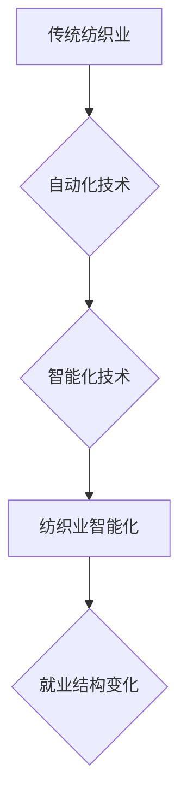

> 纺织业、自动化、人工智能、机器学习、就业结构、未来趋势、社会影响

## 1. 背景介绍

纺织业作为人类文明发展的重要组成部分，经历了从手工纺织到机械化生产再到现代智能化生产的漫长演变。随着科技的进步，人工智能（AI）和机器学习（ML）技术在纺织业的应用日益广泛，自动化程度不断提高，这深刻地改变了纺织工人的就业结构。

传统纺织业主要依赖人工操作，纺织工人承担着从原料整理到布匹加工的各个环节。然而，随着自动化技术的普及，许多重复性劳动和体力劳动被机器取代，纺织工人的工作内容和技能需求发生了重大变化。

## 2. 核心概念与联系

**2.1 纺织业自动化**

纺织业自动化是指利用机器和自动化设备替代人工进行纺织生产过程中的各种操作，以提高生产效率、降低成本和产品质量。

**2.2 人工智能（AI）**

人工智能是指模拟人类智能行为的计算机系统，包括学习、推理、决策和解决问题等能力。

**2.3 机器学习（ML）**

机器学习是人工智能的一个子领域，它通过算法训练模型，使模型能够从数据中学习并进行预测或分类。

**2.4 纺织业智能化**

纺织业智能化是指将人工智能和机器学习技术应用于纺织生产过程，实现智能化控制、优化生产流程和提高产品质量。

**2.5 影响因素**

纺织业就业结构变化受到多种因素的影响，包括：

* **技术进步:** 自动化和智能化技术的快速发展是导致纺织工人就业结构变化的主要因素。
* **市场需求:** 消费者对产品质量、款式和价格的要求不断提高，促使纺织企业寻求更高效的生产方式。
* **劳动力成本:** 随着劳动力成本的上升，企业更倾向于采用自动化设备替代人工。
* **政府政策:** 政府对自动化和智能化技术的扶持政策也对纺织业就业结构变化产生了影响。

**2.6 Mermaid 流程图**



## 3. 核心算法原理 & 具体操作步骤

**3.1 算法原理概述**

纺织业智能化应用中常用的算法包括：

* **机器视觉:** 用于识别和分析纺织材料的缺陷、颜色和纹理。
* **深度学习:** 用于预测纺织材料的性能和质量，以及优化生产流程。
* **自然语言处理:** 用于处理纺织生产中的文本数据，例如订单信息和生产记录。

**3.2 算法步骤详解**

以机器视觉算法为例，其具体操作步骤如下：

1. **图像采集:** 使用摄像头采集纺织材料的图像。
2. **图像预处理:** 对图像进行增强、去噪和尺寸调整等处理，提高图像质量。
3. **特征提取:** 使用算法提取图像中的特征，例如颜色、纹理和形状。
4. **分类识别:** 将提取的特征与已知缺陷样本进行比较，识别纺织材料的缺陷类型。
5. **结果输出:** 将识别结果输出到控制系统，进行相应的处理，例如停止生产或进行质量检修。

**3.3 算法优缺点**

**优点:**

* **提高生产效率:** 自动化检测可以快速准确地识别缺陷，减少人工检查的时间和成本。
* **提高产品质量:** 及时发现和处理缺陷，可以提高产品质量和一致性。
* **降低人工成本:** 自动化检测可以减少对人工操作的需求，降低劳动力成本。

**缺点:**

* **算法训练成本:** 训练机器视觉算法需要大量的标注数据，成本较高。
* **算法精度:** 算法的识别精度受图像质量和环境因素的影响，存在一定的误差。
* **维护成本:** 自动化设备需要定期维护和保养，成本较高。

**3.4 算法应用领域**

机器视觉算法广泛应用于纺织业的各个环节，例如：

* **原料检测:** 检测棉花、化纤等原料的质量和缺陷。
* **织物检测:** 检测织物的颜色、纹理、密度和缺陷。
* **成品检测:** 检测成品的尺寸、形状、颜色和缺陷。

## 4. 数学模型和公式 & 详细讲解 & 举例说明

**4.1 数学模型构建**

在纺织业智能化应用中，可以使用数学模型来描述和预测生产过程中的各种现象。例如，可以使用回归模型来预测纺织材料的强度，可以使用分类模型来预测纺织材料的缺陷类型。

**4.2 公式推导过程**

假设我们想要使用线性回归模型来预测纺织材料的强度，我们可以使用以下公式：

$$y = mx + c$$

其中：

* $y$ 是纺织材料的强度
* $x$ 是纺织材料的纤维长度
* $m$ 是回归系数
* $c$ 是截距

我们可以通过最小二乘法来估计回归系数 $m$ 和 $c$。

**4.3 案例分析与讲解**

假设我们收集了 100 个纺织材料的样本数据，包括纤维长度和强度。我们可以使用线性回归模型来拟合这些数据，得到一个预测模型。

然后，我们可以使用这个模型来预测新的纺织材料的强度，只要知道其纤维长度。

## 5. 项目实践：代码实例和详细解释说明

**5.1 开发环境搭建**

可以使用 Python 语言和相关的库来开发纺织业智能化应用。例如，可以使用 OpenCV 库进行图像处理，可以使用 TensorFlow 或 PyTorch 库进行深度学习。

**5.2 源代码详细实现**

```python
import cv2
import numpy as np

# 加载图像
image = cv2.imread('image.jpg')

# 转换图像到灰度
gray = cv2.cvtColor(image, cv2.COLOR_BGR2GRAY)

# 使用阈值分割
ret, thresh = cv2.threshold(gray, 127, 255, cv2.THRESH_BINARY)

# 查找轮廓
contours, hierarchy = cv2.findContours(thresh, cv2.RETR_EXTERNAL, cv2.CHAIN_APPROX_SIMPLE)

# 绘制轮廓
cv2.drawContours(image, contours, -1, (0, 255, 0), 2)

# 显示图像
cv2.imshow('Image', image)
cv2.waitKey(0)
cv2.destroyAllWindows()
```

**5.3 代码解读与分析**

这段代码实现了对纺织材料图像进行缺陷检测的简单示例。

首先，代码加载了图像并将其转换为灰度图像。然后，使用阈值分割将图像分割成前景和背景。

接下来，使用 OpenCV 库的 `findContours` 函数查找图像中的轮廓。最后，使用 `drawContours` 函数绘制轮廓，并显示图像。

**5.4 运行结果展示**

运行这段代码后，将显示一个带有绘制轮廓的图像。轮廓代表了图像中的缺陷区域。

## 6. 实际应用场景

**6.1 纺织品质量控制**

纺织品质量控制是纺织业智能化应用的一个重要场景。

使用机器视觉技术可以自动检测纺织品中的缺陷，例如颜色不均匀、织物破损、针线松脱等。

**6.2 纺织生产过程优化**

纺织生产过程优化是另一个重要的应用场景。

使用人工智能技术可以分析生产数据，识别生产过程中的瓶颈和问题，并提出优化方案。

**6.3 个性化定制**

随着个性化定制需求的增加，纺织业智能化应用可以帮助企业实现个性化定制。

例如，可以使用机器学习技术根据客户的喜好生成个性化的图案和设计。

**6.4 未来应用展望**

未来，纺织业智能化应用将更加广泛和深入。

例如，可以使用机器人技术实现纺织生产过程的自动化，可以使用虚拟现实技术进行纺织品设计和展示。

## 7. 工具和资源推荐

**7.1 学习资源推荐**

* **在线课程:** Coursera、edX、Udacity 等平台提供人工智能和机器学习相关的在线课程。
* **书籍:** 《深度学习》、《机器学习实战》等书籍可以帮助读者深入了解人工智能和机器学习的原理和应用。
* **开源项目:** TensorFlow、PyTorch 等开源项目可以帮助读者实践人工智能和机器学习的应用。

**7.2 开发工具推荐**

* **Python:** Python 是一种流行的编程语言，广泛应用于人工智能和机器学习的开发。
* **OpenCV:** OpenCV 是一个开源的计算机视觉库，可以用于图像处理、物体检测和识别等任务。
* **TensorFlow:** TensorFlow 是一个开源的机器学习框架，可以用于构建和训练深度学习模型。

**7.3 相关论文推荐**

* **《ImageNet Classification with Deep Convolutional Neural Networks》**
* **《Attention Is All You Need》**
* **《Generative Adversarial Networks》**

## 8. 总结：未来发展趋势与挑战

**8.1 研究成果总结**

纺织业智能化应用取得了显著的成果，例如提高了生产效率、产品质量和安全性。

**8.2 未来发展趋势**

未来，纺织业智能化应用将更加智能化、个性化和可持续化。

例如，将更加广泛地应用于纺织品设计、生产、销售和服务等各个环节。

**8.3 面临的挑战**

纺织业智能化应用也面临着一些挑战，例如算法精度、数据安全和伦理问题等。

**8.4 研究展望**

未来研究将重点关注解决这些挑战，并探索新的应用场景，推动纺织业的智能化发展。

## 9. 附录：常见问题与解答

**9.1 纺织业智能化应用的成本如何？**

纺织业智能化应用的成本取决于具体的应用场景和技术方案。

一般来说，初期投资成本较高，但长期来看可以降低生产成本和提高效益。

**9.2 纺织业智能化应用对就业的影响如何？**

纺织业智能化应用会对部分传统工作岗位产生冲击，但同时也创造了新的工作机会。

例如，需要维护和操作智能化设备的专业人员。

**9.3 纺织业智能化应用的安全性如何？**

纺织业智能化应用需要保障数据安全和系统安全。

企业需要采取相应的安全措施，防止数据泄露和系统攻击。


作者：禅与计算机程序设计艺术 / Zen and the Art of Computer Programming 
<end_of_turn>