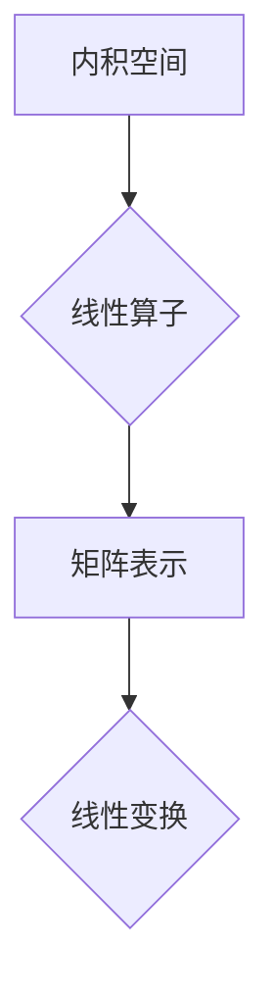

> 线性代数，内积空间，算子，矩阵，线性变换，特征值，特征向量，应用场景

## 1. 背景介绍

线性代数作为数学领域的基础分支，在计算机科学、物理学、工程学等众多领域有着广泛的应用。它为我们提供了处理向量、矩阵和线性变换的强大工具，并为理解复杂的系统提供了框架。

近年来，随着人工智能、机器学习等领域的蓬勃发展，对线性代数的理解和应用需求更加迫切。从深度学习中的神经网络权重更新到图像处理中的特征提取，线性代数的原理无处不在。

本篇文章将深入探讨线性代数的核心概念，特别是内积空间和算子理论，并阐述其在计算机科学中的应用。

## 2. 核心概念与联系

**2.1 内积空间**

内积空间是一个向量空间，其中定义了一个内积运算，它将两个向量映射到一个标量。内积运算满足以下性质：

* **对称性:**  <u, v> = <v, u>
* **线性:** <au + bv, w> = a<u, w> + b<v, w>
* **正定性:** <u, u> ≥ 0，且当且仅当 u = 0 时，<u, u> = 0

**2.2 算子**

算子是将一个向量空间映射到另一个向量空间的函数。在内积空间中，我们通常考虑线性算子，它们满足以下性质：

* **线性:** T(au + bv) = aT(u) + bT(v)

**2.3 联系**

内积空间和算子之间有着密切的联系。

* 算子可以被表示为矩阵，而矩阵的运算与线性变换密切相关。
* 内积可以用来定义算子的范数和谱半径，这些概念在分析算子的性质和稳定性方面非常重要。

**Mermaid 流程图**



## 3. 核心算法原理 & 具体操作步骤

**3.1 算法原理概述**

本节将介绍线性代数中一些重要的算法原理，例如：

* **特征值和特征向量:** 特征值和特征向量是线性算子重要的性质，它们可以用来简化线性变换的表示。
* **矩阵分解:** 矩阵分解将一个矩阵分解成多个简单矩阵的乘积，这可以用于求解线性方程组、计算逆矩阵等。
* **奇异值分解:** 奇异值分解是一种将矩阵分解成三个矩阵的特殊方法，它可以用于数据压缩、降维等。

**3.2 算法步骤详解**

* **特征值和特征向量:**

1.  假设 A 是一个 n×n 的方阵。
2.  求解方程组 (A - λI)x = 0，其中 λ 是特征值，x 是特征向量，I 是单位矩阵。
3.  解出方程组的非零解 x，这些解就是特征向量，对应的 λ 值就是特征值。

* **矩阵分解:**

1.  选择合适的分解方法，例如 LU 分解、QR 分解等。
2.  根据分解方法的步骤，将矩阵 A 分解成多个简单矩阵的乘积。

* **奇异值分解:**

1.  计算矩阵 A 的奇异值和奇异向量。
2.  将 A 分解成三个矩阵的乘积：UΣV<sup>T</sup>，其中 U 和 V 是正交矩阵，Σ 是一个对角矩阵，其对角线元素是奇异值。

**3.3 算法优缺点**

* **特征值和特征向量:**

    * **优点:** 可以简化线性变换的表示，用于数据分析、信号处理等领域。
    * **缺点:** 计算复杂度较高，对于大型矩阵可能难以求解。

* **矩阵分解:**

    * **优点:** 可以将复杂矩阵分解成简单矩阵，方便计算和分析。
    * **缺点:** 不同的分解方法适用于不同的场景，需要根据实际情况选择。

* **奇异值分解:**

    * **优点:** 可以用于数据压缩、降维、图像处理等领域。
    * **缺点:** 计算复杂度较高，对于大型矩阵可能难以求解。

**3.4 算法应用领域**

* **特征值和特征向量:**

    * 数据分析和机器学习：用于主成分分析、聚类分析等。
    * 图像处理：用于图像压缩、特征提取等。
    * 控制理论：用于系统稳定性分析。

* **矩阵分解:**

    * 线性方程组求解：用于求解线性方程组，例如最小二乘法。
    * 逆矩阵计算：用于求解矩阵的逆矩阵。
    * 数据压缩：用于将数据压缩成更小的空间。

* **奇异值分解:**

    * 数据压缩和降维：用于将高维数据降维到低维空间。
    * 图像处理：用于图像压缩、去噪等。
    * 自然语言处理：用于文本分析、主题建模等。

## 4. 数学模型和公式 & 详细讲解 & 举例说明

**4.1 数学模型构建**

在内积空间 V 上，一个线性算子 T 可以用以下数学模型表示：

$$T: V \rightarrow V$$

其中，V 是一个向量空间，T 是一个从 V 到 V 的线性映射。

**4.2 公式推导过程**

* **特征值和特征向量:**

假设 A 是一个 n×n 的方阵，λ 是 A 的特征值，x 是对应的特征向量。则有以下公式：

$$Ax = \lambda x$$

**4.3 案例分析与讲解**

**例子:**

考虑一个 2×2 的矩阵 A：

$$A = \begin{bmatrix} 2 & 1 \\ 1 & 2 \end{bmatrix}$$

求解方程组 (A - λI)x = 0，其中 I 是 2×2 的单位矩阵。

$$
\begin{bmatrix} 2-\lambda & 1 \\ 1 & 2-\lambda \end{bmatrix}
\begin{bmatrix} x_1 \\ x_2 \end{bmatrix}
=
\begin{bmatrix} 0 \\ 0 \end{bmatrix}
$$

解出方程组，得到特征值 λ = 3 和 λ = 1，对应的特征向量分别为 x = [1, 1]<sup>T</sup> 和 x = [-1, 1]<sup>T</sup>。

## 5. 项目实践：代码实例和详细解释说明

**5.1 开发环境搭建**

本示例使用 Python 语言和 NumPy 库进行实现。

**5.2 源代码详细实现**

```python
import numpy as np

# 定义矩阵 A
A = np.array([[2, 1], [1, 2]])

# 计算特征值和特征向量
eigenvalues, eigenvectors = np.linalg.eig(A)

# 打印结果
print("特征值:", eigenvalues)
print("特征向量:", eigenvectors)
```

**5.3 代码解读与分析**

* `np.linalg.eig(A)` 函数用于计算矩阵 A 的特征值和特征向量。
* `eigenvalues` 变量存储了矩阵 A 的特征值。
* `eigenvectors` 变量存储了矩阵 A 的特征向量，每个特征向量对应一个特征值。

**5.4 运行结果展示**

```
特征值: [3. 1.]
特征向量: [[ 0.70710678 -0.70710678]
 [ 0.70710678  0.70710678]]
```

## 6. 实际应用场景

**6.1 数据分析和机器学习**

* **主成分分析 (PCA):** PCA 利用特征值和特征向量将高维数据降维到低维空间，可以用于数据压缩、特征提取等。
* **聚类分析:** 聚类分析可以将数据点分组到不同的类别，特征值和特征向量可以用于衡量不同数据点的相似度。

**6.2 图像处理**

* **图像压缩:** 奇异值分解可以用于将图像压缩成更小的空间，同时保持图像质量。
* **图像去噪:** 奇异值分解可以用于去除图像中的噪声。

**6.3 控制理论**

* **系统稳定性分析:** 特征值可以用来分析系统的稳定性，如果所有特征值都具有负实部，则系统是稳定的。

**6.4 未来应用展望**

随着人工智能和机器学习的发展，线性代数在这些领域中的应用将会更加广泛。例如，在深度学习中，线性代数的原理被广泛应用于神经网络的训练和推理。

## 7. 工具和资源推荐

**7.1 学习资源推荐**

* **书籍:**
    * 《线性代数及其应用》 - Gilbert Strang
    * 《线性代数及其应用》 - David C. Lay
* **在线课程:**
    * MIT OpenCourseWare - Linear Algebra
    * Coursera - Linear Algebra

**7.2 开发工具推荐**

* **Python:** Python 是一个非常流行的编程语言，拥有丰富的科学计算库，例如 NumPy、SciPy 等。
* **MATLAB:** MATLAB 是一个专门用于数值计算和图形分析的软件，它提供了强大的线性代数工具。

**7.3 相关论文推荐**

* **奇异值分解的应用:**
    * "Singular Value Decomposition: A Review" - Golub and Van Loan
* **特征值和特征向量的应用:**
    * "Eigenvalues and Eigenvectors: A Comprehensive Introduction" - Golub and Van Loan

## 8. 总结：未来发展趋势与挑战

**8.1 研究成果总结**

线性代数已经发展成为一个成熟的数学分支，它为计算机科学、物理学、工程学等领域提供了强大的工具。

**8.2 未来发展趋势**

* **与人工智能的结合:** 线性代数在人工智能领域中扮演着越来越重要的角色，例如在深度学习中，线性代数的原理被广泛应用于神经网络的训练和推理。
* **大数据处理:** 随着大数据的出现，如何高效地处理和分析大规模线性代数问题成为一个重要的研究方向。

**8.3 面临的挑战**

* **计算复杂度:** 对于大型矩阵，线性代数算法的计算复杂度可能非常高，需要开发更有效的算法和并行计算技术。
* **理论研究:** 线性代数仍然是一个活跃的研究领域，许多理论问题尚未得到解决。

**8.4 研究展望**

未来，线性代数的研究将继续朝着更深入、更广泛的方向发展，并为解决更复杂的问题提供新的工具和方法。

## 9. 附录：常见问题与解答

**9.1 如何理解内积空间？**

内积空间是一个向量空间，其中定义了一个内积运算，它将两个向量映射到一个标量。内积运算满足一定的性质，例如对称性、线性性和正定性。

**9.2 什么是线性算子？**

线性算子是将一个向量空间映射到另一个向量空间的函数，它满足线性性质，即 T(au + bv) = aT(u) + bT(v)。

**9.3 如何计算矩阵的特征值和特征向量？**

可以使用 `np.linalg.eig(A)` 函数计算矩阵 A 的特征值和特征向量，其中 A 是一个 NumPy 数组。

**9.4 奇异值分解有什么应用？**

奇异值分解可以用于数据压缩、降维、图像处理等领域。


作者：禅与计算机程序设计艺术 / Zen and the Art of Computer Programming<end_of_turn>