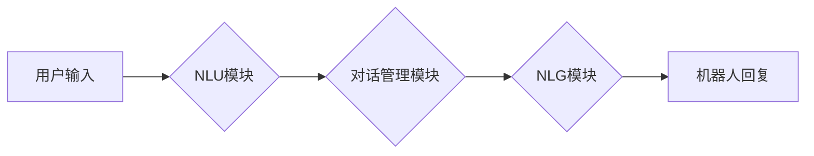

> 聊天机器人、文本生成、自然语言处理、Transformer模型、GPT、BERT、LLM、对话系统

## 1. 背景介绍

近年来，人工智能技术取得了飞速发展，其中自然语言处理（NLP）领域取得了突破性进展。聊天机器人作为NLP领域的重要应用之一，已经逐渐走进人们的生活，从简单的问答系统发展到能够进行复杂对话的智能助手。

聊天机器人能够理解和生成人类语言，并根据上下文进行智能回复，为用户提供个性化服务。例如，我们可以使用聊天机器人进行以下操作：

* 查询天气、新闻、交通信息等；
* 预订机票、酒店、餐厅等；
* 购物、支付等；
* 与客服人员进行在线沟通等。

随着技术的不断进步，聊天机器人的功能将会更加强大，应用场景将会更加广泛。

## 2. 核心概念与联系

### 2.1 聊天机器人类型

聊天机器人可以根据其功能和技术实现方式分为以下几种类型：

* **基于规则的聊天机器人:** 这种类型的聊天机器人依赖于预先定义的规则和知识库，通过匹配用户输入的关键词和规则进行回复。

* **基于机器学习的聊天机器人:** 这种类型的聊天机器人利用机器学习算法，从大量的文本数据中学习语言模式和知识，能够进行更自然和灵活的对话。

* **基于深度学习的聊天机器人:** 这种类型的聊天机器人利用深度学习算法，例如Transformer模型，能够学习更复杂的语言结构和语义关系，生成更流畅和逼真的对话。

### 2.2 核心技术

聊天机器人的核心技术包括：

* **自然语言理解（NLU）:** 理解用户输入的文本语义，识别关键词、实体、意图等。
* **对话管理:** 控制对话流程，根据用户输入和上下文进行回复，并引导对话走向目标。
* **自然语言生成（NLG）:** 生成自然流畅的文本回复，表达机器人的意图和情感。

### 2.3 核心架构

聊天机器人的典型架构包括以下几个模块：



## 3. 核心算法原理 & 具体操作步骤

### 3.1 算法原理概述

聊天机器人中常用的算法包括：

* **词嵌入:** 将单词映射到低维向量空间，捕捉单词之间的语义关系。
* **循环神经网络（RNN）:** 用于处理序列数据，例如文本，能够捕捉文本中的上下文信息。
* **Transformer模型:** 是一种基于注意力机制的深度学习模型，能够更有效地捕捉长距离依赖关系，在自然语言处理任务中取得了优异的性能。

### 3.2 算法步骤详解

以Transformer模型为例，其训练过程可以概括为以下步骤：

1. **数据预处理:** 将文本数据进行清洗、分词、标记等预处理操作。
2. **词嵌入:** 将单词映射到低维向量空间。
3. **编码器:** 使用多层Transformer编码器对输入文本进行编码，提取文本的语义信息。
4. **解码器:** 使用多层Transformer解码器根据编码后的文本信息生成回复文本。
5. **损失函数:** 使用交叉熵损失函数计算模型预测结果与真实结果之间的差异。
6. **反向传播:** 使用梯度下降算法更新模型参数，降低损失函数值。

### 3.3 算法优缺点

**优点:**

* 能够捕捉长距离依赖关系，生成更流畅的文本。
* 训练效率高，能够处理大规模文本数据。

**缺点:**

* 计算量大，需要强大的计算资源。
* 训练数据量要求高，需要大量的标注数据。

### 3.4 算法应用领域

Transformer模型在自然语言处理领域广泛应用，例如：

* **机器翻译:** 将一种语言翻译成另一种语言。
* **文本摘要:** 生成文本的简短摘要。
* **问答系统:** 回答用户提出的问题。
* **对话系统:** 与用户进行自然流畅的对话。

## 4. 数学模型和公式 & 详细讲解 & 举例说明

### 4.1 数学模型构建

Transformer模型的核心是注意力机制，它能够捕捉文本中单词之间的关系，并赋予每个单词不同的权重。

注意力机制的数学模型可以表示为：

$$
Attention(Q, K, V) = softmax(\frac{QK^T}{\sqrt{d_k}})V
$$

其中：

* $Q$：查询矩阵
* $K$：键矩阵
* $V$：值矩阵
* $d_k$：键向量的维度
* $softmax$：softmax函数

### 4.2 公式推导过程

注意力机制的公式推导过程如下：

1. 计算查询矩阵 $Q$ 与键矩阵 $K$ 的点积，并除以 $\sqrt{d_k}$。
2. 对点积结果应用softmax函数，得到每个单词的注意力权重。
3. 将注意力权重与值矩阵 $V$ 进行加权求和，得到最终的注意力输出。

### 4.3 案例分析与讲解

例如，假设我们有一个句子 "The cat sat on the mat"，我们想要计算 "cat" 和 "mat" 之间的注意力权重。

* $Q$：查询向量为 "cat" 的词嵌入向量。
* $K$：键向量为每个单词的词嵌入向量。
* $V$：值向量为每个单词的词嵌入向量。

通过计算 $Q$ 与 $K$ 的点积，并应用softmax函数，我们可以得到 "cat" 和 "mat" 之间的注意力权重。权重越高，表示 "cat" 和 "mat" 之间的语义关系越强。

## 5. 项目实践：代码实例和详细解释说明

### 5.1 开发环境搭建

* Python 3.7+
* TensorFlow 2.0+
* PyTorch 1.0+
* CUDA 10.0+ (可选)

### 5.2 源代码详细实现

```python
import tensorflow as tf

# 定义Transformer模型
class Transformer(tf.keras.Model):
    def __init__(self, vocab_size, embedding_dim, num_heads, num_layers):
        super(Transformer, self).__init__()
        self.embedding = tf.keras.layers.Embedding(vocab_size, embedding_dim)
        self.transformer_layers = [
            tf.keras.layers.MultiHeadAttention(num_heads=num_heads, key_dim=embedding_dim)
            for _ in range(num_layers)
        ]
        self.dense = tf.keras.layers.Dense(vocab_size)

    def call(self, inputs):
        # Embedding
        x = self.embedding(inputs)
        # Transformer layers
        for layer in self.transformer_layers:
            x = layer(x)
        # Output layer
        x = self.dense(x)
        return x

# 实例化模型
model = Transformer(vocab_size=10000, embedding_dim=512, num_heads=8, num_layers=6)

# 训练模型
# ...

```

### 5.3 代码解读与分析

* **Embedding层:** 将单词映射到低维向量空间。
* **Transformer层:** 使用多层MultiHeadAttention和FeedForward网络，捕捉文本中的语义关系。
* **Dense层:** 将编码后的文本信息映射到输出词汇表。

### 5.4 运行结果展示

训练完成后，我们可以使用模型生成文本回复。例如，输入 "Hello, how are you?"，模型可能会回复 "I'm fine, thank you. How about you?"。

## 6. 实际应用场景

### 6.1 聊天机器人应用场景

* **客服机器人:** 自动回答用户常见问题，提高客服效率。
* **教育机器人:** 为学生提供个性化学习辅导，解答学习疑问。
* **娱乐机器人:** 与用户进行趣味对话，提供娱乐服务。
* **虚拟助理:** 帮助用户完成日常任务，例如设置提醒、查询天气等。

### 6.2 实际应用案例

* **Google Assistant:** 谷歌的语音助手，能够理解用户语音指令，并执行相应的操作。
* **Amazon Alexa:** 亚马逊的智能音箱，能够与用户进行对话，并控制智能家居设备。
* **Microsoft Cortana:** 微软的虚拟助手，能够帮助用户管理日程安排、发送邮件等。

### 6.4 未来应用展望

随着人工智能技术的不断发展，聊天机器人的应用场景将会更加广泛，例如：

* **医疗保健:** 辅助医生诊断疾病、提供患者咨询服务。
* **金融服务:** 提供个性化理财建议、协助客户办理金融业务。
* **法律服务:** 帮助律师进行法律研究、撰写法律文件。

## 7. 工具和资源推荐

### 7.1 学习资源推荐

* **书籍:**
    * 《深度学习》
    * 《自然语言处理》
    * 《Transformer模型详解》
* **在线课程:**
    * Coursera: 自然语言处理
    * Udacity: 深度学习
    * fast.ai: 深度学习

### 7.2 开发工具推荐

* **TensorFlow:** 开源深度学习框架
* **PyTorch:** 开源深度学习框架
* **Hugging Face:** 提供预训练模型和开发工具

### 7.3 相关论文推荐

* 《Attention Is All You Need》
* 《BERT: Pre-training of Deep Bidirectional Transformers for Language Understanding》
* 《GPT-3: Language Models are Few-Shot Learners》

## 8. 总结：未来发展趋势与挑战

### 8.1 研究成果总结

近年来，聊天机器人技术取得了显著进展，特别是Transformer模型的出现，为聊天机器人带来了新的突破。

### 8.2 未来发展趋势

* **更自然流畅的对话:** 聊天机器人将能够进行更自然、更流畅的对话，更接近人类的语言表达方式。
* **更强大的理解能力:** 聊天机器人将能够更好地理解用户的意图和情感，提供更精准的回复。
* **更个性化的服务:** 聊天机器人将能够根据用户的喜好和需求提供个性化的服务。

### 8.3 面临的挑战

* **数据标注:** 训练高质量的聊天机器人模型需要大量的标注数据，数据标注成本高昂。
* **模型复杂度:** 聊天机器人模型越来越复杂，训练和部署成本越来越高。
* **伦理问题:** 聊天机器人可能会被用于恶意目的，例如传播虚假信息、进行网络欺诈等，需要解决伦理问题。

### 8.4 研究展望

未来，聊天机器人技术将继续发展，朝着更智能、更安全、更可靠的方向发展。

## 9. 附录：常见问题与解答

* **Q: 如何训练一个聊天机器人模型？**

* **A:** 训练聊天机器人模型需要准备大量的文本数据，并使用深度学习算法进行训练。

* **Q: 如何评估聊天机器人的性能？**

* **A:** 可以使用BLEU、ROUGE等指标评估聊天机器人的性能。

* **Q: 聊天机器人会取代人类工作吗？**

* **A:** 聊天机器人可以帮助人类完成一些重复性工作，但不会完全取代人类工作。


作者：禅与计算机程序设计艺术 / Zen and the Art of Computer Programming 
<end_of_turn>