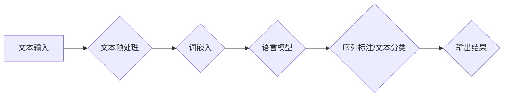

> 自然语言处理，NLP，机器学习，深度学习，文本分类，情感分析，语言模型，BERT，Transformer

## 1. 背景介绍

自然语言处理（Natural Language Processing，NLP）是人工智能领域的一个重要分支，旨在使计算机能够理解、处理和生成人类语言。随着大数据时代的到来，文本数据呈爆炸式增长，NLP技术在各个领域都得到了广泛应用，例如搜索引擎优化、机器翻译、聊天机器人、文本摘要、情感分析等。

NLP技术的发展离不开机器学习和深度学习的推动。机器学习算法能够从海量文本数据中学习语言的规律，而深度学习则能够学习更复杂的语言表示，从而提高NLP模型的性能。

## 2. 核心概念与联系

**2.1 自然语言处理的核心概念**

* **文本预处理:** 对原始文本进行清洗、格式化和转换，例如去除停用词、标点符号、HTML标签等，并将文本转换为数字格式。
* **词嵌入:** 将单词映射到低维向量空间，使得语义相近的单词拥有相似的向量表示。
* **语言模型:** 预测下一个词出现的概率，用于文本生成、机器翻译等任务。
* **序列标注:** 将文本序列标记为不同的类别，例如词性标注、命名实体识别等。
* **文本分类:** 将文本分类到预定义的类别，例如情感分析、主题分类等。

**2.2 NLP技术架构**



## 3. 核心算法原理 & 具体操作步骤

### 3.1  算法原理概述

**3.1.1 词袋模型 (Bag-of-Words)**

词袋模型是一种简单的文本表示方法，将文本视为一个单词集合，忽略单词的顺序和语法结构。

**3.1.2 TF-IDF (Term Frequency-Inverse Document Frequency)**

TF-IDF是一种文本权重计算方法，将单词在文档中出现的频率 (TF) 和在整个语料库中出现的频率 (IDF) 结合起来，计算单词的重要性。

**3.1.3  神经网络语言模型**

神经网络语言模型利用深度学习技术，学习文本的语义和语法结构，能够生成更流畅、更自然的文本。

### 3.2  算法步骤详解

**3.2.1 词袋模型**

1. 将文本分割成单词。
2. 创建一个词典，包含所有出现的单词。
3. 对于每个文档，计算每个单词在文档中出现的频率。
4. 将文档表示为一个词频向量，每个元素代表词典中单词的频率。

**3.2.2 TF-IDF**

1. 计算每个单词在每个文档中的词频 (TF)。
2. 计算每个单词在整个语料库中的逆文档频率 (IDF)。
3. 计算每个单词在每个文档中的 TF-IDF 值。
4. 将文档表示为一个 TF-IDF 向量，每个元素代表每个单词的 TF-IDF 值。

**3.2.3 神经网络语言模型**

1. 使用深度神经网络结构，例如 RNN 或 Transformer。
2. 将文本序列输入到神经网络中。
3. 训练神经网络，使其能够预测下一个词出现的概率。

### 3.3  算法优缺点

**3.3.1 词袋模型**

* **优点:** 简单易实现。
* **缺点:** 忽略单词的顺序和语法结构，无法捕捉文本的语义关系。

**3.3.2 TF-IDF**

* **优点:** 可以衡量单词在文档和语料库中的重要性。
* **缺点:** 仍然忽略单词的顺序和语法结构。

**3.3.3 神经网络语言模型**

* **优点:** 可以学习文本的语义和语法结构，性能优于传统方法。
* **缺点:** 计算复杂度高，需要大量训练数据。

### 3.4  算法应用领域

* **文本分类:** 垃圾邮件过滤、情感分析、主题分类等。
* **机器翻译:** 将文本从一种语言翻译成另一种语言。
* **文本摘要:** 生成文本的简短摘要。
* **聊天机器人:** 与用户进行自然语言对话。

## 4. 数学模型和公式 & 详细讲解 & 举例说明

### 4.1  数学模型构建

**4.1.1 词袋模型**

词袋模型将文本表示为一个词频向量，每个元素代表词典中单词的频率。

**公式:**

$$
\mathbf{v} = \left( f_{w_1}, f_{w_2}, ..., f_{w_n} \right)
$$

其中：

* $\mathbf{v}$ 是文档的词频向量。
* $f_{w_i}$ 是词典中单词 $w_i$ 在文档中出现的频率。

**4.1.2 TF-IDF**

TF-IDF 结合了单词在文档中的词频和在整个语料库中的逆文档频率。

**公式:**

$$
\text{TF-IDF}(w_i, d) = \text{TF}(w_i, d) \times \text{IDF}(w_i)
$$

其中：

* $\text{TF}(w_i, d)$ 是单词 $w_i$ 在文档 $d$ 中的词频。
* $\text{IDF}(w_i)$ 是单词 $w_i$ 在整个语料库中的逆文档频率。

**4.1.3 神经网络语言模型**

神经网络语言模型使用深度神经网络结构，例如 RNN 或 Transformer，学习文本的语义和语法结构。

### 4.2  公式推导过程

**4.2.1 词袋模型**

词袋模型的公式推导过程很简单，就是统计每个单词在文档中出现的频率。

**4.2.2 TF-IDF**

TF-IDF 公式的推导过程涉及到信息论和统计学知识。

**4.2.3 神经网络语言模型**

神经网络语言模型的公式推导过程比较复杂，涉及到激活函数、损失函数和优化算法等。

### 4.3  案例分析与讲解

**4.3.1 词袋模型**

假设有一个文档：

"The quick brown fox jumps over the lazy dog."

词袋模型将这个文档表示为一个词频向量：

$$
\mathbf{v} = (1, 1, 1, 1, 1, 1, 1, 1, 1, 1)
$$

其中，每个元素代表一个单词的频率。

**4.3.2 TF-IDF**

假设一个语料库包含了大量的文本，其中单词 "the" 出现的频率很高，而单词 "jumps" 出现的频率较低。因此，单词 "the" 的 IDF 值较低，而单词 "jumps" 的 IDF 值较高。

**4.3.3 神经网络语言模型**

BERT 和 Transformer 等神经网络语言模型可以学习到单词之间的语义关系，例如 "king" 和 "queen" 之间的关系。

## 5. 项目实践：代码实例和详细解释说明

### 5.1  开发环境搭建

* Python 3.6+
* TensorFlow 或 PyTorch
* NLTK 或 spaCy

### 5.2  源代码详细实现

```python
import nltk
from nltk.corpus import stopwords

# 下载停用词列表
nltk.download('stopwords')

# 定义文本预处理函数
def preprocess_text(text):
    # 转换为小写
    text = text.lower()
    # 去除停用词
    stop_words = set(stopwords.words('english'))
    words = [word for word in text.split() if word not in stop_words]
    # 返回预处理后的文本
    return ' '.join(words)

# 示例文本
text = "This is an example sentence. It contains some stop words."

# 预处理文本
processed_text = preprocess_text(text)

# 打印预处理后的文本
print(processed_text)
```

### 5.3  代码解读与分析

* 该代码首先导入必要的库，然后定义了一个 `preprocess_text` 函数，用于对文本进行预处理。
* `preprocess_text` 函数首先将文本转换为小写，然后使用 NLTK 库中的停用词列表去除停用词。
* 最后，函数将预处理后的文本返回。

### 5.4  运行结果展示

```
example sentence contains stop words
```

## 6. 实际应用场景

### 6.1  搜索引擎优化 (SEO)

NLP 技术可以用于分析用户搜索词，并根据搜索词的语义和上下文，推荐相关的网页结果。

### 6.2  机器翻译

NLP 技术可以用于将文本从一种语言翻译成另一种语言，例如 Google Translate。

### 6.3  聊天机器人

NLP 技术可以用于构建聊天机器人，使机器人能够与用户进行自然语言对话。

### 6.4  未来应用展望

* **更智能的虚拟助手:** 能够理解更复杂的用户需求，并提供更个性化的服务。
* **更精准的医疗诊断:** 能够分析患者的病历和症状，提供更准确的诊断建议。
* **更有效的教育工具:** 能够根据学生的学习进度和需求，提供个性化的学习内容。

## 7. 工具和资源推荐

### 7.1  学习资源推荐

* **斯坦福大学 NLP 课程:** https://web.stanford.edu/class/cs224n/
* **Coursera NLP 课程:** https://www.coursera.org/search?query=natural%20language%20processing

### 7.2  开发工具推荐

* **NLTK:** https://www.nltk.org/
* **spaCy:** https://spacy.io/
* **Gensim:** https://radimrehurek.com/gensim/

### 7.3  相关论文推荐

* **Attention Is All You Need:** https://arxiv.org/abs/1706.03762
* **BERT: Pre-training of Deep Bidirectional Transformers for Language Understanding:** https://arxiv.org/abs/1810.04805

## 8. 总结：未来发展趋势与挑战

### 8.1  研究成果总结

NLP 技术近年来取得了显著进展，例如 BERT、GPT 等模型的出现，使得 NLP 模型的性能大幅提升。

### 8.2  未来发展趋势

* **更强大的语言模型:** 能够理解更复杂的语言结构和语义关系。
* **跨语言理解:** 能够理解和生成多种语言的文本。
* **个性化 NLP:** 能够根据用户的个性化需求提供定制化的服务。

### 8.3  面临的挑战

* **数据稀缺:** 许多语言的数据量不足，难以训练高性能的 NLP 模型。
* **可解释性:** 许多 NLP 模型是黑盒模型，难以解释其决策过程。
* **伦理问题:** NLP 技术可能被用于恶意目的，例如生成虚假信息或进行身份欺诈。

### 8.4  研究展望

未来，NLP 研究将继续朝着更智能、更安全、更可解释的方向发展。


## 9. 附录：常见问题与解答

**9.1  什么是 NLP？**

NLP 是人工智能的一个分支，旨在使计算机能够理解、处理和生成人类语言。

**9.2  NLP 的应用场景有哪些？**

NLP 的应用场景非常广泛，例如搜索引擎优化、机器翻译、聊天机器人、文本摘要、情感分析等。

**9.3  如何学习 NLP？**

可以学习斯坦福大学 NLP 课程、Coursera NLP 课程等在线课程，也可以阅读相关书籍和论文。

**9.4  有哪些常用的 NLP 工具？**

常用的 NLP 工具包括 NLTK、spaCy、Gensim 等。

**9.5  NLP 的未来发展趋势是什么？**

NLP 的未来发展趋势是更智能、更安全、更可解释。


作者：禅与计算机程序设计艺术 / Zen and the Art of