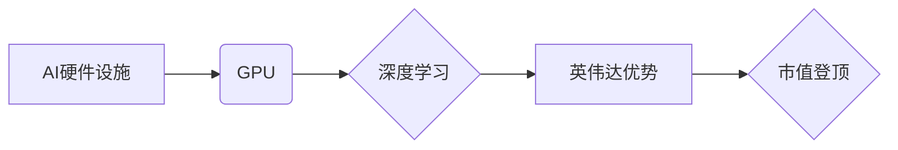

> 英伟达, AI, 硬件设施, GPU, 芯片设计, 市值, 数据中心, 深度学习, 

## 1. 背景介绍

2023年，英伟达(Nvidia)的市值突破了1万亿美元，成为全球市值最高的芯片公司。这一成就并非偶然，而是英伟达在人工智能(AI)领域的技术领先地位和市场占有率的体现。英伟达的核心产品——GPU(图形处理单元)，在深度学习等AI应用中发挥着至关重要的作用。本文将深入探讨英伟达市值登顶背后的原因，分析其在AI硬件设施领域的优势，并展望未来发展趋势。

## 2. 核心概念与联系

**2.1 AI硬件设施**

AI硬件设施是指专门为人工智能算法设计和优化的硬件设备。与传统的CPU(中央处理器)相比，AI硬件设施在处理海量数据和进行并行计算方面具有显著优势。

**2.2 GPU在AI领域的应用**

GPU最初被设计用于处理图形渲染，其并行计算能力使其成为深度学习算法的理想选择。深度学习算法通常需要处理大量的矩阵运算，而GPU的并行架构能够大幅度加速这些运算。

**2.3 英伟达的优势**

英伟达在GPU领域拥有多年的技术积累和市场经验。其高端GPU产品，如Tesla和A100，在性能、效率和功能方面都处于领先地位。此外，英伟达还提供了一套完整的AI软件生态系统，包括CUDA(Compute Unified Device Architecture)和cuDNN(cuDNN)，为开发者提供了丰富的工具和资源。

**2.4  核心概念与联系流程图**



## 3. 核心算法原理 & 具体操作步骤

**3.1 算法原理概述**

深度学习算法的核心是多层神经网络。神经网络由多个层组成，每层包含多个神经元。每个神经元接收来自上一层的输入，并通过权重进行加权求和，然后通过激活函数进行非线性变换，最终输出到下一层。

**3.2 算法步骤详解**

1. **数据预处理:** 将原始数据转换为深度学习算法可以理解的格式。
2. **模型构建:** 设计神经网络的结构，包括层数、神经元数量和激活函数等。
3. **参数初始化:** 为神经网络中的权重和偏置赋予初始值。
4. **前向传播:** 将输入数据通过神经网络进行一次传播，得到输出结果。
5. **损失函数计算:** 计算模型输出与真实值的差异，即损失值。
6. **反向传播:** 根据损失值，调整神经网络中的权重和偏置，使模型输出更接近真实值。
7. **迭代训练:** 重复前向传播、损失函数计算和反向传播的过程，直到模型达到预设的精度。

**3.3 算法优缺点**

**优点:**

* 能够自动学习数据中的特征，无需人工特征工程。
* 能够处理复杂的数据模式，例如图像、语音和文本。
* 具有强大的泛化能力，能够应用于不同的任务和领域。

**缺点:**

* 需要大量的训练数据和计算资源。
* 训练过程复杂，需要专业的知识和技能。
* 模型解释性较差，难以理解模型的决策过程。

**3.4 算法应用领域**

深度学习算法已广泛应用于各个领域，例如：

* **计算机视觉:** 图像识别、物体检测、图像分割、人脸识别等。
* **自然语言处理:** 文本分类、机器翻译、情感分析、对话系统等。
* **语音识别:** 语音转文本、语音合成等。
* **医疗诊断:** 病理图像分析、疾病预测等。
* **金融分析:** 风险评估、欺诈检测等。

## 4. 数学模型和公式 & 详细讲解 & 举例说明

**4.1 数学模型构建**

深度学习算法的核心是神经网络，其数学模型可以表示为一系列的矩阵运算。

**4.2 公式推导过程**

* **激活函数:** 激活函数用于引入非线性，使神经网络能够学习复杂的数据模式。常见的激活函数包括ReLU、Sigmoid和Tanh。

* **损失函数:** 损失函数用于衡量模型输出与真实值的差异。常见的损失函数包括均方误差(MSE)和交叉熵(Cross-Entropy)。

* **梯度下降:** 梯度下降是一种优化算法，用于调整神经网络中的权重和偏置，使模型输出更接近真实值。

**4.3 案例分析与讲解**

以图像分类为例，假设输入图像为一个32x32的像素矩阵，经过卷积层、池化层和全连接层后，得到一个包含10个神经元的输出层。每个神经元对应一个类别，输出值代表该类别属于该图像的概率。

**4.4 数学公式举例**

* **ReLU激活函数:**

$$f(x) = max(0, x)$$

* **均方误差损失函数:**

$$L = \frac{1}{N} \sum_{i=1}^{N} (y_i - \hat{y}_i)^2$$

其中，$y_i$为真实值，$\hat{y}_i$为模型输出，$N$为样本数量。

## 5. 项目实践：代码实例和详细解释说明

**5.1 开发环境搭建**

* 操作系统: Ubuntu 20.04
* CUDA Toolkit: 11.7
* cuDNN: 8.4
* Python: 3.8
* 深度学习框架: TensorFlow 2.x

**5.2 源代码详细实现**

```python
import tensorflow as tf

# 定义模型
model = tf.keras.models.Sequential([
    tf.keras.layers.Conv2D(32, (3, 3), activation='relu', input_shape=(32, 32, 3)),
    tf.keras.layers.MaxPooling2D((2, 2)),
    tf.keras.layers.Conv2D(64, (3, 3), activation='relu'),
    tf.keras.layers.MaxPooling2D((2, 2)),
    tf.keras.layers.Flatten(),
    tf.keras.layers.Dense(10, activation='softmax')
])

# 编译模型
model.compile(optimizer='adam',
              loss='sparse_categorical_crossentropy',
              metrics=['accuracy'])

# 训练模型
model.fit(x_train, y_train, epochs=10)

# 评估模型
loss, accuracy = model.evaluate(x_test, y_test)
print('Test loss:', loss)
print('Test accuracy:', accuracy)
```

**5.3 代码解读与分析**

* 代码定义了一个简单的卷积神经网络模型，用于图像分类任务。
* 模型包含卷积层、池化层和全连接层。
* 使用Adam优化器、交叉熵损失函数和准确率作为评估指标。
* 模型训练了10个epochs，并使用测试集评估模型性能。

**5.4 运行结果展示**

训练完成后，模型的测试准确率通常会达到较高的水平。

## 6. 实际应用场景

**6.1 数据中心**

英伟达的GPU在数据中心中广泛应用于机器学习训练、高性能计算和人工智能推理。

**6.2 自动驾驶**

英伟达的DRIVE平台为自动驾驶汽车提供强大的计算能力和感知能力。

**6.3 云计算**

各大云服务提供商都提供基于英伟达GPU的云计算服务，为开发者提供便捷的AI开发环境。

**6.4 未来应用展望**

随着人工智能技术的不断发展，英伟达的GPU将在更多领域得到应用，例如：

* **医疗保健:** 辅助诊断、药物研发、个性化医疗。
* **金融科技:** 风险管理、欺诈检测、投资决策。
* **工业自动化:** 机器视觉、过程优化、预测维护。

## 7. 工具和资源推荐

**7.1 学习资源推荐**

* **CUDA编程指南:** https://docs.nvidia.com/cuda/cuda-c-programming-guide/index.html
* **cuDNN文档:** https://docs.nvidia.com/deeplearning/cudnn/index.html
* **TensorFlow教程:** https://www.tensorflow.org/tutorials

**7.2 开发工具推荐**

* **Jupyter Notebook:** https://jupyter.org/
* **VS Code:** https://code.visualstudio.com/

**7.3 相关论文推荐**

* **ImageNet Classification with Deep Convolutional Neural Networks:** https://arxiv.org/abs/1202.1038
* **Attention Is All You Need:** https://arxiv.org/abs/1706.03762

## 8. 总结：未来发展趋势与挑战

**8.1 研究成果总结**

英伟达在AI硬件设施领域取得了显著成就，其GPU产品在性能、效率和功能方面处于领先地位。深度学习算法的不断发展也推动了AI技术的进步。

**8.2 未来发展趋势**

* **更高效的GPU架构:** 英伟达将继续探索新的GPU架构，以提高计算性能和能源效率。
* **异构计算:** 英伟达将推动CPU、GPU和专用加速器之间的协同工作，实现更强大的计算能力。
* **边缘计算:** 英伟达将开发更小型化和低功耗的GPU，用于边缘计算场景。

**8.3 面临的挑战**

* **芯片制造技术:** 随着芯片工艺的不断缩小，芯片制造技术面临着越来越大的挑战。
* **人才短缺:** AI领域人才需求量巨大，而人才供给不足。
* **伦理问题:** AI技术的快速发展也带来了伦理问题，例如算法偏见和数据隐私。

**8.4 研究展望**

未来，英伟达将继续致力于推动AI技术的进步，为人类社会创造更多价值。


## 9. 附录：常见问题与解答

**9.1 如何选择合适的GPU？**

选择合适的GPU取决于具体的应用场景和预算。英伟达提供了一系列GPU产品，从入门级到高端，性能和价格各不相同。

**9.2 如何学习CUDA编程？**

英伟达提供了丰富的CUDA编程指南和教程，可以帮助开发者学习CUDA编程。

**9.3 如何部署AI模型？**

可以将训练好的AI模型部署到数据中心、云平台或边缘设备上。

作者：禅与计算机程序设计艺术 / Zen and the Art of Computer Programming 


<end_of_turn>