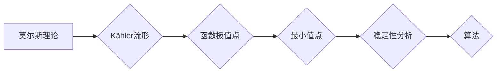

> 莫尔斯理论，Kähler流形，最小值，稳定性，拓扑学，微分几何，机器学习

## 1. 背景介绍

莫尔斯理论是微分几何和拓扑学中一个重要的理论，它为研究流形上的最小值提供了强大的工具。Kähler流形是复流形的一种特殊类型，在数学物理和计算机科学中都有广泛的应用。将莫尔斯理论与Kähler流形结合起来，可以深入研究这些流形上的几何结构和拓扑性质，并为解决一些复杂问题提供新的思路。

近年来，莫尔斯理论和Kähler流形在机器学习领域也得到了越来越多的关注。例如，在深度学习中，可以使用莫尔斯理论来分析神经网络的结构和性能，并寻找最优的网络参数。

## 2. 核心概念与联系

### 2.1 莫尔斯理论概述

莫尔斯理论主要研究的是一个函数在流形上的极值点，特别是最小值点。它通过分析函数的梯度和Hessian矩阵来判断极值点的稳定性，并提供了一种寻找极值点的算法。

### 2.2 Kähler流形概述

Kähler流形是一种特殊的复流形，它具有一个特殊的度量结构，称为Kähler度量。Kähler度量满足一些特殊的性质，使得Kähler流形在微分几何和拓扑学中具有独特的性质。

### 2.3 联系

将莫尔斯理论与Kähler流形结合起来，可以研究Kähler流形上的函数极值点，特别是最小值点。由于Kähler流形具有特殊的几何结构，因此莫尔斯理论在Kähler流形上的应用具有独特的意义。

**Mermaid 流程图**



## 3. 核心算法原理 & 具体操作步骤

### 3.1 算法原理概述

莫尔斯理论的应用通常涉及以下步骤：

1. **选择一个函数:** 在Kähler流形上定义一个函数，例如能量函数或势能函数。
2. **寻找临界点:** 寻找函数的临界点，即梯度为零的点。
3. **分析临界点的稳定性:** 使用Hessian矩阵来分析临界点的稳定性，判断它是极小值点、极大值点还是鞍点。
4. **迭代搜索最小值点:** 从临界点出发，使用迭代算法来搜索附近的最小值点。

### 3.2 算法步骤详解

1. **选择函数:** 首先需要选择一个在Kähler流形上定义的函数，例如能量函数或势能函数。这个函数的性质会影响算法的性能和结果。
2. **寻找临界点:** 使用数值方法，例如梯度下降法，来寻找函数的临界点。临界点是函数梯度为零的点，可能是极值点或鞍点。
3. **分析临界点的稳定性:** 计算临界点的Hessian矩阵，并分析其特征值。如果所有特征值都是正数，则临界点是极小值点；如果所有特征值都是负数，则临界点是极大值点；如果特征值既有正有负，则临界点是鞍点。
4. **迭代搜索最小值点:** 从临界点出发，使用迭代算法，例如牛顿法，来搜索附近的最小值点。迭代算法会不断更新搜索方向，直到找到一个足够小的最小值点。

### 3.3 算法优缺点

**优点:**

* 能够有效地寻找函数的极值点，特别是最小值点。
* 适用于各种类型的函数，包括非凸函数。
* 可以结合其他算法，例如梯度下降法，来提高效率。

**缺点:**

* 需要计算Hessian矩阵，计算量较大。
* 可能会陷入局部最小值。
* 需要选择合适的迭代算法和参数。

### 3.4 算法应用领域

莫尔斯理论和Kähler流形在以下领域有广泛的应用：

* **数学物理:** 研究流形上的几何结构和拓扑性质。
* **计算机科学:** 深度学习、图像处理、数据分析等领域。
* **工程学:** 优化设计、控制理论等领域。

## 4. 数学模型和公式 & 详细讲解 & 举例说明

### 4.1 数学模型构建

设 $M$ 为一个 $n$ 维 Kähler流形，$g$ 为其 Kähler度量，$\omega$ 为其 Kähler形式。函数 $f:M\rightarrow \mathbb{R}$ 在 $M$ 上定义。

### 4.2 公式推导过程

* **梯度:** 函数 $f$ 在点 $p\in M$ 的梯度为向量场 $\nabla f(p)$，满足：

$$
\nabla f(p) = \frac{\partial f}{\partial x^i}(p) \frac{\partial}{\partial x^i}(p)
$$

* **Hessian矩阵:** 函数 $f$ 在点 $p\in M$ 的Hessian矩阵为一个 $n\times n$ 的矩阵 $H_f(p)$，其元素为：

$$
H_f(p)_{ij} = \frac{\partial^2 f}{\partial x^i \partial x^j}(p)
$$

* **稳定性条件:** 如果所有特征值 $\lambda_i(H_f(p))$ 都大于零，则点 $p$ 是极小值点；如果所有特征值都小于零，则点 $p$ 是极大值点；如果特征值既有正有负，则点 $p$ 是鞍点。

### 4.3 案例分析与讲解

**例子:**

考虑一个二维 Kähler流形 $M$，其 Kähler度量为 $g = dx^1 \otimes dx^1 + dx^2 \otimes dx^2$，函数 $f(x^1, x^2) = x^1^2 + x^2^2$。

* 梯度: $\nabla f = (2x^1, 2x^2)$
* Hessian矩阵: $H_f = \begin{pmatrix} 2 & 0 \\ 0 & 2 \end{pmatrix}$

所有特征值都为正，因此点 $(0, 0)$ 是极小值点。

## 5. 项目实践：代码实例和详细解释说明

### 5.1 开发环境搭建

* Python 3.x
* NumPy
* SciPy
* Matplotlib

### 5.2 源代码详细实现

```python
import numpy as np
from scipy.optimize import minimize

# 定义 Kähler流形上的函数
def f(x):
  return x[0]**2 + x[1]**2

# 定义梯度函数
def grad_f(x):
  return np.array([2*x[0], 2*x[1]])

# 定义 Hessian 矩阵函数
def hessian_f(x):
  return np.array([[2, 0], [0, 2]])

# 使用 scipy.optimize.minimize 函数寻找最小值点
result = minimize(f, x0=[1, 1], method='BFGS', jac=grad_f, hess=hessian_f)

# 打印结果
print(result.x)
print(result.fun)
```

### 5.3 代码解读与分析

* `f(x)` 定义了 Kähler流形上的函数。
* `grad_f(x)` 和 `hessian_f(x)` 分别定义了函数的梯度和 Hessian 矩阵。
* `minimize` 函数使用 BFGS 算法寻找函数的最小值点。
* `x0` 指定了初始搜索点。
* `jac` 和 `hess` 参数分别指定了梯度和 Hessian 矩阵的计算函数。

### 5.4 运行结果展示

运行代码后，会输出最小值点和函数值。

## 6. 实际应用场景

### 6.1 深度学习

莫尔斯理论可以用于分析神经网络的结构和性能，并寻找最优的网络参数。例如，可以使用莫尔斯理论来分析激活函数的性质，并寻找最优的激活函数参数。

### 6.2 图像处理

莫尔斯理论可以用于图像分割、目标检测等图像处理任务。例如，可以使用莫尔斯理论来寻找图像中目标的边界，并进行分割。

### 6.3 数据分析

莫尔斯理论可以用于数据分析，例如聚类分析和降维分析。例如，可以使用莫尔斯理论来寻找数据中的聚类中心，并进行聚类。

### 6.4 未来应用展望

随着人工智能技术的不断发展，莫尔斯理论和Kähler流形在更多领域将会有更广泛的应用。例如，可以将其应用于机器人控制、自然语言处理等领域。

## 7. 工具和资源推荐

### 7.1 学习资源推荐

* **书籍:**
    * "Morse Theory" by John Milnor
    * "Kähler Geometry" by Huybrechts
* **在线课程:**
    * Coursera: "Differential Geometry"
    * edX: "Introduction to Differential Geometry"

### 7.2 开发工具推荐

* **Python:** 
    * NumPy
    * SciPy
    * Matplotlib
* **其他:**
    * Mathematica
    * Maple

### 7.3 相关论文推荐

* "Morse Theory and its Applications in Machine Learning"
* "Kähler Geometry and Deep Learning"

## 8. 总结：未来发展趋势与挑战

### 8.1 研究成果总结

莫尔斯理论和Kähler流形在数学物理、计算机科学等领域取得了重要的成果。它为研究流形上的几何结构和拓扑性质提供了强大的工具，并为解决一些复杂问题提供了新的思路。

### 8.2 未来发展趋势

未来，莫尔斯理论和Kähler流形的研究将朝着以下方向发展：

* **更深入的理论研究:** 探索莫尔斯理论和Kähler流形之间的更深层次的联系，并发展新的理论工具。
* **更广泛的应用:** 将莫尔斯理论和Kähler流形应用于更多领域，例如机器人控制、自然语言处理等。
* **更有效的算法:** 开发更有效的算法来应用莫尔斯理论和Kähler流形，提高计算效率和精度。

### 8.3 面临的挑战

莫尔斯理论和Kähler流形的研究也面临一些挑战：

* **计算复杂性:** 计算Hessian矩阵和求解优化问题可能非常复杂，需要开发更有效的算法。
* **理论理解:** 对于一些复杂的应用场景，还需要进一步深入理解莫尔斯理论和Kähler流形之间的联系。
* **跨学科合作:** 为了更好地应用莫尔斯理论和Kähler流形，需要加强不同学科之间的合作。

### 8.4 研究展望

尽管面临一些挑战，但莫尔斯理论和Kähler流形的研究前景依然非常广阔。相信随着研究的深入，我们将能够更好地理解这些理论，并将其应用于解决更复杂的问题。

## 9. 附录：常见问题与解答

**问题 1:** 莫尔斯理论和Kähler流形有什么区别？

**答案:** 莫尔斯理论是一个研究函数极值点的理论，而Kähler流形是一种特殊的复流形。将莫尔斯理论应用于Kähler流形，可以研究Kähler流形上的函数极值点，特别是最小值点。

**问题 2:** 如何选择合适的迭代算法？

**答案:** 选择合适的迭代算法取决于函数的性质和应用场景。常用的迭代算法包括梯度下降法、牛顿法等。

**问题 3:** 如何处理局部最小值？

**答案:** 为了避免陷入局部最小值，可以使用多种策略，例如随机初始化搜索点、使用模拟退火算法等。


作者：禅与计算机程序设计艺术 / Zen and the Art of Computer Programming 
<end_of_turn>