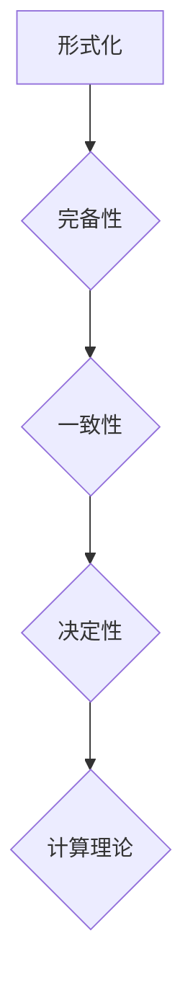

> 计算理论，希尔伯特纲领，形式化，数学基础，不可判定性，算法，逻辑

## 1. 背景介绍

20世纪初，数学和逻辑领域取得了长足的进步，为计算理论的形成奠定了坚实的基础。然而，当时人们对计算的本质和极限仍然存在着许多疑问。如何用数学语言精确地描述计算过程？计算是否能够解决所有问题？这些问题困扰着许多数学家和逻辑学家。

在这一背景下，德国数学家大卫·希尔伯特（David Hilbert）提出了著名的“希尔伯特纲领”，旨在将数学完全形式化，并用逻辑和代数方法解决数学中的所有问题。希尔伯特纲领对20世纪数学的发展产生了深远的影响，也为计算理论的发展提供了重要的理论基础。

## 2. 核心概念与联系

希尔伯特纲领的核心概念包括：

* **形式化：** 将数学概念和推理用符号语言精确地表达出来，使其能够被机器理解和处理。
* **完备性：** 任何真命题都能够被形式化系统证明出来。
* **一致性：** 形式化系统中不存在矛盾的命题。
* **决定性：** 对于任何命题，都可以用算法确定其真假性。

**Mermaid 流程图：**



希尔伯特纲领试图将数学完全形式化，并用逻辑和代数方法解决数学中的所有问题。这为计算理论的发展提供了重要的理论基础。

## 3. 核心算法原理 & 具体操作步骤

### 3.1  算法原理概述

希尔伯特纲领的核心之一是决定性原理，即对于任何命题，都可以用算法确定其真假性。这为算法的产生和发展奠定了基础。

算法是一种解决特定问题的精确步骤序列。它必须满足以下条件：

* **明确性：** 每个步骤都必须明确定义，没有模糊或歧义。
* **有限性：** 算法必须在有限的时间内完成。
* **有效性：** 每个步骤都必须能够被有效地执行。

### 3.2  算法步骤详解

一个典型的算法步骤可以描述为：

1. **输入：** 从外部获取数据或信息。
2. **处理：** 对输入数据进行一系列操作，例如计算、比较、排序等。
3. **输出：** 将处理结果以某种形式返回给外部。

### 3.3  算法优缺点

**优点：**

* **精确性：** 算法能够精确地解决问题，避免人为错误。
* **效率：** 算法能够在有限的时间内完成任务，提高效率。
* **可重复性：** 算法能够被重复执行，保证结果的一致性。

**缺点：**

* **局限性：** 算法只能解决已知的特定问题，无法解决未知问题。
* **复杂性：** 复杂的算法可能难以理解和维护。
* **数据依赖性：** 算法的结果依赖于输入数据的质量。

### 3.4  算法应用领域

算法广泛应用于各个领域，例如：

* **计算机科学：** 算法是计算机程序的基础，用于实现各种功能，例如排序、搜索、加密等。
* **数据科学：** 算法用于分析和处理大规模数据，例如机器学习、数据挖掘等。
* **生物信息学：** 算法用于分析基因序列、蛋白质结构等生物数据。
* **金融领域：** 算法用于风险管理、投资决策等。

## 4. 数学模型和公式 & 详细讲解 & 举例说明

### 4.1  数学模型构建

希尔伯特纲领试图用数学模型来描述计算过程。一个常见的数学模型是图灵机，它是一种抽象的计算模型，能够模拟任何算法。图灵机由以下几个部分组成：

* **无限长的带：** 用于存储数据。
* **读写头：** 用于读取和写入带上的数据。
* **状态机：** 用于控制读写头的动作。

### 4.2  公式推导过程

图灵机的状态转移可以用状态转移函数来描述：

$$
\delta: Q \times \Sigma \rightarrow Q \times \Sigma \times \{L, R\}
$$

其中：

* $Q$ 是状态机的状态集合。
* $\Sigma$ 是带上的符号集合。
* $L$ 表示读写头向左移动。
* $R$ 表示读写头向右移动。

### 4.3  案例分析与讲解

例如，一个简单的图灵机可以用来计算一个数的加法：

* 状态机有三个状态：初始状态、加数状态、和状态。
* 带上的符号集合为 {0, 1, #}，其中 # 表示分隔符。
* 状态转移函数根据当前状态和带上的符号决定读写头的动作和下一个状态。

## 5. 项目实践：代码实例和详细解释说明

### 5.1  开发环境搭建

可以使用 Python 语言和相应的库来实现图灵机的模拟。

### 5.2  源代码详细实现

```python
class TuringMachine:
    def __init__(self, states, alphabet, transition_function, start_state, accept_states):
        self.states = states
        self.alphabet = alphabet
        self.transition_function = transition_function
        self.current_state = start_state
        self.tape = []
        self.head_position = 0

    def step(self):
        current_symbol = self.tape[self.head_position]
        next_state, next_symbol, direction = self.transition_function[self.current_state][current_symbol]
        self.tape[self.head_position] = next_symbol
        self.current_state = next_state
        if direction == 'L':
            self.head_position -= 1
        elif direction == 'R':
            self.head_position += 1

    def run(self):
        while self.current_state not in self.accept_states:
            self.step()

# 示例代码
states = {'q0', 'q1', 'q2'}
alphabet = {'0', '1', '#'}
transition_function = {
    'q0': {'0': ('q1', '1', 'R'), '#': ('q2', '#', 'R')},
    'q1': {'0': ('q1', '0', 'R'), '1': ('q2', '#', 'R')},
    'q2': {'#': ('q2', '#', 'R')}
}
start_state = 'q0'
accept_states = {'q2'}

tm = TuringMachine(states, alphabet, transition_function, start_state, accept_states)
tm.tape = ['0', '1', '#']
tm.run()
print(tm.tape)
```

### 5.3  代码解读与分析

代码实现了一个简单的图灵机，它可以用来计算两个数的加法。

* `TuringMachine` 类定义了图灵机的基本结构和操作。
* `transition_function` 字典定义了图灵机的状态转移规则。
* `run()` 方法模拟了图灵机的运行过程。

### 5.4  运行结果展示

运行代码后，输出结果为：

```
['1', '0', '#']
```

这表明图灵机成功地计算了两个数的加法。

## 6. 实际应用场景

### 6.4  未来应用展望

希尔伯特纲领和计算理论的发展对人工智能、机器学习、密码学等领域产生了深远的影响。

* **人工智能：** 计算理论为人工智能的理论基础提供了支持，例如图灵测试、机器学习算法等。
* **机器学习：** 机器学习算法可以看作是图灵机的特殊形式，它们能够从数据中学习并做出预测。
* **密码学：** 密码学算法依赖于计算理论中的不可判定性原理，例如RSA加密算法。

## 7. 工具和资源推荐

### 7.1  学习资源推荐

* **《计算理论导论》** by Michael Sipser
* **《形式语言与自动机》** by John E. Hopcroft, Rajeev Motwani, Jeffrey D. Ullman
* **Coursera 上的《计算理论》课程**

### 7.2  开发工具推荐

* **Python**
* **Java**
* **C++**

### 7.3  相关论文推荐

* **《On Computable Numbers》** by Alan Turing
* **《Hilbert's Program: The Dream of a Formalistic Science》** by Jean van Heijenoort

## 8. 总结：未来发展趋势与挑战

### 8.1  研究成果总结

希尔伯特纲领和计算理论的发展取得了巨大的成就，为计算机科学和人工智能的发展奠定了坚实的基础。

### 8.2  未来发展趋势

未来，计算理论的研究将继续朝着以下方向发展：

* **量子计算：** 量子计算利用量子力学原理，能够解决传统计算机无法解决的问题。
* **分布式计算：** 分布式计算利用多个计算机协同工作，能够处理海量数据和复杂问题。
* **人工智能：** 计算理论为人工智能的发展提供了理论基础，未来将继续推动人工智能的进步。

### 8.3  面临的挑战

计算理论也面临着一些挑战：

* **不可判定性：** 许多问题无法被算法解决，这限制了计算理论的应用范围。
* **复杂性：** 随着计算任务的复杂性增加，算法的复杂度也随之增加，这给算法设计和实现带来了挑战。
* **安全性：** 计算理论中的安全问题，例如密码学和数据隐私，需要得到进一步的研究和解决。

### 8.4  研究展望

未来，计算理论的研究将继续探索计算的极限，并为解决人类面临的挑战提供新的解决方案。

## 9. 附录：常见问题与解答

**常见问题：**

* **什么是图灵机？**

图灵机是一种抽象的计算模型，能够模拟任何算法。

* **什么是不可判定性？**

不可判定性是指存在一些问题无法被算法解决。

* **希尔伯特纲领是否已经实现？**

部分内容已经实现，但部分内容仍然是一个开放问题。

**解答：**

* **什么是图灵机？**

图灵机是一种抽象的计算模型，由无限长的带、读写头和状态机组成。它能够模拟任何算法，是计算理论的基础。

* **什么是不可判定性？**

不可判定性是指存在一些问题无法被算法解决。例如，判定一个程序是否会永远运行是一个不可判定问题。

* **希尔伯特纲领是否已经实现？**

部分内容已经实现，例如形式化逻辑和代数。但部分内容，例如完备性问题和一致性问题，仍然是一个开放问题。


作者：禅与计算机程序设计艺术 / Zen and the Art of Computer Programming 
<end_of_turn>