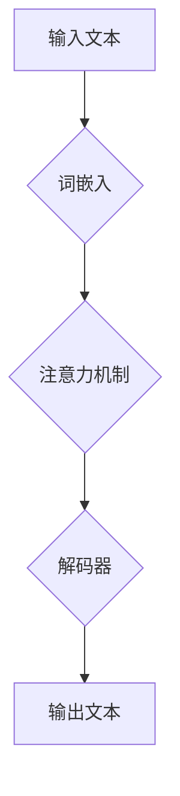

> 大模型、语言模型、思维、认知、人工智能、深度学习、自然语言处理

## 1. 背景介绍

近年来，深度学习技术取得了飞速发展，特别是大规模语言模型（Large Language Model，LLM）的出现，为人工智能领域带来了革命性的变革。这些模型，例如GPT-3、LaMDA和BERT，展现出惊人的文本生成、翻译、摘要和问答能力，甚至能够创作诗歌、剧本和代码。然而，尽管大模型在某些方面表现出令人惊叹的智能，但它们仍然无法真正理解语言的含义，更无法像人类一样进行思考和推理。

大模型的训练过程本质上是统计学习，它们通过学习海量文本数据中的模式和关系，来预测下一个词或句子。然而，语言的本质不仅仅是符号的排列组合，它还蕴含着丰富的语义、逻辑和情感信息。大模型虽然能够模仿人类语言的结构和语法，但它们缺乏对这些深层含义的理解。

## 2. 核心概念与联系

**2.1 语言与思维的本质区别**

语言是人类交流和表达思想的工具，而思维则是人类认知和理解世界的过程。语言是符号系统，它通过词汇、语法和语义来表达概念和关系；而思维则是抽象、逻辑和创造性的过程，它涉及到对信息的理解、分析、整合和生成。

**2.2 大模型的局限性**

大模型虽然能够生成逼真的文本，但它们仍然局限于以下几个方面：

* **缺乏真正的理解:** 大模型只能识别和预测语言模式，而无法真正理解语言的含义和上下文。
* **缺乏逻辑推理能力:** 大模型难以进行复杂的逻辑推理和推论，它们只能根据训练数据中的模式进行判断。
* **缺乏创造力和想象力:** 大模型的文本生成能力主要依赖于训练数据中的模式，它们难以产生真正原创和富有想象力的内容。

**2.3  Mermaid 流程图**



## 3. 核心算法原理 & 具体操作步骤

**3.1 算法原理概述**

大模型的核心算法是基于深度学习的Transformer架构，它利用注意力机制来捕捉文本中的长距离依赖关系。Transformer模型由编码器和解码器两部分组成。编码器将输入文本转换为向量表示，解码器则根据编码器的输出生成目标文本。

**3.2 算法步骤详解**

1. **词嵌入:** 将输入文本中的每个词转换为向量表示，每个词对应一个唯一的向量。
2. **编码器:** 将词向量输入到编码器中，编码器通过多层Transformer模块进行处理，最终将输入文本转换为一个上下文相关的向量表示。
3. **注意力机制:** 在编码器和解码器中，注意力机制用于捕捉文本中的长距离依赖关系。注意力机制会为每个词分配一个权重，权重高的词对输出的影响更大。
4. **解码器:** 解码器根据编码器的输出和之前生成的文本，预测下一个词。解码器也使用多层Transformer模块进行处理，并利用注意力机制来选择最相关的上下文信息。
5. **输出文本:** 解码器最终输出一个序列化的词向量，将其转换为文本即可。

**3.3 算法优缺点**

* **优点:**
    * 能够捕捉长距离依赖关系，提高文本理解能力。
    * 训练效率高，能够处理海量文本数据。
    * 在文本生成、翻译、摘要等任务中表现出色。
* **缺点:**
    * 训练成本高，需要大量的计算资源和数据。
    * 缺乏对语言深层含义的理解。
    * 容易受到训练数据中的偏差影响。

**3.4 算法应用领域**

* 自然语言处理 (NLP)：文本分类、情感分析、机器翻译、问答系统等。
* 人工智能 (AI)：聊天机器人、虚拟助手、智能客服等。
* 代码生成：自动生成代码、代码补全等。
* 内容创作：自动生成文章、诗歌、剧本等。

## 4. 数学模型和公式 & 详细讲解 & 举例说明

**4.1 数学模型构建**

Transformer模型的核心是注意力机制，它可以表示为一个矩阵乘法运算。假设输入文本的词向量为X，则注意力权重矩阵为A，输出的上下文向量为C。

**公式:**

$$C = softmax(A * X)$$

其中，softmax函数将注意力权重矩阵A与词向量X进行矩阵乘法，然后对结果进行归一化，得到每个词的上下文向量。

**4.2 公式推导过程**

注意力权重矩阵A的计算过程涉及到多个步骤：

1. 计算词向量之间的相似度。
2. 将相似度转换为注意力权重。
3. 对注意力权重进行归一化。

**4.3 案例分析与讲解**

例如，在机器翻译任务中，Transformer模型可以利用注意力机制来捕捉源语言和目标语言之间的对应关系。

## 5. 项目实践：代码实例和详细解释说明

**5.1 开发环境搭建**

* Python 3.7+
* PyTorch 1.7+
* CUDA 10.2+

**5.2 源代码详细实现**

```python
import torch
import torch.nn as nn

class Transformer(nn.Module):
    def __init__(self, vocab_size, embedding_dim, num_heads, num_layers):
        super(Transformer, self).__init__()
        self.embedding = nn.Embedding(vocab_size, embedding_dim)
        self.transformer_layers = nn.ModuleList([
            nn.TransformerEncoderLayer(embedding_dim, num_heads)
            for _ in range(num_layers)
        ])
        self.linear = nn.Linear(embedding_dim, vocab_size)

    def forward(self, x):
        x = self.embedding(x)
        for layer in self.transformer_layers:
            x = layer(x)
        x = self.linear(x)
        return x
```

**5.3 代码解读与分析**

* `__init__`方法初始化模型参数，包括词嵌入层、Transformer编码器层和输出层。
* `forward`方法定义模型的正向传播过程，将输入词向量转换为输出文本。

**5.4 运行结果展示**

训练好的Transformer模型可以用于各种自然语言处理任务，例如机器翻译、文本摘要和问答系统。

## 6. 实际应用场景

**6.1 机器翻译:** Transformer模型在机器翻译领域取得了显著的成果，例如Google Translate和DeepL翻译引擎都采用了Transformer架构。

**6.2 文本摘要:** Transformer模型可以自动生成文本摘要，例如新闻文章、会议记录和学术论文。

**6.3 问答系统:** Transformer模型可以构建问答系统，例如自动回答用户的问题，并提供相关信息。

**6.4 未来应用展望**

* **个性化教育:** 根据学生的学习进度和需求，提供个性化的学习内容和辅导。
* **医疗诊断:** 分析患者的病历和症状，辅助医生进行诊断和治疗。
* **法律服务:** 自动分析法律文件，提供法律咨询和建议。

## 7. 工具和资源推荐

**7.1 学习资源推荐**

* **论文:**
    * Attention Is All You Need (Vaswani et al., 2017)
    * BERT: Pre-training of Deep Bidirectional Transformers for Language Understanding (Devlin et al., 2018)
* **书籍:**
    * Deep Learning (Goodfellow et al., 2016)
    * Natural Language Processing with PyTorch (Bird et al., 2019)

**7.2 开发工具推荐**

* **PyTorch:** 深度学习框架
* **TensorFlow:** 深度学习框架
* **Hugging Face Transformers:** 预训练 Transformer 模型库

**7.3 相关论文推荐**

* GPT-3: Language Models are Few-Shot Learners (Brown et al., 2020)
* LaMDA: Language Models for Dialogue Applications (Google AI Blog, 2021)

## 8. 总结：未来发展趋势与挑战

**8.1 研究成果总结**

近年来，大模型在自然语言处理领域取得了显著的进展，展现出强大的文本生成、理解和推理能力。

**8.2 未来发展趋势**

* **模型规模的进一步扩大:** 随着计算资源的不断提升，大模型的规模将继续扩大，从而提升其性能和能力。
* **多模态学习:** 将文本、图像、音频等多种模态信息融合在一起，构建更全面的认知模型。
* **可解释性研究:** 研究大模型的决策过程，提高其透明度和可解释性。

**8.3 面临的挑战**

* **数据偏见:** 大模型的训练数据可能存在偏见，导致模型输出结果存在偏差。
* **计算资源消耗:** 训练大模型需要大量的计算资源，这对于资源有限的机构和个人来说是一个挑战。
* **伦理问题:** 大模型的应用可能带来一些伦理问题，例如信息操纵、隐私泄露等，需要引起重视和探讨。

**8.4 研究展望**

未来，大模型的研究将继续朝着更智能、更安全、更可解释的方向发展。


## 9. 附录：常见问题与解答

**9.1 如何训练一个大模型？**

训练一个大模型需要大量的计算资源、数据和专业知识。一般来说，需要使用深度学习框架，例如PyTorch或TensorFlow，并根据具体任务选择合适的模型架构和训练策略。

**9.2 如何解决大模型的偏见问题？**

解决大模型的偏见问题需要从多个方面入手，例如：

* 使用更全面、更均衡的数据集进行训练。
* 在训练过程中加入对抗训练，以减少模型对特定特征的过度依赖。
* 开发可解释性模型，以便更好地理解模型的决策过程，并识别潜在的偏见。

**9.3 大模型的未来发展方向是什么？**

大模型的未来发展方向包括：

* 模型规模的进一步扩大。
* 多模态学习。
* 可解释性研究。
* 伦理问题研究。


作者：禅与计算机程序设计艺术 / Zen and the Art of Computer Programming 
<end_of_turn>