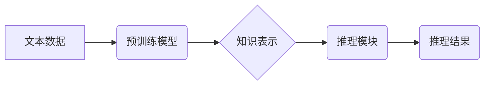

> 大语言模型，认知盲点，推理能力，逻辑推理，知识图谱，常识推理，因果关系，文本理解

## 1. 背景介绍

近年来，大语言模型（LLM）在自然语言处理领域取得了令人瞩目的成就。从文本生成、翻译到问答和代码编写，LLM展现出强大的能力，甚至在某些方面超越了人类的表现。然而，尽管LLM取得了如此巨大的进步，它们仍然存在着一些关键的认知盲点，尤其是在推理能力方面。

传统的AI系统通常依赖于明确的规则和逻辑程序，而LLM则通过学习海量文本数据来构建其知识和理解。这种学习方式使得LLM能够处理更复杂和灵活的语言任务，但也带来了新的挑战。由于LLM的训练数据通常是文本形式，它们难以直接学习和理解因果关系、逻辑推理和抽象概念等高阶认知能力。

## 2. 核心概念与联系

**2.1 大语言模型 (LLM)**

大语言模型是一种基于Transformer架构的深度学习模型，通过学习海量文本数据来理解和生成人类语言。它们拥有大量的参数，能够捕捉语言的复杂结构和语义关系。

**2.2 认知盲点**

认知盲点是指AI系统在某些特定领域或任务中表现出明显的缺陷或局限性。对于LLM来说，常见的认知盲点包括：

* **逻辑推理能力不足:** LLM在处理逻辑推理问题时往往表现不佳，例如无法从已知信息推导出新的结论，或者容易受到错误信息的影响。
* **常识推理缺失:** LLM缺乏人类的常识知识，难以理解和解释一些与日常生活息息相关的场景和事件。
* **因果关系理解困难:** LLM难以理解事件之间的因果关系，例如无法判断一个事件是否导致了另一个事件的发生。
* **抽象概念理解有限:** LLM在理解抽象概念方面存在困难，例如难以理解时间、空间、道德等概念。

**2.3 解决方案**

为了解决LLM的认知盲点，研究者们正在探索多种解决方案，包括：

* **增强逻辑推理能力:** 通过引入逻辑推理模块或算法，帮助LLM进行更准确的逻辑推理。
* **融入常识知识:** 将人类的常识知识融入到LLM的训练数据中，帮助LLM理解和解释现实世界。
* **学习因果关系:** 使用因果推理算法或数据集，帮助LLM学习事件之间的因果关系。
* **发展抽象概念理解:** 使用更高级的语义表示和推理方法，帮助LLM理解抽象概念。

**2.4 Mermaid 流程图**



## 3. 核心算法原理 & 具体操作步骤

### 3.1 算法原理概述

LLM的训练主要基于Transformer架构，它利用自注意力机制来捕捉文本序列中的长距离依赖关系。通过大量的文本数据训练，LLM能够学习到语言的语法、语义和上下文关系。

### 3.2 算法步骤详解

1. **数据预处理:** 将文本数据进行清洗、分词、标记等预处理操作，使其能够被模型理解。
2. **模型训练:** 使用预训练模型和大量的文本数据进行训练，学习语言的表示和关系。
3. **微调:** 将预训练模型微调到特定任务，例如文本分类、问答或机器翻译。
4. **推理:** 将输入文本输入到微调后的模型中，得到相应的输出结果。

### 3.3 算法优缺点

**优点:**

* 强大的文本理解和生成能力
* 可以处理各种自然语言任务
* 能够学习复杂的语言结构和语义关系

**缺点:**

* 训练成本高
* 容易受到训练数据的影响
* 缺乏逻辑推理和常识推理能力

### 3.4 算法应用领域

* **自然语言处理:** 文本分类、问答、机器翻译、文本摘要等
* **人工智能助手:** 聊天机器人、虚拟助理
* **代码生成:** 自动生成代码片段
* **创意写作:** 生成诗歌、小说等创意文本

## 4. 数学模型和公式 & 详细讲解 & 举例说明

### 4.1 数学模型构建

LLM的训练过程可以看作是一个优化问题，目标是找到模型参数，使得模型在训练数据上的预测结果与真实标签尽可能接近。

**损失函数:**

$$
L = \sum_{i=1}^{N} \mathcal{L}(y_i, \hat{y}_i)
$$

其中：

* $N$ 是训练数据的样本数量
* $\mathcal{L}$ 是损失函数，例如交叉熵损失
* $y_i$ 是真实标签
* $\hat{y}_i$ 是模型预测的标签

**优化算法:**

常用的优化算法包括梯度下降法、Adam算法等。这些算法通过迭代更新模型参数，使得损失函数不断减小。

### 4.2 公式推导过程

损失函数的最小化可以通过梯度下降法实现。梯度下降法的核心思想是沿着梯度的负方向更新模型参数，从而使得损失函数不断减小。

**梯度更新公式:**

$$
\theta_{t+1} = \theta_t - \alpha \nabla_{\theta} L(\theta)
$$

其中：

* $\theta$ 是模型参数
* $\alpha$ 是学习率
* $\nabla_{\theta} L(\theta)$ 是损失函数对模型参数的梯度

### 4.3 案例分析与讲解

例如，在文本分类任务中，LLM会将输入文本映射到不同的类别。损失函数可以是交叉熵损失，它衡量模型预测结果与真实标签之间的差异。通过梯度下降法，LLM会不断调整模型参数，使得模型在训练数据上的预测结果与真实标签更加一致。

## 5. 项目实践：代码实例和详细解释说明

### 5.1 开发环境搭建

* Python 3.7+
* PyTorch 或 TensorFlow
* CUDA 和 cuDNN (可选，用于GPU加速)

### 5.2 源代码详细实现

```python
import torch
import torch.nn as nn

class Transformer(nn.Module):
    # ... (Transformer模型的实现)

# 实例化模型
model = Transformer()

# 定义损失函数和优化器
criterion = nn.CrossEntropyLoss()
optimizer = torch.optim.Adam(model.parameters())

# 训练模型
for epoch in range(num_epochs):
    for batch in train_dataloader:
        # 前向传播
        outputs = model(batch['input_ids'])
        loss = criterion(outputs, batch['labels'])

        # 反向传播
        optimizer.zero_grad()
        loss.backward()

        # 更新参数
        optimizer.step()

# 保存模型
torch.save(model.state_dict(), 'model.pth')
```

### 5.3 代码解读与分析

* Transformer模型的实现：该代码示例展示了Transformer模型的基本结构，包括编码器、解码器和注意力机制等。
* 损失函数和优化器：使用交叉熵损失函数和Adam优化器来训练模型。
* 训练循环：训练模型的过程包括前向传播、反向传播和参数更新。
* 模型保存：训练完成后，将模型参数保存到文件以便后续使用。

### 5.4 运行结果展示

训练完成后，可以使用测试数据评估模型的性能，例如计算准确率、F1-score等指标。

## 6. 实际应用场景

### 6.1 文本生成

LLM可以用于生成各种类型的文本，例如：

* **小说、诗歌、剧本:** 通过学习大量的文学作品，LLM可以生成具有创意和风格的文本。
* **新闻报道、文章:** LLM可以根据给定的主题和关键词生成新闻报道或文章。
* **对话系统:** LLM可以用于构建聊天机器人，进行自然流畅的对话。

### 6.2 机器翻译

LLM可以用于将文本从一种语言翻译成另一种语言。

### 6.3 问答系统

LLM可以用于构建问答系统，回答用户提出的问题。

### 6.4 代码生成

LLM可以学习代码的语法和结构，并根据给定的需求生成代码片段。

### 6.5 未来应用展望

LLM在未来将有更广泛的应用场景，例如：

* **个性化教育:** 根据学生的学习进度和需求，提供个性化的学习内容和辅导。
* **医疗诊断:** 辅助医生进行疾病诊断，提高诊断准确率。
* **法律服务:** 自动生成法律文件，提供法律咨询服务。

## 7. 工具和资源推荐

### 7.1 学习资源推荐

* **书籍:**
    * 《深度学习》
    * 《自然语言处理》
* **在线课程:**
    * Coursera: 自然语言处理
    * edX: 深度学习
* **博客和论坛:**
    * Hugging Face
    * TensorFlow Blog

### 7.2 开发工具推荐

* **PyTorch:** 深度学习框架
* **TensorFlow:** 深度学习框架
* **Transformers:** 预训练模型库

### 7.3 相关论文推荐

* **Attention Is All You Need:** https://arxiv.org/abs/1706.03762
* **BERT: Pre-training of Deep Bidirectional Transformers for Language Understanding:** https://arxiv.org/abs/1810.04805

## 8. 总结：未来发展趋势与挑战

### 8.1 研究成果总结

近年来，LLM取得了显著的进展，在文本理解、生成和推理等方面展现出强大的能力。

### 8.2 未来发展趋势

* **更强大的模型:** 研究者们将继续开发更强大、更复杂的LLM，例如千亿参数甚至万亿参数的模型。
* **更有效的训练方法:** 研究者们将探索更有效的训练方法，例如分布式训练和迁移学习，以降低训练成本和提高训练效率。
* **更强的推理能力:** 研究者们将致力于增强LLM的推理能力，使其能够更好地理解和解决逻辑推理和常识推理问题。
* **更广泛的应用场景:** LLM将应用于更多领域，例如医疗、教育、法律等，为人类社会带来更多价值。

### 8.3 面临的挑战

* **数据安全和隐私:** LLM的训练需要大量的文本数据，如何保证数据安全和隐私是一个重要的挑战。
* **模型可解释性:** LLM的决策过程往往是复杂的，难以理解，如何提高模型的可解释性是一个重要的研究方向。
* **伦理问题:** LLM的应用可能带来一些伦理问题，例如信息操纵、偏见和歧视，需要认真思考和解决。

### 8.4 研究展望

未来，LLM将继续朝着更强大、更智能、更安全的方向发展，为人类社会带来更多机遇和挑战。


## 9. 附录：常见问题与解答

**Q1: LLM的训练需要多少数据？**

A1: LLM的训练需要大量的文本数据，通常需要数十亿甚至数千亿个单词。

**Q2: LLM的训练成本很高吗？**

A2: 由于LLM的模型规模庞大，训练成本确实很高，需要大量的计算资源和时间。

**Q3: LLM是否可以理解人类的情感？**

A3: 目前LLM还无法真正理解人类的情感，它只能识别文本中的情感表达。

**Q4: LLM是否会取代人类的工作？**

A4: LLM可以自动化一些重复性工作，但它并不会完全取代人类的工作。人类仍然需要发挥创造力、批判性思维和情感智能等方面的优势。


作者：禅与计算机程序设计艺术 / Zen and the Art of Computer Programming 
<end_of_turn>