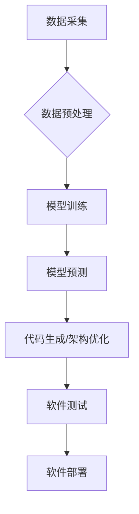

> 数据驱动开发，机器学习，深度学习，人工智能，软件架构，软件工程，数据分析

## 1. 背景介绍

软件开发行业正经历着前所未有的变革。传统的软件开发模式，以人为中心，依赖于人工编码和设计，面临着效率低下、迭代周期长、难以应对复杂系统等挑战。随着数据量的爆炸式增长和人工智能技术的飞速发展，数据驱动开发模式应运而生，成为软件开发的新趋势。

数据驱动开发的核心思想是将数据作为软件开发的驱动因素，利用机器学习、深度学习等人工智能技术，从海量数据中挖掘价值，自动生成代码、优化软件架构、预测用户需求等。这种模式能够显著提高软件开发效率，降低开发成本，并赋予软件更强的智能化和适应性。

## 2. 核心概念与联系

数据驱动开发的核心概念包括：

* **数据：** 数据是软件开发的基石，包括用户行为数据、系统运行数据、市场趋势数据等。
* **机器学习：** 机器学习算法能够从数据中学习模式和规律，并用于预测、分类、聚类等任务。
* **深度学习：** 深度学习是机器学习的子集，利用多层神经网络模拟人类大脑的学习过程，能够处理更复杂的数据类型，并取得更优的性能。
* **人工智能：** 人工智能是模拟和扩展人类智能的学科，包括机器学习、深度学习、自然语言处理等多个领域。

数据驱动开发模式的架构如下：



## 3. 核心算法原理 & 具体操作步骤

### 3.1  算法原理概述

数据驱动开发中常用的算法包括：

* **监督学习：** 利用标记数据训练模型，预测新的数据标签。例如，根据用户历史行为数据，预测用户对特定产品的购买意愿。
* **无监督学习：** 从未标记数据中发现模式和结构。例如，根据用户行为数据，聚类用户群体，识别不同类型的用户。
* **强化学习：** 通过试错学习，让智能体在环境中获得最大奖励。例如，训练机器人完成特定任务，例如导航、抓取等。

### 3.2  算法步骤详解

以监督学习为例，其基本步骤如下：

1. **数据采集：** 收集与目标任务相关的标记数据。
2. **数据预处理：** 清洗、转换、特征工程等，将数据转换为模型可理解的形式。
3. **模型选择：** 根据任务类型和数据特点，选择合适的模型算法。
4. **模型训练：** 利用标记数据训练模型，调整模型参数，使其能够准确预测目标变量。
5. **模型评估：** 使用测试数据评估模型性能，例如准确率、召回率、F1-score等。
6. **模型部署：** 将训练好的模型部署到实际应用场景中，用于预测新的数据。

### 3.3  算法优缺点

**优点：**

* 自动化程度高，能够自动生成代码、优化架构等，提高开发效率。
* 能够从海量数据中挖掘价值，发现隐藏的模式和规律。
* 软件能够根据用户行为和数据反馈进行动态调整，提高适应性。

**缺点：**

* 需要大量高质量的数据进行训练，数据质量直接影响模型性能。
* 模型训练过程复杂，需要专业的技术人员进行操作。
* 模型解释性较差，难以理解模型的决策过程。

### 3.4  算法应用领域

数据驱动开发模式已在多个领域得到应用，例如：

* **软件推荐系统：** 根据用户历史行为数据，推荐用户感兴趣的软件。
* **代码生成工具：** 根据用户需求，自动生成代码片段或完整程序。
* **软件架构优化：** 分析软件运行数据，优化软件架构，提高性能和可靠性。
* **用户体验优化：** 分析用户行为数据，优化软件界面和功能，提升用户体验。

## 4. 数学模型和公式 & 详细讲解 & 举例说明

### 4.1  数学模型构建

数据驱动开发中常用的数学模型包括：

* **线性回归模型：** 用于预测连续变量，假设目标变量与输入变量之间存在线性关系。
* **逻辑回归模型：** 用于预测分类变量，假设目标变量与输入变量之间存在非线性关系。
* **支持向量机模型：** 用于分类和回归任务，通过寻找最佳的分隔超平面来分类数据。
* **神经网络模型：** 能够处理复杂的数据类型，并学习非线性关系，广泛应用于图像识别、自然语言处理等领域。

### 4.2  公式推导过程

以线性回归模型为例，其目标是找到最佳的权重参数，使得模型预测值与真实值之间的误差最小。

**损失函数：**

$$
L(w) = \frac{1}{n} \sum_{i=1}^{n} (y_i - \hat{y}_i)^2
$$

其中：

* $w$ 是模型的权重参数
* $n$ 是样本数量
* $y_i$ 是第 $i$ 个样本的真实值
* $\hat{y}_i$ 是模型预测的第 $i$ 个样本的值

**梯度下降算法：**

$$
w = w - \alpha \nabla L(w)
$$

其中：

* $\alpha$ 是学习率
* $\nabla L(w)$ 是损失函数的梯度

### 4.3  案例分析与讲解

假设我们想要预测房屋价格，可以使用线性回归模型。

**输入变量：** 房屋面积、房间数量、地理位置等。

**输出变量：** 房屋价格

我们可以收集房屋数据，训练线性回归模型，并使用模型预测新房子的价格。

## 5. 项目实践：代码实例和详细解释说明

### 5.1  开发环境搭建

* Python 3.x
* TensorFlow 或 PyTorch 等深度学习框架
* Jupyter Notebook 或 VS Code 等代码编辑器

### 5.2  源代码详细实现

```python
import tensorflow as tf

# 定义模型结构
model = tf.keras.models.Sequential([
    tf.keras.layers.Dense(64, activation='relu', input_shape=(7,)),
    tf.keras.layers.Dense(32, activation='relu'),
    tf.keras.layers.Dense(1)
])

# 编译模型
model.compile(optimizer='adam', loss='mse')

# 训练模型
model.fit(X_train, y_train, epochs=10)

# 评估模型
loss = model.evaluate(X_test, y_test)
print('Loss:', loss)

# 预测新数据
predictions = model.predict(new_data)
```

### 5.3  代码解读与分析

* 代码首先定义了模型结构，包括输入层、隐藏层和输出层。
* 然后编译模型，指定优化器、损失函数等参数。
* 接着训练模型，使用训练数据进行模型参数的更新。
* 最后评估模型性能，并使用模型预测新数据。

### 5.4  运行结果展示

运行结果包括模型训练过程中的损失值变化曲线，以及模型在测试数据上的损失值和预测结果。

## 6. 实际应用场景

数据驱动开发模式已在多个领域得到应用，例如：

* **软件推荐系统：** 根据用户历史行为数据，推荐用户感兴趣的软件。
* **代码生成工具：** 根据用户需求，自动生成代码片段或完整程序。
* **软件架构优化：** 分析软件运行数据，优化软件架构，提高性能和可靠性。
* **用户体验优化：** 分析用户行为数据，优化软件界面和功能，提升用户体验。

### 6.4  未来应用展望

随着数据量的继续增长和人工智能技术的不断发展，数据驱动开发模式将更加广泛地应用于软件开发领域。未来，我们可能会看到：

* 更智能的代码生成工具，能够自动生成更复杂的代码。
* 更精准的软件推荐系统，能够推荐更符合用户需求的软件。
* 更高效的软件架构优化工具，能够帮助开发人员更快地构建高性能、高可靠的软件系统。

## 7. 工具和资源推荐

### 7.1  学习资源推荐

* **书籍：**
    * 《深度学习》
    * 《机器学习实战》
    * 《Python机器学习》
* **在线课程：**
    * Coursera
    * edX
    * Udacity

### 7.2  开发工具推荐

* **Python：** 
* **TensorFlow：** 
* **PyTorch：** 
* **Jupyter Notebook：** 
* **VS Code：**

### 7.3  相关论文推荐

* **《Attention Is All You Need》**
* **《BERT: Pre-training of Deep Bidirectional Transformers for Language Understanding》**
* **《Generative Adversarial Networks》**

## 8. 总结：未来发展趋势与挑战

### 8.1  研究成果总结

数据驱动开发模式在软件开发领域取得了显著的成果，能够提高开发效率、降低开发成本，并赋予软件更强的智能化和适应性。

### 8.2  未来发展趋势

未来，数据驱动开发模式将朝着以下方向发展：

* **更智能的模型：** 开发更智能、更强大的机器学习模型，能够处理更复杂的数据类型，并做出更准确的预测。
* **更自动化流程：** 将更多软件开发流程自动化，例如代码生成、测试、部署等，进一步提高开发效率。
* **更个性化的体验：** 利用数据驱动开发模式，为用户提供更个性化的软件体验。

### 8.3  面临的挑战

数据驱动开发模式也面临着一些挑战：

* **数据质量问题：** 数据质量直接影响模型性能，需要保证数据准确、完整、一致。
* **模型解释性问题：** 许多机器学习模型的决策过程难以解释，这可能会导致模型的可信度降低。
* **伦理问题：** 数据驱动开发模式可能会涉及到用户隐私和数据安全等伦理问题，需要谨慎处理。

### 8.4  研究展望

未来，我们需要继续研究和探索数据驱动开发模式，解决其面临的挑战，并将其应用于更多领域，推动软件开发行业的发展。

## 9. 附录：常见问题与解答

* **Q：数据驱动开发模式是否会取代传统软件开发模式？**

* **A：** 数据驱动开发模式是一种新的软件开发模式，它可以与传统软件开发模式相结合，发挥各自的优势。未来，两种模式可能会共同存在，并相互补充。

* **Q：数据驱动开发模式需要哪些技术技能？**

* **A：** 数据驱动开发模式需要掌握机器学习、深度学习、数据分析等技术技能，以及软件开发基础知识。

* **Q：数据驱动开发模式有哪些风险？**

* **A：** 数据驱动开发模式存在数据质量问题、模型解释性问题、伦理问题等风险，需要谨慎处理。


作者：禅与计算机程序设计艺术 / Zen and the Art of Computer Programming 
<end_of_turn>