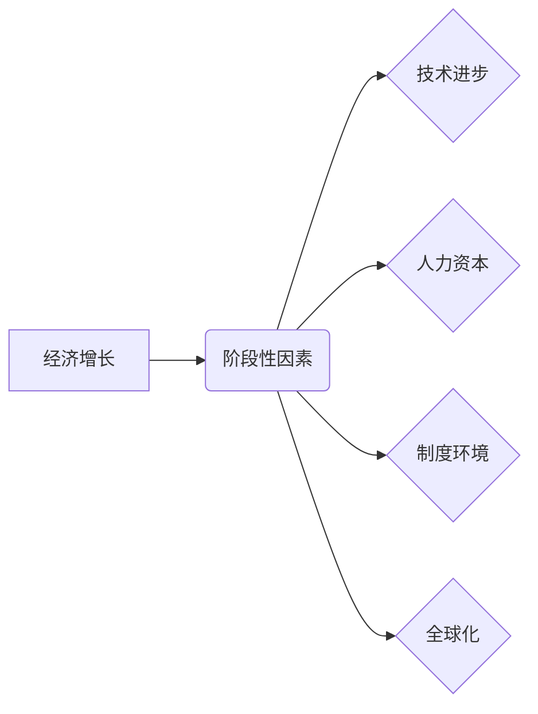

> 经济增长、阶段性因素、技术进步、人力资本、制度环境、全球化、可持续发展

## 1. 背景介绍

经济增长是社会发展的重要指标，它反映了一个国家或地区的生产能力和生活水平的提升。然而，经济增长的速度和模式并非一成不变，而是受到多种因素的影响，其中阶段性因素扮演着至关重要的角色。

阶段性因素是指在特定历史时期，对经济增长产生重大影响的独特条件或环境。这些因素往往具有时间性、空间性和偶然性，其影响力在不同阶段可能呈现出显著差异。理解阶段性因素对经济增长的影响，对于制定有效的经济政策、促进可持续发展具有重要意义。

## 2. 核心概念与联系

**2.1 经济增长**

经济增长是指一个国家或地区的国民生产总值（GDP）在一定时期内以一定的百分比增长。它通常被视为衡量经济发展水平的重要指标。

**2.2 阶段性因素**

阶段性因素是指在特定历史时期，对经济增长产生重大影响的独特条件或环境。这些因素往往具有时间性、空间性和偶然性，其影响力在不同阶段可能呈现出显著差异。

**2.3 阶段性因素与经济增长的关系**

阶段性因素对经济增长的影响是多方面的，可以从以下几个方面进行分析：

* **技术进步:** 技术进步是推动经济增长的主要动力之一。不同阶段的技术进步水平和方向会对经济增长产生不同的影响。例如，工业革命时期，蒸汽机和纺织机的发明推动了工业生产的快速发展，而信息技术革命时期，互联网和人工智能的出现则推动了服务业和知识经济的快速发展。
* **人力资本:** 人力资本是指个体拥有的知识、技能和经验。人力资本的积累和提升是经济增长的重要基础。不同阶段的人力资本水平和结构会对经济增长产生不同的影响。例如，发达国家的人力资本水平较高，而发展中国家的人力资本水平相对较低。
* **制度环境:** 制度环境是指一个国家或地区的法律、法规、政策和社会文化等方面的规范。良好的制度环境可以促进经济增长，而不良的制度环境则会阻碍经济增长。不同阶段的制度环境会对经济增长产生不同的影响。例如，改革开放以来，中国政府推行了一系列市场化改革，为经济增长创造了良好的制度环境。
* **全球化:** 全球化是指国家之间经济、政治、文化等方面的相互联系和融合。全球化可以促进经济增长，但也可能带来一些挑战。不同阶段的全球化程度会对经济增长产生不同的影响。例如，加入WTO后，中国获得了更大的市场空间和投资机会，促进了经济增长。

**2.4  核心概念关系图**



## 3. 核心算法原理 & 具体操作步骤

**3.1 算法原理概述**

阶段性因素对经济增长的影响是一个复杂的多因素交互系统，难以用简单的算法模型完全描述。然而，我们可以通过一些统计模型和计量经济学方法来分析阶段性因素对经济增长的影响。

**3.2 算法步骤详解**

1. **数据收集:** 收集相关经济数据，包括GDP、技术进步指标、人力资本指标、制度环境指标、全球化指标等。
2. **数据处理:** 对收集到的数据进行清洗、整理和转换，使其适合进行分析。
3. **模型构建:** 选择合适的统计模型或计量经济学方法，例如回归分析、面板数据分析等，构建阶段性因素对经济增长的影响模型。
4. **模型估计:** 利用收集到的数据，对模型进行估计，得到阶段性因素对经济增长的影响系数。
5. **模型检验:** 对模型的估计结果进行检验，判断模型的有效性和可靠性。
6. **结果分析:** 分析模型的估计结果，解释阶段性因素对经济增长的影响机制。

**3.3 算法优缺点**

* **优点:** 可以量化阶段性因素对经济增长的影响，为政策制定提供参考。
* **缺点:** 难以完全捕捉阶段性因素的复杂性，模型结果可能存在一定的误差。

**3.4 算法应用领域**

* **宏观经济政策制定:** 帮助政府制定更有效的经济政策，促进经济增长。
* **产业发展规划:** 帮助企业了解阶段性因素对产业发展的影响，制定相应的发展战略。
* **投资决策:** 帮助投资者了解阶段性因素对投资风险和回报的影响，做出更明智的投资决策。

## 4. 数学模型和公式 & 详细讲解 & 举例说明

**4.1 数学模型构建**

我们可以用以下线性回归模型来描述阶段性因素对经济增长的影响：

```latex
Y_t = \beta_0 + \beta_1 X_{1t} + \beta_2 X_{2t} + ... + \beta_n X_{nt} + \epsilon_t
```

其中：

* $Y_t$ 表示t时期的经济增长率。
* $X_{1t}, X_{2t}, ..., X_{nt}$ 表示t时期的阶段性因素指标。
* $\beta_0$ 是截距项。
* $\beta_1, \beta_2, ..., \beta_n$ 是阶段性因素指标的回归系数。
* $\epsilon_t$ 是随机误差项。

**4.2 公式推导过程**

通过最小二乘法，我们可以估计回归系数 $\beta_1, \beta_2, ..., \beta_n$。

**4.3 案例分析与讲解**

假设我们想分析技术进步对经济增长的影响，我们可以选择专利数量作为技术进步指标，并用线性回归模型进行分析。如果回归系数 $\beta_1$ 为正值，则表明技术进步对经济增长有正向影响。

## 5. 项目实践：代码实例和详细解释说明

**5.1 开发环境搭建**

* 操作系统：Windows/macOS/Linux
* Python 版本：3.6+
* 必要的库：pandas, numpy, statsmodels

**5.2 源代码详细实现**

```python
import pandas as pd
import statsmodels.formula.api as sm

# 加载数据
data = pd.read_csv('economic_data.csv')

# 构建模型
model = sm.ols('gdp_growth ~ tech_progress', data=data).fit()

# 打印模型结果
print(model.summary())
```

**5.3 代码解读与分析**

* `pandas` 库用于数据处理和分析。
* `statsmodels` 库用于统计模型的构建和估计。
* `sm.ols()` 函数用于构建线性回归模型。
* `fit()` 函数用于估计模型参数。
* `summary()` 函数用于打印模型结果，包括回归系数、t值、p值等。

**5.4 运行结果展示**

运行代码后，会输出模型结果，包括回归系数、t值、p值等。根据这些结果，我们可以判断技术进步对经济增长的影响。

## 6. 实际应用场景

**6.1 政策制定**

政府可以利用阶段性因素分析结果，制定更有效的经济政策。例如，如果分析结果表明技术进步对经济增长有显著正向影响，政府可以制定政策鼓励科技创新，促进技术进步。

**6.2 产业发展规划**

企业可以利用阶段性因素分析结果，制定相应的产业发展规划。例如，如果分析结果表明人力资本对经济增长有重要影响，企业可以制定培训计划，提升员工技能水平。

**6.3 投资决策**

投资者可以利用阶段性因素分析结果，做出更明智的投资决策。例如，如果分析结果表明全球化对经济增长有正向影响，投资者可以考虑投资于具有全球化潜力的企业。

**6.4 未来应用展望**

随着数据分析技术的不断发展，阶段性因素对经济增长的影响分析将更加精准和深入。未来，我们可以利用大数据、人工智能等技术，构建更复杂的模型，更好地理解阶段性因素对经济增长的影响，为经济发展提供更有效的决策支持。

## 7. 工具和资源推荐

**7.1 学习资源推荐**

* **书籍:**
    * 《经济增长理论》
    * 《计量经济学》
    * 《时间序列分析》
* **在线课程:**
    * Coursera: 经济增长
    * edX: 计量经济学
    * Udemy: 时间序列分析

**7.2 开发工具推荐**

* **Python:** 
    * pandas
    * numpy
    * statsmodels
* **R:** 
    * tidyverse
    * lmtest

**7.3 相关论文推荐**

* **Romer, P. M. (1990). Endogenous technological change.**
* **Solow, R. M. (1956). A contribution to the theory of economic growth.**
* **Acemoglu, D., Johnson, S., & Robinson, J. A. (2001). The colonial origins of comparative development: An empirical investigation.**

## 8. 总结：未来发展趋势与挑战

**8.1 研究成果总结**

阶段性因素对经济增长的影响是一个复杂而重要的研究领域。通过对阶段性因素的分析，我们可以更好地理解经济增长的机制，为政策制定和产业发展提供参考。

**8.2 未来发展趋势**

未来，阶段性因素对经济增长的影响分析将更加精准和深入。随着数据分析技术的不断发展，我们可以利用大数据、人工智能等技术，构建更复杂的模型，更好地理解阶段性因素对经济增长的影响。

**8.3 面临的挑战**

阶段性因素对经济增长的影响分析面临着一些挑战，例如：

* 数据获取和处理的难度
* 模型的复杂性和可解释性的问题
* 阶段性因素的动态性和不确定性

**8.4 研究展望**

未来，我们需要继续加强对阶段性因素的研究，探索更有效的分析方法，为经济发展提供更精准的决策支持。

## 9. 附录：常见问题与解答

**9.1 什么是阶段性因素？**

阶段性因素是指在特定历史时期，对经济增长产生重大影响的独特条件或环境。这些因素往往具有时间性、空间性和偶然性，其影响力在不同阶段可能呈现出显著差异。

**9.2 阶段性因素对经济增长的影响有哪些？**

阶段性因素对经济增长的影响是多方面的，可以从以下几个方面进行分析：

* 技术进步
* 人力资本
* 制度环境
* 全球化

**9.3 如何分析阶段性因素对经济增长的影响？**

我们可以利用统计模型和计量经济学方法来分析阶段性因素对经济增长的影响。例如，我们可以使用线性回归模型，将阶段性因素指标作为自变量，经济增长率作为因变量，估计阶段性因素对经济增长的影响系数。


作者：禅与计算机程序设计艺术 / Zen and the Art of Computer Programming 
<end_of_turn>