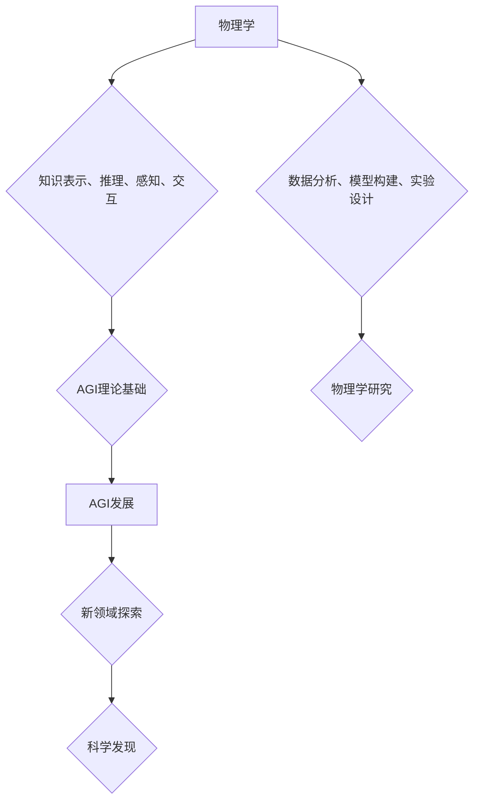

> AGI，物理学，协同发展，机器学习，深度学习，仿真，模拟，科学发现

## 1. 背景介绍

人工智能（AI）近年来取得了令人瞩目的进展，特别是深度学习技术的突破，使得机器在图像识别、自然语言处理等领域展现出强大的能力。然而，当前的AI系统仍然局限于特定的任务和领域，缺乏人类般的通用智能（AGI）。AGI的目标是构建能够像人类一样学习、思考、解决问题和创造的智能系统。

物理学作为自然科学的基础学科，致力于探索宇宙的本质规律和物质世界的运行机制。物理学的研究成果为我们理解世界提供了深刻的洞察，也为人工智能的发展提供了重要的理论基础。

近年来，人工智能和物理学之间开始出现越来越多的交叉研究，这表明两者之间存在着深层的联系和协同发展潜力。

## 2. 核心概念与联系

**2.1 AGI与物理学的联系**

AGI的实现需要解决许多关键问题，例如：

* **知识表示和推理:** AGI需要能够像人类一样理解和表示知识，并进行复杂的推理和决策。物理学中的因果关系、空间关系和时间关系等概念可以为AGI的知识表示和推理提供启示。
* **感知和交互:** AGI需要能够感知周围环境并与之交互。物理学中的传感器技术、控制理论和机器人学等领域可以为AGI的感知和交互能力提供技术支持。
* **学习和适应:** AGI需要能够从经验中学习和适应不断变化的环境。物理学中的统计力学、信息论和进化算法等理论可以为AGI的学习和适应机制提供借鉴。

**2.2 协同发展模式**

AGI与物理学的协同发展可以采取多种模式：

* **物理学为AGI提供理论基础:** 物理学的研究成果可以为AGI的知识表示、推理、感知和交互等方面提供理论指导。
* **AGI辅助物理学研究:** AGI可以帮助物理学家进行数据分析、模型构建和实验设计，加速物理学研究的进展。
* **AGI与物理学共同探索新领域:** AGI和物理学可以共同探索新的科学领域，例如量子计算、宇宙学和生命科学。

**2.3 Mermaid 流程图**



## 3. 核心算法原理 & 具体操作步骤

**3.1 算法原理概述**

在AGI与物理学的协同发展中，机器学习算法扮演着至关重要的角色。机器学习算法可以帮助AGI从物理学数据中学习，并构建物理世界的模型。

**3.2 算法步骤详解**

1. **数据收集:** 从物理学实验、观测数据和模拟结果中收集大量数据。
2. **数据预处理:** 对收集到的数据进行清洗、转换和特征提取，使其适合机器学习算法的训练。
3. **模型选择:** 选择合适的机器学习算法，例如深度神经网络、支持向量机或决策树。
4. **模型训练:** 使用训练数据训练机器学习模型，使其能够学习物理世界的规律。
5. **模型评估:** 使用测试数据评估模型的性能，并进行模型调优。
6. **模型应用:** 将训练好的模型应用于新的物理学问题，例如预测实验结果、模拟物理现象或发现新的物理规律。

**3.3 算法优缺点**

* **优点:**

    * 能够从海量数据中发现隐藏的模式和规律。
    * 可以自动学习和适应不断变化的环境。
    * 可以帮助物理学家解决复杂的问题，加速科学发现。

* **缺点:**

    * 需要大量的训练数据。
    * 模型的解释性和可解释性较差。
    * 容易受到数据偏差的影响。

**3.4 算法应用领域**

* **粒子物理学:** 使用机器学习算法分析粒子碰撞数据，发现新的粒子和物理现象。
* **天体物理学:** 使用机器学习算法分析天文观测数据，发现新的天体和宇宙结构。
* **凝聚态物理学:** 使用机器学习算法模拟材料的性质和行为，设计新的材料。
* **生物物理学:** 使用机器学习算法分析生物分子结构和功能，理解生命现象。

## 4. 数学模型和公式 & 详细讲解 & 举例说明

**4.1 数学模型构建**

在AGI与物理学的协同发展中，数学模型是描述物理世界和构建AGI的桥梁。物理学中的许多重要概念，例如牛顿运动定律、麦克斯韦方程组和薛定谔方程，都是用数学公式表达的。

**4.2 公式推导过程**

例如，牛顿第二定律描述了物体运动与受力之间的关系：

$$F = ma$$

其中，F是物体所受的合力，m是物体的质量，a是物体的加速度。

这个公式可以通过观察物体运动的现象，并进行量化分析推导出来。

**4.3 案例分析与讲解**

在模拟宇宙演化的过程中，物理学家使用广义相对论的数学模型来描述引力场和时空的弯曲。

$$R_{\mu
u} - \frac{1}{2}Rg_{\mu
u} + \Lambda g_{\mu
u} = \frac{8\pi G}{c^4}T_{\mu
u}$$

其中，$R_{\mu
u}$是黎曼曲率张量，$g_{\mu
u}$是度规张量，$\Lambda$是宇宙常数，$G$是引力常数，$c$是光速，$T_{\mu
u}$是能量动量张量。

这个公式描述了时空的几何结构与物质和能量之间的关系，可以用来模拟宇宙的膨胀、星系的形成和黑洞的演化等现象。

## 5. 项目实践：代码实例和详细解释说明

**5.1 开发环境搭建**

* 操作系统：Ubuntu 20.04
* 编程语言：Python 3.8
* 库依赖：TensorFlow、NumPy、Matplotlib

**5.2 源代码详细实现**

```python
import tensorflow as tf
import numpy as np
import matplotlib.pyplot as plt

# 定义神经网络模型
model = tf.keras.models.Sequential([
    tf.keras.layers.Dense(128, activation='relu', input_shape=(10,)),
    tf.keras.layers.Dense(64, activation='relu'),
    tf.keras.layers.Dense(1)
])

# 编译模型
model.compile(optimizer='adam', loss='mse')

# 加载训练数据
(x_train, y_train), (x_test, y_test) = tf.keras.datasets.boston_housing.load_data()

# 训练模型
model.fit(x_train, y_train, epochs=100)

# 评估模型
loss = model.evaluate(x_test, y_test)
print('测试损失:', loss)

# 预测结果
predictions = model.predict(x_test)

# 可视化结果
plt.scatter(y_test, predictions)
plt.xlabel('真实值')
plt.ylabel('预测值')
plt.title('预测结果')
plt.show()
```

**5.3 代码解读与分析**

这段代码实现了使用深度神经网络对波士顿房屋价格进行预测的简单示例。

* 首先，定义了一个包含两层全连接神经网络的模型。
* 然后，使用Adam优化器和均方误差损失函数对模型进行编译。
* 接着，加载波士顿房屋数据集并进行训练。
* 最后，评估模型性能并可视化预测结果。

**5.4 运行结果展示**

运行代码后，会输出模型的测试损失值，并生成一个散点图，展示真实值与预测值的比较。

## 6. 实际应用场景

**6.1 物理模拟与预测**

AGI可以辅助物理学家构建更精确的物理模型，并进行更复杂的物理模拟。例如，可以模拟宇宙的演化、星系的形成、黑洞的演化等复杂物理现象。

**6.2 科学发现与探索**

AGI可以帮助物理学家分析海量数据，发现隐藏的模式和规律，从而加速科学发现。例如，可以分析粒子碰撞数据，发现新的粒子和物理现象；可以分析天文观测数据，发现新的天体和宇宙结构。

**6.3 新技术研发**

AGI可以帮助物理学家开发新的技术，例如：

* **量子计算:** AGI可以帮助设计和优化量子计算算法，加速量子计算的发展。
* **纳米技术:** AGI可以帮助设计和模拟纳米材料的性质和行为，推动纳米技术的进步。
* **能源技术:** AGI可以帮助开发新的能源技术，例如核融合能源和太阳能电池。

**6.4 未来应用展望**

随着AGI技术的不断发展，其在物理学领域的应用将更加广泛和深入。未来，AGI可能能够：

* 自动设计和进行物理实验。
* 自动分析和解释物理实验结果。
* 提出新的物理理论和假设。
* 帮助人类探索宇宙的奥秘。

## 7. 工具和资源推荐

**7.1 学习资源推荐**

* **书籍:**

    * 《深度学习》
    * 《机器学习》
    * 《人工智能：现代方法》

* **在线课程:**

    * Coursera: 深度学习
    * edX: 机器学习
    * Udacity: 人工智能工程师

**7.2 开发工具推荐**

* **Python:** 广泛用于机器学习和人工智能开发。
* **TensorFlow:** 开源深度学习框架。
* **PyTorch:** 开源深度学习框架。
* **Jupyter Notebook:** 用于交互式编程和数据可视化。

**7.3 相关论文推荐**

* 《Attention Is All You Need》
* 《BERT: Pre-training of Deep Bidirectional Transformers for Language Understanding》
* 《AlphaFold: A solution to a 50-year-old grand challenge in biology》

## 8. 总结：未来发展趋势与挑战

**8.1 研究成果总结**

AGI与物理学的协同发展取得了显著的进展，例如：

* 在粒子物理学、天体物理学、凝聚态物理学和生物物理学等领域取得了新的科学发现。
* 开发了新的物理模拟和预测方法。
* 推动了量子计算、纳米技术和能源技术等领域的进步。

**8.2 未来发展趋势**

* **更强大的AGI:** 随着人工智能技术的不断发展，AGI将变得更加强大，能够解决更复杂的问题。
* **更深入的物理学理解:** AGI将帮助物理学家更深入地理解物理世界，探索新的物理规律。
* **新的科学发现:** AGI将推动新的科学发现，开拓新的科学领域。

**8.3 面临的挑战**

* **数据获取和处理:** AGI需要大量的训练数据，获取和处理这些数据是一个挑战。
* **模型解释性和可解释性:** AGI模型的解释性和可解释性较差，这限制了其在物理学领域的应用。
* **伦理和社会影响:** AGI的应用可能带来伦理和社会问题，需要进行深入的思考和讨论。

**8.4 研究展望**

未来，AGI与物理学的协同发展将继续深入，带来更多令人惊叹的成果。我们需要加强基础研究，突破关键技术瓶颈，并积极应对伦理和社会挑战，确保AGI的健康发展，造福人类社会。

## 9. 附录：常见问题与解答

**9.1 如何选择合适的机器学习算法？**

选择合适的机器学习算法取决于具体的应用场景和数据特点。例如，对于分类问题，可以考虑使用支持向量机、决策树或随机森林算法；对于回归问题，可以考虑使用线性回归、逻辑回归或神经网络算法。

**9.2 如何评估机器学习模型的性能？**

常用的评估指标包括准确率、召回率、F1-score、AUC等。选择合适的评估