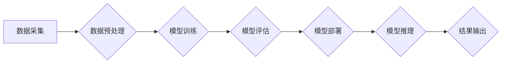

> AI 2.0, 基础设施, 算力, 存储, 网络, 模型训练, 数据安全, 隐私保护

## 1. 背景介绍

人工智能（AI）技术近年来发展迅速，从语音识别、图像识别到自然语言处理等领域取得了突破性进展。随着AI应用场景的不断拓展，对算力、存储、网络等基础设施的需求也呈现指数级增长。我们正处于AI 2.0时代，这一时代的特点是AI模型规模更大、更复杂，对基础设施的要求更高。

传统的IT基础设施架构难以满足AI 2.0时代的需求。传统的集中式数据中心面临着成本高、效率低、可扩展性差等问题。而分布式架构则可以更好地应对大规模数据处理和模型训练的需求。

## 2. 核心概念与联系

**2.1 AI 2.0时代基础设施的特点**

* **海量数据处理能力:** AI 2.0时代需要处理海量数据，因此基础设施需要具备强大的数据处理能力。
* **高性能计算能力:** AI模型训练需要大量的计算资源，基础设施需要提供高性能计算能力。
* **低延迟网络:** AI应用场景对网络延迟要求较高，基础设施需要提供低延迟网络。
* **弹性扩展能力:** AI应用场景瞬息万变，基础设施需要具备弹性扩展能力，能够根据需求动态调整资源。
* **安全可靠性:** AI基础设施需要保障数据安全和系统可靠性。

**2.2 AI 2.0基础设施架构**

AI 2.0基础设施架构主要包括以下几个部分：

* **算力层:** 提供高性能计算资源，支持AI模型训练和推理。
* **存储层:** 提供海量数据存储和管理能力，支持数据训练和模型部署。
* **网络层:** 提供高速、低延迟的网络连接，支持数据传输和模型部署。
* **管理层:** 提供基础设施的监控、管理和调度功能。

**2.3  AI 2.0基础设施架构流程图**



## 3. 核心算法原理 & 具体操作步骤

**3.1  算法原理概述**

深度学习算法是AI 2.0时代的核心算法之一。深度学习算法通过多层神经网络来模拟人类大脑的学习过程，能够从海量数据中自动学习特征，并进行预测或分类。

**3.2  算法步骤详解**

1. **数据预处理:** 将原始数据进行清洗、转换和格式化，使其适合深度学习算法的训练。
2. **模型构建:** 根据任务需求选择合适的深度学习模型架构，并设置模型参数。
3. **模型训练:** 使用训练数据对模型进行训练，调整模型参数，使其能够准确地预测或分类数据。
4. **模型评估:** 使用测试数据对模型进行评估，评估模型的准确率、召回率等指标。
5. **模型部署:** 将训练好的模型部署到生产环境中，用于进行预测或分类任务。

**3.3  算法优缺点**

**优点:**

* 能够自动学习特征，无需人工特征工程。
* 能够处理海量数据，并取得较高的准确率。
* 能够应用于多种任务，例如图像识别、自然语言处理等。

**缺点:**

* 训练时间长，需要大量的计算资源。
* 对数据质量要求高，数据不纯净会导致模型性能下降。
* 模型解释性差，难以理解模型的决策过程。

**3.4  算法应用领域**

深度学习算法广泛应用于以下领域：

* **计算机视觉:** 图像识别、目标检测、图像分割等。
* **自然语言处理:** 文本分类、情感分析、机器翻译等。
* **语音识别:** 语音转文本、语音助手等。
* **推荐系统:** 商品推荐、内容推荐等。
* **医疗诊断:** 病情诊断、疾病预测等。

## 4. 数学模型和公式 & 详细讲解 & 举例说明

**4.1  数学模型构建**

深度学习模型通常采用多层神经网络结构，每个神经元接收多个输入信号，并通过激活函数进行处理，输出一个信号。神经网络的训练过程是通过调整神经元权重和偏置，使得模型输出与真实值之间的误差最小化。

**4.2  公式推导过程**

深度学习模型的训练过程通常使用反向传播算法。反向传播算法通过计算误差梯度，更新神经元权重和偏置，从而使模型逐渐逼近真实值。

**损失函数:** 衡量模型预测值与真实值之间的误差。常见的损失函数包括均方误差（MSE）、交叉熵损失（Cross-Entropy Loss）等。

**梯度下降:** 通过计算损失函数的梯度，更新神经元权重和偏置，使得损失函数值逐渐减小。

**4.3  案例分析与讲解**

假设我们有一个简单的线性回归模型，目标是预测房价。模型输入特征包括房屋面积和房间数量，输出为房价。

损失函数可以定义为均方误差：

$$
L = \frac{1}{n} \sum_{i=1}^{n} (y_i - \hat{y}_i)^2
$$

其中：

* $L$ 为损失函数值
* $n$ 为样本数量
* $y_i$ 为真实房价
* $\hat{y}_i$ 为模型预测的房价

梯度下降算法可以用来更新模型参数：

$$
\theta = \theta - \alpha \nabla L
$$

其中：

* $\theta$ 为模型参数
* $\alpha$ 为学习率
* $\nabla L$ 为损失函数的梯度

通过不断迭代更新模型参数，模型最终可以逼近真实房价的预测关系。

## 5. 项目实践：代码实例和详细解释说明

**5.1  开发环境搭建**

* 操作系统：Ubuntu 20.04
* 编程语言：Python 3.8
* 深度学习框架：TensorFlow 2.0
* 硬件环境：GPU

**5.2  源代码详细实现**

```python
import tensorflow as tf

# 定义模型
model = tf.keras.models.Sequential([
    tf.keras.layers.Dense(64, activation='relu', input_shape=(2,)),
    tf.keras.layers.Dense(1)
])

# 编译模型
model.compile(optimizer='adam', loss='mse')

# 训练模型
model.fit(x_train, y_train, epochs=10)

# 评估模型
loss = model.evaluate(x_test, y_test)
print('Loss:', loss)

# 预测房价
new_data = [[100, 2]]
prediction = model.predict(new_data)
print('Prediction:', prediction)
```

**5.3  代码解读与分析**

* 代码首先定义了一个简单的线性回归模型，包含两层全连接神经网络。
* 模型使用ReLU激活函数，并使用Adam优化器进行训练。
* 训练过程使用均方误差作为损失函数，训练10个epochs。
* 训练完成后，使用测试数据评估模型性能。
* 最后，使用训练好的模型预测新的房价。

**5.4  运行结果展示**

运行代码后，会输出模型的训练损失和测试损失，以及对新数据的预测结果。

## 6. 实际应用场景

**6.1  医疗诊断**

AI 2.0基础设施可以用于辅助医生进行疾病诊断，例如通过分析医学影像数据识别肿瘤、预测患者的风险等。

**6.2  金融风险控制**

AI 2.0基础设施可以用于识别金融欺诈、评估信用风险、预测市场波动等。

**6.3  智能制造**

AI 2.0基础设施可以用于优化生产流程、预测设备故障、实现智能制造。

**6.4  未来应用展望**

AI 2.0基础设施将推动更多创新应用的落地，例如：

* **个性化教育:** 根据学生的学习情况提供个性化的学习方案。
* **智能交通:** 实现无人驾驶、智能交通管理等。
* **智慧城市:** 建设更加智能、高效的城市管理系统。

## 7. 工具和资源推荐

**7.1  学习资源推荐**

* **深度学习课程:** Coursera、edX、Udacity等平台提供丰富的深度学习课程。
* **深度学习书籍:** 《深度学习》、《动手学深度学习》等书籍对深度学习原理和应用进行了深入讲解。
* **开源代码库:** TensorFlow、PyTorch等开源代码库提供了丰富的深度学习模型和工具。

**7.2  开发工具推荐**

* **深度学习框架:** TensorFlow、PyTorch、Keras等深度学习框架提供了高效的模型训练和部署工具。
* **云计算平台:** AWS、Azure、GCP等云计算平台提供了强大的计算资源和服务，支持深度学习模型训练和部署。

**7.3  相关论文推荐**

* **ImageNet Classification with Deep Convolutional Neural Networks**
* **Attention Is All You Need**
* **BERT: Pre-training of Deep Bidirectional Transformers for Language Understanding**

## 8. 总结：未来发展趋势与挑战

**8.1  研究成果总结**

AI 2.0时代基础设施建设取得了显著进展，深度学习算法取得了突破性进展，并在多个领域取得了成功应用。

**8.2  未来发展趋势**

* **模型规模和复杂度进一步提升:** 未来AI模型将更加庞大、复杂，对算力和存储能力要求更高。
* **边缘计算和分布式训练:** 将AI模型部署到边缘设备，并利用分布式训练技术提高训练效率。
* **模型可解释性和安全性:** 研究更可解释的AI模型，并加强AI模型的安全性，防止模型被恶意攻击。

**8.3  面临的挑战**

* **算力需求爆炸式增长:** 满足AI 2.0时代算力需求是一个巨大的挑战。
* **数据安全和隐私保护:** AI模型训练需要大量数据，如何保障数据安全和隐私保护是一个重要问题。
* **人才短缺:** AI领域人才需求量大，但人才供给不足。

**8.4  研究展望**

未来研究将重点关注以下几个方面：

* **新型算力架构:** 研究更加高效、低功耗的算力架构，例如量子计算、光计算等。
* **数据安全和隐私保护技术:** 研究更加有效的隐私保护技术，例如联邦学习、差分隐私等。
* **AI伦理和社会影响:** 研究AI技术的伦理问题，并探讨AI技术对社会的影响。

## 9. 附录：常见问题与解答

**9.1  什么是AI 2.0？**

AI 2.0是指人工智能技术进入第二阶段的发展阶段，其特点是模型规模更大、更复杂，对基础设施的要求更高。

**9.2  AI 2.0基础设施有哪些特点？**

AI 2.0基础设施需要具备海量数据处理能力、高性能计算能力、低延迟网络、弹性扩展能力和安全可靠性。

**9.3  深度学习算法有哪些应用场景？**

深度学习算法广泛应用于计算机视觉、自然语言处理、语音识别、推荐系统、医疗诊断等领域。


作者：禅与计算机程序设计艺术 / Zen and the Art of Computer Programming 
<end_of_turn>