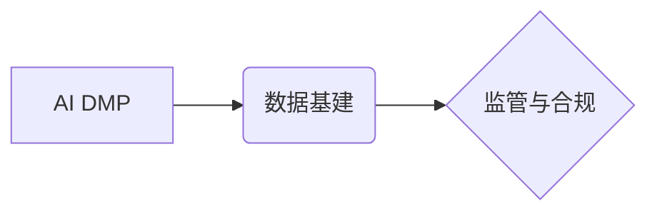

> AI DMP, 数据基建, 监管合规, 数据隐私, 数据安全, 算法透明度

## 1. 背景介绍

随着人工智能 (AI) 技术的飞速发展，数据已成为驱动 AI 发展和应用的关键要素。AI 数据管理平台 (AI DMP) 作为数据驱动的 AI 应用的核心基础设施，在收集、存储、处理、分析和利用海量数据方面发挥着至关重要的作用。然而，AI DMP 的发展也面临着监管和合规方面的挑战。

数据隐私保护、数据安全保障、算法透明度和可解释性等问题日益受到关注。为了确保 AI DMP 的健康发展，需要建立完善的监管和合规机制，保障数据安全和用户权益，促进 AI 技术的伦理发展。

## 2. 核心概念与联系

**2.1 AI DMP 简介**

AI DMP 是专门为人工智能应用场景设计的平台，它集成了数据采集、存储、处理、分析、管理等功能，为 AI 模型的训练和部署提供数据支持。

**2.2 数据基建**

数据基建是指构建和维护数据基础设施，包括数据存储、数据处理、数据分析等方面的技术和资源。AI DMP 的数据基建是其核心组成部分，它决定了 AI DMP 的数据处理能力、数据安全性和数据可用性。

**2.3 监管与合规**

监管与合规是指遵守相关法律法规和行业标准，确保数据安全、用户隐私和算法透明度。AI DMP 的监管和合规需要考虑数据隐私保护、数据安全保障、算法透明度和可解释性等方面。

**2.4 核心概念关系图**



## 3. 核心算法原理 & 具体操作步骤

**3.1 算法原理概述**

AI DMP 中常用的算法包括数据清洗、数据转换、数据聚合、数据建模等。这些算法基于统计学、机器学习和数据挖掘等领域的技术，旨在从海量数据中提取有价值的信息，并为 AI 模型提供高质量的数据支持。

**3.2 算法步骤详解**

**数据清洗:**

1. 识别和处理缺失值、重复值和异常值。
2. 标准化数据格式，确保数据一致性。
3. 移除无关数据，提高数据质量。

**数据转换:**

1. 将数据转换为 AI 模型所需的格式。
2. 转换数据类型，例如将文本数据转换为数值数据。
3. 构建特征向量，提取数据中的关键信息。

**数据聚合:**

1. 对数据进行分组和汇总，例如按时间、地域或用户进行聚合。
2. 计算聚合指标，例如平均值、总和或计数。
3. 生成数据报表，直观展示数据趋势。

**数据建模:**

1. 使用机器学习算法构建数据模型，例如分类模型、回归模型或聚类模型。
2. 训练模型，使其能够准确预测或分类数据。
3. 评估模型性能，并进行模型优化。

**3.3 算法优缺点**

**优点:**

* 能够有效处理海量数据，提取有价值的信息。
* 能够提高数据质量，为 AI 模型提供高质量的数据支持。
* 能够帮助企业更好地理解数据，做出更明智的决策。

**缺点:**

* 算法复杂度高，需要专业的技术人员进行开发和维护。
* 算法需要大量的训练数据，否则模型性能会下降。
* 算法可能会存在偏差，导致模型输出结果不准确。

**3.4 算法应用领域**

AI DMP 的核心算法广泛应用于各个领域，例如：

* **金融领域:** 风险评估、欺诈检测、客户画像。
* **医疗领域:** 疾病诊断、药物研发、患者管理。
* **零售领域:** 商品推荐、库存优化、客户服务。
* **制造领域:** 质量控制、设备预测维护、生产优化。

## 4. 数学模型和公式 & 详细讲解 & 举例说明

**4.1 数学模型构建**

AI DMP 中常用的数学模型包括线性回归模型、逻辑回归模型、决策树模型、支持向量机模型等。这些模型基于数学公式和算法，能够对数据进行建模和预测。

**4.2 公式推导过程**

例如，线性回归模型的公式如下：

$$y = \beta_0 + \beta_1x_1 + \beta_2x_2 + ... + \beta_nx_n + \epsilon$$

其中：

* $y$ 是预测值。
* $\beta_0, \beta_1, ..., \beta_n$ 是模型参数。
* $x_1, x_2, ..., x_n$ 是输入特征。
* $\epsilon$ 是误差项。

通过最小化误差函数，可以求解模型参数，从而建立线性回归模型。

**4.3 案例分析与讲解**

假设我们想要预测房价，输入特征包括房屋面积、房屋朝向、房屋楼层等。我们可以使用线性回归模型对房价进行预测。通过训练模型，我们可以得到模型参数，例如房屋面积每增加1平方米，房价会增加1万元。

## 5. 项目实践：代码实例和详细解释说明

**5.1 开发环境搭建**

AI DMP 的开发环境通常包括操作系统、编程语言、数据库、机器学习框架等。例如，可以使用 Python 语言、TensorFlow 或 PyTorch 机器学习框架、MySQL 或 PostgreSQL 数据库等。

**5.2 源代码详细实现**

```python
# 数据清洗
import pandas as pd

data = pd.read_csv("data.csv")
data.dropna(inplace=True)
data.drop_duplicates(inplace=True)

# 数据转换
data["house_area"] = data["house_area"].astype(float)
data["house_direction"] = data["house_direction"].astype("category")

# 数据聚合
average_price = data["house_price"].mean()

# 数据建模
from sklearn.linear_model import LinearRegression

model = LinearRegression()
model.fit(data[["house_area", "house_direction"]], data["house_price"])

# 预测房价
new_data = pd.DataFrame({"house_area": [100], "house_direction": ["南"]})
predicted_price = model.predict(new_data)
```

**5.3 代码解读与分析**

这段代码演示了 AI DMP 中的数据清洗、数据转换、数据聚合和数据建模的基本步骤。

**5.4 运行结果展示**

运行代码后，可以得到平均房价和预测的房价。

## 6. 实际应用场景

AI DMP 在各个行业都有广泛的应用场景，例如：

**6.1 金融领域**

* **风险评估:** AI DMP 可以分析客户的财务数据，评估其信用风险和投资风险。
* **欺诈检测:** AI DMP 可以识别异常交易行为，防止金融欺诈。
* **客户画像:** AI DMP 可以分析客户的消费行为和偏好，构建客户画像，为精准营销提供支持。

**6.2 医疗领域**

* **疾病诊断:** AI DMP 可以分析患者的病历、检查结果和基因信息，辅助医生诊断疾病。
* **药物研发:** AI DMP 可以分析药物的分子结构和生物活性，加速药物研发。
* **患者管理:** AI DMP 可以帮助医院管理患者信息，提高医疗服务效率。

**6.3 零售领域**

* **商品推荐:** AI DMP 可以分析用户的购买历史和浏览记录，推荐个性化的商品。
* **库存优化:** AI DMP 可以预测商品的需求量，优化库存管理。
* **客户服务:** AI DMP 可以提供智能客服，解答用户的疑问。

**6.4 未来应用展望**

随着 AI 技术的不断发展，AI DMP 的应用场景将更加广泛，例如：

* **个性化教育:** AI DMP 可以根据学生的学习情况，提供个性化的学习方案。
* **智能交通:** AI DMP 可以分析交通流量和路况，优化交通管理。
* **智慧城市:** AI DMP 可以收集和分析城市数据，提高城市管理效率。

## 7. 工具和资源推荐

**7.1 学习资源推荐**

* **书籍:**
    * 《深度学习》
    * 《机器学习实战》
    * 《Python数据科学手册》
* **在线课程:**
    * Coursera
    * edX
    * Udacity

**7.2 开发工具推荐**

* **编程语言:** Python
* **机器学习框架:** TensorFlow, PyTorch
* **数据库:** MySQL, PostgreSQL
* **云平台:** AWS, Azure, GCP

**7.3 相关论文推荐**

* 《Attention Is All You Need》
* 《BERT: Pre-training of Deep Bidirectional Transformers for Language Understanding》
* 《Generative Adversarial Networks》

## 8. 总结：未来发展趋势与挑战

**8.1 研究成果总结**

AI DMP 技术发展迅速，取得了显著成果，在数据处理、模型训练、应用场景等方面取得了突破。

**8.2 未来发展趋势**

* **模型更加智能化:** AI DMP 将采用更先进的机器学习算法，构建更智能的模型，能够更好地理解和处理数据。
* **数据安全更加可靠:** AI DMP 将更加注重数据安全，采用更先进的加密技术和安全机制，保障数据安全。
* **应用场景更加广泛:** AI DMP 将应用于更多领域，例如教育、医疗、交通等，为社会发展提供更多支持。

**8.3 面临的挑战**

* **数据隐私保护:** AI DMP 处理大量用户数据，需要有效保护用户隐私，避免数据泄露和滥用。
* **算法透明度和可解释性:** AI DMP 的算法复杂，需要提高算法的透明度和可解释性，让用户了解模型的决策过程。
* **数据质量和可信度:** AI DMP 的模型性能依赖于数据质量，需要确保数据的准确性和可靠性。

**8.4 研究展望**

未来，AI DMP 研究将更加注重数据隐私保护、算法透明度和可解释性、数据质量和可信度等方面，推动 AI 技术的伦理发展，为社会带来更多福祉。

## 9. 附录：常见问题与解答

**9.1 如何保障数据隐私？**

AI DMP 可以采用以下措施保障数据隐私：

* **数据脱敏:** 将敏感信息替换为非敏感信息。
* **数据加密:** 使用加密技术保护数据安全。
* **访问控制:** 设置严格的访问权限，控制数据访问范围。

**9.2 如何提高算法透明度？**

AI DMP 可以采用以下措施提高算法透明度：

* **使用可解释性模型:** 选择能够解释模型决策过程的算法。
* **提供模型解释报告:** 生成模型解释报告，说明模型的决策依据。
* **开源模型代码:** 发布模型代码，让用户可以自行分析模型。

**9.3 如何保证数据质量？**

AI DMP 可以采用以下措施保证数据质量：

* **数据清洗:** 识别和处理数据中的错误和缺失值。
* **数据验证:** 对数据进行验证，确保数据准确性。
* **数据标注:** 对数据进行标注，提高数据质量。


作者：禅与计算机程序设计艺术 / Zen and the Art of Computer Programming 
<end_of_turn>