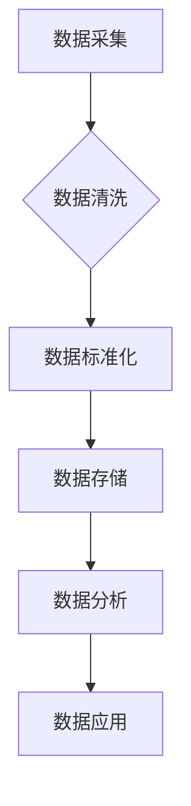

> AI DMP, 数据基建, 数据质量, 数据标准, 数据治理, 数据可信度, 数据一致性, 数据完整性, 数据安全

## 1. 背景介绍

在当今数据爆炸的时代，数据已成为企业最重要的资产。人工智能 (AI) 的快速发展，使得数据在推动业务创新、提升运营效率、挖掘商业价值方面发挥着越来越重要的作用。然而，海量数据的质量参差不齐，缺乏统一的标准规范，严重制约了 AI 应用的落地和效果。

数据管理平台 (DMP) 作为数据治理的核心引擎，在数据采集、存储、处理、分析等环节发挥着至关重要的作用。而 AI DMP，则将人工智能技术融入数据管理平台，赋予其更强大的数据处理能力和智能化决策支持功能。

数据质量和数据标准是构建 AI DMP 的基石，也是保证 AI 应用效果的关键因素。只有数据质量高、标准规范，才能为 AI 模型提供可靠的数据支撑，从而实现精准预测、智能决策和业务优化。

## 2. 核心概念与联系

**2.1 数据质量**

数据质量是指数据在准确性、完整性、一致性、时效性、可用性等方面的优劣程度。

**2.2 数据标准**

数据标准是指对数据格式、结构、内容、定义等方面进行统一规范的规则和准则。

**2.3 AI DMP**

AI DMP 是将人工智能技术融入数据管理平台，实现数据智能化管理和分析的平台。

**2.4 数据基建**

数据基建是指构建数据存储、处理、分析等基础设施，为数据应用提供支撑的系统建设。

**2.5 数据治理**

数据治理是指对数据生命周期进行全流程管理，确保数据质量、安全、合规等方面的规范化运作。

**2.6 数据可信度**

数据可信度是指数据真实性、可靠性和准确性的度量。

**2.7 数据一致性**

数据一致性是指数据在不同系统、不同时间点上的相同性。

**2.8 数据完整性**

数据完整性是指数据没有丢失、损坏或篡改。

**2.9 数据安全**

数据安全是指保护数据免受未授权访问、使用、披露或破坏。

**2.10 数据标准化**

数据标准化是指将数据按照统一的标准进行格式化、结构化和规范化处理。

**2.11 数据质量控制**

数据质量控制是指通过制定规则、流程和工具，确保数据质量符合预期的标准。

**2.12 数据质量评估**

数据质量评估是指对数据质量进行量化分析和评价，识别数据质量问题并制定改进方案。

**2.13 数据质量提升**

数据质量提升是指通过各种技术手段和方法，提高数据的准确性、完整性、一致性和时效性。

**2.14 数据治理体系**

数据治理体系是指建立一套规范、流程和制度，对数据进行全生命周期管理的体系。

**2.15 数据资产管理**

数据资产管理是指将数据视为企业重要的资产，对其进行识别、评估、管理和利用。

**Mermaid 流程图**



## 3. 核心算法原理 & 具体操作步骤

### 3.1  算法原理概述

数据质量控制算法主要利用机器学习、统计分析等技术，对数据进行清洗、标准化、验证等操作，以提高数据质量。常见的算法包括：

* **规则匹配算法:** 基于预定义的规则，对数据进行匹配和过滤，例如去除重复数据、格式错误的数据等。
* **统计分析算法:** 利用统计方法，例如均值、标准差、频率分布等，对数据进行分析，识别异常值、缺失值等问题。
* **机器学习算法:** 利用机器学习模型，例如分类、回归、聚类等，对数据进行分类、预测、聚合等操作，例如识别欺诈数据、预测数据缺失等。

### 3.2  算法步骤详解

**数据清洗:**

1. **缺失值处理:** 识别缺失值，并根据业务需求选择合适的处理方法，例如删除、填充、预测等。
2. **重复值处理:** 识别重复数据，并根据业务需求选择合适的处理方法，例如删除、合并等。
3. **异常值处理:** 识别异常值，并根据业务需求选择合适的处理方法，例如删除、修正等。
4. **格式化处理:** 将数据按照统一的格式进行规范化处理，例如日期格式、数值格式等。

**数据标准化:**

1. **数据编码:** 将数据转换为统一的编码格式，例如数值编码、文本编码等。
2. **数据映射:** 将数据映射到统一的字典或分类体系，例如产品分类、地区编码等。
3. **数据聚合:** 将数据进行聚合，例如将多个指标合并成一个综合指标。

**数据验证:**

1. **数据一致性验证:** 检查数据在不同系统、不同时间点上的一致性。
2. **数据完整性验证:** 检查数据是否完整，没有丢失或损坏。
3. **数据准确性验证:** 检查数据是否准确，符合业务规则和事实。

### 3.3  算法优缺点

**优点:**

* 自动化程度高，可以提高数据质量控制效率。
* 能够识别和处理复杂的数据质量问题。
* 可以根据业务需求进行定制化配置。

**缺点:**

* 需要大量的训练数据和计算资源。
* 算法模型的准确性依赖于训练数据的质量。
* 算法的解释性和可解释性较差。

### 3.4  算法应用领域

数据质量控制算法广泛应用于各个领域，例如：

* 金融行业：用于识别欺诈交易、预测客户流失等。
* 电商行业：用于识别假货、预测用户购买行为等。
* 医疗行业：用于识别医疗错误、预测疾病风险等。
* 政府部门：用于识别数据异常、提高数据分析效率等。

## 4. 数学模型和公式 & 详细讲解 & 举例说明

### 4.1  数学模型构建

数据质量评估模型通常采用基于规则的模型或基于机器学习的模型。

**基于规则的模型:**

* 规则可以定义数据质量的各个指标，例如准确性、完整性、一致性等。
* 规则可以根据业务需求进行定制化配置。
* 规则的评估结果可以量化，例如评分、等级等。

**基于机器学习的模型:**

* 可以利用机器学习算法，例如分类、回归、聚类等，对数据进行分析和评估。
* 可以自动学习数据质量的特征和模式。
* 可以根据历史数据进行预测和预警。

### 4.2  公式推导过程

**数据准确性评估公式:**

$$Accuracy = \frac{TP + TN}{TP + TN + FP + FN}$$

其中：

* TP: 真正例数
* TN: 真负例数
* FP: 假正例数
* FN: 假负例数

**数据完整性评估公式:**

$$Completeness = \frac{Total\_Data - Missing\_Data}{Total\_Data}$$

其中：

* Total\_Data: 总数据量
* Missing\_Data: 缺失数据量

### 4.3  案例分析与讲解

**案例:**

假设我们有一个电商平台的用户数据，需要评估其数据质量。

* **数据准确性:** 可以利用机器学习算法，例如分类算法，对用户数据进行分类，例如真实用户和虚假用户。然后计算分类模型的准确率，作为数据准确性的评估指标。
* **数据完整性:** 可以计算用户数据的缺失率，例如姓名、地址、电话号码等字段的缺失率。缺失率越高，数据完整性越低。

## 5. 项目实践：代码实例和详细解释说明

### 5.1  开发环境搭建

* 操作系统: Ubuntu 20.04
* Python 版本: 3.8
* 必要的库: pandas, numpy, scikit-learn

### 5.2  源代码详细实现

```python
import pandas as pd
from sklearn.model_selection import train_test_split
from sklearn.linear_model import LogisticRegression

# 加载用户数据
data = pd.read_csv('user_data.csv')

# 数据预处理
# ...

# 划分训练集和测试集
X_train, X_test, y_train, y_test = train_test_split(data.drop('is_real', axis=1), data['is_real'], test_size=0.2)

# 训练逻辑回归模型
model = LogisticRegression()
model.fit(X_train, y_train)

# 评估模型性能
accuracy = model.score(X_test, y_test)
print(f'模型准确率: {accuracy}')

# ...
```

### 5.3  代码解读与分析

* 代码首先加载用户数据，并进行必要的预处理操作，例如缺失值处理、特征工程等。
* 然后将数据划分成训练集和测试集，用于训练和评估模型。
* 选择逻辑回归模型作为分类模型，并训练模型。
* 最后评估模型的性能，例如准确率。

### 5.4  运行结果展示

运行结果会显示模型的准确率，例如：

```
模型准确率: 0.92
```

## 6. 实际应用场景

### 6.1  金融行业

* **欺诈检测:** AI DMP 可以利用机器学习算法，分析交易数据，识别异常交易行为，从而有效预防欺诈行为。
* **风险评估:** AI DMP 可以分析客户数据，评估客户的信用风险，帮助金融机构进行精准授信和风险控制。
* **客户画像:** AI DMP 可以分析客户行为数据，构建客户画像，帮助金融机构进行精准营销和个性化服务。

### 6.2  电商行业

* **商品推荐:** AI DMP 可以分析用户行为数据，推荐用户感兴趣的商品，提高用户购物体验和转化率。
* **价格优化:** AI DMP 可以分析市场数据和用户行为数据，优化商品价格，提高利润率。
* **库存管理:** AI DMP 可以预测商品需求，优化库存管理，降低库存成本。

### 6.3  医疗行业

* **疾病诊断:** AI DMP 可以分析患者数据，辅助医生进行疾病诊断，提高诊断准确率。
* **药物研发:** AI DMP 可以分析药物数据，加速药物研发过程，降低研发成本。
* **患者管理:** AI DMP 可以分析患者数据，帮助医院进行患者管理，提高医疗服务质量。

### 6.4  未来应用展望

随着人工智能技术的不断发展，AI DMP 将在更多领域得到应用，例如：

* **智能制造:** AI DMP 可以帮助企业优化生产流程，提高生产效率。
* **智慧城市:** AI DMP 可以帮助城市管理者优化城市资源配置，提高城市管理效率。
* **教育行业:** AI DMP 可以帮助教育机构个性化教学，提高教学效果。

## 7. 工具和资源推荐

### 7.1  学习资源推荐

* **书籍:**
    * 《数据科学实战》
    * 《机器学习》
    * 《深度学习》
* **在线课程:**
    * Coursera: 数据科学、机器学习
    * edX: 数据分析、人工智能
    * Udemy: 数据科学、机器学习

### 7.2  开发工具推荐

* **Python:** 数据分析、机器学习
* **Spark:** 大数据处理
* **Hadoop:** 大数据存储
* **TensorFlow:** 深度学习框架
* **PyTorch:** 深度学习框架

### 7.3  相关论文推荐

* **《Attention Is All You Need》**
* **《BERT: Pre-training of Deep Bidirectional Transformers for Language Understanding》**
* **《Generative Adversarial Networks》**

## 8. 总结：未来发展趋势与挑战

### 8.1  研究成果