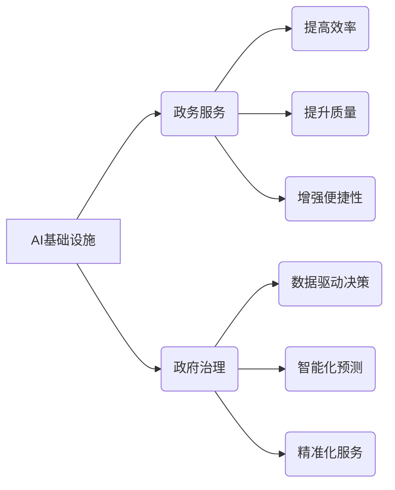

> AI基础设施、政务服务、政府治理、机器学习、深度学习、自然语言处理、数据分析、智能决策

## 1. 背景介绍

在信息时代，数据已成为重要的生产要素，政府拥有海量的数据资源，但如何有效利用这些数据提升治理能力是一个重大挑战。人工智能（AI）技术的快速发展为政府治理提供了新的机遇。AI基础设施，作为AI技术应用的基础，能够帮助政府构建智能化政务服务体系，提升政府治理效率和水平。

近年来，全球范围内，政府纷纷探索AI技术在政务服务领域的应用。例如，美国政府利用AI技术进行税务申报、医疗保险审核等；新加坡政府利用AI技术进行城市管理、交通规划等；中国政府利用AI技术进行公共服务、社会管理等。

## 2. 核心概念与联系

**2.1 AI基础设施**

AI基础设施是指支撑AI技术应用的软硬件平台和服务体系。它包括：

* **算力平台:** 提供强大的计算能力，支持AI模型的训练和推理。
* **数据平台:** 提供海量数据存储、管理和分析能力，为AI模型训练提供数据支撑。
* **算法平台:** 提供各种AI算法模型，以及模型训练、部署和管理工具。
* **应用平台:** 提供AI应用开发和部署平台，方便开发者构建和发布AI应用。

**2.2 政务服务**

政务服务是指政府为公民、企业和其他组织提供的公共服务。它涵盖了广泛的领域，例如：

* **行政审批:** 办理营业执照、土地使用证等。
* **社会保障:** 提供养老保险、医疗保险等。
* **公共安全:** 提供治安管理、消防救援等。
* **文化教育:** 提供图书馆、博物馆等公共文化服务。

**2.3 政府治理**

政府治理是指政府运用权力和资源，协调社会资源，实现社会稳定和发展。它包括：

* **政策制定:** 制定和实施各项政策法规。
* **资源配置:** 协调分配社会资源。
* **社会管理:** 维持社会秩序和稳定。
* **公共服务:** 提供公共服务和保障。

**2.4 AI基础设施与政务服务的关系**

AI基础设施可以为政务服务提供强大的技术支撑，提升政务服务的效率、质量和便捷性。

* **提高效率:** AI技术可以自动化处理大量重复性工作，例如数据录入、信息查询等，释放人力资源，提高工作效率。
* **提升质量:** AI技术可以利用数据分析和预测模型，提高政务服务的精准度和有效性。
* **增强便捷性:** AI技术可以提供智能化交互方式，例如语音识别、自然语言处理等，方便公民和企业获取政务服务。

**2.5 AI基础设施与政府治理的关系**

AI基础设施可以为政府治理提供智能化决策支持，提升政府治理水平。

* **数据驱动决策:** AI技术可以对海量数据进行分析和挖掘，为政府决策提供数据支撑。
* **智能化预测:** AI技术可以利用预测模型，预测未来趋势和潜在风险，帮助政府提前预警和应对。
* **精准化服务:** AI技术可以根据公民和企业的个性化需求，提供精准化的公共服务。

**2.6 核心概念架构图**



## 3. 核心算法原理 & 具体操作步骤

**3.1 算法原理概述**

AI基础设施在政务服务和政府治理中的应用，主要依赖于以下核心算法：

* **机器学习:** 

机器学习算法能够从数据中学习模式和规律，并根据学习到的知识进行预测和决策。常见的机器学习算法包括：

    * **监督学习:** 利用标记数据训练模型，例如分类、回归等。
    * **无监督学习:** 从未标记数据中发现模式和结构，例如聚类、降维等。
    * **强化学习:** 通过试错学习，在环境中获得最大奖励。

* **深度学习:** 

深度学习算法是一种更高级的机器学习算法，它利用多层神经网络来模拟人类大脑的学习过程。深度学习算法在图像识别、自然语言处理等领域取得了突破性进展。

* **自然语言处理:** 

自然语言处理算法能够理解和处理人类语言，例如文本分类、情感分析、机器翻译等。

**3.2 算法步骤详解**

以机器学习算法为例，其基本步骤如下：

1. **数据收集和预处理:** 收集相关数据，并进行清洗、转换、特征提取等预处理工作。
2. **模型选择:** 根据具体任务选择合适的机器学习算法模型。
3. **模型训练:** 利用训练数据训练模型，调整模型参数，使其能够准确地预测或分类。
4. **模型评估:** 利用测试数据评估模型的性能，例如准确率、召回率、F1-score等。
5. **模型部署:** 将训练好的模型部署到实际应用环境中，用于进行预测或分类。

**3.3 算法优缺点**

* **优点:**

    * 自动化处理数据，提高效率。
    * 能够发现数据中的隐藏模式和规律。
    * 能够根据数据进行个性化服务。

* **缺点:**

    * 需要大量的数据进行训练。
    * 模型的性能取决于数据的质量。
    * 算法的解释性较差，难以理解模型的决策过程。

**3.4 算法应用领域**

* **政务服务:**

    * 智能客服: 利用自然语言处理技术，为公民和企业提供智能化的客服服务。
    * 审批自动化: 利用机器学习算法，自动审批简单的行政审批事项。
    * 政策推荐: 利用机器学习算法，根据公民和企业的需求，推荐相关的政策信息。

* **政府治理:**

    * 预测分析: 利用机器学习算法，预测未来趋势和潜在风险，例如人口增长、交通拥堵等。
    * 舆情监测: 利用自然语言处理技术，监测社会舆情，及时发现潜在的社会问题。
    * 犯罪预测: 利用机器学习算法，预测犯罪热点，加强治安管理。

## 4. 数学模型和公式 & 详细讲解 & 举例说明

**4.1 数学模型构建**

在AI基础设施的政务服务和政府治理中，常用的数学模型包括：

* **线性回归模型:** 用于预测连续变量，例如房价、人口增长率等。
* **逻辑回归模型:** 用于预测分类变量，例如客户是否会购买产品、事件是否会发生等。
* **支持向量机模型:** 用于分类和回归问题，能够处理高维数据。
* **决策树模型:** 用于分类和回归问题，能够解释模型的决策过程。
* **神经网络模型:** 用于复杂问题，例如图像识别、自然语言处理等。

**4.2 公式推导过程**

以线性回归模型为例，其目标是找到一条直线，使得预测值与实际值之间的误差最小。

线性回归模型的数学公式如下：

$$y = w_0 + w_1x_1 + w_2x_2 + ... + w_nx_n + \epsilon$$

其中：

* $y$ 是预测值
* $w_0, w_1, w_2, ..., w_n$ 是模型参数
* $x_1, x_2, ..., x_n$ 是输入特征
* $\epsilon$ 是误差项

模型参数的求解方法是使用最小二乘法，其目标是最小化误差平方和：

$$J(w) = \sum_{i=1}^{m}(y_i - \hat{y}_i)^2$$

其中：

* $m$ 是样本数量
* $y_i$ 是实际值
* $\hat{y}_i$ 是预测值

通过求解 $J(w)$ 的最小值，可以得到模型参数 $w$ 的最佳值。

**4.3 案例分析与讲解**

例如，可以使用线性回归模型预测房价。输入特征可以包括房屋面积、房间数量、地理位置等，输出变量是房价。通过训练模型，可以得到一个预测房价的公式，例如：

$$房价 = 10000 + 500 * 面积 + 10000 * 房间数量 + 2000 * 地理位置$$

## 5. 项目实践：代码实例和详细解释说明

**5.1 开发环境搭建**

* 操作系统: Ubuntu 20.04
* Python 版本: 3.8
* 必要的库: pandas, numpy, scikit-learn, matplotlib

**5.2 源代码详细实现**

```python
import pandas as pd
from sklearn.linear_model import LinearRegression
from sklearn.model_selection import train_test_split
import matplotlib.pyplot as plt

# 加载数据
data = pd.read_csv('house_price.csv')

# 选择特征和目标变量
X = data[['面积', '房间数量', '地理位置']]
y = data['房价']

# 将数据分为训练集和测试集
X_train, X_test, y_train, y_test = train_test_split(X, y, test_size=0.2, random_state=42)

# 创建线性回归模型
model = LinearRegression()

# 训练模型
model.fit(X_train, y_train)

# 预测测试集数据
y_pred = model.predict(X_test)

# 评估模型性能
print('模型系数:', model.coef_)
print('截距:', model.intercept_)
print('R方:', model.score(X_test, y_test))

# 可视化预测结果
plt.scatter(y_test, y_pred)
plt.xlabel('实际房价')
plt.ylabel('预测房价')
plt.title('线性回归模型预测结果')
plt.show()
```

**5.3 代码解读与分析**

* 首先，加载数据并选择特征和目标变量。
* 然后，将数据分为训练集和测试集。
* 创建线性回归模型并训练模型。
* 使用训练好的模型预测测试集数据。
* 最后，评估模型性能并可视化预测结果。

**5.4 运行结果展示**

运行代码后，会输出模型系数、截距、R方等指标，以及预测结果的可视化图。

## 6. 实际应用场景

**6.1 智能客服**

政府可以利用自然语言处理技术，构建智能客服系统，为公民和企业提供24小时在线服务，解答常见问题，办理简单的行政审批事项。

**6.2 审批自动化**

政府可以利用机器学习算法，自动审批简单的行政审批事项，例如营业执照、房屋租赁合同等，提高审批效率，减少人工成本。

**6.3 政策推荐**

政府可以利用机器学习算法，根据公民和企业的需求，推荐相关的政策信息，提高政策的知晓度和利用率。

**6.4 未来应用展望**

随着AI技术的不断发展，AI基础设施在政务服务和政府治理中的应用将更加广泛和深入。例如：

* **更智能化的政务服务:** 利用AI技术，提供更加个性化、智能化的政务服务，例如智能问答、智能预约、智能办理等。
* **更精准的政府治理:** 利用AI技术，更加精准地预测和应对社会问题，例如预测犯罪热点、预测自然灾害等。
* **更透明的政府管理:** 利用AI技术，提高政府工作的透明度和可解释性，例如自动生成政府报告、自动审核政府文件等。

## 7. 工具和资源推荐

**7.1 学习资源推荐**

* **在线课程:** Coursera, edX, Udacity 等平台提供丰富的AI相关课程。
* **书籍:** 《深度学习》、《机器学习》、《自然语言处理》等书籍。
* **博客和论坛:** AI相关的