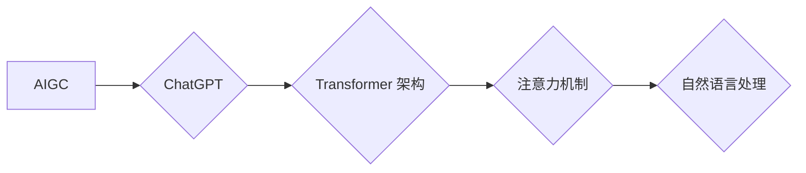

> AIGC, ChatGPT, 自然语言处理, 文本生成, 应用程序开发, 实际应用场景

## 1. 背景介绍

近年来，人工智能（AI）技术取得了飞速发展，特别是生成式人工智能（AIGC）领域，掀起了新的技术浪潮。AIGC能够根据给定的输入，生成新的文本、图像、音频等内容，展现出强大的创造力和应用潜力。其中，ChatGPT作为一款基于Transformer架构的强大语言模型，凭借其出色的文本生成能力和广泛的应用场景，迅速成为了AIGC领域的明星产品。

ChatGPT的出现，为我们提供了全新的工具和思路，可以应用于各种领域，例如：

* **内容创作:** 自动生成文章、故事、诗歌、剧本等创意内容。
* **客服服务:**  构建智能客服机器人，提供24小时在线服务，提高客户体验。
* **教育辅助:**  辅助学生学习，提供个性化辅导和知识问答。
* **代码生成:**  根据自然语言描述，自动生成代码，提高开发效率。

## 2. 核心概念与联系

### 2.1  AIGC 与 ChatGPT

AIGC是指利用人工智能技术生成新内容的范畴，涵盖了文本、图像、音频、视频等多种类型。ChatGPT作为一种具体的AIGC模型，专注于文本生成任务。它通过学习海量文本数据，掌握了语言的语法、语义和上下文关系，能够生成流畅、自然的文本。

### 2.2  Transformer 架构

ChatGPT基于Transformer架构，是一种专门设计用于处理序列数据的深度学习模型。Transformer的创新之处在于引入了“注意力机制”，能够有效地捕捉文本中的长距离依赖关系，从而提升文本生成质量。

### 2.3  自然语言处理 (NLP)

自然语言处理是人工智能的一个重要分支，旨在使计算机能够理解和处理人类语言。ChatGPT的文本生成能力离不开NLP技术的支持，例如词嵌入、句法分析、语义理解等。

**Mermaid 流程图**



## 3. 核心算法原理 & 具体操作步骤

### 3.1  算法原理概述

ChatGPT的核心算法是基于Transformer架构的解码器网络。解码器网络接收输入序列，并根据上下文信息生成相应的输出序列。

* **输入嵌入:** 将输入文本转换为向量表示。
* **多头注意力:** 计算每个词与其他词之间的注意力权重，捕捉文本中的长距离依赖关系。
* **前馈神经网络:** 对每个词的嵌入向量进行非线性变换，提取更深层的语义信息。
* **输出层:** 将隐藏状态转换为概率分布，预测下一个词。

### 3.2  算法步骤详解

1. **预处理:** 将输入文本进行清洗、分词、标记等预处理操作。
2. **嵌入:** 将预处理后的文本转换为词向量表示。
3. **编码:** 使用编码器网络对输入文本进行编码，生成上下文表示。
4. **解码:** 使用解码器网络根据上下文表示生成输出文本。
5. **后处理:** 对生成的文本进行解码、去噪等后处理操作。

### 3.3  算法优缺点

**优点:**

* **生成高质量文本:**  由于Transformer架构和注意力机制，ChatGPT能够生成流畅、自然的文本。
* **处理长文本:**  Transformer架构能够有效地捕捉长距离依赖关系，适合处理长文本。
* **可微分:**  ChatGPT模型是可微分的，可以利用梯度下降算法进行训练。

**缺点:**

* **训练成本高:**  训练大型语言模型需要大量的计算资源和时间。
* **数据依赖:**  ChatGPT的性能取决于训练数据的质量和数量。
* **缺乏常识推理:**  ChatGPT在某些情况下可能无法进行合理的常识推理。

### 3.4  算法应用领域

* **文本生成:**  文章、故事、诗歌、剧本等。
* **机器翻译:**  将文本从一种语言翻译成另一种语言。
* **对话系统:**  构建智能聊天机器人。
* **代码生成:**  根据自然语言描述生成代码。

## 4. 数学模型和公式 & 详细讲解 & 举例说明

### 4.1  数学模型构建

ChatGPT的数学模型主要基于Transformer架构，其核心组件是多头注意力机制和前馈神经网络。

**注意力机制:**

注意力机制允许模型关注输入序列中与当前词语相关的部分，从而更好地理解上下文信息。

公式:

$$
Attention(Q, K, V) = softmax(\frac{QK^T}{\sqrt{d_k}})V
$$

其中:

* $Q$: 查询矩阵
* $K$: 键矩阵
* $V$: 值矩阵
* $d_k$: 键向量的维度

**前馈神经网络:**

前馈神经网络是一个多层感知机，用于提取文本的深层语义信息。

公式:

$$
F(x) = \sigma(W_2 \sigma(W_1 x + b_1) + b_2)
$$

其中:

* $x$: 输入向量
* $W_1$, $W_2$: 权重矩阵
* $b_1$, $b_2$: 偏置项
* $\sigma$: 激活函数

### 4.2  公式推导过程

注意力机制的softmax函数用于计算每个词与当前词语的相关性，并将相关性转化为概率分布。前馈神经网络通过多层非线性变换，提取文本的深层语义信息。

### 4.3  案例分析与讲解

假设我们输入一个句子“我爱学习编程”，注意力机制会计算每个词与“编程”之间的相关性，并将相关性最高的词语（例如“学习”）赋予更高的权重，从而更好地理解句子的含义。

## 5. 项目实践：代码实例和详细解释说明

### 5.1  开发环境搭建

* Python 3.7+
* PyTorch 或 TensorFlow
* CUDA (可选)

### 5.2  源代码详细实现

```python
# 使用 HuggingFace Transformers 库加载预训练模型
from transformers import AutoModelForCausalLM, AutoTokenizer

model_name = "gpt2"
tokenizer = AutoTokenizer.from_pretrained(model_name)
model = AutoModelForCausalLM.from_pretrained(model_name)

# 输入文本
input_text = "我爱"

# Token化输入文本
input_ids = tokenizer.encode(input_text, return_tensors="pt")

# 生成文本
output = model.generate(input_ids, max_length=50)

# 解码输出文本
generated_text = tokenizer.decode(output[0], skip_special_tokens=True)

# 打印输出文本
print(generated_text)
```

### 5.3  代码解读与分析

* 使用HuggingFace Transformers库加载预训练模型和词典。
* Token化输入文本，将文本转换为模型可以理解的格式。
* 使用模型的`generate`方法生成文本。
* 解码输出文本，将模型输出的token转换为可读文本。

### 5.4  运行结果展示

```
我爱学习编程
```

## 6. 实际应用场景

### 6.1  内容创作

ChatGPT可以用于自动生成各种类型的文本内容，例如：

* **文章:**  根据给定的主题和关键词，自动生成新闻报道、博客文章、技术文档等。
* **故事:**  根据给定的情节和人物，自动生成小说、童话故事等。
* **诗歌:**  根据给定的主题和风格，自动生成诗歌。

### 6.2  客服服务

ChatGPT可以用于构建智能客服机器人，提供24小时在线服务，例如：

* **问答:**  回答客户常见问题。
* **订单查询:**  帮助客户查询订单状态。
* **预约服务:**  帮助客户预约服务时间。

### 6.3  教育辅助

ChatGPT可以用于辅助学生学习，例如：

* **个性化辅导:**  根据学生的学习进度和难点，提供个性化的辅导。
* **知识问答:**  回答学生的知识问题。
* **练习生成:**  生成各种类型的练习题。

### 6.4  未来应用展望

ChatGPT的应用场景还在不断扩展，未来可能应用于：

* **代码生成:**  根据自然语言描述，自动生成代码。
* **药物研发:**  辅助药物研发，预测药物的活性。
* **艺术创作:**  辅助艺术家创作音乐、绘画等艺术作品。

## 7. 工具和资源推荐

### 7.1  学习资源推荐

* **HuggingFace Transformers:** https://huggingface.co/docs/transformers/index
* **OpenAI API:** https://beta.openai.com/docs/api-reference/introduction
* **Stanford NLP Group:** https://nlp.stanford.edu/

### 7.2  开发工具推荐

* **Jupyter Notebook:** https://jupyter.org/
* **Google Colab:** https://colab.research.google.com/

### 7.3  相关论文推荐

* **Attention Is All You Need:** https://arxiv.org/abs/1706.03762
* **BERT: Pre-training of Deep Bidirectional Transformers for Language Understanding:** https://arxiv.org/abs/1810.04805

## 8. 总结：未来发展趋势与挑战

### 8.1  研究成果总结

ChatGPT的出现，标志着AIGC技术取得了新的突破，为文本生成领域带来了革命性的变化。其强大的文本生成能力和广泛的应用场景，为我们提供了全新的工具和思路，推动了人工智能技术的快速发展。

### 8.2  未来发展趋势

* **模型规模更大:**  未来，AIGC模型的规模将会进一步扩大，拥有更强的文本生成能力和理解能力。
* **多模态生成:**  AIGC模型将不仅仅局限于文本生成，还会扩展到图像、音频、视频等多模态内容的生成。
* **个性化定制:**  AIGC模型将更加注重个性化定制，能够根据用户的需求生成更加符合其偏好的内容。

### 8.3  面临的挑战

* **数据安全和隐私:**  AIGC模型的训练需要大量数据，如何保证数据安全和隐私是一个重要的挑战。
* **模型可解释性:**  AIGC模型的决策过程往往是复杂的，如何提高模型的可解释性是一个重要的研究方向。
* **伦理问题:**  AIGC技术可能会带来一些伦理问题，例如内容生成中的偏见和虚假信息传播，需要引起足够的重视。

### 8.4  研究展望

未来，AIGC技术将继续朝着更强大、更智能、更安全的方向发展，为人类社会带来更多福祉。


## 9. 附录：常见问题与解答

**Q1: ChatGPT的训练数据是什么？**

A1: ChatGPT的训练数据包括大量的文本数据，例如书籍、文章、代码等。

**Q2: 如何使用ChatGPT生成文本？**

A2: 可以使用HuggingFace Transformers库或OpenAI API调用ChatGPT模型进行文本生成。

**Q3: ChatGPT可以理解中文吗？**

A3:  ChatGPT可以理解和生成多种语言的文本，包括中文。

**Q4: ChatGPT的生成文本质量如何？**

A4: ChatGPT能够生成高质量的文本，但其生成质量取决于训练数据和模型参数。

**Q5: ChatGPT有哪些应用场景？**

A5: ChatGPT的应用场景非常广泛，例如内容创作、客服服务、教育辅助等。


作者：禅与计算机程序设计艺术 / Zen and the Art of Computer Programming 
<end_of_turn>