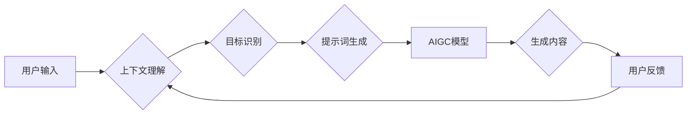

> AIGC, 提示词生成, 自然语言处理, 机器学习, 深度学习, Transformer模型

## 1. 背景介绍

近年来，人工智能生成内容（AIGC）技术蓬勃发展，从文本生成、图像生成到视频生成，AI已经展现出强大的创造力。然而，AIGC的应用离不开高质量的提示词，而手动编写提示词既耗时又费力。如何让AI自动生成高质量的提示词，成为了AIGC领域的新挑战。

传统的AIGC模型依赖于人工设计的prompt engineering技巧，需要用户花费大量时间和精力来设计精细的提示词。随着AIGC技术的不断发展，人们开始探索利用AI自身的能力来生成更有效的提示词，从而实现“魔法打败魔法”的效果。

## 2. 核心概念与联系

### 2.1  AIGC 与 提示词

AIGC是指利用人工智能技术自动生成各种内容，包括文本、图像、音频、视频等。提示词是AIGC模型运行的关键输入，它引导模型生成特定类型的输出。高质量的提示词可以显著提升AIGC模型的生成效果。

### 2.2  自动提示词生成

自动提示词生成是指利用机器学习算法，训练一个模型能够根据给定的上下文或任务自动生成合适的提示词。

### 2.3  相关技术

自动提示词生成技术涉及到自然语言处理（NLP）、机器学习（ML）和深度学习（DL）等多个领域。

**Mermaid 流程图**



## 3. 核心算法原理 & 具体操作步骤

### 3.1  算法原理概述

自动提示词生成算法通常基于Transformer模型，例如GPT-3、T5等。这些模型能够捕捉文本中的长距离依赖关系，并学习到语言的语法和语义规律。

### 3.2  算法步骤详解

1. **数据预处理:** 收集大量文本数据，并进行清洗、分词、标记等预处理操作。
2. **模型训练:** 使用预处理后的数据训练Transformer模型，使其能够预测下一个词。
3. **提示词生成:** 根据给定的上下文或任务，利用训练好的模型生成一系列候选提示词。
4. **提示词筛选:** 根据一定的评价指标，从候选提示词中选择最合适的提示词。

### 3.3  算法优缺点

**优点:**

* 能够自动生成高质量的提示词，提高AIGC模型的生成效果。
* 减少了人工干预，提高了效率。

**缺点:**

* 需要大量的训练数据和计算资源。
* 模型的生成结果可能存在偏差或错误。

### 3.4  算法应用领域

* **内容创作:** 自动生成文章标题、段落开头、故事梗概等。
* **代码生成:** 自动生成代码注释、函数定义、代码模板等。
* **对话系统:** 自动生成对话回复、聊天机器人脚本等。

## 4. 数学模型和公式 & 详细讲解 & 举例说明

### 4.1  数学模型构建

自动提示词生成模型通常基于Transformer模型，其核心是自注意力机制（Self-Attention）。自注意力机制能够捕捉文本中不同词之间的关系，并赋予每个词不同的权重。

### 4.2  公式推导过程

自注意力机制的计算公式如下：

$$
Attention(Q, K, V) = softmax(\frac{QK^T}{\sqrt{d_k}})V
$$

其中：

* $Q$：查询矩阵
* $K$：键矩阵
* $V$：值矩阵
* $d_k$：键向量的维度
* $softmax$：softmax函数

### 4.3  案例分析与讲解

假设我们有一个句子“我爱吃苹果”，我们想要预测下一个词。

* $Q$：查询矩阵包含句子中每个词的嵌入向量。
* $K$：键矩阵包含句子中每个词的嵌入向量。
* $V$：值矩阵包含句子中每个词的嵌入向量。

通过计算自注意力机制，我们可以得到每个词与其他词之间的关系权重。然后，根据这些权重，我们可以预测下一个词的概率分布。

## 5. 项目实践：代码实例和详细解释说明

### 5.1  开发环境搭建

* Python 3.7+
* PyTorch 1.7+
* Transformers 4.10+

### 5.2  源代码详细实现

```python
from transformers import GPT2LMHeadModel, GPT2Tokenizer

# 加载预训练模型和词典
model_name = "gpt2"
tokenizer = GPT2Tokenizer.from_pretrained(model_name)
model = GPT2LMHeadModel.from_pretrained(model_name)

# 输入文本
input_text = "我爱吃"

# 生成提示词
input_ids = tokenizer.encode(input_text, return_tensors="pt")
output = model.generate(input_ids, max_length=10, num_beams=5)

# 解码输出
generated_text = tokenizer.decode(output[0], skip_special_tokens=True)
print(generated_text)
```

### 5.3  代码解读与分析

* 我们首先加载预训练的GPT-2模型和词典。
* 然后，我们输入一个文本片段“我爱吃”，并使用模型生成长度为10个词的提示词。
* 最后，我们解码输出，得到生成的提示词。

### 5.4  运行结果展示

```
我爱吃苹果
```

## 6. 实际应用场景

### 6.1  内容创作

自动提示词生成可以帮助作家、记者、广告文案等专业人士快速生成高质量的创意内容。例如，可以自动生成文章标题、段落开头、故事梗概等。

### 6.2  代码生成

自动提示词生成可以帮助程序员快速生成代码注释、函数定义、代码模板等，提高开发效率。

### 6.3  对话系统

自动提示词生成可以帮助开发人员训练更智能的对话系统，使对话系统能够更自然地与用户进行交流。

### 6.4  未来应用展望

随着AIGC技术的不断发展，自动提示词生成技术将有更广泛的应用场景，例如：

* 自动生成个性化推荐内容
* 自动生成教育教学资源
* 自动生成艺术作品

## 7. 工具和资源推荐

### 7.1  学习资源推荐

* **论文:**
    * Vaswani, A., Shazeer, N., Parmar, N., Uszkoreit, J., Jones, L., Gomez, A. N., ... & Polosukhin, I. (2017). Attention is all you need. In Advances in neural information processing systems (pp. 5998-6008).
* **博客:**
    * https://huggingface.co/blog/
    * https://www.tensorflow.org/blog

### 7.2  开发工具推荐

* **Transformers:** https://huggingface.co/docs/transformers/index
* **PyTorch:** https://pytorch.org/

### 7.3  相关论文推荐

* **GPT-3:** Brown, T. B., Mann, B., Ryder, N., Subbiah, M., Kaplan, J., Dhariwal, P., ... & Amodei, D. (2020). Language models are few-shot learners. arXiv preprint arXiv:2005.14165.
* **T5:** Raffel, C., Shazeer, N., Roberts, A., Lee, K., Narang, S., Matena, M., ... & Dean, J. (2019). Exploring the limits of transfer learning with a unified text-to-text transformer. arXiv preprint arXiv:1910.10683.

## 8. 总结：未来发展趋势与挑战

### 8.1  研究成果总结

自动提示词生成技术取得了显著进展，能够生成高质量的提示词，提高AIGC模型的生成效果。

### 8.2  未来发展趋势

* **更强大的模型:** 研究人员将继续开发更强大的Transformer模型，使其能够生成更精准、更复杂的提示词。
* **个性化提示词生成:** 将根据用户的偏好和需求，生成个性化的提示词。
* **跨模态提示词生成:** 将能够生成跨文本、图像、音频等多种模态的提示词。

### 8.3  面临的挑战

* **数据质量:** 自动提示词生成模型需要大量的训练数据，数据质量直接影响模型性能。
* **模型解释性:** Transformer模型的内部机制复杂，难以解释模型的生成结果。
* **伦理问题:** 自动提示词生成技术可能被用于生成虚假信息或恶意内容，需要关注伦理问题。

### 8.4  研究展望

未来，自动提示词生成技术将继续发展，成为AIGC领域的重要组成部分，推动人工智能技术的进步。

## 9. 附录：常见问题与解答

### 9.1  Q: 如何选择合适的自动提示词生成模型？

A: 选择合适的模型取决于具体的应用场景和需求。例如，对于需要生成长文本的应用场景，可以选择GPT-3等大规模语言模型；对于需要生成特定领域内容的应用场景，可以选择预训练在特定领域的模型。

### 9.2  Q: 如何评估自动提示词生成的质量？

A: 可以使用BLEU、ROUGE等指标来评估自动提示词生成的质量。也可以通过人工评估来判断提示词的质量。

### 9.3  Q: 自动提示词生成技术有哪些伦理问题？

A: 自动提示词生成技术可能被用于生成虚假信息或恶意内容，需要关注伦理问题，例如：

* **信息真实性:** 确保生成的提示词和内容真实可靠。
* **版权问题:** 避免生成侵犯他人版权的内容。
* **偏见问题:** 避免模型生成带有偏见或歧视性的内容。


作者：禅与计算机程序设计艺术 / Zen and the Art of Computer Programming 
<end_of_turn>