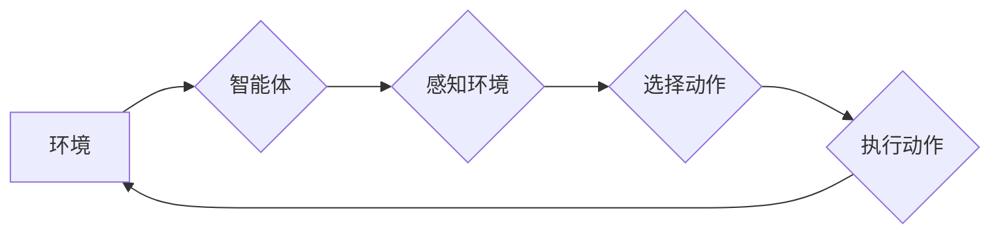

> AI Agent, 动作选择策略, 强化学习, 马尔可夫决策过程, 价值函数, 策略梯度, 深度强化学习

## 1. 背景介绍

在人工智能领域，智能体（Agent）的概念至关重要。智能体是指能够感知环境、做出决策并采取行动以实现特定目标的系统。动作选择策略是智能体在面对环境变化时做出最佳决策的关键。

传统的编程方法依赖于预先定义的规则和逻辑，而智能体需要能够学习和适应不断变化的环境。因此，动作选择策略的研究成为人工智能领域的重要研究方向之一。

## 2. 核心概念与联系

### 2.1 马尔可夫决策过程 (MDP)

马尔可夫决策过程 (MDP) 是描述智能体与环境交互的数学框架。它由以下五个要素组成：

* **状态空间 (S):** 智能体可能处于的所有状态的集合。
* **动作空间 (A):** 智能体在每个状态下可以采取的所有动作的集合。
* **转移概率 (P):** 从一个状态执行一个动作后转移到另一个状态的概率。
* **奖励函数 (R):** 智能体在每个状态执行一个动作后获得的奖励。
* **折扣因子 (γ):** 用于权衡未来奖励与当前奖励的比例。

### 2.2 价值函数

价值函数是评估状态或状态-动作对的价值的函数。它可以分为两种类型：

* **状态价值函数 (V(s)):** 表示状态 s 的期望长期奖励。
* **动作价值函数 (Q(s, a)):** 表示在状态 s 执行动作 a 后获得的期望长期奖励。

### 2.3 策略

策略是指智能体在每个状态下选择动作的规则。策略可以是确定性的，也可以是随机的。

**Mermaid 流程图**



## 3. 核心算法原理 & 具体操作步骤

### 3.1 算法原理概述

强化学习 (RL) 是一种机器学习方法，它通过智能体与环境的交互来学习最优的动作选择策略。RL 算法的目标是最大化智能体在长期的奖励积累。

### 3.2 算法步骤详解

1. **初始化:** 初始化价值函数和策略。
2. **感知环境:** 智能体感知当前环境状态。
3. **选择动作:** 根据当前策略选择一个动作。
4. **执行动作:** 智能体执行选择的动作，并观察环境状态的变化和获得的奖励。
5. **更新价值函数:** 根据获得的奖励和新的环境状态，更新价值函数。
6. **更新策略:** 根据更新后的价值函数，更新策略，以选择更优的动作。
7. **重复步骤 2-6:** 直到达到终止条件或学习完成。

### 3.3 算法优缺点

**优点:**

* 可以学习复杂的环境和任务。
* 不需要预先定义规则和逻辑。
* 可以适应不断变化的环境。

**缺点:**

* 训练过程可能很慢。
* 需要大量的训练数据。
* 可能会出现不稳定性问题。

### 3.4 算法应用领域

* **游戏:** 训练游戏 AI，例如 AlphaGo 和 AlphaStar。
* **机器人:** 控制机器人执行任务，例如导航和抓取。
* **推荐系统:** 建议用户感兴趣的内容。
* **医疗保健:** 辅助医生诊断和治疗疾病。

## 4. 数学模型和公式 & 详细讲解 & 举例说明

### 4.1 数学模型构建

马尔可夫决策过程 (MDP) 可以用以下数学模型表示：

* 状态空间: S = {s1, s2, ..., sn}
* 动作空间: A = {a1, a2, ..., am}
* 转移概率: P(s' | s, a) 表示从状态 s 执行动作 a 后转移到状态 s' 的概率。
* 奖励函数: R(s, a) 表示在状态 s 执行动作 a 后获得的奖励。
* 折扣因子: γ (0 ≤ γ ≤ 1) 用于权衡未来奖励与当前奖励的比例。

### 4.2 公式推导过程

状态价值函数的 Bellman 方程:

$$V(s) = \max_a \sum_{s'} P(s' | s, a) [R(s, a) + \gamma V(s')]$$

动作价值函数的 Bellman 方程:

$$Q(s, a) = R(s, a) + \gamma \max_{a'} Q(s', a')$$

### 4.3 案例分析与讲解

假设一个智能体在玩一个简单的游戏，游戏状态可以是 "开始"、"中" 和 "结束"，动作可以是 "前进" 和 "后退"。

* 状态空间: S = {"开始", "中", "结束"}
* 动作空间: A = {"前进", "后退"}
* 奖励函数: R(s, a) = 1 如果状态是 "中"，否则为 0。
* 折扣因子: γ = 0.9

通过 Bellman 方程，我们可以计算出每个状态的价值函数和每个状态-动作对的动作价值函数。

## 5. 项目实践：代码实例和详细解释说明

### 5.1 开发环境搭建

* Python 3.x
* TensorFlow 或 PyTorch

### 5.2 源代码详细实现

```python
import tensorflow as tf

# 定义状态空间、动作空间、奖励函数等
# ...

# 定义价值函数网络
class ValueNetwork(tf.keras.Model):
    def __init__(self):
        super(ValueNetwork, self).__init__()
        # ...

    def call(self, state):
        # ...

# 定义策略网络
class PolicyNetwork(tf.keras.Model):
    def __init__(self):
        super(PolicyNetwork, self).__init__()
        # ...

    def call(self, state):
        # ...

# 定义强化学习算法
class QLearningAgent:
    def __init__(self):
        # ...

    def learn(self, state, action, reward, next_state):
        # ...

# 创建智能体
agent = QLearningAgent()

# 训练智能体
for episode in range(num_episodes):
    # ...

# 测试智能体
# ...
```

### 5.3 代码解读与分析

* 价值函数网络和策略网络分别用于估计状态价值和选择动作。
* QLearningAgent 类实现了强化学习算法，包括价值函数更新和策略更新。
* 训练过程包括多个episode，每个episode包含多个时间步。

### 5.4 运行结果展示

* 可以通过观察智能体的行为和奖励积累来评估训练效果。
* 可以使用图表和曲线来可视化训练过程。

## 6. 实际应用场景

### 6.1 游戏 AI

强化学习已被广泛应用于游戏 AI 的开发，例如 AlphaGo 和 AlphaStar。这些 AI 系统能够学习复杂的策略，并战胜人类顶尖选手。

### 6.2 机器人控制

强化学习可以用于控制机器人执行任务，例如导航、抓取和组装。机器人可以通过与环境交互学习最优的控制策略。

### 6.3 推荐系统

强化学习可以用于构建个性化的推荐系统。系统可以学习用户的偏好，并推荐用户感兴趣的内容。

### 6.4 未来应用展望

* **自动驾驶:** 强化学习可以用于训练自动驾驶汽车，使其能够在复杂的环境中安全行驶。
* **医疗保健:** 强化学习可以用于辅助医生诊断和治疗疾病，并优化医疗资源分配。
* **金融:** 强化学习可以用于预测市场趋势、管理风险和优化投资策略。

## 7. 工具和资源推荐

### 7.1 学习资源推荐

* **书籍:**
    * Reinforcement Learning: An Introduction by Richard S. Sutton and Andrew G. Barto
    * Deep Reinforcement Learning Hands-On by Maxim Lapan
* **在线课程:**
    * Deep Reinforcement Learning Specialization by DeepLearning.AI
    * Reinforcement Learning by David Silver (University of DeepMind)

### 7.2 开发工具推荐

* **TensorFlow:** 开源深度学习框架，支持强化学习算法的实现。
* **PyTorch:** 开源深度学习框架，也支持强化学习算法的实现。
* **OpenAI Gym:** 强化学习环境库，提供各种标准的强化学习任务。

### 7.3 相关论文推荐

* **Deep Q-Network (DQN):** Mnih et al. (2015)
* **Proximal Policy Optimization (PPO):** Schulman et al. (2017)
* **Trust Region Policy Optimization (TRPO):** Schulman et al. (2015)

## 8. 总结：未来发展趋势与挑战

### 8.1 研究成果总结

强化学习在过去几年取得了显著进展，在游戏、机器人控制、推荐系统等领域取得了成功应用。

### 8.2 未来发展趋势

* **更强大的算法:** 研究更强大的强化学习算法，例如基于模型的强化学习和多智能体强化学习。
* **更复杂的应用场景:** 将强化学习应用于更复杂的应用场景，例如自动驾驶和医疗保健。
* **更安全的强化学习:** 研究更安全的强化学习算法，避免出现不可预知的行为。

### 8.3 面临的挑战

* **数据效率:** 强化学习算法通常需要大量的训练数据。
* **样本复杂性:** 强化学习算法的样本复杂性很高，需要大量的样本才能达到良好的性能。
* **可解释性:** 强化学习算法的决策过程难以解释，这可能会导致信任问题。

### 8.4 研究展望

未来，强化学习将继续是一个重要的研究方向，并将推动人工智能技术的进一步发展。


## 9. 附录：常见问题与解答

### 9.1 什么是强化学习？

强化学习是一种机器学习方法，它通过智能体与环境的交互来学习最优的动作选择策略。

### 9.2 强化学习与监督学习有什么区别？

监督学习使用标记数据来训练模型，而强化学习使用奖励信号来训练模型。

### 9.3 强化学习有哪些应用场景？

强化学习的应用场景非常广泛，包括游戏 AI、机器人控制、推荐系统、自动驾驶等。


作者：禅与计算机程序设计艺术 / Zen and the Art of Computer Programming 
<end_of_turn>