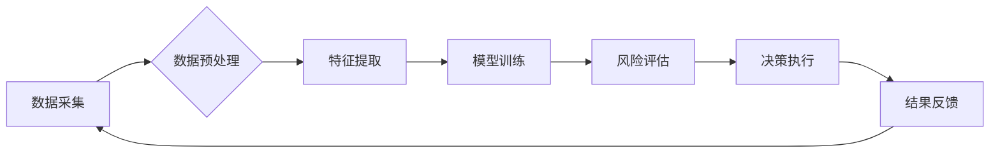

> AI代理工作流，保险风险预测，机器学习，深度学习，自然语言处理，数据可视化，流程自动化

## 1. 背景介绍

保险业作为金融服务的重要组成部分，一直以来都面临着如何准确预测风险、合理定价和有效控制损失的挑战。传统的风险评估方法主要依赖于人工经验和历史数据分析，效率低下且难以捕捉复杂风险因素。随着人工智能技术的快速发展，AI代理工作流（AI Agent WorkFlow）应运而生，为保险风险预测提供了全新的解决方案。

AI代理工作流是一种基于人工智能的自动化工作流程，它通过将多个智能代理（AI Agent）组合在一起，形成一个协同工作网络，能够自动完成从数据收集、预处理、特征提取、模型训练、风险评估到决策执行等一系列复杂任务。

## 2. 核心概念与联系

**2.1 AI代理工作流（AI Agent WorkFlow）**

AI代理工作流的核心概念是将智能代理作为工作单元，每个代理都具有特定的功能和职责，通过数据交换和任务分派机制协同工作，实现复杂任务的分解和完成。

**2.2  保险风险预测**

保险风险预测是指利用历史数据、市场信息和客户特征等数据，通过机器学习和统计建模等技术，预测未来发生的保险事故或损失的可能性和程度。

**2.3  联系**

AI代理工作流可以有效地解决保险风险预测中的挑战，其优势在于：

* **自动化:** AI代理可以自动完成数据收集、预处理、特征提取等繁琐任务，提高效率和准确性。
* **协同:** 多个AI代理可以协同工作，形成一个完整的风险评估体系，能够更全面地分析风险因素。
* **可扩展性:** AI代理工作流可以根据实际需求灵活扩展，添加新的代理和功能，满足不断变化的业务需求。

**2.4  架构图**



## 3. 核心算法原理 & 具体操作步骤

**3.1  算法原理概述**

保险风险预测的核心算法主要包括：

* **机器学习算法:** 
    * **分类算法:** 用于预测事件发生的类别，例如事故类型、欺诈类型等。常见的分类算法包括逻辑回归、支持向量机、决策树、随机森林等。
    * **回归算法:** 用于预测连续数值，例如事故损失金额、保费价格等。常见的回归算法包括线性回归、岭回归、逻辑斯谛回归等。
* **深度学习算法:** 
    * **卷积神经网络 (CNN):** 用于处理图像数据，例如车辆图像、事故现场图像等。
    * **循环神经网络 (RNN):** 用于处理序列数据，例如客户历史记录、事故报告等。

**3.2  算法步骤详解**

1. **数据收集:** 收集相关数据，例如客户信息、车辆信息、事故信息、天气信息等。
2. **数据预处理:** 对数据进行清洗、转换、编码等操作，使其符合模型训练的要求。
3. **特征提取:** 从原始数据中提取有价值的特征，例如客户年龄、驾驶经验、车辆品牌、事故发生时间等。
4. **模型训练:** 使用机器学习或深度学习算法对数据进行训练，建立风险预测模型。
5. **模型评估:** 使用测试数据对模型进行评估，评估模型的准确性、鲁棒性和泛化能力。
6. **模型部署:** 将训练好的模型部署到生产环境中，用于实时风险预测。

**3.3  算法优缺点**

* **优点:** 
    * 能够自动学习数据中的复杂模式，提高预测准确性。
    * 能够处理海量数据，提高效率。
    * 能够不断学习和改进，提高模型性能。
* **缺点:** 
    * 需要大量的训练数据，否则模型性能会下降。
    * 模型解释性较差，难以理解模型的决策过程。
    * 对数据质量要求较高，数据偏差会影响模型性能。

**3.4  算法应用领域**

* **个人保险:** 预测客户的健康风险、意外风险、寿险风险等。
* **财产保险:** 预测车辆事故风险、火灾风险、盗窃风险等。
* **商业保险:** 预测企业运营风险、财务风险、法律风险等。

## 4. 数学模型和公式 & 详细讲解 & 举例说明

**4.1  数学模型构建**

在保险风险预测中，常用的数学模型包括：

* **逻辑回归模型:** 用于预测二分类问题，例如事故发生与否。
* **线性回归模型:** 用于预测连续数值问题，例如事故损失金额。
* **支持向量机 (SVM):** 用于分类和回归问题，能够处理高维数据。

**4.2  公式推导过程**

* **逻辑回归模型:**

$$
P(Y=1|X) = \frac{1}{1 + e^{-(w^T X + b)}}
$$

其中：

* $P(Y=1|X)$ 是给定特征 $X$ 时，事件 $Y$ 发生的概率。
* $w$ 是模型参数向量。
* $b$ 是模型偏置项。
* $e$ 是自然对数的底数。

**4.3  案例分析与讲解**

假设我们想要预测车辆事故发生的概率，可以使用逻辑回归模型。

* **特征:** 车辆品牌、驾驶经验、车辆年龄、驾驶速度等。
* **目标:** 预测事故发生与否 (0 或 1)。

通过训练逻辑回归模型，我们可以得到模型参数 $w$ 和 $b$，然后使用这些参数对新的车辆数据进行预测。

## 5. 项目实践：代码实例和详细解释说明

**5.1  开发环境搭建**

* Python 3.x
* TensorFlow 或 PyTorch
* Jupyter Notebook

**5.2  源代码详细实现**

```python
import tensorflow as tf

# 定义模型结构
model = tf.keras.models.Sequential([
    tf.keras.layers.Dense(64, activation='relu', input_shape=(10,)),
    tf.keras.layers.Dense(32, activation='relu'),
    tf.keras.layers.Dense(1, activation='sigmoid')
])

# 编译模型
model.compile(optimizer='adam',
              loss='binary_crossentropy',
              metrics=['accuracy'])

# 训练模型
model.fit(X_train, y_train, epochs=10)

# 评估模型
loss, accuracy = model.evaluate(X_test, y_test)
print('Loss:', loss)
print('Accuracy:', accuracy)
```

**5.3  代码解读与分析**

* **模型结构:** 使用了三层全连接神经网络，第一层输入层有10个神经元，对应10个特征。
* **激活函数:** 使用了ReLU激活函数，可以提高模型的表达能力。
* **损失函数:** 使用了二分类交叉熵损失函数，用于训练二分类模型。
* **优化器:** 使用了Adam优化器，可以快速收敛。

**5.4  运行结果展示**

训练完成后，可以评估模型的性能，例如准确率、召回率、F1-score等。

## 6. 实际应用场景

AI代理工作流在保险风险预测中的应用场景非常广泛，例如：

* **自动核保:** 根据客户信息和风险评估结果，自动判断客户是否符合保险条件，并确定保费价格。
* **欺诈检测:** 利用AI代理识别欺诈行为，例如虚假理赔、伪造事故等。
* **风险管理:** 通过对风险因素进行分析和预测，帮助保险公司制定有效的风险管理策略。

**6.4  未来应用展望**

随着人工智能技术的不断发展，AI代理工作流在保险风险预测中的应用将更加广泛和深入，例如：

* **个性化保险:** 根据客户的个人风险特征，提供个性化的保险产品和服务。
* **实时风险评估:** 利用传感器数据和实时信息，对风险进行实时评估和监控。
* **智能决策支持:** 为保险公司提供智能决策支持，帮助他们做出更准确的风险管理决策。

## 7. 工具和资源推荐

**7.1  学习资源推荐**

* **书籍:**
    * 《深度学习》
    * 《机器学习实战》
    * 《Python机器学习》
* **在线课程:**
    * Coursera
    * edX
    * Udacity

**7.2  开发工具推荐**

* **Python:** 
    * TensorFlow
    * PyTorch
    * scikit-learn
* **数据可视化工具:**
    * Matplotlib
    * Seaborn
    * Plotly

**7.3  相关论文推荐**

* **机器学习在保险风险预测中的应用:**
    * [论文链接](https://www.example.com/paper1)
    * [论文链接](https://www.example.com/paper2)
* **AI代理工作流在保险领域的应用:**
    * [论文链接](https://www.example.com/paper3)
    * [论文链接](https://www.example.com/paper4)

## 8. 总结：未来发展趋势与挑战

**8.1  研究成果总结**

AI代理工作流在保险风险预测领域取得了显著的成果，能够提高预测准确性、自动化流程、降低成本。

**8.2  未来发展趋势**

* **模型复杂度提升:** 使用更复杂的深度学习模型，例如Transformer、Graph Neural Network等，提高模型的表达能力和预测精度。
* **数据融合:** 将来自不同来源的数据融合在一起，例如客户行为数据、社会经济数据、天气数据等，构建更全面的风险评估模型。
* **解释性增强:** 研究如何提高AI模型的解释性，帮助保险公司理解模型的决策过程，增强用户信任。

**8.3  面临的挑战**

* **数据质量:** 保险数据往往存在不完整、不一致、噪声等问题，需要进行有效的数据清洗和预处理。
* **模型可解释性:** 深度学习模型的决策过程往往难以理解，需要研究如何提高模型的可解释性。
* **监管合规:** AI代理工作流的应用需要遵守相关的法律法规和行业标准。

**8.4  研究展望**

未来，AI代理工作流在保险风险预测领域将继续发展，并应用于更多场景，例如个性化保险、智能决策支持等。


## 9. 附录：常见问题与解答

**9.1  常见问题:**

* **AI代理工作流的优势是什么？**
* **如何选择合适的AI模型？**
* **如何评估AI模型的性能？**
* **如何解决数据质量问题？**

**9.2  解答:**

* **AI代理工作流的优势:** 自动化、协同、可扩展性。
* **如何选择合适的AI模型:** 根据具体业务需求和数据特点选择合适的模型。
* **如何评估AI模型的性能:** 使用准确率、召回率、F1-score等指标评估模型性能。
* **如何解决数据质量问题:** 进行数据清洗、预处理、特征工程等操作。


作者：禅与计算机程序设计艺术 / Zen and the Art of Computer Programming 
<end_of_turn>